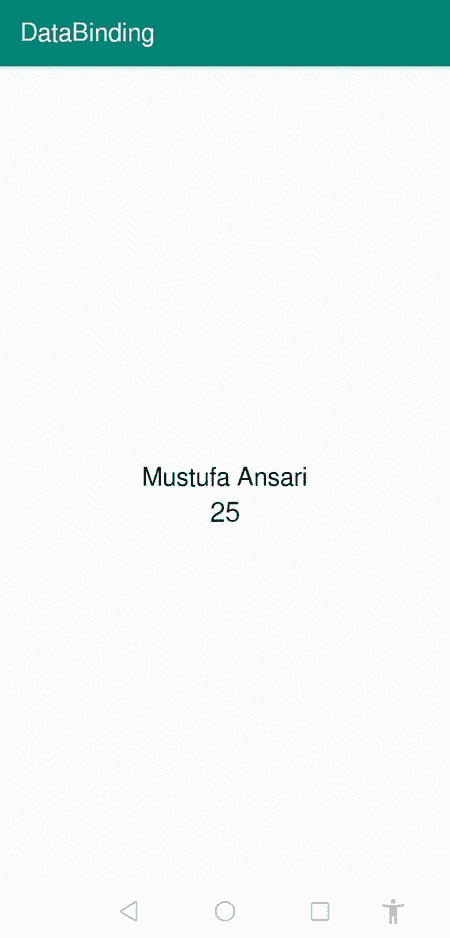
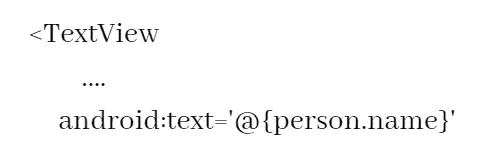
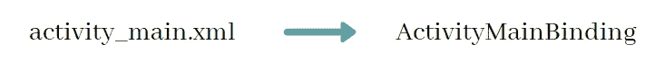
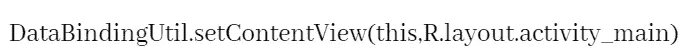
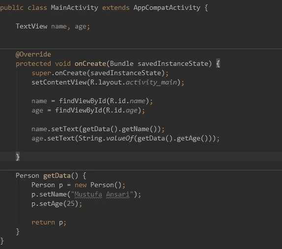

# 完整的 Android 数据绑定教程(第一部分)

> 原文：<https://betterprogramming.pub/android-data-binding-139686b65aec>

## **部分**[**Android Jetpack**](https://developer.android.com/jetpack)**。**

## 没有更多的 findViewById()


> “永远不要停止学习；因为当我们停止学习时，我们就停止了成长”

数据绑定让开发者的生活变得更加轻松，并预示着 android 应用开发的新时代。

我在之前的文章中谈到了数据绑定，比如[“如何制作可通过动画扩展的 RecyclerView 项目”](https://medium.com/better-programming/recyclerview-expanded-1c1be424282c)，但是如果你对数据绑定一无所知，请继续阅读，我将带你了解每一个方面。

# 什么是数据绑定？

n droid 数据绑定是 [android jetpack](https://developer.android.com/jetpack) 的一部分，这是一套帮助开发者开发高质量应用的工具。如果你是一个有 android 应用开发经验的开发者，你会熟悉`findViewById()`，在活动中声明视图的方法。假设我正在制作一个应用程序，它会在`textView`中显示我的名字。这里我展示了定义视图的两种方式，有数据绑定和没有数据绑定。

> 注意:为了简洁起见，我省略了 XML 和活动的细节。

## **无数据绑定**

```
TextView myName = findViewById(R.id.m);
myName.setText(“Mustufa Ansari”)
```

## 使用数据绑定

```
<TextView
    android:text="@{modelClass.userName}" />
```

你可能觉得很难理解上面发生的事情——这完全没关系。这是一小段与数据绑定相关的代码，只是给你一个思路。

你可以清楚地看到，在上面代码的数据绑定部分，我已经直接在我们的活动中使用`modelClass`在 *XML* 文件中声明了我的用户名。在此之后，您不需要在您的活动中添加`findViewById()`来找到`textview`，然后在其中设置`userName` 。

# 入门指南

首先，我在您的`build.gradle`中添加了一小段代码，以便在您的项目中启用数据绑定:

```
dataBinding{
   enabled true
}
```

接下来，我制作一个简单的应用程序，在`textViews`中显示一些文本。我将向您展示在`textView`、*中使用* 和*中不使用* 数据绑定的两种数据呈现方式，以便您了解其流程。

我已经在我的`build.gradle`文件中添加了数据绑定依赖:

现在让我们来做一个示范课。正如我前面提到的，数据绑定与模型类一起工作。在使用数据绑定时拥有一个模型类是一个很好的实践——这是在应用程序中使用数据绑定的完整方式。

我正在创建一个名为`Person.java`的模型类，其中我定义了两个变量:`name`和`age`。

现在让我们在应用程序中展示一些数据。我将把这分成两步—有数据绑定和没有数据绑定。

## 无数据绑定

我的`activity_main.xml`长这样:

我的`MainActivity.java`长这样:

这是声明视图和将视图与数据绑定的老方法。

点击运行，你会得到这个结果:



## 使用数据绑定

为了实现数据绑定，我们需要将整个布局包装在`<layout></layout>`标签中，就像这样:

现在，在数据绑定中，我们可以直接将视图与数据绑定。但是为此，我们必须引入另一个数据绑定术语:`<data></data>`标签。在这个数据标签中，我们可以导入我们需要的模型类，它需要与视图绑定:

```
<data>
    <variable
        name="person"
        type="com.codixlab.databinding.Person" />
</data>
```

这意味着我们将把这个模型类附加到我们的布局中。这里你可以看到我们有一个`variable`标签，它有两个属性:*名称*和*类型*。

给这个模型类起什么名字是你自己的决定，但是给它起一个和你的模型类一样的名字是一个很好的习惯。

`type`:这是一种`name`变量。这里我们将`Person`类附加到布局中，所以类型是`Person.java`的类路径。

现在我们的`activity_main.xml`长这样:

下一步是用数据绑定我们的视图。要做到这一点，有一种通过使用带有视图的`'@{}'`来绑定带有数据的布局的方法。让我们看看如何实现这一点:



在这里，我将我的`TextView`文本属性与模型类属性`name`绑定，这样无论活动的名称是什么，它都会显示在这个`textView` *中。*这有意义吗？

现在布局一切正常，是时候编辑我们的`MainActivity.java`了。

首先，我们需要告诉我们的活动我们将使用数据绑定，因为它不知道我们在 XML 文件中做了什么。为此，当我们将布局包含在`<layout>`标签下时，数据绑定会生成一个类。将该类导入模式很简单。无论您的活动布局的名称是什么，您的绑定类名称都将与该布局文件一致。让我们来看看。



“Binding”一词将由数据绑定库本身附加。

*注意:如果您无法导入您的数据绑定活动类，只需重新构建您的项目。*



在这一行中，我们将整个 XML 存储在变量`bi`中。我们可以用这个变量访问整个布局和其中的每个视图。随便你给它起什么名字——我只是叫它`bi`以供即时使用。

现在是将数据附加到视图的时候了。

还记得我们对 XML 文件中的数据做了什么吗？

没错，我们用名字`person`设置模型类。数据绑定非常方便——它为数据生成 setter 方法。如果你调用`bi`并按下`.` ，那么你会看到类似`setPerson()`的东西，你可以在其中设置你的模型类。然后它将附加一个视图:

现在点击运行，你会看到结果:


让我们比较一下有数据绑定和没有数据绑定的代码:



您可以清楚地看到两个示例中的代码行。数据绑定让开发人员更容易开发复杂的应用程序，也让我们免于编写样板代码。

这是系列文章的第一部分——还有很多东西要学，我们还没有完成数据绑定！

## [点击此处查看第二部分](https://medium.com/better-programming/android-data-binding-2-37737eef89d9)

**关注**[**CodixLab**](https://medium.com/codixlab)**了解更多科技知识。**

**觉得这篇文章有用吗？下面是我阅读最多的关于更好编程的文章:**

*   [如何使用 TextView 在 android 中实现复制/粘贴功能？](https://medium.com/better-programming/android-copy-paste-7dd60ad47d0)
*   [想成为一名成功的 Android 开发者？遵循此路线图](https://medium.com/better-programming/android-free-courses-3b550ce388e6)
*   [全屏底片](https://medium.com/better-programming/bottom-sheet-android-340703e114d2)
*   [如何使 RecyclerView 项目可扩展？](https://medium.com/better-programming/recyclerview-expanded-1c1be424282c)
*   想要制作具有更多选项的动画浮动操作按钮？
*   [用漂亮的动画制作 RecyclerView！](https://medium.com/better-programming/android-recyclerview-with-beautiful-animations-5e9b34dbb0fa)