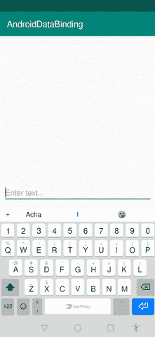

# 完整的 Android 数据绑定教程(第 2 部分)

> 原文：<https://betterprogramming.pub/android-data-binding-2-37737eef89d9>

## 没有更多的 findViewById()


在本系列的第 1 部分中，我已经讨论了一些与 Android 数据绑定相关的基础知识。如果您是新手，我建议您回到第 1 部分，以确保您清楚 Android 数据绑定的概念和基础知识。

> 今天的动机
> 
> “为了记录下你的下一个梦，睡前阅读…”
> 
> **——纳内特·l·埃弗里**

在这篇文章中，我将向您展示如何通过不同的方法使用 Android 数据绑定来实现点击事件。

# 处理点击事件

在您的项目中，使用 Android 数据绑定处理不同的事件非常容易。让我向您展示如何实现点击事件。

我正在用一个按钮和一个将在`textView`中显示输入文本的`EditText`创建一个新项目。

这是我的`activity_main.xml`:

为了使用数据绑定使按钮起作用，有两种方法:使用内部类和不使用内部类。我向你展示了两种方式。

## 没有内部阶级

为此，您需要在 Java 类中创建一个公共函数，并使用数据绑定将该函数与一个按钮绑定。让我告诉你怎么做。

下面是将用于执行任何任务的`onSubmit()`函数。

棘手的部分来了。我们正在绑定一个`MainActivity.java`中的函数，数据绑定需要一个类来将其属性与 XML 绑定。所以这个功能是`MainAcitivity.java`的一个属性。我们需要用 XML 绑定`MainAcitivity.java`。

```
<data>
    <variable
        name="callback"
        type="com.codixlab.androiddatabinding.MainActivity" />
</data>
```

在`MainActivity.java`中，你需要在你的`oncreate()`中添加`this`:

```
bi.setCallback(this);
```

您需要添加`this`,因为我们引用的是当前上下文——也就是`MainActivity.java`本身。

现在使用回调将按钮与`onsubmit()`绑定。

```
<Button
    android:id="@+id/button"
    android:layout_width="match_parent"
    android:layout_height="wrap_content"
    android:layout_marginStart="8dp"
    android:layout_marginTop="28dp"
    android:layout_marginEnd="8dp"
    android:onClick='@{() -> callback.onSubmit()}'
    android:text="Submit"
    app:layout_constraintEnd_toEndOf="parent"
    app:layout_constraintHorizontal_bias="0.0"
    app:layout_constraintStart_toStartOf="parent"
    app:layout_constraintTop_toBottomOf="@+id/editText" />
```

让我们运行应用程序。



## 有一个内部阶层

您只需要在活动中创建一个内部类来处理点击事件。它与上面的方法相同，只是有一些变化。

我正在`MainActivity.java`中创建一个内部类来处理点击事件。你可以在你的`Activity`中为不同的操作定义不同的点击事件，但目前我只做一个函数。

```
public class MainActivityOnClick {
    public void Onclick() {
        if (!bi.editText.getText().toString().isEmpty()) {
            String text = bi.editText.getText().toString();
            bi.textView.setText(text);
        }
    }
}
```

现在是时候用 XML 绑定这个类了。过程和之前差不多。在前面的方法中，我们在 XML 中添加了我们的`MainActivity.java`,但是现在我们将引用我们的内部类。

```
<data>

    <variable
        name="callback"
        type="com.codixlab.androiddatabinding.MainActivity.MainActivityOnClick" />
</data>
```

在`MainActivity.java`中，我们需要添加一个`setCallback`。

下面是如何使用内部类来附加按钮的方法。

让我们运行应用程序。


使用内部类

在下一部分中，我们将看到如何为包含布局实现数据绑定技术。

## 查看我最常阅读的文章:

*   [flutter 1.12 有什么新特性？](https://medium.com/swlh/whats-new-in-flutter-1-12-f53473cf5130?source=friends_link&sk=f8292dcc478dcec79e45847732589aec)
*   [如何用 Python 制作安卓应用？](https://medium.com/swlh/how-to-make-android-apps-with-python-10a33b9e5983?source=friends_link&sk=a799a45fa45ec0988a86859a10dcca7a)
*   [使用 RecyclerView 建立多选列表](https://medium.com/better-programming/gmail-like-list-67bc51adc68a?source=friends_link&sk=76ff9ad846d1dddcf2b7ec3aa4a9b0a6)
*   [使用 RecyclerView 构建简单的搜索功能](https://medium.com/better-programming/recyclerview-search-326030d4bdf1?source=friends_link&sk=c307661f8e883e4500a5c110bae6b8eb)