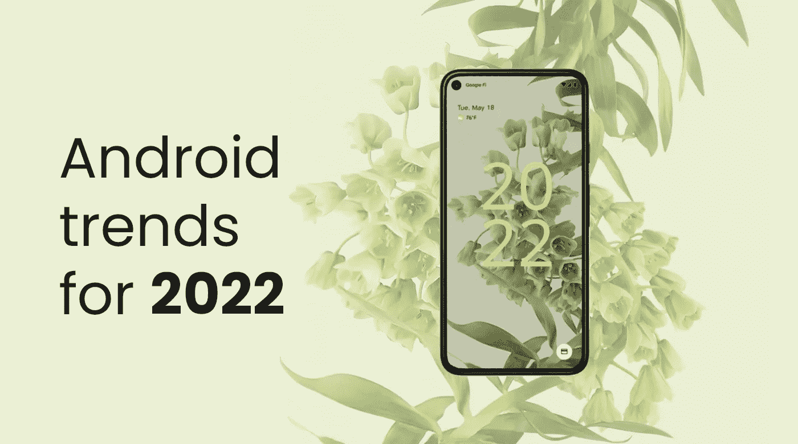

# 2022 年安卓发展趋势

> 原文：<https://betterprogramming.pub/android-development-trends-for-2022-51734382bce1>

## Jetpack Compose、Hilt、Kotlin Flow 和 Coroutines——Android 开发人员必备的技能

背景图片:谷歌官方 Android 12 图片。作者编辑

作为移动开发人员，我们的首要任务之一是保持最新状态并查看最新公告，即使这意味着要离开我们的舒适区。去年，Android 世界出现了几个有趣的东西，然而，我将把重点放在我们应该在 2022 年开始使用的最重要的东西上。

# Jetpack 撰写

毫无疑问，这是去年最大的宣布。一些影响很多开发领域的东西，即使只是 UI 层。这是在 Android 上创建视图的一种全新方式。我们可能最终会放弃 XML，用声明性的思维方式取代命令性的思维方式。Android 最终以现代风格创建了用户界面，赶上了其他平台。

Jetpack Compose 是围绕 Kotlin 编写的，它得到了 Google 的大力支持，即使它在创建真正高级的视图时仍然有一些限制。但是，您会发现对新导航、保存状态和主题的支持。还有很多带教程的文章和视频，已经很值得一试了。特别是，随着即将到来的对[材料你](https://material.io/blog/announcing-material-you)的支持——2021 年的另一个大新闻。

Jetpack 撰写视图示例

此外，如果你开始使用 Jetpack Compose，一定要熟悉[伴奏者](https://github.com/google/accompanist)——Compose 的支持库。

# 柄

Hilt 是一个新的依赖注入工具，建立在最流行的工具 Dagger 之上。它是专门为 Android 构建的，支持视图模型、活动、片段，甚至前面提到的 Jetpack Compose。对比 Dagger，配置真的很直接，错误也更清晰，所以即使对于依赖注入经验比较少的人来说，也应该是相当可以理解的。

刀柄用法示例

如你所见，Hilt 包含了很多 Android 开发的便利。对我来说，这似乎是我们发展的未来，所以如果你还没有尝试过，是时候去看看了。

# 科特林流

几年前，Kotlin 被宣布为官方编程语言。Kotlin 协程已经普及了一段时间。现在，是时候进行下一步了——kot Lin Flow，它是 RxJava 的轻量级替代方案。

Kotlin 流是我们返回多个异步计算值的一种方式。最流行的选项可能是`StateFlow`，或者它的可变对应物，它公开了一个当前值。之后，您可以熟悉 SharedFlow 和 Flow builders。

它有很多类似于 RxJava 的操作符，但它试图保持一个真正简单的设计。如果您使用 Kotlin 协程，它应该是您的首选。它甚至支持`LiveData`，然而，Android 中的发展正朝着放弃`LiveData`而支持 Flow 的方向发展。

Kotlin 流量使用示例

如果你想了解更多关于 Kotlin 流的知识，JetBrains 创建了一个非常棒的[文档](https://kotlinlang.org/docs/flow.html)。

# 摘要

看起来似乎只有 3 个主题，但它们可以完全改变你编写 Android 应用程序的方式，因为它们触及了代码库的所有层面。

更重要的是，我相信这 3 个工具应该一起使用，帮助创建一个更好、更健壮、更容易测试的代码库。这些是最新的 Android 趋势，当然花些时间学习这些工具是值得的。

你觉得我的预测怎么样？你能在我的清单上添加一些东西吗？请分享你的想法。

另外，看看我写的关于 Android 中[安全性的文章。](https://medium.com/android-news/security-in-android-cheatsheet-8c3d3125e3a9)