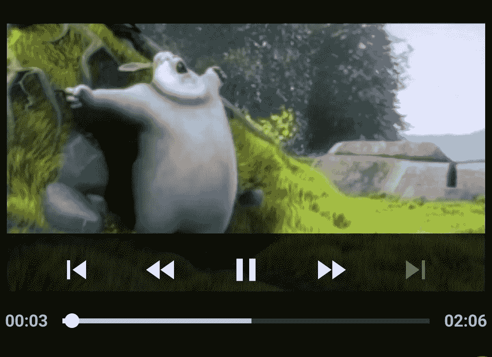
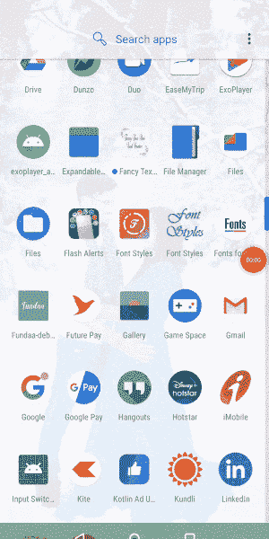

# Android ExoPlayer:像 YouTube 一样在你的应用程序中播放视频

> 原文：<https://betterprogramming.pub/android-exoplayer-play-videos-in-your-app-like-youtube-486853913397>

## Android 中 ExoPlayer 集成的初学者指南



# 视频应用的重要性

出于娱乐、教育和许多其他目的，对视频播放应用程序的需求一直存在。如果我们看看 Youtube 过去五到十年的使用情况，你就能清楚地看到这一点。即使在地球上最偏远的地区，移动娱乐也增加了很多。甚至偏远村庄的文盲也在使用视频应用程序进行娱乐。另一方面，由于新冠肺炎引起的疫情，世界上大多数学校都转向了电子学习。出于这些原因，一个好的应用程序可以做很多事情，为满足当前世界的需求而构建。说够了，让我们深入到我们的概念:Exoplayer。

# 介绍

在 ExoPlayer 之前，Android 的 MediaPlayer API 是在本地和互联网上跨 Android 设备播放音频和视频的主要解决方案。一开始，使用 MediaPlayer 播放一个简单的视频很容易，但如果你想建立一个像 Youtube 这样的播放器，那将需要大量的时间、精力和痛苦。我的原则是不要重新发明轮子，而是使用已经存在的完美解决方案。

ExoPlayer 是运行在 Android YouTube 应用程序中的视频播放器。它不是 Android 框架的一部分，而是由谷歌维护的一个开源项目。ExoPlayer 是 Google 提供的一个库，它代表我们处理音频和视频相关的事情，我们可以调用一些方法来玩它。我们还可以对播放器 UI(用户界面)进行自定义。

*ExoPlayer 建立在 Android 的 MediaCodec API 之上，该 API 在 Android 4.1(API 16 级)中已经出了。所以，如果我们想集成 Exoplayer，你的应用程序的最低 API 版本需要设置为 API 16。*

# 为什么要用 ExoPlayer？

*   ExoPlayer 支持 DASH(基于 HTTP 的动态自适应流)、HLS(HTTP 直播流)、SmoothStreaming 和 Common Encryption 等功能，`MediaPlayer`不支持这些功能。
*   ExoPlayer 采用模块化设计，因此易于扩展和定制。
*   Android 上的主要视频流巨头大多依赖 Exoplayer，因为它的功能和灵活性。ExoPlayer 是运行在 Android YouTube、网飞、亚马逊媒体播放器 Prime、HotStar 和许多其他流行和强大的应用程序上的视频播放器。
*   很好的文档和教程。
*   免费的！

说够了，让我们开始编码吧。

# 基本 Android ExoPlayer 应用程序

让我们通过创建一个示例应用程序并检查一步一步的过程来检查集成，以便更好地理解。从你的工作室创建一个新项目，并遵循以下步骤。

如果您没有足够的时间一步一步来，或者您打算直接深入代码，请查看示例集成的 repo 链接:

[](https://github.com/pavan5208/exoplayer_android_sample.git) [## pavan 5208/exo player _ Android _ sample

### 通过在 GitHub 上创建帐户，为 pavan 5208/exo player _ Android _ sample 开发做出贡献。

github.com](https://github.com/pavan5208/exoplayer_android_sample.git) 

## 步骤 1:在应用级 build.gradle 文件中添加 ExoPlayer 依赖项

```
implementation 'com.google.android.exoplayer:exoplayer:2.11.8'
```

这可以是您选择的任何版本——我只是添加了目前可用的最新版本。顺便说一下，我们还可以灵活地只添加我们实际需要的库模块，而不是上面提到的完整包。

可用的库模块有:

*   `exoplayer-core`:核心功能(必备)。
*   `exoplayer-dash`:支持破折号内容。
*   `exoplayer-hls`:支持 HLS 内容。
*   `exoplayer-smoothstreaming`:支持平滑流式内容。
*   `exoplayer-ui`:和 ExoPlayer 一起使用的 UI 组件和资源。

在这个例子中，让我们接着添加一个完整的包，因为添加单个模块有不同的需求，有时会导致错误。

此外，确保您已经在项目级 build.gradle 文件的`repositories` 部分添加了 JCenter 和 Google，尽管它们在新版本中是默认添加的。

```
repositories **{** google()
    jcenter()
**}**
```

## 步骤 2:在应用程序级别启用 Java8 支持`build.gradle`

```
compileOptions **{** targetCompatibility JavaVersion.*VERSION_1_8* **}**
```

## 步骤 3:创建一个 XML 并向其中添加一个 ExPlayer 视图

为了定制 UI 看起来像 Youtube 或其他东西，我们需要添加一些布局，drawables 等，我们将在我接下来的文章中看到。这里，让我们给基本的`PlayerView`充气:

# 步骤 4:通过创建一个 ExoPlayer 实例并分配一个播放源来初始化播放器

当我们完成了 UI 之后，让我们创建 ExoPlayer 的实例来开始播放媒体。我们可以使用可用的构建器模式来创建实例。在大多数情况下，使用`SimpleExoPlayer`将是一种方便的方法——实现`ExoPlayer`接口。

```
val videoPlayer = SimpleExoPlayer.Builder(this).build()
```

由于我们已经创建了 ExoPlayer 的实例，现在我们需要将它分配给用 XML 创建的视图:

```
video_player_view?.*player* = videoPlayer
```

接下来，我们需要构建源来播放。有许多类型的媒体源可供选择，让我们从`ProgressiveMediaSource` **开始。**这里我们拿一个 URL，通过构建`ProgressiveMediaSource` **来玩。**

这通常分两步完成。第一步我们创建`DefaultDataSourceFactory` 的实例，然后将这个实例传递给`ProgressiveMediaSource.Factory`，如下所示:

`sampleUrl`是包含流 URL 的字符串变量。

到目前为止，初始化播放器的方法将如下所示:

# 步骤 5:添加与活动生命周期相关的基本暂停和播放功能

当我们完成时，不要忘记释放播放器:

# 步骤 6:向清单文件添加互联网权限并运行应用程序

```
<uses-permission android:name="android.permission.INTERNET" />
```

你应该看到下面的视频播放与所有的播放器功能:暂停，播放，倒带，寻找选项等。



视频因尺寸较大而被修剪

整个活动看起来会像这样:

这款播放器的功能类似于 YouTube。当应用程序进入后台时，播放器暂停播放，当用户回来时，它从停止的地方播放。

但是在现实世界的场景中，我们需要处理更多的事情来获得更好的用户体验，比如玩家的状态处理或者保持 seek 位置继续。

下面是 GitHub 的 repo 链接，用于本文中使用的示例:

[](https://github.com/pavan5208/exoplayer_android_sample.git) [## pavan 5208/exo player _ Android _ sample

### 通过在 GitHub 上创建帐户，为 pavan 5208/exo player _ Android _ sample 开发做出贡献。

github.com](https://github.com/pavan5208/exoplayer_android_sample.git) 

# 摘要

暂时就这些了。我希望你学到了新东西。让我们在我即将发表的文章中检查高级状态处理、实时流处理、类似于 Youtube 的 UI 美化等。敬请期待！

# 参考

*   [ExoPlaye](https://developer.android.com/guide/topics/media/exoplayer)
*   [使用 ExoPlayer 进行流媒体播放](https://codelabs.developers.google.com/codelabs/exoplayer-intro/#0)

请给我留下你的建议和意见。

感谢阅读。