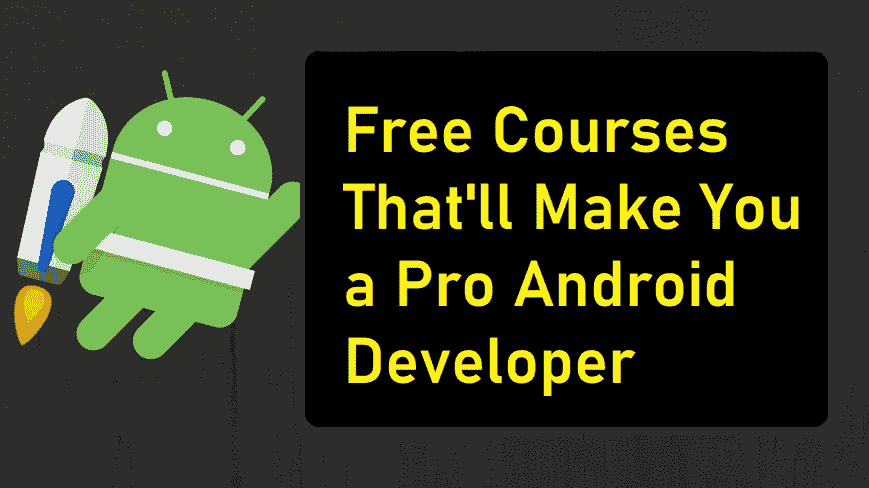

# 成为成功的 Android 开发者的路线图

> 原文：<https://betterprogramming.pub/android-free-courses-3b550ce388e6>

## 如何成为一名 Android 开发者？

## 如果你想成为一名专业的 Android 开发者，请遵循这个路线图

> "改变是所有真正学习的最终结果."
> 
> ―利奥·巴斯卡利亚

Android 开发现在很受欢迎。

许多人要求我指导他们成为一名 Android 开发者。正确的行动方针是什么？

如果你想成为一名 Android 开发者，我发现这里有一些非常有用的课程。

在完成所有课程后，你会觉得自己像一个专业的 Android 开发者，能够解决现代 Android 应用程序开发的问题。

这些是来自 Udacity 的课程，完全免费。

# 初级水平

## **安卓基础:用户界面**

在[这门课](https://www.udacity.com/course/android-basics-user-interface--ud834)，你将学习 Android 和 Java 编程语言的基础。这将是你 Android 开发之旅的第一步。学习这门课程不需要任何编程知识。

## **安卓基础:用户输入**

[这门课程](https://www.udacity.com/course/android-basics-user-input--ud836)也非常基础，面向那些刚刚开始使用 Android 和 Java 的人。本课程不要求事先具备编程知识。

## **安卓基础:多屏应用**

[本课程](https://www.udacity.com/course/android-basics-multiscreen-apps--ud839)是谷歌纳米学位项目的一部分。在本课程中，您将学习如何开发适用于多屏幕的 Android 应用。

## **安卓基础:网络**

在[这门课](https://www.udacity.com/course/android-basics-networking--ud843)中，你将学习如何在 Android 应用中建立联系。完成本课程后，您将能够制作一个地震应用程序。

## **安卓基础:数据存储**

在[这门课](https://www.udacity.com/course/android-basics-data-storage--ud845)中，你将学习如何在你的 Android 应用中实现数据持久化。您将学习 SQL 基础知识，这是一种与 SQLite 数据库交互所需的编程语言。

# 中间能级

## 开发安卓应用

在[这门课](https://www.udacity.com/course/new-android-fundamentals--ud851)中，你将获得 Android 应用开发的实践经验。您将在讲师的逐步指导下开发高质量的云连接 Android 应用程序。

## **安卓材质设计**

在[这门课程](https://www.udacity.com/course/material-design-for-android-developers--ud862)中，他们将带你了解 Android 材料设计的基本原则，之后，他们将向你展示如何在 Android 示例应用程序中应用这些原则。老实说，材料设计是 Android 应用开发旅程中非常重要的一部分。这是必须的。

## **谷歌 Firebase**

这是一门关于 Firebase 的[入门课程。Firebase 是开发者在 Android 应用中处理后端功能的重要平台，如实时数据库和推送通知。](https://www.udacity.com/course/firebase-in-a-weekend-by-google-android--ud0352)

## **Google Firebase Analytics**

Firebase 有许多特性。但最重要和最有用的功能是 Firebase Analytics。在 Firebase 中有一个无限的分析解决方案。[在整个课程中，](https://www.udacity.com/course/firebase-analytics-android--ud354)你将学习如何扩大应用的用户群。

## **Kotlin for Android**

在[这门课](https://www.udacity.com/course/kotlin-for-android-developers--ud888)中，你将学习 Kotlin 的基础知识，这是继 Java 之后的一种新的 Android 编程语言。

## **安卓性能**

[这门课](https://www.udacity.com/course/android-performance--ud825)非常必要，因为每个安卓应用都有性能和可用性问题。这是一个非常关键的技能，你需要学会诊断你的 Android 应用程序的性能问题。

# 优等

1.  **高级 android 应用开发** 本课程是关于 Android 开发的一些高级知识。您将了解片段、回放、小部件、测试等等。你将能够制作出生产就绪的应用程序。[点击这里。](https://www.udacity.com/course/advanced-android-app-development--ud855)
2.  在对 Android 有了足够的了解之后，现在是时候让自己为技术面试做准备了。本课程将通过模拟面试来帮助您完成一个完整的面试过程，并且您将学习行为问题和白板问题的最佳实践。点击这里。
3.  **Gradle for Android** 本课程是关于 Gradle 及其编译的。Gradle build tool 如何编译和打包应用程序。[点击这里。](https://www.udacity.com/course/gradle-for-android-and-java--ud867)

这份课程汇编对于那些希望从事 Android 应用程序开发的人来说非常重要。你需要做的就是有耐心并开始学习。

按照自己的进度完成每门课程。不要慌！如果你完成了这些课程，你可以找到一份初级 Android 或中级 Android 开发人员的工作。

哈尼亚写道这里有一篇很棒的文章，是关于如何赢得你的第一个自由职业项目的。

 [## 如何赢得你的第一个自由职业项目？

### 赢得第一个自由职业项目的五星公式！

medium.com](https://medium.com/writers-blokke/how-to-win-your-first-freelancing-project-51e243b340f5) 

## 觉得这篇文章有用？跟着我 [Mustufa Ansari](https://medium.com/u/8ee4abb8abb8?source=post_page-----1b8c9832af43----------------------) 上媒。看看下面我读得最多的文章。

*   [如何使用 TextView 在 android 中实现复制/粘贴功能？](https://medium.com/better-programming/android-copy-paste-7dd60ad47d0)
*   [Android 数据绑定(第一部分)](https://medium.com/better-programming/android-data-binding-139686b65aec)
*   [如何使 RecyclerView 项目可扩展？](https://medium.com/better-programming/recyclerview-expanded-1c1be424282c)
*   想要制作具有更多选项的动画浮动操作按钮？
*   [用漂亮的动画制作 RecyclerView！](https://medium.com/better-programming/android-recyclerview-with-beautiful-animations-5e9b34dbb0fa)
*   [AndroidX 是什么？](https://medium.com/better-programming/what-is-androidx-1b8c9832af43)