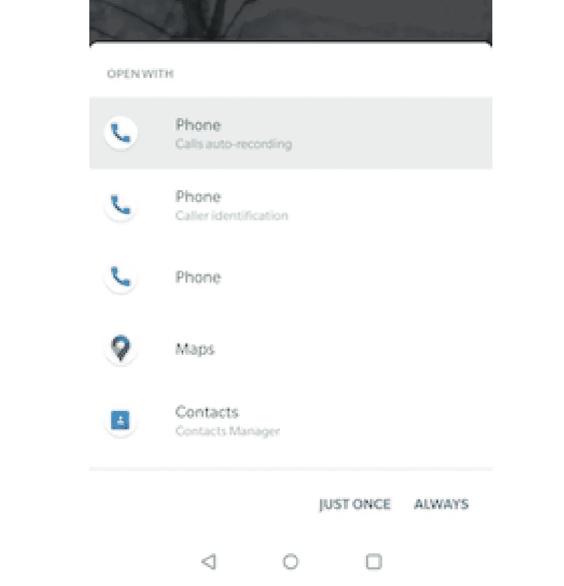
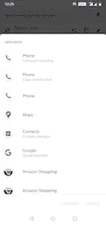

# 安卓深层链接指南

> 原文：<https://betterprogramming.pub/android-guide-for-app-deeplinks-aa5fb0e1514e>

## 它们是什么，我们怎样才能用好它们？



Play Store 中的每个应用程序在用户基础方面都达到了一定的水平，希望用户每天或每月都回来使用该应用程序。

这被称为*留存率，*这是应用程序筹集资金或做其他一些事情的关键因素，具体取决于它们的要求。

所以基本上他们发送不必要的通知或消息来获得用户的关注。深层链接是一个重要的方面，让用户去一个特定的目的地，而不是通常的导航流。

Android 上的深度链接推动了更好的用户体验。在本文中，让我们探索深层链接，以及我们如何在 Android 应用程序中实现它们。在开始实现之前，理解一些基本的东西是很重要的，比如它们是什么以及我们为什么需要它们。

# 什么是深度链接？

深层链接类似于我们日常使用的链接或 URL。每个链接或 URL 用于将用户导航到某个特定的目的地。例如，让我们看看下面的 URL:

```
https://www.example.com/classes?lecture=10
```

上面的链接是一个 URL，它将你导航到`example.com`域中的`classes`页面，而不是域主页。

因此，在这些术语中，Android 深度链接是一种将用户导航到应用程序内特定目的地的 URL。在 Android 中，我们添加了*意图过滤器*来定义特定页面的 URL，我们从输入的意图中提取数据来驱动用户进行正确的活动。

简单来说，Android 深度链接只不过是将用户导航到应用程序的特定内容或特定页面的 URL。

# 深层链接的构建模块

URL 是用于定义 web 端点的格式。对于 Android，我们需要将 URL 分成几个部分来告诉系统处理特定的事情。让我们用 Android 术语检查一个示例 URL:

```
https://www.sample.com/profile?id=1&name=pavan
```

*   `https`是一个*方案*
*   `www.sample.com`是一台*主机*
*   `**/profile**`是一个*路径*，用于标识特定的页面或内容
*   `?id=1&name=pavan`是我们使用意图提取的*查询参数*

以上的东西，像主机、方案、路径、查询参数，都是在 Android 中建立深度链接需要的东西。

# 理解深层链接

当用户点击深层链接时，Android 系统会按顺序尝试每个操作，直到请求成功:

1.  打开可以处理 URI 的用户首选应用程序(如果已指定)。
2.  打开唯一可用的可以处理 URI 的应用程序。
3.  允许用户从如下选项对话框中选择一个应用程序



# 如何处理意图过滤器

意图过滤器是应用程序清单文件中的一个表达式，它指定组件希望接收的意图类型。在清单文件中设置一个`<intent-filter>`作为入口点。

1.  将动作定义为意图的`ACTION_VIEW`,这样 Google 搜索就可以到达意图过滤器。

```
<**action** android:name="**android.intent.action.VIEW**" />
```

2.包括`[BROWSABLE](https://developer.android.com/reference/android/content/Intent#CATEGORY_BROWSABLE)`类别，以便可以从意图过滤器的网络浏览器访问它。没有它，在浏览器中点击链接就无法解析到你的应用。

此外，包括`[DEFAULT](https://developer.android.com/reference/android/content/Intent#CATEGORY_DEFAULT)`类别，它允许你的应用程序响应隐含的意图。否则，只有在意向指定了您的应用程序组件名称时，活动才能开始。

```
<**category** android:name="**android.intent.category.DEFAULT**" />
<**category** android:name="**android.intent.category.BROWSABLE**" />
```

3.为意图过滤器添加一个`data`标签。这个`data`标签有`host`、`scheme`、`path`和`query`参数来标识链接。

可以有多个`data`标签。

URL `example://app/profile`的`data`标签如下:

```
<**data**
    android:**host**="app"
    android:**pathPrefix**="/profile"
    android:**scheme**="example" />
```

**注意:**为目标`Activity`设置`android:launchMode="singleTask"`以避免同时启动活动的多个实例。

# 让我们创造一个深度链接

要构建一个深层链接，把上面步骤中的所有东西加在一起。以下 XML 片段显示了如何在清单中为深度链接指定意图筛选器。

URIs `“app://sample/profile”`和`“https://www.sample.com/profile”`都解析为一个活动。

我们可以使用带有多个`data`标签的单个意图过滤器，但是为不同的 URIs 添加多个意图过滤器是一个很好的过程。

```
<intent-filter>
  ...
  <data android:scheme="https" android:host="www.example.com" />
  <data android:scheme="app" android:host="open.my.app" />
</intent-filter>
```

看起来好像只支持`https://www.example.com`和`app://open.my.app`。但是，它实际上支持那两个加上这些:`app://www.example.com`和`https://open.my.app`。

一旦我们通过 URIs 为你的应用清单添加了活动内容的意图过滤器，Android 就能够在运行时将任何具有匹配 URIs 的`Intent`路由到你的应用。

# 从传入意向中读取数据

一旦系统通过意图过滤器开始我们的活动，我们就可以使用意图提供的数据来确定我们需要呈现什么。调用`getData()`和`getAction()`方法来检索与传入意图相关的数据和动作

由于`id` 是强制参数，如果 intent 不包含数据，我们将通过调用`finish()`来关闭活动实例。逻辑取决于需求。

# 如何测试深层链接

我们可以使用 Android Debug Bridge (adb) shell 命令来检查深层链接是否流动，比如深层链接是否导航到正确的页面。

```
adb shell am start -a android.intent.action.VIEW -d "**URI_SCHEME**" **package-name**
```

使用上面的命令，通过用定义的 URL 替换`URI_SCHEME`，用应用程序包名称替换`package-name`，我们可以测试我们的实现。上述配置文件页面的命令是:

```
adb shell am start -a android.intent.action.VIEW -d "**app://sample/profile?id=1**" **com.sample**
```

然而，`package-name`是一个可选属性。为了消除具有相同 URI 的不同应用程序之间的歧义，我们定义了`package-name`。

# 最佳实践

*   您需要有一个**单独的深度链接活动**来处理所有需要登录、完成入职等情况。隔离入口点将提供处理事情的灵活性，并提供更干净的代码来维护。
*   最好**验证并呈现**页面内容，因为目标页面是隐藏的，可能会有安全问题。最好在呈现页面之前进行验证
*   如果应用程序有登录或入职功能，最好有一个**重定向助手**功能来维护导航。例如，如果用户点击一个链接并进入应用程序，假设他没有登录。还假设他试图访问的内容需要登录验证。首先，我们将目的地的详细信息存储在一个重定向函数中，并显示登录页面，在验证之后，使用重定向函数，我们需要将用户重定向到正确的目的地。

# 结论

目前就这些——希望你喜欢这篇文章。

感谢阅读！

## 参考

*   [“创建应用内容的深层链接](https://developer.android.com/training/app-links/deep-linking)”