# Android 渲染视图的内部机制

> 原文：<https://betterprogramming.pub/android-internals-for-rendering-a-view-430cd394e225>

## 只有了解了幕后发生的事情，才有可能制作出一个出色的应用程序

马丁·卡特勒在 [Unsplash](https://unsplash.com/?utm_source=unsplash&utm_medium=referral&utm_content=creditCopyText) 上的照片

如果你没有读过关于[的书，不知道如何在 Android](https://medium.com/better-programming/understand-how-view-renders-in-android-763f0adfb95c?source=your_stories_page---------------------------) 中渲染视图，请[查看](https://medium.com/better-programming/understand-how-view-renders-in-android-763f0adfb95c)以获得更好的理解。由于我们中的一些人更有兴趣挖掘更多的细节，如渲染时使用的组件，显示管道是什么，以及 UI 和硬件之间的同步是如何发生的，下面是答案。要知道上述问题的答案，我们需要知道下面列出的基本组件

1.  UI 线程
2.  渲染线程
3.  编舞者
4.  垂直同步
5.  缓冲队列
6.  表面抛油器
7.  表面视图
8.  显示管道

# UI 线程

每一个 app 都有它运行 UI 对象的特殊线程，比如视图对象；这个线程被称为 UI 线程。只有在 UI 线程上运行的对象才能访问该线程上的其他对象。

简单地说，UI 线程准备了要在渲染线程上执行的命令管道。从技术上讲，UI 线程负责通过处理视图的生命周期来创建信息。这意味着 UI 线程运行视图的 onMeasure()、onLayout()、onDraw()并收集信息，然后将其传递给渲染线程。

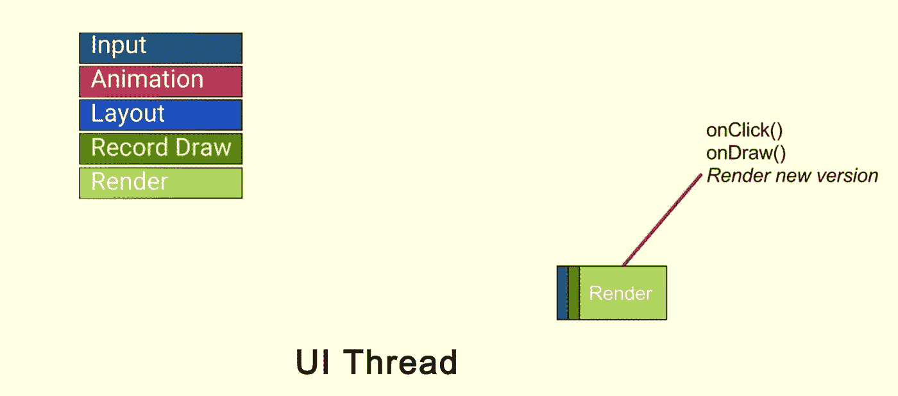

例如，让我们考虑在一个视图上有一个点击事件。UI 线程处理输入事件；如果视图中有任何属性变化，那么就会发生遍历来测量视图。在定位和放置视图之后，就进入了阶段。最后一个阶段是根据上述信息绘制视图。如果上面的信息准备好了，那么我们就把这些信息从 UI 线程同步到渲染线程。

# 渲染线程

渲染线程是 Android Lollipop 中已经引入的组件。它从 UI 线程获取输入，并将其处理给 GPU。我们假设 UI 线程和渲染线程按顺序工作，因为没有来自 UI 线程的输入，渲染线程不知道做什么。但是，实际上，它们是异步工作的，例如在一些动画和其他东西的情况下。但一般来说，我们确实准备了 UI 线程上的所有信息，并将这些信息传递给渲染线程，渲染线程是一个与 GPU 对话的独立线程。

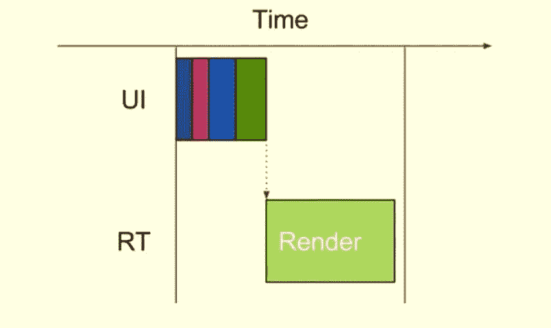

# 编舞者

我们可以说 [Choreographer](https://developer.android.com/reference/android/view/Choreographer) 是一个类，它充当了底层显示系统和应用级视图系统之间的桥梁。

编排器从显示子系统接收定时脉冲，例如垂直同步，然后将工作安排为呈现下一个显示帧的一部分。

# 垂直同步

要了解 VSYNC，我们需要了解另外两个术语。一个是刷新率，也就是屏幕每秒可以更新显示多少次。第二个术语是帧率，意思是你的 GPU 每秒可以画多少帧。这两者需要协同工作，才能将图像正确地绘制到屏幕上。不能保证这两者以相同的频率出现。在这种情况下，我们可以在屏幕上看到差异或不完整的绘制帧。

GPU 使用两个缓冲区:后台缓冲区和帧缓冲区。后台缓冲区用于绘制帧。一旦完成，GPU 会将该帧复制到帧缓冲区。简而言之，帧缓冲区保存需要在屏幕上呈现的数据。但是，在将内容从后台缓冲区复制到帧缓冲区时，从帧缓冲区获取数据的屏幕刷新率会出现问题。

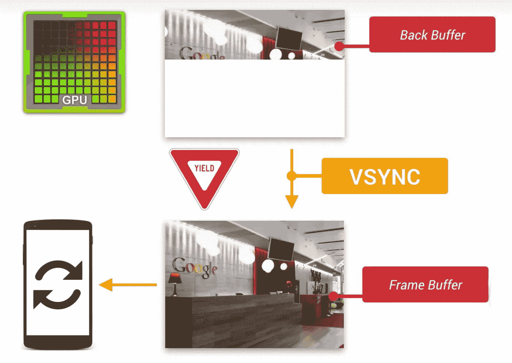

因此，垂直同步(VSYNC)就派上了用场。VSYNC 保存从后台缓冲区到帧缓冲区的复制操作，以防屏幕刷新。因此，帧缓冲区中完整绘制的帧将只在屏幕上呈现。

VSYNC 通常每秒启动 60 次(大约 16.67 毫秒)。在引入 VSYNC 之前，我们经历过 UI 渲染的延迟，这是人眼可以察觉的。

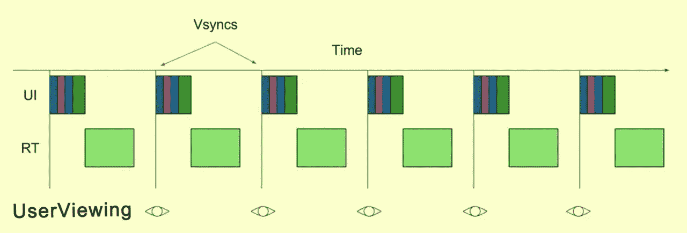

## 流动

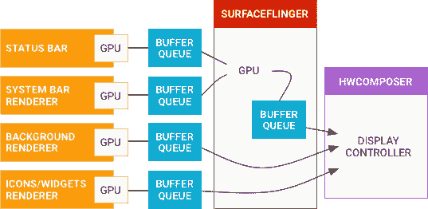

# 表面抛油器

基本上，SurfaceFlinger 获取显示数据的缓冲区，将它们组合成一个缓冲区，然后将其传递给硬件抽象层(HAL)。但是，SurfaceFlinger 专门处理包含图形和显示数据的缓冲区。

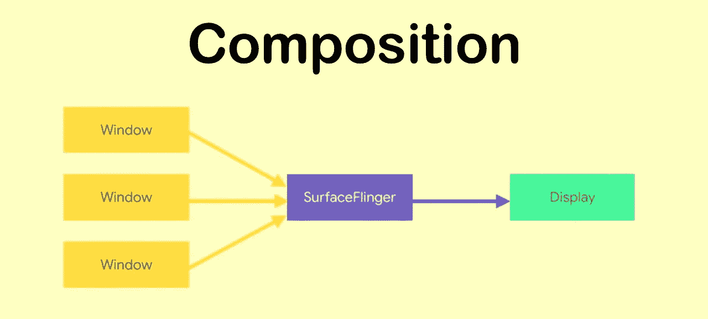

# 缓冲队列

缓冲区是一个简单的内存区域，当某样东西被移动到另一个地方时，用来临时存储它。缓冲队列只是我们的图形缓冲区所在的缓冲区队列。通常，我们会有一到三个缓冲区。缓冲队列主要有两个端点:一个是生产者，另一个是消费者。

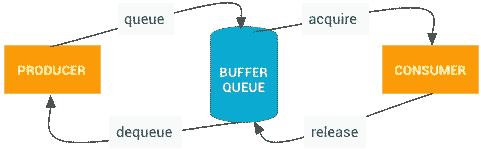

步骤 1: Producer 在队列上调用了一个名为 dequeueBuffer 的方法，现在 Buffer 的状态是出列。现在，缓冲区的所有者是生产者，它可以对缓冲区进行任何操作，如渲染、设置数据等。通过使用 OpenGL 或 Canvas。

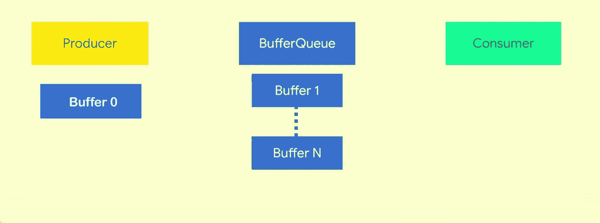

步骤 2:在生产者完成插入数据后，它调用队列缓冲区，以便缓冲区排队返回 BufferQueue。此时，缓冲区的状态从出列->排队变为缓冲区所有者成为 BufferQueue。

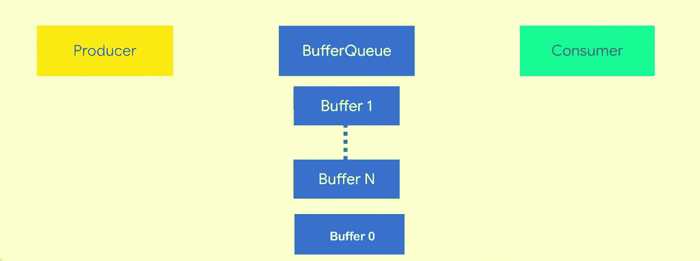

步骤 3:现在消费者将调用 BufferQueue 上的 acquireBuffer，并获取队列中可用的缓冲区。现在消费者是主人；缓冲区的状态由 QUEUED-> ACQUIRED 改变。

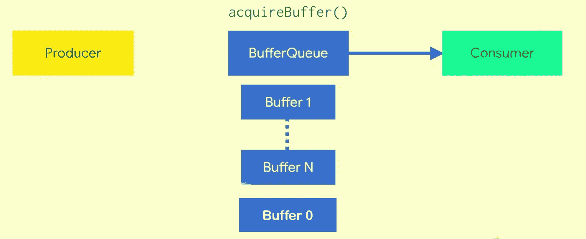

步骤 4:在消费者操作之后，它调用 release 以便缓冲区返回到 BufferQueue 中。此时，缓冲区的状态从“已获取”->“自由”变为“缓冲区所有者”，成为 BufferQueue。

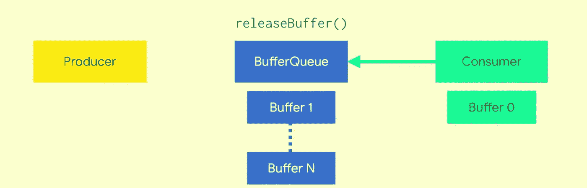

最后，缓冲队列状态

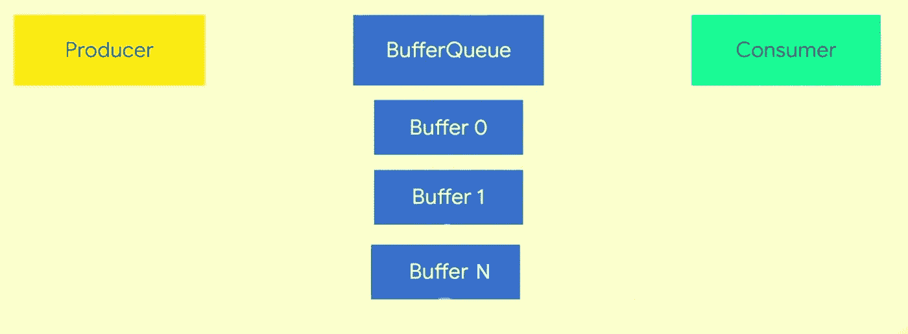

## 例子

让我们看一个例子，其中 WindowManger 是我们的生产者，SurfaceFlinger 是我们的消费者。当我们创建一个对话框或创建一个活动时，一个窗口被附加到 WindowManager。现在这个窗口在 SurfaceFlinger 端有了一个兄弟，叫做 Layer。层是系统中的一个组件，它创建并拥有应用程序的 BufferQueue。表面是一个 API，它是生产者与 BufferQueue 交互的端点。

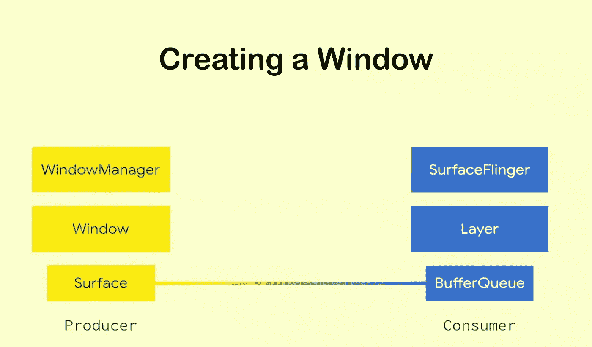

# 显示管道

VSYNC 信号同步显示流水线。显示管道由应用渲染、SurfaceFlinger 合成和在显示器上呈现图像的硬件合成器(HWC)组成。VYSNC 同步应用程序唤醒以开始渲染的时间、SurfaceFlinger 唤醒以合成屏幕的时间以及显示刷新周期。这种同步消除了不连贯，提高了图形的视觉性能。

HWC 生成 VSYNC 事件，并通过回调将事件发送给 SurfaceFlinger。

# 表面视图

SurfaceView 提供了嵌入视图层次结构内部的专用绘图表面。您可以控制这个表面的格式，如果您愿意，还可以控制它的大小；表面视图负责将表面放置在屏幕上的正确位置

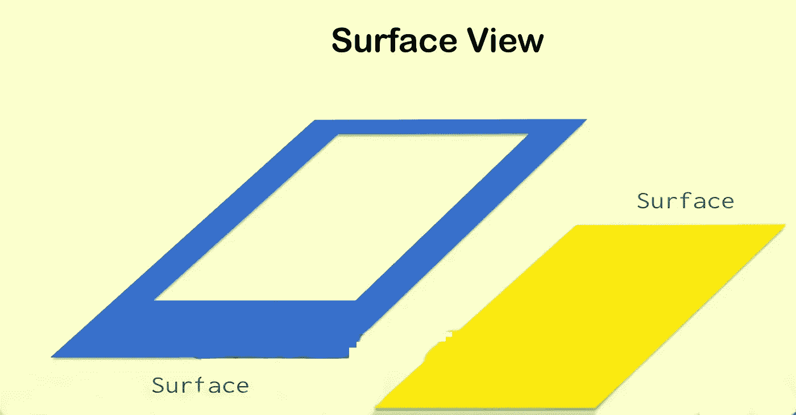

SurfaceView 的工作原理是窗口就是它的表面。然后，它精确地在表面上切孔。我们要求 WindowManager 和 SurfaceFlinger 创建第二个表面，我们只是把它放在第一个表面的下面。它们是两个不同的表面和不同的缓冲队列；他们可以独立。下面是结果。

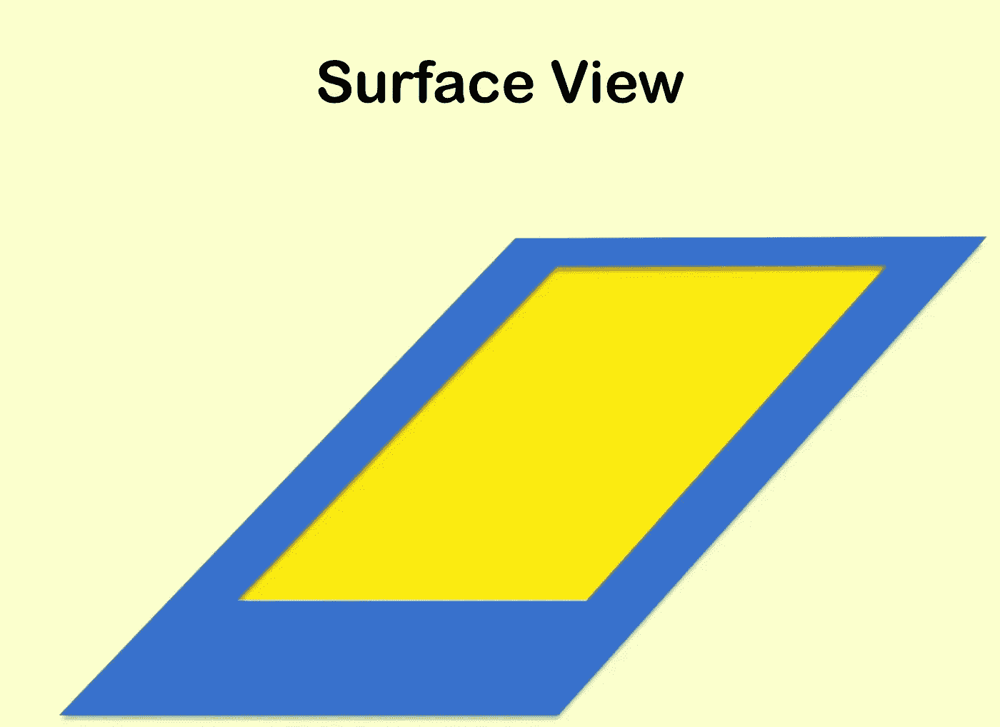

感谢您的阅读！