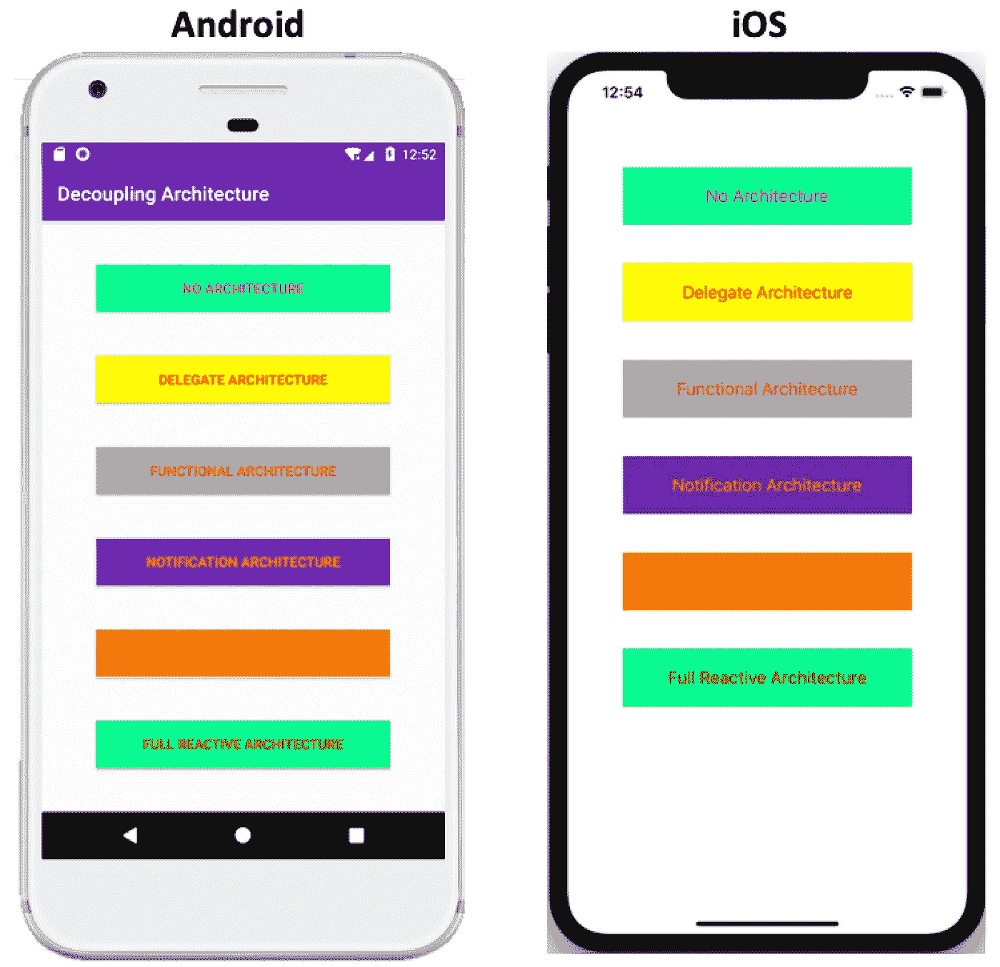
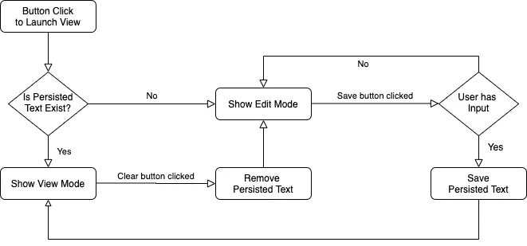
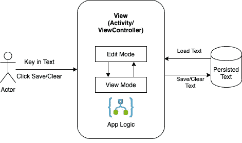
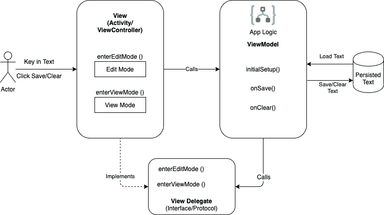
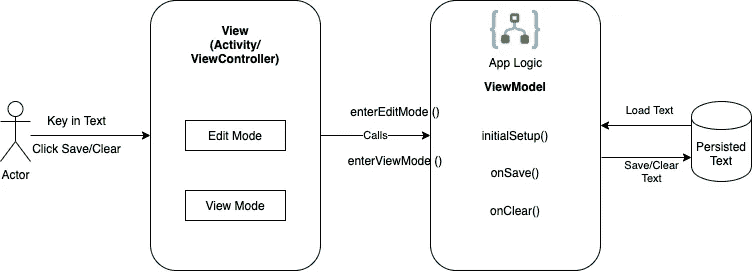
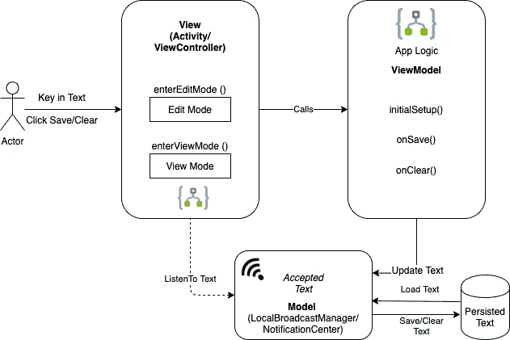
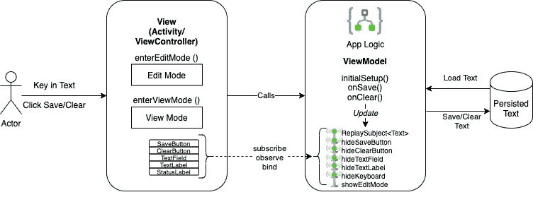
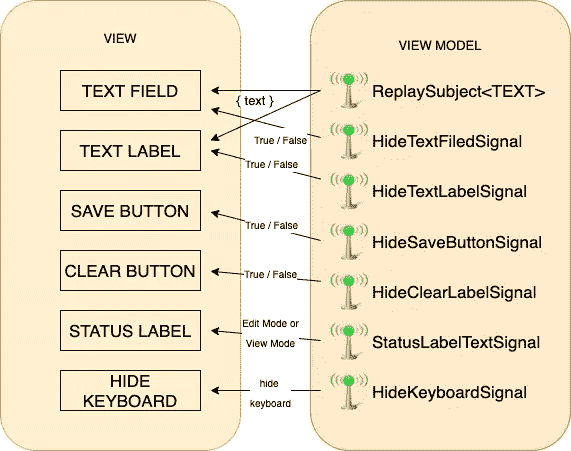

# Android 和 iOS 视图/逻辑解耦示例

> 原文：<https://betterprogramming.pub/android-ios-view-logic-decoupling-examples-8be1bc287114>

## 通过简化代码来改进我们的应用程序


照片[来自](https://unsplash.com/@killerfvith) [Unsplash](https://unsplash.com/photos/l5Tzv1alcps) 的黄福生

为了使我们的应用程序代码更好地结构化，可以将逻辑与视图分离开来——例如`Activity`(在 Android 中)和`ViewController`(在 iOS 中)。因此，知道如何做是很重要的。

在这里，我分享了从视图中分离逻辑的各种方法，并在 Android (Kotlin)和 iOS (Swift)中给出了例子。这使得学习这两个平台更加容易。

这也将像 MVP 这样的架构暴露给 MVVM。可以评估一下个别 app 哪个更好。

# 代码示例

为了帮助学习，我在两个平台上都创建了代码示例，其中六个示例(六个按钮)做完全相同的事情(从用户的角度来看)，但是具有不同的架构方法，我将在下面的每一节中详细介绍。

[](https://github.com/elye/demo_android_view_model_view_decouple) [## elye/demo _ Android _ view _ model _ view _ decouple

### 在 Android-elye/demo _ Android _ View _ model _ View _ decouple 中演示解耦视图模型及其视图的各种架构

github.com](https://github.com/elye/demo_android_view_model_view_decouple) [](https://github.com/elye/demo_ios_view_model_view_decouple) [## elye/demo _ IOs _ view _ model _ view _ decouple

### 演示在 iOS-elye/demo _ iOS _ View _ model _ View _ decouple 中解耦视图模型及其视图的各种架构

github.com](https://github.com/elye/demo_ios_view_model_view_decouple) 

# 基本:无架构

首先，让我们看一个没有任何架构的。这有助于说明整体功能是什么。它是由青色按钮触发的。代码易于追踪，因为所有代码(包括逻辑)都在`Activity`和`ViewController`中。

功能很简单:我们将显示一个可编辑的文本字段和一个保存按钮。我们称之为*编辑模式。*一旦用户输入内容并点击保存按钮，它就会变成一个标签，里面显示文本。它还会显示一个清除按钮。我们称之为*视图模式。*

相反，当用户点击清除按钮时，它将返回到编辑模式并清除文本。


除了在编辑模式和查看模式之间来回切换之外，它还将类型数据保存到内存中。因此，如果用户在查看模式下退出视图并返回页面，它将显示编辑模式。

从功能上讲，它的工作原理如下面的流程图所示。流程中有几个逻辑的例子。



从架构图来看，没有逻辑分离。一切都在一个类内处理(`Activity` / `ViewController`)。



这对于一个小的逻辑视图页面来说是可以的，如本例所示。但是如果我们进一步扩展它的功能，它将无法扩展，并且变得难以维护。此外，这会使测试变得困难，因为我们需要在测试代码中包含`View`类。

从长远来看，为了使它变得更好并具有可伸缩性，让我们将逻辑解耦到另一个名为`ViewModel`的类中。至于如何做，下面是五种不同的方法。

# 代表架构

在 Android 世界中，这通常被称为*模型-视图-展示者(MVP)* 架构模式。在 iOS 中，它通常被称为*委托方法，*主类将其逻辑委托给另一个类。这里，我们指的是逻辑处理类`ViewModel`。

这个`ViewModel`类将负责所有的逻辑部分(例如，决定保存按钮是否可以保存)以及与持久文本的交互，让`View`类不用担心所有这些细节。

`ViewModel`虽然负责逻辑，但需要与视图通信以进入视图或编辑模式。为此，我们需要如下图所示的接口/协议的帮助。



接口/协议定义了视图需要实现什么，这样`ViewModel`就可以进行交互。

```
**// Android**
**interface** DelegateView {
    fun enterViewMode(text: String)
    fun enterEditMode()
}**// iOS
protocol** DelegateView : class {
    func enterViewMode(text: String)
    func enterEditMode()
}
```

视图本身会相应地实现这个接口/协议。它拥有一个`ViewModel`，在那里它将自己传递给。

```
**// Android**
class DelegateActivity : AppCompatActivity(), **DelegateView** {
    private var **viewModel: DelegateViewModel**? = null
    //... 
    viewModel = **DelegateViewModel(this)**
}**// iOS** class DelegateViewController: UIViewController, **DelegateView** {
    private var **viewModel: DelegateViewModel**?
    //...
    self.viewModel = **DelegateViewModel(delegate: self)**
}
```

为了进行反馈，`ViewModel`也有一个视图的引用，它是接口/协议的实现。

```
**// Android**
class DelegateViewModel(private val delegate: DelegateView)**// iOS**
class DelegateViewModel {
    private **unowned** let delegate: DelegateView!
    init(delegate: DelegateView) { self.delegate = delegate } // ...
}
```

这里需要注意的是，在 iOS 中，我们将`unowned`类型设置为`delegate`来打破保持循环。

就是这样。现在，您可以将逻辑从视图中分离出来。有关详细信息，请查看示例代码。

## 讨论

这种方法很容易跟踪，并且在视图和`ViewModel` 之间有很强的契约——如接口/协议所定义的。这使得跟踪变得容易，当缺少某些东西时，编译时错误很容易显示出来。

这种方法的缺点是:

1.  需要额外的接口/协议。
2.  即使我们已经解耦了逻辑，它们仍然以某种方式强耦合，其中一方需要了解另一方的期望。
3.  即使不是所有定义的接口/协议都是必需的，视图仍然需要实现它们(我们可以使用 Kotlin 中的默认接口来减轻这一点——但不是针对协议)。

为了解决这个限制，让我们看看下一种方法

# 功能建筑

我们可以传递函数，而不是用现代编程方法定义接口/协议。这可以使用 Kotlin 中的 lambdas 和 Swift 中的 closures 来完成。



在`ViewModel`中，所需的 lambda/闭包定义可以声明如下:

```
**// Android**
fun initialSetup(enterEditMode: () -> Unit,
                 enterViewMode: (text: String) -> Unit) **// iOS**
fun initialSetup(enterEditMode: () -> Unit,
                 enterViewMode: (text: String) -> Unit) 
```

在视图中，用户可以轻松地发送函数:

```
**// Android**
viewModel?.initialSetup(::enterEditMode, ::enterViewMode)**// iOS**
viewModel?.initialSetup(enterEditMode: enterEditMode, 
                        enterViewMode: enterViewMode)
```

## 讨论

在这种方法中，我们消除了对接口/协议的需求，如上图所示。强契约和耦合不再存在。这使得视图对它所需要的和不需要在`ViewModel`中定义的有更多的控制。

然而，这种方法的缺点是:

1.  视图决定了`ViewModel`应该调用什么功能。因此，如果一个错误的函数(相同的签名)被发送，这可能会导致一个`ViewModel`无法控制的错误。
2.  如果一遍又一遍地需要同一个函数，同样的函数需要一遍又一遍地发送给`ViewModel`。例如，下面的代码显示`enterViewMode`被发送了两次，而`enterEditMode`也被发送了两次。

```
**// Android example**
private fun save() {
    viewModel?.save(edit_text.*text*.toString(), ::**enterViewMode**)
}

private fun clear() {
    viewModel?.clear(::**enterEditMode**)
}

private fun setupInitialView() {
    viewModel?.initialSetup(::**enterEditMode**, ::**enterViewMode**)
}
```

# 通知架构

对于一个简单的应用程序来说，这不是一个很常见的模式，但是在我们研究反应式方法之前，这是值得一游的。

在这种方法中，我们进一步分离了视图和`ViewModel` ——其中视图与`ViewModel`交互，但是`ViewModel`不直接与视图通信。

相反，`ViewModel`只是更新模型(数据)。更新后，数据将向监听其通知的人发送通知。观众将注册收听该事件，因此将被通知这些变化。



在我的代码示例中，我使用了 Android 和 iOS 自带的通知机制。

*   在 Android 中，我使用 [LocalBroadcastManager](https://developer.android.com/reference/androidx/localbroadcastmanager/content/LocalBroadcastManager)
*   在 iOS 中，我使用 [NotificationCenter](https://developer.apple.com/documentation/foundation/notificationcenter)

**注意:**Android 中不再推荐 LocalBroadcastManager。我使用它——因为它相对类似于 iOS 中的 NotificationCenter。Google 推荐使用另一种观察者模式(例如， [EventBus](https://github.com/greenrobot/EventBus) ) —或者甚至是 LiveData —作为一种更现代的方式。查看这篇博客文章，了解更多关于 LiveData 的信息。

在这种方法中，视图将首先注册为接收者。

```
**// Android** class NotificationArchitectureActivity : AppCompatActivity() { private val messageReceiver: BroadcastReceiver 
    = object : BroadcastReceiver() {
    override fun onReceive(context: Context?, intent: Intent) {
        //... 
    }
  } // ...
  **LocalBroadcastManager.getInstance(this).registerReceiver**(
        messageReceiver,
        IntentFilter(NotificationModel.textSetNotification)
    )}**// iOS** class NotificationViewController: UIViewController {
    override init(nibName nibNameOrNil: String?, 
        bundle nibBundleOrNil: Bundle?) {
        super.init(nibName: nibNameOrNil, bundle: nibBundleOrNil) ** NotificationCenter.default.addObserver**(
            self, selector: #selector(gotNotified(_:)),
            name: NSNotification.Name(rawValue:   
            NotificationModel.textSetNotification),
            object: nil)
    }
}
```

此外，在退出视图时，需要记住取消注册。

```
**// Android**
override fun onDestroy() {
    **LocalBroadcastManager.getInstance(this).unregisterReceiver**(
        messageReceiver)
    super.onDestroy()
}**// iOS** deinit {
    **NotificationCenter.default.removeObserver**(
        self, name: NSNotification.Name(rawValue:   
        NotificationModel.textSetNotification),
       object: self)
}
```

`ViewModel`将有一些逻辑来决定什么时候它应该发送一个对模型文本的更新。当模型文本更新时，它会广播它的文本。

```
**// Android** var text: String? = MainActivity.persistedText
    set(value) {
        field = value
        MainActivity.persistedText = value ?: String()
        val intent = Intent(textSetNotification).*apply* { 
             putExtra(textKey, value) 
        } **LocalBroadcastManager.getInstance**(
             MainActivity.globalContext).**sendBroadcast**(intent)
    }**// iOS** var text: String? {
   didSet {
       ViewController.persistedText = text ?? String()
       let data:[String: String?] 
            = [NotificationModel.textKey: text] **NotificationCenter.default.post**(
            name: NSNotification.Name(
                rawValue: NotificationModel.textSetNotification),
            object: nil, userInfo: data as [AnyHashable : Any]
        )
    }
}
```

这里，由于广播者只广播模型文本的变化，这种变化可以从有文本变为没有文本，视图仍然需要一些逻辑来决定什么进入编辑模式或视图模式。

## 讨论

这种模式看起来不错，因为它使得`ViewModel`根本不需要知道视图。它的职责只是更新模型文本(数据)。模型文本(数据)的责任是广播它已经改变了。

这种模式曾因其简洁的解耦而备受青睐。然而，它给人们对心流的理解带来了复杂性。有时，这似乎很神奇——也许视图会知道自己的数据已经更新了。追溯到发送数据的起点并不容易。

**注:**Android 中曾经流行的 [loader 架构](https://developer.android.com/guide/components/loaders)也采用了这种模式。该模式将让视图获取`ViewModel`来获取数据并更新数据库。在更新数据库时，它会通知视图它已经更改，并将更改后的数据发送过来。这种方法也被 Google now 认为是不可取的，LiveData 被视为首选方法。

# 反应式建筑

通知架构非常简洁，因为它具有很好的解耦性。然而，追踪流程的困难导致了它的衰落。因此，反应式方法开始发挥作用。它具有很好的解耦性，并以更简单的方式来跟踪它们是如何交互的。

我称之为*反应式方法，*因为我们使用的是反应式编程机制。然而，在开发社区中，这也被称为*模型-视图-视图-模型(MVVM)* 架构模式。

在这种反应式架构中，视图将分配`ViewModel`来执行其所需的流程逻辑。`ViewModel`有反应对象(如`Subject`、`Signal`、`Observable`等)，`ViewModel`可以相应更新。


视图将订阅/绑定/观察反应对象。因此，当反应对象发生任何变化时，视图会立即得到通知。虽然它看起来类似于通知方法，但就其转换数据的能力而言，它要轻得多，也更有效。

为了使用反应式方法，我们需要使用外部库。

*   在 Android 中，我使用 [RxJava](https://github.com/ReactiveX/RxJava)
*   在 iOS 中，我使用 [ReactiveKit](https://github.com/DeclarativeHub/ReactiveKit)

要了解更多关于 RxJava 的信息，你可以参考[这篇博文](https://medium.com/@elye.project/learning-rxjava-in-android-made-simple-in-kotlin-observable-range-filter-ec605bb273a1)。

在这种方法中，在`ViewModel`中，它有反应对象。需要时，它会用适当的数据更新反应对象。

```
**// Android**
val textSubject: **ReplaySubject**<String> = ReplaySubject.create()
// ...
textSubject.onNext(text)// iOS
lettextSubject = **ReplayOneSubject**<String, Never>()
//...
textSubject.send(text)
```

在视图中，我们将订阅/绑定/观察`ViewModel`中各自的反应对象。

```
**// Android**
disposable = **viewModel?.textSubject?.subscribe** { text ->
    if (text.*isEmpty*()) {
        enterEditMode()
    } else {
        enterViewMode(text)
    }
}**// iOS**
**viewModel?.textSubject.observeNext** { [unowned self] text in
    if text.isEmpty {
        self.enterEditMode()
    } else {
        self.enterViewMode(text: text)
    }
}.dispose(in: bag)
```

收到信号后，它提取数据并决定如何处理。如你所见，这个观点还是有一些逻辑的。好像不太理想。

然而，这是因为我使用了一个反应性对象来进行通信，该对象将用于决定视图中的各种视图更改。

为了做得更好并减少视图中所需的逻辑，我们可以考虑使用更多的反应性对象——如下一种方法所示。

# 全反应式架构

这种方法和上面的完全一样，除了我们使用了更多的反应物体。我们可以将特定视图行为的对象联系在一起。



让我们进一步放大，看看反应对象和视图组件之间的关系。



这种 1:1 的关系能够实现`ViewModel`中的完全逻辑控制。因此，这从视图中移走了所有可能的逻辑，使得视图依赖于`ViewModel`。

下面，我们展示了视图组件和反应对象之间的绑定关系。

```
**// Android**
viewModel?.textSubject?.subscribe **{** text **->** edit_text.setText(text)
    text_view.*text* = text **}**?.*addToBag*()

viewModel?.modeTextSignal?.subscribe **{** text_status.*text* = **it }** ?.*addToBag*()

viewModel?.hideKeyboardSignal?.subscribe **{** *hideKeyboard*() **}** ?.*addToBag*()

viewModel?.hideClearButton?.subscribe **{** btn_clear.*hideIt*(**it**) **}** ?.*addToBag*()

viewModel?.hideTextField?.subscribe **{** edit_text.*hideIt*(**it**)**}** ?.*addToBag*()

viewModel?.hideSaveButton?.subscribe **{** btn_save.*hideIt*(**it**) **}** ?.*addToBag*()

viewModel?.hideTextLabel?.subscribe **{** text_view.*hideIt*(**it**) **}** ?.*addToBag*()**// iOS**
viewModel?.textSubject.observeNext { [unowned self] text in
    self.textField.text = text
    self.textLabel.text = text }.dispose(in: bag)viewModel?.modeTextSignal.observeNext {
    self.statusLabel.text = $0 }.dispose(in: bag)viewModel?.hideKeyboardSignal.observeNext{
    self.textField.resignFirstResponder() }.dispose(in: bag)viewModel?.hideTextLabel
    .bind(to: textLabel.reactive.isHidden).dispose(in: bag)viewModel?.hideClearButton
    .bind(to: clearButton.reactive.isHidden).dispose(in: bag)viewModel?.hideTextField
    .bind(to: textField.reactive.isHidden).dispose(in: bag)viewModel?.hideSaveButton
    .bind(to: saveButton.reactive.isHidden).dispose(in: bag)
```

反应式方法是目前比较流行的方法之一，原因在于:

*   将`ViewModel`从视图中分离出来的能力，其中`ViewModel`根本不需要了解视图
*   响应式对象比通知框架要轻量级得多，因此，我们可以为每个组件单独拥有它们
*   追踪逻辑——尽管不像委托方法那样简单——通常仍然是可行的

# 结论

鉴于反应式 MVVM 方法具有很大的优势，它也被 Google made Architecture for Android 所采用——例如，[Android Architecture Components](https://developer.android.com/topic/libraries/architecture)with LiveData 等。

感谢阅读。