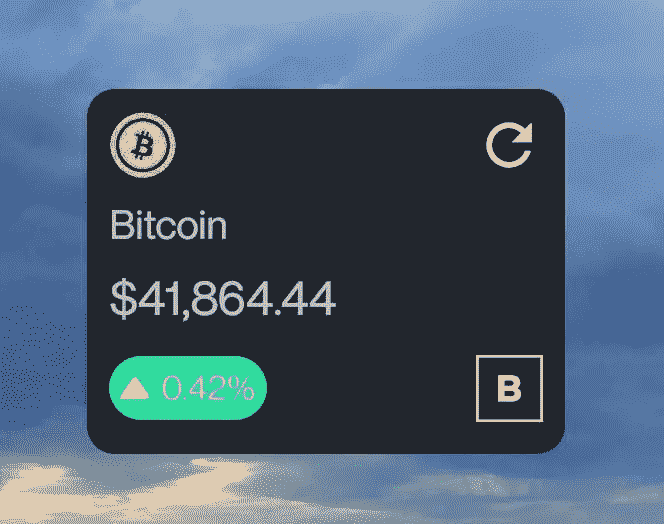

# 使用 Jetpack Glance 构建 Android 应用程序小部件

> 原文：<https://betterprogramming.pub/android-jetpack-glance-for-app-widgets-bd7a704624ba>

## 构建一个带有刷新按钮的比特币价格小部件

[đức trịnh](https://unsplash.com/@duc154?utm_source=medium&utm_medium=referral)在 [Unsplash](https://unsplash.com?utm_source=medium&utm_medium=referral) 上的照片

自从我的上一篇文章以来已经有很长时间了。这一次，我在这里向您介绍 Jetpack Glance for App Widgets。让我们开始吧。

Jetpack Glance 是一个组合风格的框架，允许开发远程 Android 视图。

你可以用最少的代码和声明性的 Kotlin API 构建一个别致的、现代的、可靠的应用程序部件。

Jetpack Glance 仍然处于 alpha 版本 1.0.0-alpha01。

要将 Glance 添加到您的项目中，需要在您的`build.gradle`中添加 Google Maven 和依赖项。

你可能想知道扫视有用吗？只需几个句子，它就提供了与远程视图的组合视图兼容性。请注意，Glance 有自己的一组组件，这些组件不能与`androidx.compose` **互操作。**

尽管 Glance 自己的可组合组件集还没有包含所有的 Jetpack 组合组件。我认为他们会出现更稳定的版本。好吧，让我们出汗吧！

# 履行

至此，我将开始用代码实现来一步步解释如何创建一个比特币小部件。这个比特币小工具的想法是允许用户查看比特币的每日价格变化。

此外，他们可以单击刷新按钮从本地数据源获取最新值。我说本地源，因为我们把最新的值放入本地，如果它没有过期的话。

## 1.以 XML 格式创建 AppWidgetProvider

首先，在资源中创建一个应用程序小部件 XML。

这个 XML 文件是特定小部件的标识。您可以添加必要的属性，如`minWidth`、`minHeight`、`updateFrequency`等。更多属性请查看 Android 官方文档。

app_widget_info.xml

## 2.创建 GlanceAppWidget 子类

这是我们与`AppWidgetManager`通信的 UI 层。

当您调用它的`update`方法时，将开始合成，合成的视图将被翻译成`RemoteViews`。

对于组合，您需要覆盖如下所示的`Content`方法:

## 3.创建小部件的可组合视图

顺便说一下，我已经将我的撰写视图分离到另一个`BitcoinWidget.kt`文件中，如下所示:

## 3.创建`GlanceAppWidgetReceiver`的子类

`GlanceAppWidgetReceiver`是从`AppWidgetProvider`派生的一个类，用于生成远程视图。

您需要覆盖`glanceAppWidget`属性来创建您的小部件接收器。

上面的`MarketWidgetReceiver`班发生了很多事情。

*   当小部件第一次出现在你的屏幕上时，将会调用`onUpdate`方法。
*   还有一个叫做`onUpdate`方法的`observeData`函数。`observeData`方法启动协程从本地获取数据。一旦我们获得了最新的比特币价格数据，我们将使用`updateAppWidgetState`来显示来自`Preferences`的最新值，并调用`GlanceAppWidget`的 update 方法来刷新视图。
*   但是对于要更新的小部件，我们需要一种监听广播事件的方法。这就是`onReceive`方法与新的`MarketRefreshCallback`动作广播的关系。

## 4.为小部件刷新创建一个可组合的 UI

在我们进入回调类实现之前，让我们创建一个由刷新按钮组成的`BitcoinWidgetHeader`视图(它将最终触发回调):

上面的代码不言自明。

## 5.为应用程序小部件设置 ActionCallBack

现在让我们创建一个`ActionCallback`。因为我们希望在点击按钮时更新小部件，所以我们创建了`ActionCallback`并覆盖了`onRun`方法。

在`onRun`方法内部，我们创建了一个意图`sendBroadcast`。这个广播会通知`MarketWidgetReceiver`的`onReceive`方法。最终，我们通过意图得到这个广播，并观察我们的最新数据。

## 6.更新 AndroidManifest.xml 文件

接下来，通过添加`MarketWidgetReceiver`类来更新`Manifest`文件。另外，不要忘记添加一个应用程序小部件提供商，如下所示:

以下是所有功能的最终预览:

# 源代码

 [## GitHub-eno feb/比特币-市场-android:比特币市场 app 为您展示当前的比特币市场…

### 比特币市场 app 向您展示当前比特币市场价格以及不同时间区间的价格走势图💰- GitHub …

github.com](https://github.com/enofeb/bitcoin-market-android)