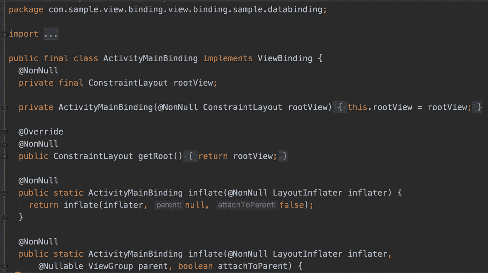

# 在 Android 中用 Jetpack 视图绑定替换已弃用的 Kotlin 合成

> 原文：<https://betterprogramming.pub/android-jetpack-view-binding-c0947f7a6e9e>

## 如果科特林合成材料正在消失，是时候转向替代品了吗？


由[川上正和](https://unsplash.com/@masakaze?utm_source=medium&utm_medium=referral)在 [Unsplash](https://unsplash.com?utm_source=medium&utm_medium=referral) 上拍摄的照片。

自从 Android 开发开始以来，已经有许多方法可以从类内部的 XML 布局文件中访问视图，以对它们执行操作。让我们回顾一下导入视图的演变。

# **findViewById**

最初，我们通过传递视图 ID 来使用`findViewById()`方法访问视图。这在所有膨胀布局的类文件中添加了大量样板代码。仅仅为了找到视图而重复编写这些代码既不有趣也不舒服。

## **语法**

```
TextView emailTextView;
emailTextView = (TextView) findViewById(R.id.txt_email);
```

*   `R.id.txt_email`表示在 ID 名称为`txt_email` **的任何布局中定义的视图。**
*   `R` 是 Android 中的一个类，拥有所有视图 id 的集合。
*   `findViewById`是一种用于从附加到当前活动的布局资源文件中找到视图的方法。

缺点是:

1.  `NullPointerException`和`ClassCastException`导致无空安全或类型安全。
2.  更多样板代码。

# **黄油刀**

挣扎了几年后，我们迁移到 ButterKnife **，**一个基于注释的库，以方便地访问视图。ButterKnife 是一个用于 Android 的视图注入库。我们必须在`gradle`文件中集成一个依赖项，然后使用各自的注释来访问视图。

缺点是:

1.  这也不令人兴奋。尽管我们减少了行数，但样板代码仍然存在于所有类文件的顶部。
2.  堆栈跟踪有点难以理解。
3.  它已被弃用，功能开发和一般错误修复已经停止。

现在说说 Kotlin synthetics，在过去三年里，它在导入视图方面统治了 Android 开发世界。

# 科特林合成纤维

合成材料是 JetBrains 开发的 Kotlin Android 扩展的一部分。合成使得在代码中绑定视图变得更加简单和容易。合成让我们在`kotlinx.android.synthetic`绑定的帮助下取代对`findViewById`的调用。

我们需要在`gradle`文件中添加一个插件来访问合成:

```
apply plugin: 'kotlin-android-extensions'
```

## 科特林合成被否决了吗？

许多开发人员很快喜欢并采用了 Kotlin 合成材料，因为它们非常容易使用。然而，随着 Kotlin 1.4.20 **，**的发布，官方宣布不推荐使用 Kotlin Android 扩展。

在 1.4.20 中，JetBrains 的团队从`kotlin-android-extensions`中提取了 Parcelable 实现生成器，并开始了人工合成的弃用周期。目前，合成材料将继续工作，但会有一个弃用警告。`android-kotlin-extensions`将在 2021 年 9 月(或之后)的未来 Kotlin 版本中删除。

## 为什么科特林合成材料被弃用？

使用 Kotlin 合成纤维有许多缺点:

*   它们污染了全局名称空间。
*   它们不公开可空性信息。
*   他们只使用科特林代码。
*   在切换口味时，使用产品口味会导致合成导入语句出错。
*   在多个布局中导入具有相同 id 的视图会导致开销问题。

# Android Jetpack 视图绑定

视图绑定是 Google 团队当前的建议，用于将视图从 XML 导入到`Activity`、`Fragment`或`Adapter`类。视图绑定是一个允许我们更容易地编写与视图交互的代码的特性。大多数情况下，视图绑定取代了`findViewById`。它同时支持 Java 和 Kotlin。

要遵循的步骤:

1.  在`build.gradle`中启用视图绑定(不需要额外的依赖)。
2.  它为该模块中的每个 XML 布局生成一个绑定类。
3.  binding 类的一个实例包含对所有视图的直接引用，这些视图在相应的布局中有一个 ID。

## 设置

视图绑定是类似于 Android 扩展的模块级配置。不需要添加任何额外的依赖项。让我们通过在模块级`build.gradle`文件中将其值设置为`true`来启用视图绑定。

从 Android Studio 版开始:

```
android {
    ...
    buildFeatures {
 **viewBinding true**    }
}
```

一旦该特性被启用，它将自动(在构建或使用`rebuild`选项时)为该模块中的布局生成所有绑定类。

## 禁用视图绑定

如果我们想跳过绑定类的生成，我们需要将`tools:viewBindingIgnore="true"`属性添加到布局文件的根视图中:

```
<LinearLayout
        ...
        **tools:viewBindingIgnore="true"** >
    ...
</LinearLayout>
```

让我们检查一下`Activity`和`Fragment`类中视图的用法。

## 课堂上的基本用法

在使用绑定类生成之前，我们需要了解它。绑定类的名称是 Pascal 格式的 XML 文件的名称，并在末尾加上单词`Binding`。

例如，如果布局文件的名称是`activity_main.xml`，则生成的绑定类的名称是`ActivityMainBinding`。

## 在活动中使用视图绑定

让我们创建一个示例项目，并检查在`Activity`中访问视图元素的流程。

要查看完整的代码库，请查看[视图绑定示例](https://github.com/pavan5208/viewbinding_sample)。

1.  在 Android Studio 中创建新项目:文件→新项目→ …
2.  在 app 级`build.gradle`文件中启用视图绑定:

```
android{
......
buildFeatures **{** viewBinding true
**}
}**
```

3.重新生成项目，并检查生成的绑定类的生成文件夹，或者通过按下 double-shift 搜索该类的名称。绑定类的名称是 Pascal 格式的布局文件的名称，在末尾加上单词`Binding`。我的情况是`ActivityMainBinding`，看起来是这样的:



4.现在我的`ActivityMainBinding`类包含了布局中每个带有 ID 的视图的属性。因此，让我们将 ID 为`text_email`的文本视图添加到布局文件中，并重新构建项目。然后我们将检查`ActivityMainBinding`文件的变化:

5.我们需要遵循下面的三个步骤来访问绑定类实例，并将视图设置为`Activity`:

1.  我们需要调用包含在生成的`ActivityMainBinding`类中的静态`inflate()`方法。这创建了一个绑定类的实例或对象供`Activity`使用。
2.  接下来，通过调用`getRoot()`方法或使用 Kotlin 的属性语法来获取对根视图的引用。
3.  最后，将根视图设置为`setContentView()`，使其成为屏幕上的活动视图。

将这三个步骤放在一起:

6.现在，我们已经准备好访问绑定类实例上相应布局中带有 id 的视图:

```
*binding*.textEmail.*text* = "Satya"
*binding*.textEmail.setOnClickListener **{** //Do some awful stuff here
**}**
```

让我们看看如何在片段中使用视图绑定。

7.在电子邮件文本视图下面的`Activity` XML 中添加一个静态`Fragment`实例:

8.`Fragment`内的视图绑定与`Activity`内的相似。唯一的区别是我们需要丢弃`onDestroyView`生命周期回调中的绑定对象，因为`Fragment`中的绑定实例的范围是`Fragment`视图的生命周期(在`onCreateView`和`onDestroyView`之间)。

现在运行并检查应用程序。此外，检查生成的代码，以便更好地理解。要获得完整的代码，请查看 GitHub 上的[视图绑定示例。](https://github.com/pavan5208/viewbinding_sample)

# 摘要

视图绑定在某些方面类似于 Kotlin synthetics(例如，访问属性)，但在处理绑定实例和设置根方面有一点额外的东西。Kotlin 合成材料的替代品是`findViewbyId()`和 view binding。

如果您不担心样板代码、空安全或类型安全，您可以使用`findViewbyId()`。如果你想用最新的东西更新自己，遵循 Android 开发者的建议。如果您担心样板代码、空安全和类型安全，可以使用视图绑定。

# 参考

*   [Android 开发者:视图绑定](https://developer.android.com/topic/libraries/view-binding)