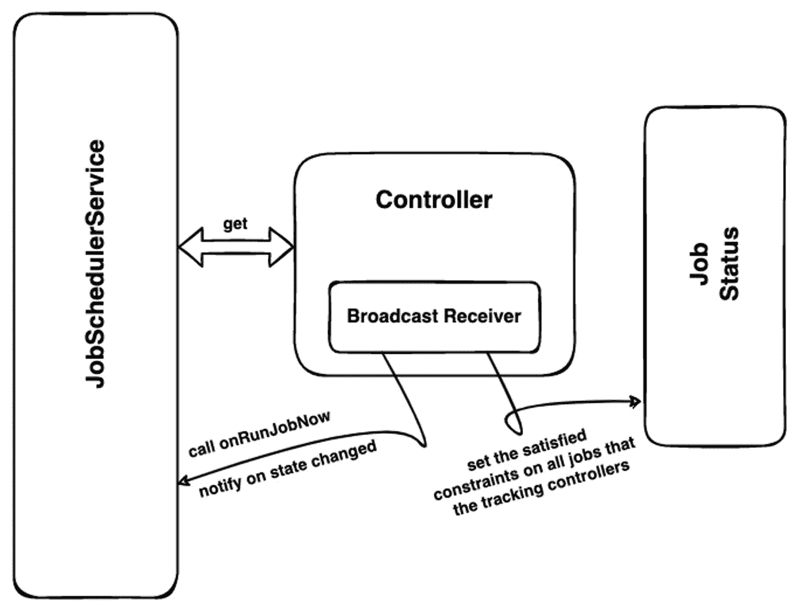
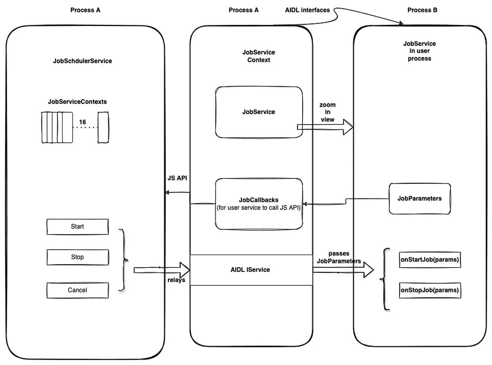
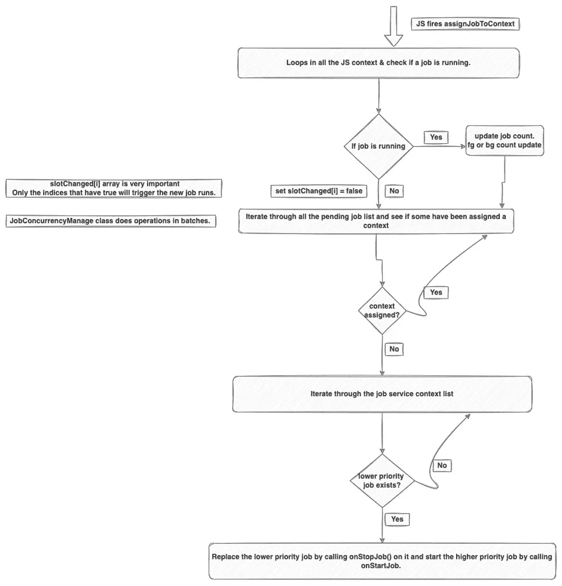
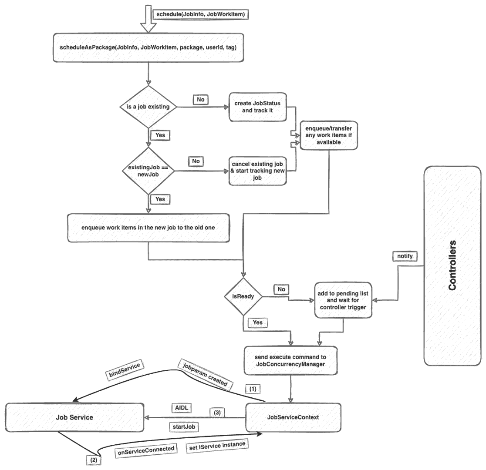

# Android job scheduler——里面有什么？探索内部

> 原文：<https://betterprogramming.pub/android-jobscheduler-whats-inside-exploring-the-internals-51d301059d55>

## 了解 JobSchedulers 如何在幕后工作。在本文中，我们将探讨 android 作业调度器是如何在内部实现的？他们是如何做到所有的魔法，甚至更多？如果这些是你正在问自己的问题，那么恭喜你，你的寻找今天结束了！但是做好准备，这将是一个漫长的旅程。


[Hanson Lu](https://unsplash.com/@hansonluu?utm_source=unsplash&utm_medium=referral&utm_content=creditCopyText) 在 [Unsplash](https://unsplash.com/s/photos/internal?utm_source=unsplash&utm_medium=referral&utm_content=creditCopyText) 上的照片

所以在我们开始之前，我想提醒一下，对于至少使用过一次 JobSchedulers 并且熟悉它所提供的 API 的人来说，这篇文章是有用的。

如果你是新手，那么我强烈建议你看一看我不久前写的作业调度入门。

[](https://medium.com/@kiitvishal89/android-jobscheduler-schedule-your-jobs-like-a-master-cfa0d80e5f10) [## Android JobScheduler —像主人一样安排您的作业！

### 在作业调度器出现之前，每当我遇到想做一些后台处理的用例时，我必须…

medium.com](https://medium.com/@kiitvishal89/android-jobscheduler-schedule-your-jobs-like-a-master-cfa0d80e5f10) 

因此，我将组织这篇文章的方式是这样的，我将首先解释作业调度程序的所有重要组件，一旦我们理解了所有组件以及它们的作用，然后我们将尝试构建其功能的整体图。

在我解释的同时，我也将发布框架中的代码，并提供有限的细节以便于理解。事不宜迟，我们开始吧。

# JobScheduler 的关键组件

1.  `JobSchedulerService`
2.  `JobStatus`
3.  `JobStore`和`JobSet`
4.  `Controllers`和`StatusChangedListeners`
5.  `JobServiceContext`
6.  `JobConcurrencyManager`
7.  工作`Restriction`

# JobSchedulerService

当您调用`getSystemService(Context.JobSchedulerService)` *时，这是 JobScheduler API 与之交互的 facade。*

提到的所有其他组件都是这个类的助手。这是一项系统服务，在系统启动时启动。您在 JobService 实现中收到的所有回调都是从该类中触发的。

通俗地说，我们可以说这是主编排器，它负责发送命令来启动准备执行的作业，或者当系统状态改变时，这个类触发作业的执行。我们将在最后一节处理关于这个类的更多细节，因为我们需要先理解其他组件才能正确地理解它。

# 作业状态

这是你工作的内在表现。作为一个用户，我们创建一个`JobInfo`对象，包含关于我们工作的重要信息，例如，需要运行的组件(`JobService`实现)、工作的约束、周期细节等。

当我们使用`schedule()` API 将`JobInfo`提交给框架时，所有的信息都被消化了，一个新的`JobStatus`对象被创建，它有更多关于作业的细节，所有的内部类彼此共享这个类。他们不知道工作信息。

`JobStatus`有两个内部列表，一个叫做待定列表，另一个叫做执行列表。

我们知道，我们可以使用`enqueue()`将多个`JobWorkItems`添加到作业信息中，并使用`param.dequeue()`提取作业服务中的作业工作项。因此，简单地说，每当使用`enqueue()`添加一个工作时，它就被添加到待定列表中，每当它出队时，它就从待定列表中移除并被添加到执行列表中。一旦使用`JobParameter.completeWork(JobWorkItem)` API 将工作标记为完成，该项也将从执行列表中删除。

## **入队**

```
public void enqueueWorkLocked(IActivityManager am, JobWorkItem work) {
    if (pendingWork == null) {
        pendingWork = new ArrayList<>();
    }
    work.setWorkId(nextPendingWorkId);
    nextPendingWorkId++;
    // .. some framework code stripped.
    pendingWork.add(work);
}
```

## **出列**

```
public JobWorkItem dequeueWorkLocked() {
    if (pendingWork != null && pendingWork.size() > 0) {
        JobWorkItem work = pendingWork.remove(0);
        if (work != null) {
            if (executingWork == null) {
                executingWork = new ArrayList<>();
            }
            executingWork.add(work);
        }
        return work;
    }
    return null;
}
```

该组件还负责作业传输，如中所示，当调度了一个作业并且已经有一个作业使用相同的 ID 运行时，那么旧作业中的工作项必须复制到新作业中，并且旧作业被取消。

旧作业的所有正在执行的工作被转移到传入作业的未决作业，并且未决工作被原样复制。参见下面的代码:

```
public void stopTrackingJobLocked(IActivityManager am, JobStatus incomingJob) {
    if (incomingJob != null) {
        *// We are replacing with a new job -- transfer the work!  We do any executing
        // work first, since that was originally at the front of the pending work.
       ***if (executingWork != null && executingWork.size() > 0) {
            incomingJob.pendingWork = executingWork;
        }
        if (incomingJob.pendingWork == null) {
            incomingJob.pendingWork = pendingWork;
        } else if (pendingWork != null && pendingWork.size() > 0) {
            incomingJob.pendingWork.addAll(pendingWork);
        }**
        pendingWork = null;
        executingWork = null;
        incomingJob.nextPendingWorkId = nextPendingWorkId;
        incomingJob.updateEstimatedNetworkBytesLocked();
    } else {
        *// We are completely stopping the job...  need to clean up work.* 
        pendingWork = null;
        executingWork = null;
    }

}
```

简单不是吗。

让我们试着理解这堂课的下一组责任。每个作业都有一组特定的运行约束条件，例如只有连接电池时才运行、只有网络处于活动状态时才运行、如果网络不符合给定的标准则不运行，或者只有在存储容量不低时才运行，等等。因此，每当系统状态改变时，这个对象就用相关约束的当前状态进行更新。我们将讨论它如何在即将到来的组件中得到更新。

它使用一个位屏蔽整数来跟踪约束的状态。每个约束用整数中的一个位来表示，每当状态改变时，这个位就会相应地增加和清除。并且该对象提供 getter/setter 方法来轮询各个约束的当前状态。以及检查作业整体状态的方法，即`isReady()`。

通俗地说，它有一个整数表示运行作业所需的约束(来自我们提供的 JobInfo ),还有一个整数表示约束的当前状态。如果有 2 个相等，那么`isReady()`返回真。

```
private boolean isConstraintsSatisfied(int satisfiedConstraints) {
    if (overrideState == *OVERRIDE_FULL*) {
        *// force override: the job is always runnable* return true;
    }

    int sat = satisfiedConstraints;
    if (overrideState == *OVERRIDE_SOFT*) {
        *// override: pretend all 'soft' requirements are satisfied* sat |= (requiredConstraints & *SOFT_OVERRIDE_CONSTRAINTS*);
    }

    return (sat & mRequiredConstraintsOfInterest) ==   mRequiredConstraintsOfInterest;
}
```

一旦你看到这个类，你会看到这个类是一个应用周期限制到你的工作，即最大周期不能超过 1 年，最小不能少于 15 分钟。

# 作业存储和作业集

该组件维护您的系统上运行的所有作业的列表(是的，在您的系统上)。这作为 XML 文件`jobs.xml`保存在系统数据目录下的`/system/jobs`目录中。每当一个作业被创建时，它被记录在这个类中，当一个作业被删除时，它必须从这个类中删除。它公开了简单的 API，例如，`add(JobStatus)`，`remove(JobStatus)`，`contains(JobStatus)`，`removeAllForUid(userID)`等。

当系统启动时，这个组件被创建，所有写入 XML 的作业被读取并转换成`JobStatus`对象，然后`JobSchedulerService`发出一个运行命令来运行任何适用的作业。

如果我们看一下它的内部，我们会看到作业是按照用户 id 存储和分组的。这样做是因为，如果用户被删除，它可以轮询所有作业并取消它。如果它必须为用户启动作业，也可以做类似的事情。所以数据看起来像`Map<UserID, Set<JobStatus> >`。

```
private JobStore(Context context, Object lock, File dataDir) {
    mLock = lock;
    mWriteScheduleLock = new Object();
    mContext = context;

    File systemDir = new File(dataDir, "system");
    File jobDir = new File(systemDir, "job");
    jobDir.mkdirs();
    mJobsFile = new AtomicFile(new File(jobDir, "jobs.xml"), "jobs");

    mJobSet = new JobSet();
    readJobMapFromDisk(mJobSet, mRtcGood);
}
```

这是你的作业调度器的内存。这就是它记住您的作业的方式，如果设备重新启动多次，就会重新安装这些作业。

## 控制器和状态改变监听器

JS 的特殊能力是，当满足/不满足约束时，它可以运行作业并抢占它们。控制器是实现此功能的组件。

> 控制器是 JobScheduler 框架的感知器官，它监听系统的实时状态。

理想情况下，对于您在`JobInfo`中提供的每个约束，至少有一个控制器映射到它。其中有`BatteryController`、`ChargingController`、`ConnectivityController`、`IdleController`、`QuotaController`等等很多。

每个控制器都遵循一个控制器契约，该契约有两个重要的方法，`maybeStartTracking(JobStatus)`、`maybeStopTracking(JobStatus)`

这些 API 的帮助方式是，每当一个任务被调度时，`JobSchedulerService`有一个所有控制器(`List<Controllers>`)的列表，它在一个 for 循环中运行并触发`maybeStartTracking()`。在每个控制器内部，有一个检查，查看该作业是否有控制器可以帮助监听的约束。如果是，则将作业附加到跟踪作业状态列表中，否则忽略它。

```
@Override
public void maybeStartTrackingJobLocked(JobStatus taskStatus, JobStatus lastJob) {
   ** if (taskStatus.hasPowerConstraint()) { // use job status API 
        mTrackedTasks.add(taskStatus);**
        taskStatus.setTrackingController(JobStatus.*TRACKING_BATTERY*);
        taskStatus.setChargingConstraintSatisfied(mChargeTracker.isOnStablePower());
        taskStatus.setBatteryNotLowConstraintSatisfied(mChargeTracker.isBatteryNotLow());
    }
}
```

现在的问题是，它如何监听系统状态？

大多数 Android 开发人员都知道这些用例可以通过广播接收器来实现。所以你的猜测也是正确的。每个控制器都建立在广播接收机之上。因此，它提供了基于拉或推的支持。

之所以需要拉，是因为作业调度器服务有时会想知道在运行作业之前是否满足特定的约束条件(通常是在提交作业并需要立即运行时)。需要基于推的 API 来更新`jobStatus`对象，以获得满足的约束的实时状态。

基于推的通信通过称为状态改变监听器的契约发生。`JobSchedulerService`实现这个接口，当每个控制器改变状态时，它使用下面的回调方法通知 JS 服务:

```
public interface StateChangedListener {
    */**
     * Called by the controller to notify the JobManager that it should check on the state of a
     * task.
     */* public void onControllerStateChanged();

    */**
     * Called by the controller to notify the JobManager that regardless of the state of the task,
     * it must be run immediately.
     * @param jobStatus The state of the task which is to be run immediately. <strong>null
     *                  indicates to the scheduler that any ready jobs should be flushed.</strong>
     */* public void onRunJobNow(JobStatus jobStatus);

    public void onDeviceIdleStateChanged(boolean deviceIdle);
}
```

以下是数据的总体流向:



作者图片

## 作业服务上下文

该框架将可以一起运行的最大作业数限制为 16 个。这个限制不是应用范围的限制，而是跨不同用户的系统范围的限制。

```
*/** The maximum number of concurrent jobs we run at one time. */* static final int *MAX_JOB_CONTEXTS_COUNT* = 16;

*/** The maximum number of jobs that we allow an unprivileged app to schedule */* private static final int *MAX_JOBS_PER_APP* = 100;
```

为了运行 16 个作业，框架创建了 16 个 shells，作业在其中执行。这些炮弹被称为`JobServiceContext`。它们在系统启动时被初始化，并且用 phase == `THIRD_PARTY_APPS_CAN_START`调用`onBootPhase(int phase)`。下面是剥离的启动代码:

```
else if (phase == PHASE_THIRD_PARTY_APPS_CAN_START) {
    synchronized (mLock) {
        *// Let's go!* mReadyToRock = true;

        ***// Create the "runners".***for (int i = 0; i < *MAX_JOB_CONTEXTS_COUNT*; i++) {
            mActiveServices.add(
                    new JobServiceContext(this, mBatteryStats, mJobPackageTracker,
                            getContext().getMainLooper()));
        }
       ** *// Attach jobs to their controllers.***mJobs.forEachJob((job) -> {
            for (int controller = 0; controller < mControllers.size(); controller++) {
                final StateController sc = mControllers.get(controller);
                **sc.maybeStartTrackingJobLocked**(job, null);
            }
        });
       ** *// GO GO GO! Fire the jobs if they are ready***mHandler.obtainMessage(*MSG_CHECK_JOB*).sendToTarget();
    }
```

所有这 16 个 shell 都是可重用的 shell，这意味着当一个作业被抢占时，它可以用来运行另一个作业。所以，现在问题来了，app 的`JobService`运行在 app 的进程中，而`JobServiceContext`运行在系统进程中——但是它们如何能够协同工作呢？

正如你已经猜到的，AIDL 出现了。

`JobServiceContext`是托管流程的主机，交互通过 AIDL 接口完成。互动是双向的。在`JobServiceContext`里面有一个`IJobService`接口引用，指向用户的`JobService`，当回调被给予`JobService`时，比如`onStartJob(JobParameters)`、`onStopJob(JobParameters)`、**、**这个`JobParameter`包含了一个叫做`JobCallback`、**、**的东西，它是一小组方法的绑定实现，这些方法可以从 app 进程中调用。它看起来像下面这样:

```
final class JobCallback extends IJobCallback.Stub {
    public String mStoppedReason;
    public long mStoppedTime;

    @Override
    public void acknowledgeStartMessage(int jobId, boolean ongoing) {
        doAcknowledgeStartMessage(this, jobId, ongoing);
    }

    @Override
    public void acknowledgeStopMessage(int jobId, boolean reschedule) {
        doAcknowledgeStopMessage(this, jobId, reschedule);
    }

    @Override
    public JobWorkItem dequeueWork(int jobId) {
        return doDequeueWork(this, jobId);
    }

    @Override
    public boolean completeWork(int jobId, int workId) {
        return doCompleteWork(this, jobId, workId);
    }

    @Override
    public void jobFinished(int jobId, boolean reschedule) {
        doJobFinished(this, jobId, reschedule);
    }
}
```

作业回调中的方法与从`JobService`调用的方法相同。你可能只使用`completeWork`和`jobFinished`，但是，如果我们看到`JobService.java`类的实现，我们也会看到所有这些方法的用法。

现在，我们知道存在双向通信的机制，`IJobService`绑定器实现用于`JobServiceContext` - > `User` `JobService`，而`JobCallback`内部的`JobParameters`则相反。

下图展示了我们之前讨论的内容:



JobServiceContext 流程图

需要记住的一点是`JobServiceContext`是`ServiceConnection`的一个实现，所以当上下文绑定到你的作业服务时，它会收到一个回调`onServiceConnected()`，在这个回调里面，会收到指向你的作业服务的 AIDL 绑定器，这里也是创建`JobParameter`实例的地方。让我们看看一些剥离的代码:

```
boolean executeRunnableJob(JobStatus job) {
    synchronized (mLock) {

        mRunningJob = job;
        mRunningCallback = new JobCallback();

        mParams = **new JobParameters**(mRunningCallback, job.getJobId(), ji.getExtras(),
                ji.getTransientExtras(), ji.getClipData(), ji.getClipGrantFlags(),
                isDeadlineExpired, triggeredUris, triggeredAuthorities, job.network);

        **final Intent intent = new Intent().setComponent(job.getServiceComponent());** boolean binding = false;
        try {
            binding = **mContext.bindServiceAsUser(intent, this,
                    Context.*BIND_AUTO_CREATE***| Context.*BIND_NOT_FOREGROUND* | Context.*BIND_NOT_PERCEPTIBLE*,
                    new UserHandle(job.getUserId()));
        } catch (SecurityException e) {
         //. some code
        }
        return true;
    }
}
```

这里我们看到开始一个作业绑定到服务，现在当你的服务被创建时，这个类接收`onServiceConnected()` **，**这是你的作业服务绑定到这个类的地方，它触发`IJobService.startJob(params)` **。**

`JobServiceContext`负责与用户`JobService`的各种沟通。任何需要在服务中触发回调的组件都必须请求这个组件。

# JobConcurrencyManager

正如我们已经看到的，在框架中只能有 16 个服务同时运行，但是可以有数百个作业。所以就带来了什么时候运行什么的问题。这个问题由并发管理器解决。

> 因此，它公开了一个由 JobSchedulerService 使用的 API*assignobstocontextslocked*。JS 服务从不直接启动作业，因为它永远不知道哪些作业已经在运行，而且还需要进行大量的抢占。所以，你将总是看到它将调用*assignjobstocontexts locked always。*

我将尝试用非常简单的术语来解释这一点。

该组件跟踪所有 16 个正在运行的作业，如果有新作业，它将扫描所有插槽，并查看插槽是否可用。如果可用，它会使用我们刚刚研究过的`JobServiceContext`将作业分配到服务的插槽和 kicks。

如果插槽不可用，它将运行所有插槽，并查看正在运行的服务的优先级是否低于被请求运行的服务的优先级，如果正在运行的服务优先级较低，则在该插槽上请求`onStopJob()`,它被抢占，新服务被分配到该插槽。如果所有的服务都很重要，那么所请求的服务会一直等待，直到一个槽为空。

总的来说，流程如下所示:



JobConcurrencyManager 流程

# 作业调度服务(续..如约而至)

我们知道到目前为止 JS 服务是主协调器，这里我们将看到当使用`schedule(JobInfo)`和`enqueue(JobInfo, JobWorkItem)`调度一个作业时会发生什么。这两个调用都被路由到一个内部方法，

```
public int scheduleAsPackage(JobInfo job, JobWorkItem work, int uId, String packageName, int userId, String tag)
```

里面发生了什么？

最好用流程图来演示:



schedule() API 工作

1.  当一个作业进入时，系统会查看是否有一个已经计划好的具有相同 ID 的作业，如果没有，则创建一个 JobStatus 对象。如果已经存在具有该 ID 的作业，那么它检查作业是否相同(`JobInfo`改变了吗？).如果是同一个作业，则它将传入的工作排队到现有作业，否则它请求取消现有作业并将所有工作转移到新作业。

2.一旦`JobStatus`在不存在的情况下被创建，或者为调度的作业获取了现有的作业状态，这个类使用我们讨论过的`maybeStartTracking(JobStatus)` API 启动跟踪请求，相关的控制器开始跟踪作业。

3.现在，它调用`isReady()`来查看它现在是否可以运行。如果`NO`，那么它被保存在未决列表中(当控制器通知满足约束时，它被触发)。如果`isReady()`返回`YES`，它使用`assignJobsToContextsLocked()` *向`JobConcurrencyManager`发出请求。*

4.`JobConcurrencyManager`找到一个可用的插槽，并使用`executeRunnableJob` API 请求`JobServiceContext`启动应用程序的`JobService`。它绑定服务，然后调用`onServiceConnected()`。从那里用作业参数触发`onStartJob`回调。

这是作业调度框架内部发生的事情的鸟瞰图。虽然我没有涵盖所有内容，但我希望它在某种程度上是有用的，可以帮助您自己浏览代码库。