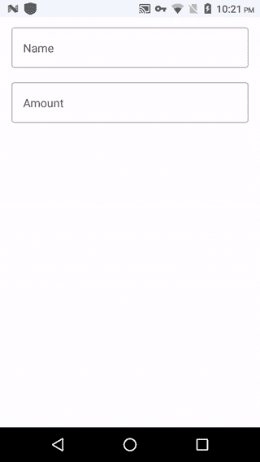

# 使用 Jetpack Compose 处理 Android 键盘

> 原文：<https://betterprogramming.pub/android-keyboard-handling-using-jetpack-compose-c478f7afaae0>

## 在你的 Android 应用中有效地处理键盘事件


照片由 [Zan](https://unsplash.com/@zanilic?utm_source=medium&utm_medium=referral) 在 [Unsplash](https://unsplash.com?utm_source=medium&utm_medium=referral) 上拍摄

在本文中，我们将学习如何在 jetpack compose 中管理 Android 键盘。我们将更加关注 IME 动作、键盘类型、焦点监听器等。

# 介绍

Jetpack Compose 是谷歌最近试图让 Android 开发者轻松构建 UI 的尝试之一。

> *“Jetpack Compose 是一个用于构建原生 Android UI 的现代工具包。Jetpack Compose 以更少的代码、强大的工具和直观的 Kotlin APIs 简化并加速了 Android 上的 UI 开发。”—* [*安卓开发者*](https://developer.android.com/jetpack/compose/tutorial)

Jetpack Compose 的稳定版本 1.0 最近发布，这意味着它的生产就绪。因此，这将是学习如何使用下一代 UI 套件进行 Android 开发的大好时机。

您需要安装 Android Studio —北极狐(2020.3.1) 版本才能使用 Jetpack Compose。

# 先决条件

在进一步学习之前，您必须具备如何使用 Jetpack Compose 的基本知识。如果你是作曲新手，我强烈推荐阅读以下文章:

*   "[喷气背包构成组件(第一部分)](/jetpack-compose-components-part-1-a80717dbfb59)"
*   [“探索 Jetpack Compose 中的 Android 底层表单”](/explore-android-bottom-sheets-in-jetpack-compose-50eff0257231)
*   "[在 JetPack Compose 中构建 Android 布局](/build-android-layouts-in-jetpack-compose-bda2e0837f5e)"
*   [“使用 Jetpack 撰写的 Android 底部导航栏”](/android-bottom-navigation-bar-with-jetpack-compose-8c2aa02b933d)

# 项目设置

通常在 android 中，当屏幕上有输入栏时，键盘就会出现。

在这个编写示例中，我们将使用`OutlinedTextField`来探索键盘动作。我们将有两个输入字段。一个指示`name`，另一个指示`amount`。我们将`Scaffold`作为根，然后`Column`垂直排列`OutlinedTextFields`。看一看:

# 键盘选项

`KeyboardOptions`是一个不可变的 Kotlin 类，通过它可以配置软件键盘中的选项。它可以作为参数传递给 Jetpack Compose 中的`TextFields`。

`KeyboardOptions`主要有`capitalization`、`autoCorrect`、`keyboardType`、`imeAction`四种选择。每一个都有其独特的重要性。让我们看看:

*   `capitalization` : 根据 **—** `KeyboardCapitalization.Characters` **、** `KeyboardCapitalization.Sentences` **、** `KeyboardCapitalization.Words` **、**、`KeyboardCapitalization.None`四种类型，用于键盘字符的大写。
*   `autoCorrect` : 这是一个布尔参数。如果为真，它会根据用户键盘历史自动纠正输入，否则它不会纠正任何东西。
*   `keyboardType` : 用于向用户显示特定类型的键盘，如带`KeyboardType.Email`的电子邮件键盘或带`KeyboardType.Number`的纯数字键盘等。
*   `imeAction` : 这个 IME 动作会被键盘兑现，并在键盘上显示特定的图标。例如，如果是`ImeAction.Search`，那么它会在键盘上显示一个搜索图标。

```
OutlinedTextField(
    value = name,
    onValueChange = updateName ,
    label = **{** Text(**"**Name**"**) **}**,
    placeholder = **{** Text(text = **"**Name**"**) **}**,
    singleLine = true,
    **keyboardOptions = KeyboardOptions.Default.copy(
        capitalization = KeyboardCapitalization.Sentences,
        autoCorrect = false,
        keyboardType = KeyboardType.Text,
        imeAction = ImeAction.Next
    ),**
    modifier = Modifier
        .fillMaxWidth()
)
```

# 键盘操作

`KeyboardActions`是 compose foundation 库中的 Kotlin 类，它帮助开发人员执行任务，以响应用户与软件键盘中的 IME 选项的交互。

现在，我们有六个可用的键盘操作— `onDone`、`onGo`、`onNext`、`onPrevious`、`onSearch`和`onSend`、**。**在 compose 风格中处理键盘交互的方法比传统的方法更简洁。看一看:

```
OutlinedTextField(
    value = name,
    onValueChange = updateName ,
    label = **{** Text("Name") **}**,
    placeholder = **{** Text(text = "Name") **}**,
    singleLine = true,
    keyboardOptions = KeyboardOptions.Default.copy(
        capitalization = KeyboardCapitalization.Sentences,
        autoCorrect = true,
        keyboardType = KeyboardType.Number,
        imeAction = ImeAction.Search),
    **keyboardActions = KeyboardActions(onNext = {
        // TODO you're action goes here
    }),**
    modifier = Modifier
        .fillMaxWidth())
```

# *LocalFocusManager*

既然我们已经完成了键盘选项的设置，并且找到了一种捕获用户与键盘交互的方法，那么是时候对交互执行自定义操作了。

一个最常见的用例是当用户与`onNext` IME 选项交互时，将一个输入字段的焦点移到下一个。

在 Jetpack Compose 中，我们使用了`LocalFocusManager`来控制 composable 中的焦点。首先，我们需要获得焦点管理器的`current`实例，如下所示:

```
val focusManager = LocalFocusManager.current
```

然后我们需要使用在前面章节中实现的`onNext` `KeyboardAction`中的`focusManager`来将焦点转移到下一个`TextField`:

```
keyboardActions = KeyboardActions(onNext = **{
    focusManager.moveFocus(FocusDirection.Down)**
**}**),
```

我们可以用这个`LocalFocusManager`来聚焦任何视图而不仅仅是`TextField`。我们还可以向多个方向转移焦点— `Up`、`Down`、`Next`、`Previous`、`In`、`Out`、`Left`、`Right`。

# *键盘控制器*

现在我们有两个`TextFields`，对于第一个字段，我们使用`onNext` ime 选项，因为它必须将焦点转移到下一个视图，但是在第二个字段中，我们将使用`onDone` ime 选项。

当用户点击`onDone`时，我们需要将焦点从`TextField`上移开并关闭键盘，如下所示:

```
keyboardOptions = KeyboardOptions.Default.copy(
    capitalization = KeyboardCapitalization.Sentences,
    autoCorrect = true,
    keyboardType = KeyboardType.Number,
    imeAction = ImeAction.Done),
**keyboardActions = KeyboardActions(onNext = {
    focusManager.clearFocus()
}),**
```

这将移除`TextField`上的焦点并关闭键盘。但是可能会有一种情况，你需要手动关闭键盘，这时我们使用`KeyboardController`。

首先，我们需要得到如下所示的`current`实例:

```
val keyboardController = LocalSoftwareKeyboardController.current
```

然后我们需要调用`hide`函数来关闭键盘:

```
keyboardController?.hide()
```

当我们把所有的拼图放在一起时，它看起来如下所示:

# 最终输出

这是我们正在运行的 Android 应用程序:



最终输出

# 结论

目前就这些。希望你学到了有用的东西。感谢阅读。