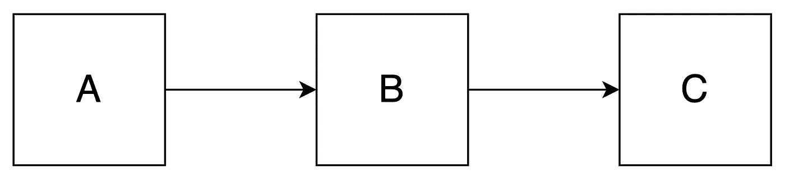
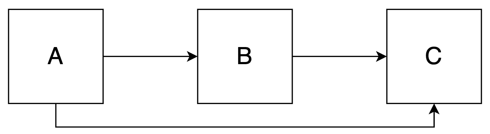
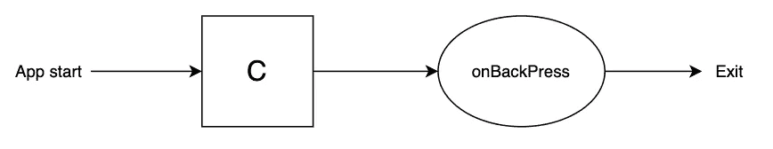
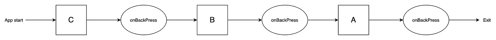

# 具有预先存在的后台堆栈的 Android 导航

> 原文：<https://betterprogramming.pub/android-navigation-with-a-pre-existing-back-stack-70d3d7327f31>

## TaskStackBuilder 简介


[张家瑜](https://unsplash.com/@danielkcheung?utm_source=medium&utm_medium=referral)在 [Unsplash](https://unsplash.com?utm_source=medium&utm_medium=referral) 上拍照。

导航仍然是移动应用程序中最具挑战性的主题之一。在使用导航组件或您自己的导航器时，您会发现许多方法来路由到一组屏幕。



从 A 到 B 到 c 的导航。

导航也意味着如何回到上一个屏幕。您必须确保您的用户能够回到对您的流程有意义的地方。

按照上面的线性路径，从 C 点往回导航会到达 b 点，但是如果我让你导航到另一个屏幕呢？由于 Android 系统处理后台堆栈，这看起来有些牵强，对吗？

让我们假设我们想从 A 导航到 C *而不从 B 导航*，然而，我们想让用户在从 C 导航回来时停留在屏幕 B 上——不管你是来自 A 还是 B



从 A 导航到 C，B 养育 C

# 深度链接用例

对于几个项目来说，我的任务是实现[深层链接](https://developer.android.com/training/app-links/deep-linking)。在移动应用中，系统可以拦截预定义的网址，打开你的应用而不是浏览器。应用程序打开后，您可以解析链接内容以导航至特定屏幕。

推荐的模式包括为每个活动声明一个深层链接。这样做将把路由委托给系统，以便在给定某个深层链接的情况下打开适当的屏幕。

但是，您将直接导航到您的屏幕，而无需任何先前的屏幕堆栈。当按下 back 按钮时，用户将离开你的应用程序，因为它是你的 back stack 中唯一的屏幕。

假设我们将深层链接附加到活动 c。一旦深层链接被触发，我们将获得下图:



在许多情况下，这将是预期的行为。例如，当你从应用程序请求邮件意向时，你将打开你选择的邮件应用程序。您将进入编辑邮件屏幕。按下后退按钮会离开邮件应用程序，并返回到您的应用程序。

不幸的是，产品经理并不总是这么看。他们更喜欢你的用户留在你的应用上，不管他们来自哪里。另一个论点是，无论用户如何登陆屏幕，路由都应该是相同的。

因为从 A 到 B and B 可以到达 C，所以他们希望有相同的导航。



引入这种模式会导致几个架构问题。深层链接不是这样工作的，由你来提供路径。

*免责声明:我不是提倡这种模式！相反，我认为深层链接应该是你的应用程序的唯一入口。离开这个入口点应该会将您重定向到开始的应用程序。*

不过，我看得太多了。我觉得你最好知道如何处理这件事。

# 重建您的后台堆栈

提供这样的导航模式意味着路由到一个屏幕，同时通知系统它应该创建的后台堆栈。

`[TaskStackBuilder](https://developer.android.com/reference/androidx/core/app/TaskStackBuilder)`提供了这样一种机制。顾名思义，您可以构建一个屏幕堆栈。

为此，你需要一个作为中枢的屏幕(比如 Splash)。它的责任将是拦截所有的深层链接，然后分派到适当的屏幕。

一旦你解析了深层链接，你就可以创建你的目的地活动意图。用一个`Context`把它传给`TaskStackBuilder`，然后开始你的一堆活动:

```
TaskStackBuilder.create(context) // can be this@SplashScreenActivity
    .addNextIntentWithParentStack(intent) // The intent where to go
    .startActivities()
```

然而，我们还没有提供您的屏幕是如何连接的。到目前为止，我们只成功地启动了一个没有任何父堆栈的 intent。预期的结果将和以前一样，尽管我们使用了一种奇特但无用的导航方式。

您需要编辑您的`AndroidManifest.xml`文件来指出栈是如何构建的。建造者依靠一面叫做`parentActivityName`的旗帜。

对于我们的示例，您可能有以下清单:

这样做，你让系统知道从 C 返回应该去 b。

现在，您可以从 A 导航到 C，但按下 back 按钮时会返回 B。