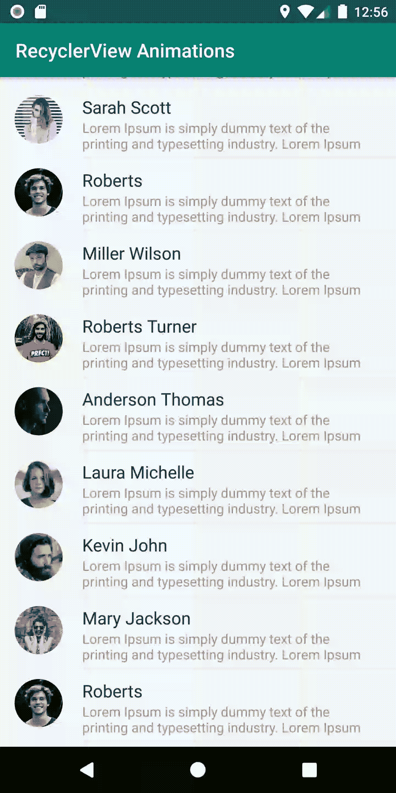
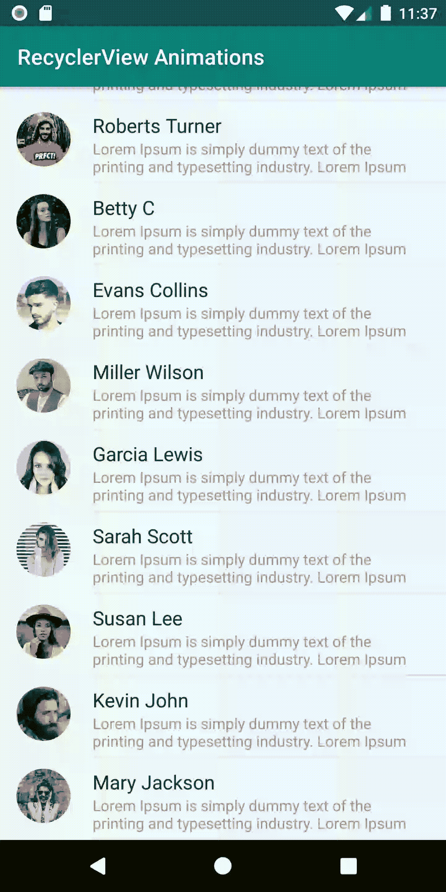
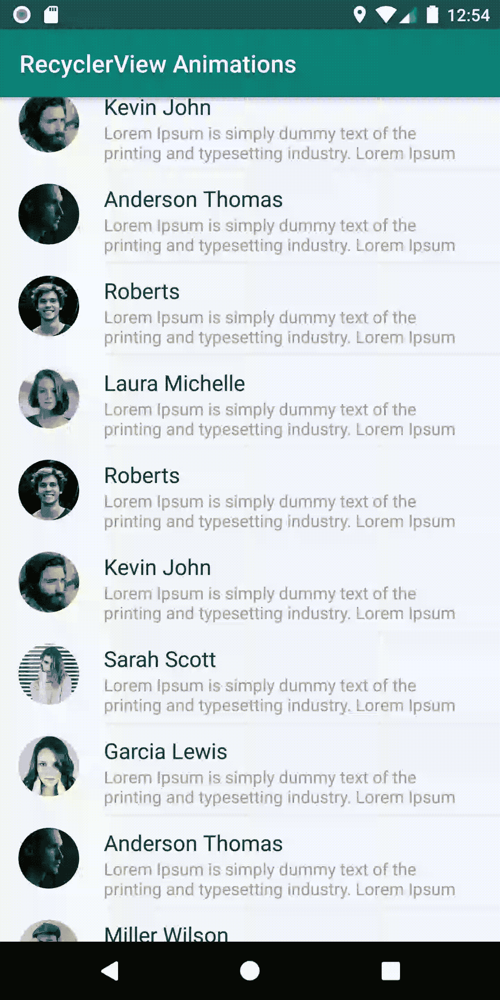
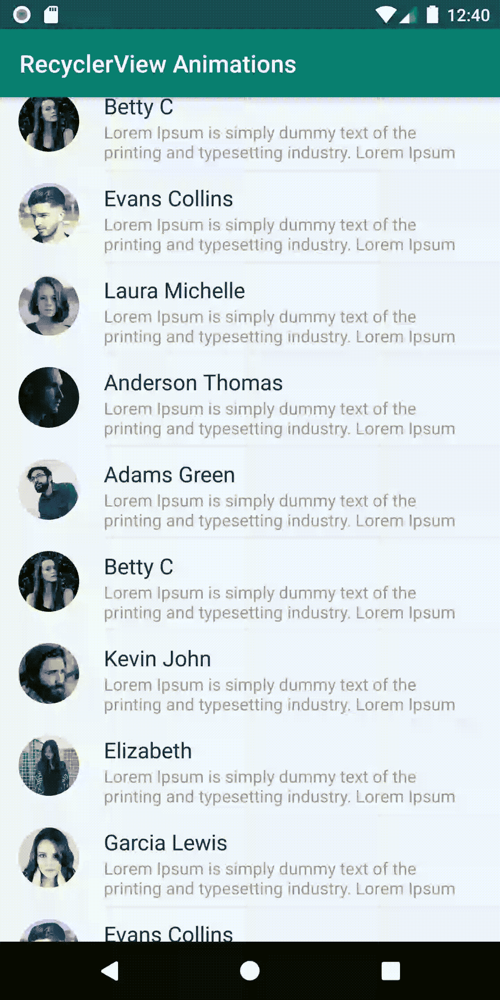

# Android RecyclerView 用漂亮的动画观看

> 原文：<https://betterprogramming.pub/android-recyclerview-with-beautiful-animations-5e9b34dbb0fa>

## Android 最重要的类之一的复杂性和动画


照片由 [Matam Jaswanth](https://unsplash.com/@mjaswanth?utm_source=unsplash&utm_medium=referral&utm_content=creditCopyText) 在 [Unsplash](https://unsplash.com/search/photos/android-phone?utm_source=unsplash&utm_medium=referral&utm_content=creditCopyText) 上拍摄



# 初始设置和基本动画

您将需要以下依赖关系，以便使这个项目。

如你所知，我从事 Android 数据绑定工作，所以让我们通过在我们的 **build.gradle** 文件中添加以下代码行来启用它。

```
dataBinding{
    enabled true
}
```

希望你都准备好了！现在让我们制作一个布局，它将负责保存 RecyclerView 的每一行—就像这样。


在你的布局文件夹中创建*`item_list.xml`*。**

**现在让我们来做一个示范课。正如你所看到的，我显示了一个不同人的列表，包括他们的名字、图像和占位符描述(在 [lorem ipsum](https://www.lipsum.com/) 文本中)。RecyclerView 的每一项都包含一个对象`Person.java`。这些对象是由我创建的名为`Person.java` *的模型类创建的。***

**是时候做`RecyclerAdapter`了，因为 RecyclerView 需要一个适配器来执行它的全部功能。我创建了一个名为`RecyclerAnimationAdapter.java`的类，并从`RecyclerView.Adapter`继承了它。在你的项目中添加下面几行代码。**

**在继续之前，让我们试着运行我们的应用程序，看看我们到目前为止做了什么。为了让它运行，我们需要一些数据来填充我们的 RecyclerView *。为此，我创建了一些虚拟数组。在你的`res/values`里面创建`array.xml` 。***

*`people_images` 是我已经包含在项目中的虚拟图像。可以有自己选择的图片。*

*我正在使用您的`MainActivity.xml`中的以下代码生成数据。*

*你的`activity_main.xml`应该是这样的。*

*让我们运行应用程序，看看到目前为止是否一切正常。*

**

*进步很大吗？现在一切正常。是时候在我们的 RecyclerView 中引入动画了。*

# *淡入动画*

*我先做淡入动画。您只需要在项目中添加以下代码行。*

*`setAnimation()`负责在 RecyclerView 制作动画。*

*这个类的工作原理就像一个数组，接受不同的动画并让它们播放。*

*`ObjectAnimator()`:这个类执行不同的动画。*

*让我们运行应用程序吧！*

**

*项目正在加载淡入效果！再介绍一些效果吧。*

# *从左到右的动画*

*为了使条目从左向右输入，让我们在代码中添加以下内容。*

*确保将您的`DURATION`更新为等于 150。*

**

# *从右向左动画*

*若要从右到左制作动画，请使用以下代码。*

**

***关注**[**CodixLab**](https://medium.com/codixlab)**了解更多科技知识。***

*觉得这篇文章有用？跟着我 [Mustufa Ansari](https://medium.com/u/8ee4abb8abb8?source=post_page-----ab66e15c8635----------------------) 上媒。看看下面我读得最多的文章。*

*   *[动画浮动动作按钮，有更多选项！](https://medium.com/better-programming/animated-fab-button-with-more-options-2dcf7118fff6)*
*   *[什么是 AndroidX？](https://medium.com/better-programming/what-is-androidx-1b8c9832af43)*
*   *[用 flutter 制作简单的笔记 app](https://medium.com/better-programming/simple-notes-app-with-flutter-part-1-ab66e15c8635)*