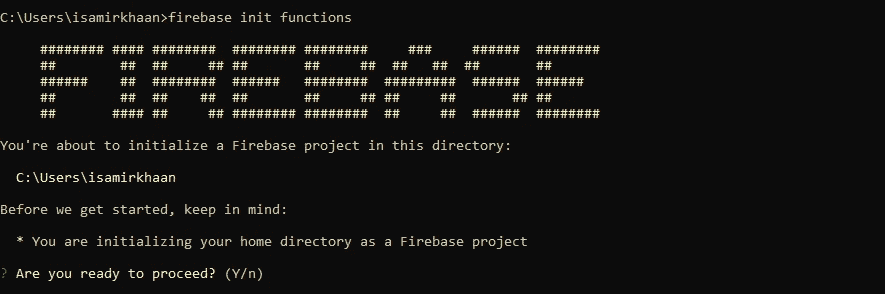
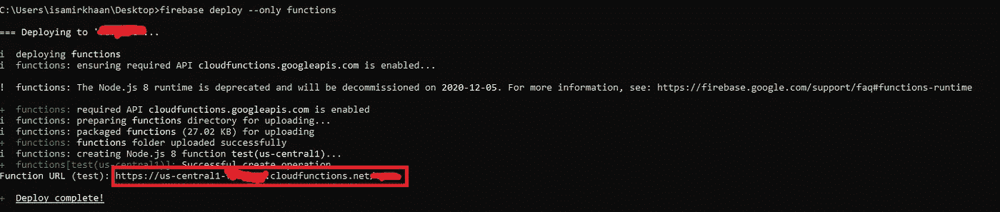
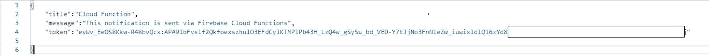
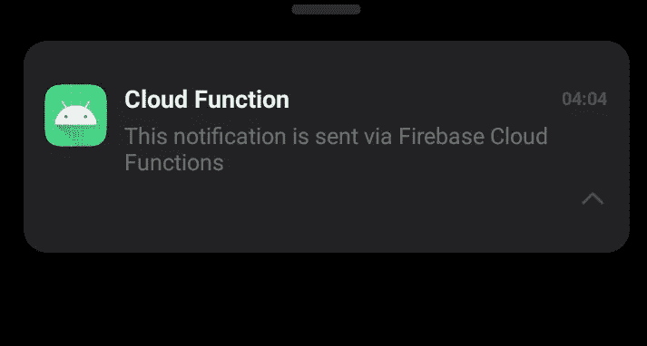

# 通过 Firebase 云功能的 Android 无服务器通知

> 原文：<https://betterprogramming.pub/android-serverless-notifications-via-firebase-cloud-functions-b64a4b73602>

## 关于 Android 上的推送通知，你只需要知道


由[萨法尔·萨法罗夫](https://unsplash.com/@codestorm?utm_source=medium&utm_medium=referral)在 [Unsplash](https://unsplash.com?utm_source=medium&utm_medium=referral) 上拍摄的照片

在本文中，您将了解 [Firebase 云函数](https://firebase.google.com/docs/functions)，通过云函数发送推送通知，以及在 Android 客户端接收通知。

# Firebase 云函数

Firebase 的云功能是一个框架，允许您通过 HTTP 请求或 Firebase 事件触发器运行后端代码。这些函数可以用 JavaScript 或 TypeScript 编写。对于本文，我选择了 JavaScript。

# 创建云函数

从[官网](https://nodejs.org/en/)安装 Node.js 和 npm。这对于用 JavaScript 编写云函数是必不可少的。安装完成后，在 Firebase CLI 的 shell 中运行以下命令。

```
npm install -g firebase-tools
```

Firebase CLI 安装完成后，登录到您的 Firebase 帐户，并通过运行以下命令在 shell 中选择 project。

```
firebase login
```

现在，初始化 Firebase 云函数，询问语言时选择 JavaScript。

```
firebase init functions
```



按 Y 键安装与 npm 的依赖关系

# 用 JavaScript 编写函数

一旦设置完成，您将在项目的`functions`目录中找到 JavaScript 索引文件。将以下代码复制到索引文件中。

用于发送推送通知的功能

运行以下代码在 Google Cloud 上部署功能。

```
firebase deploy --only functions
```

# 发送推送通知

为了验证该功能是否成功部署，我们将通过 HTTP 请求向 Android 客户端发送推送通知。可以找到 HTTP URL，如下所示。



部署功能

该请求有三个参数:通知标题、通知消息和设备 ID (Firebase 令牌)。Android 客户端的设备 ID 可以通过以下方式获取:

```
// Kotlin
FirebaseInstanceId.getInstance().*instanceId*
```

HTTP 请求的类型是 POST，并具有作为请求体的参数。



Http 请求参数

一旦请求成功发送，在一秒钟内，您将在 Android 客户端上收到通知。



系统托盘中的 Android 通知

感谢您的阅读！