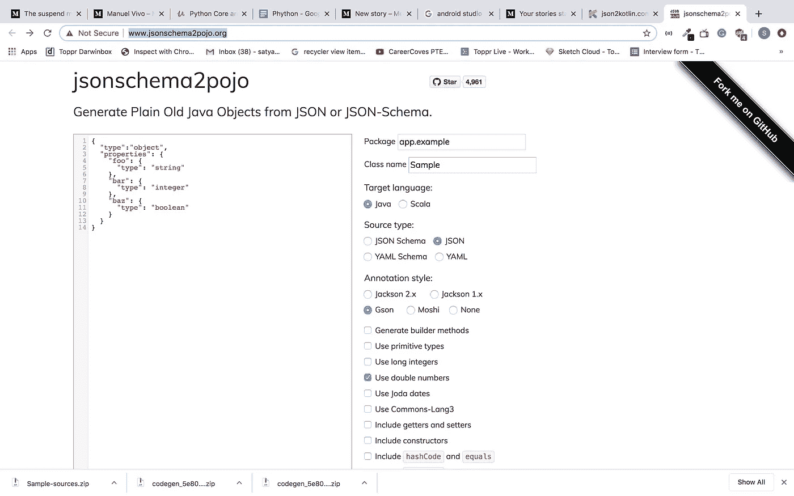
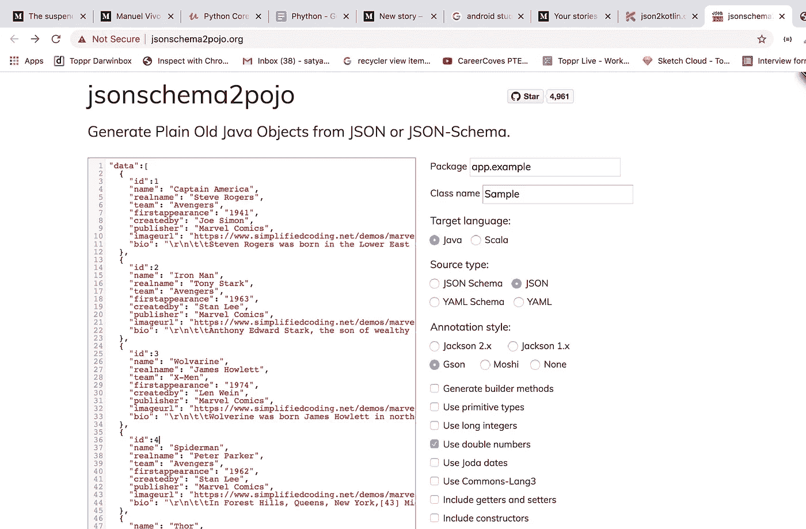
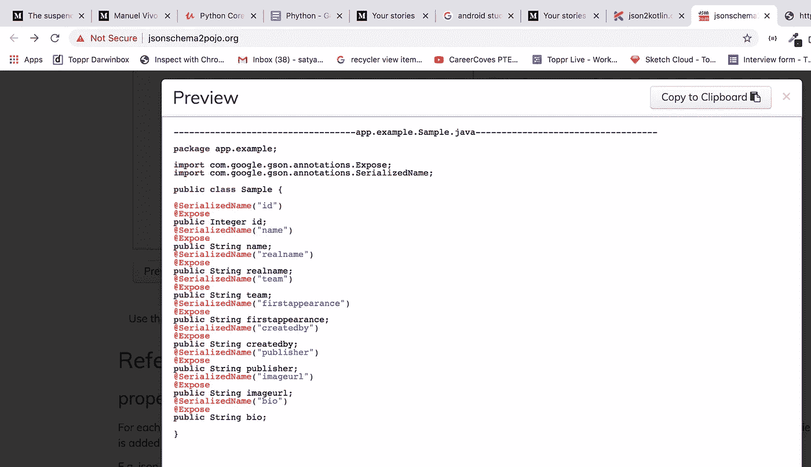
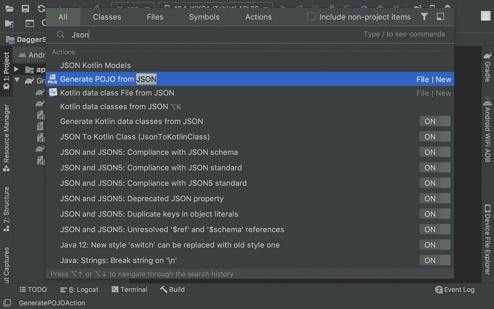
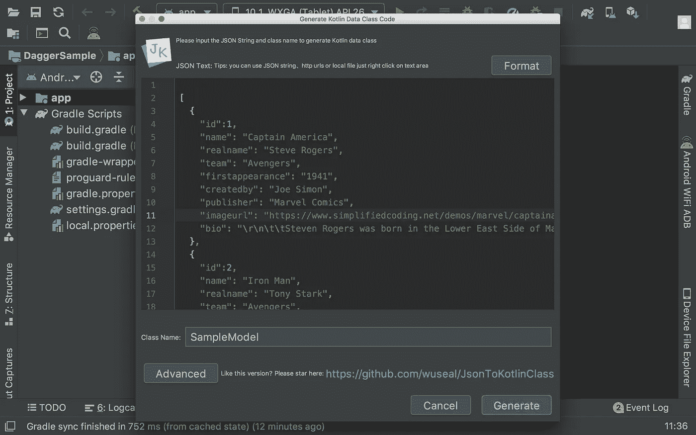
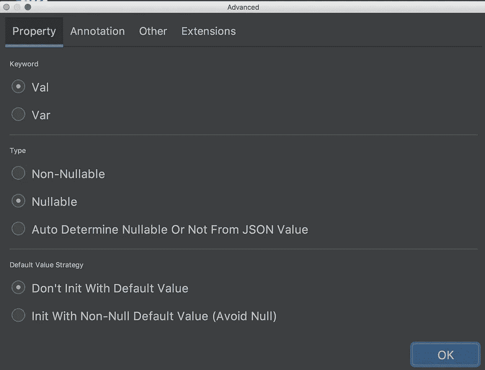
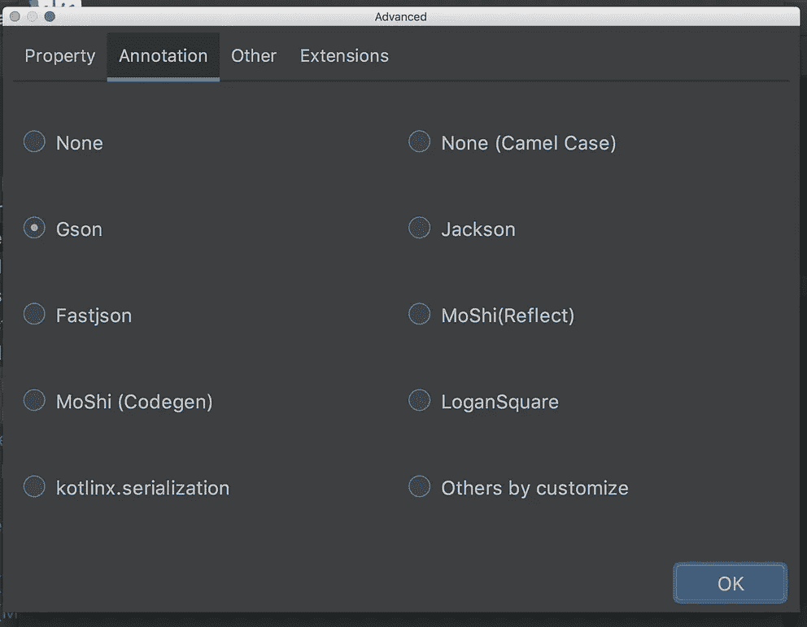

# 一个自动生成模型或 POJO 类的 Android Studio 插件

> 原文：<https://betterprogramming.pub/android-studio-plugin-for-auto-generation-of-model-or-pojo-classes-78bfda432527>

## 为 API 响应创建模型类的最简单方法


对于开发人员来说，使用最好的 IDE 和工具进行开发更容易——它们对于战士来说就像一把剑一样重要。如果我们正确使用它们，我们可以用更少的时间做更好的事情。毕竟，业绩可能是唯一的衡量标准，而不是多年的经验。因此，为了提高性能，我们需要更多地使用东西，并充分利用它们。

在我们的日常开发中，为了处理网络请求响应，我们创建普通的旧 Java 对象(POJO)或模型类来正确地处理它们。一开始，我们手动编写每个字段，但后来，过了一段时间，我们遇到了一个生成模型类的在线网站。后来，插件开始发挥作用，这使得它变得容易得多，即使没有互联网连接，它们也能工作。在本文中，我们将讨论为 API 响应创建模型类的两种方法。我们在本文中讨论的创建模型或 POJO 类的两种方法是:

*   使用网站方法
*   使用插件方法

因此，让我们考虑这样一个 API 请求，它给出以下响应。

```
[
  {
    "**id**": 123,
    "**name**": "Captain America",
    "**realname**": "Steve Rogers",
    "**team**": "Avengers",
    "**firstappearance**": "1941",
    "**createdby**": "Joe Simon",
    "**publisher**": "Marvel Comics",
    "**imageurl**": "[https://www.simplifiedcoding.net/demos/marvel/captainamerica.jpg](https://www.simplifiedcoding.net/demos/marvel/captainamerica.jpg)",
    "**bio**": "\r\n\t\tSteven Rogers was born in the Lower East Side of Manhattan, New York City, in 1925 to poor Irish immigrants, Sarah and Joseph Rogers.[54] Joseph died when Steve was a child, and Sarah died of pneumonia while Steve was a teen. By early 1940, before America's entry into World War II, Rogers is a tall, scrawny fine arts student specializing in illustration and a comic book writer and artist.\r\n\t\t"
  },
 {
   ......
  },
 {
   ......
  },
.........
 {
   ......
  }
]
```

正如您在上面的代码片段中看到的，几乎没有九个字段。手动创建对象并编写每个键及其类型不会花费太多时间。但是假设有大约 50 或 100 个字段，您是否愿意花费大量时间手工编写它们？不是吧？因此，让我们详细探讨一下上述每一种方法。

# **使用网站方法**

这是用来为 API 响应创建模型类的最简单的方法之一，而不是手工写出每个字段。现在有很多网站可以做这项工作。

一开始，我们使用了 [jsonschema2pojo、](http://www.jsonschema2pojo.org/) ，这已经很容易了。问题是如何使用它。很简单:首先，打开你的浏览器，输入`jsonschema2pojo.org`。这会将您重定向到网址，在那里您会看到以下屏幕:



在左侧，我们需要粘贴需要转换的响应或 JSON 数据，并在右侧选择所需的转换字段。



在我们的例子中，在右上角，根据我们的要求，我们需要提到应用包名和类名，在它下面选择语言选项 Java。在其下方，选择注释样式为 Gson。最后，在底部，我们有两个选项:


预览选项让您了解模型类是如何生成的，您可以在将它导入到项目中之前使用它进行验证。



zip 选项允许您下载一个或多个类，您可以将它们复制并粘贴到您的项目中。就是这样！即使你有 20 或 50 或 100 块田地，努力是一样的。

使用这种方法**、**的优点是:

*   我们不需要在模型类中手工编写每个字段，这将节省您的时间

缺点是:

*   您需要互联网连接才能使用这种方法
*   我还没有找到直接生成 Kotlin 类的选项

还有一个替代网站， [json2kotlin，](https://www.json2kotlin.com/)那里的过程是相同的。您可以轻松地生成 Kotlin 数据类。

# **使用插件方法**

我想你对插件有一个基本的概念，插件只不过是即插即用的组件。要找到插件部分，请转到首选项并在 Android Studio 中选择右侧的插件。然后，您会发现以下屏幕:


您可以使用搜索栏来搜索您感兴趣的插件，或者向下滚动到末尾来查看不同的可用插件。当你点击右边的任何一个插件时，你可以查看与该插件相关的信息。之后，如果你感兴趣，只需点击安装按钮。然后，单击应用。在那之后，重启 studio，这样改动就能反映出来，你就可以使用插件了。

在这种情况下，让我们在插件搜索栏上搜索 [JsonToKotlin lass](https://github.com/wuseal/JsonToKotlinClass) 。然后，我们可以找到不同发行商提供的不同插件的列表。所以还是选下面有 logo 的插件吧，因为我用过，感觉很方便。


*文件→设置→插件→浏览存储库→搜索 jsontoktlinclass*

安装后，重启你的工作室。一旦完成，双击键盘，搜索 JSON。然后，您会发现如下所示的选项:



单击您想要生成模型的包，并选择 New 选项。在那里，您可以选择“来自 JSON 的 Kotlin 数据类文件”选项，这样它就会在适当的文件夹中生成(否则，它会随机生成，我们需要将它移回适当的文件夹)。

单击您安装的选项。它将打开一个窗口，您可以在其中粘贴 JSON 数据以获得该类。



单击 Generate 选项，它会生成一个带有注释和所有必需内容的类。您可以单击高级选项，根据需要更改默认值。



下面是通过上述方法生成的类。

```
package com.example.daggersample.modulesimport com.google.gson.annotations.SerializedNamedata class SampleModel(
    @SerializedName("bio")
    val bio: String?,
    @SerializedName("createdby")
    val createdby: String?,
    @SerializedName("firstappearance")
    val firstappearance: String?,
    @SerializedName("imageurl")
    val imageurl: String?,
    @SerializedName("name")
    val name: String?,
    @SerializedName("properties")
    val properties: Properties?,
    @SerializedName("publisher")
    val publisher: String?,
    @SerializedName("realname")
    val realname: String?,
    @SerializedName("team")
    val team: String?
)
```

`@SerializedName`是一个注释，表示这个成员应该序列化为 JSON，并使用提供的 name 值作为它的字段名。

# 结论

目前就这些。我想你从这篇文章中学到了一些东西。我会写更多关于这些插件的东西，这些插件可以节省时间，让我们的工作更容易。

感谢阅读。