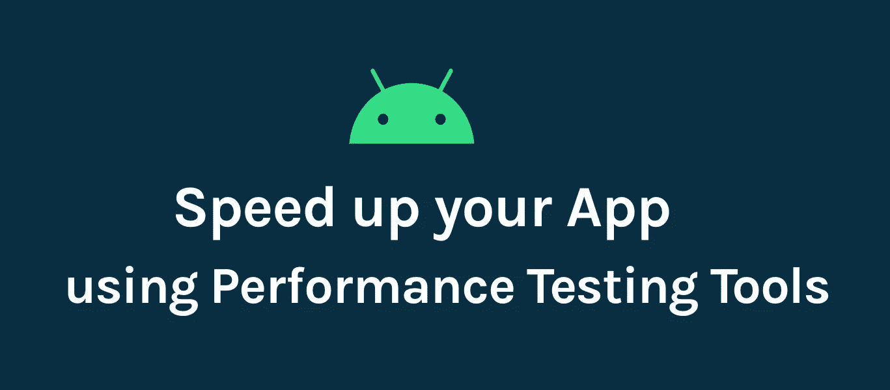
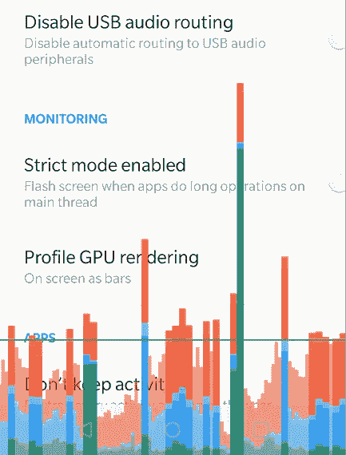
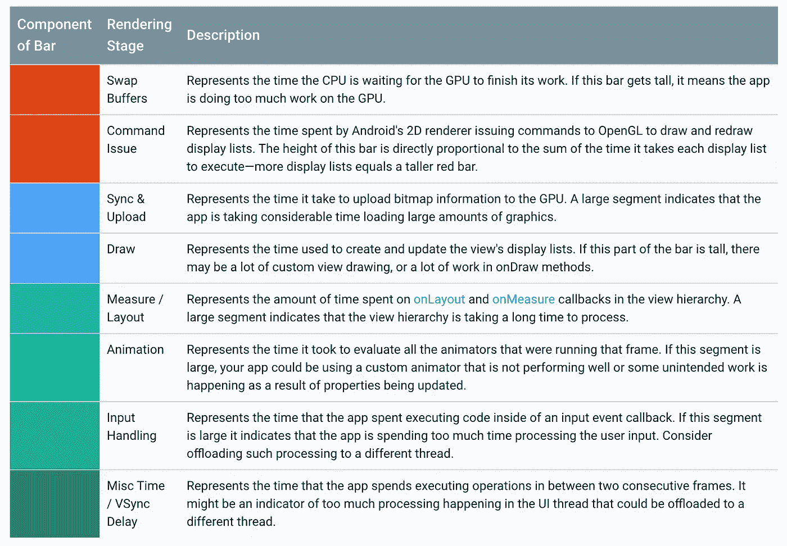
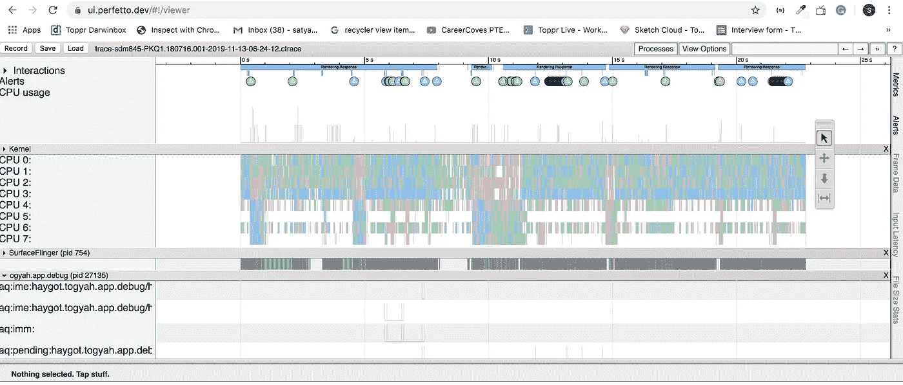
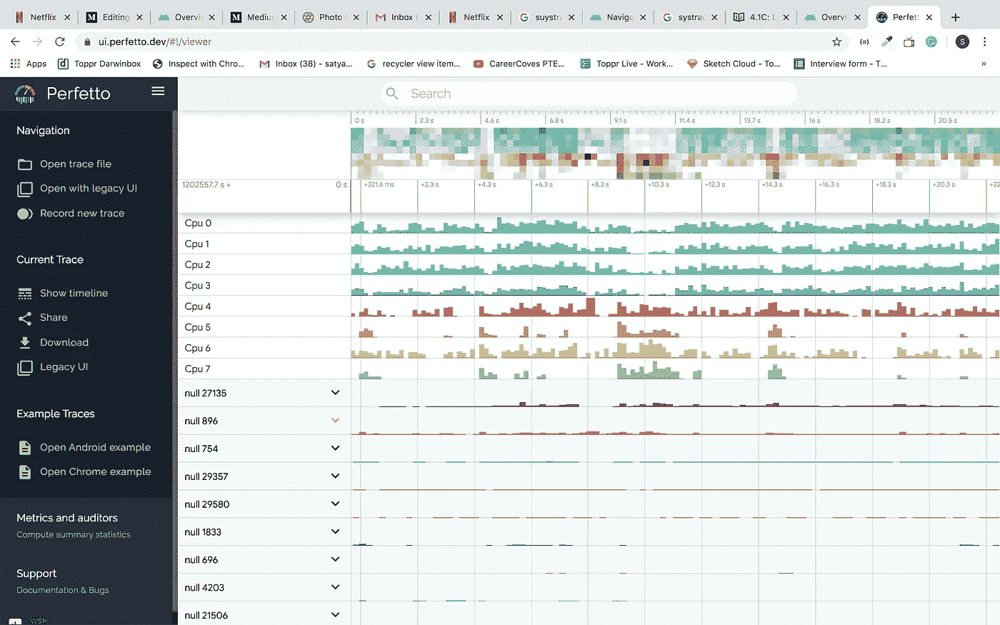
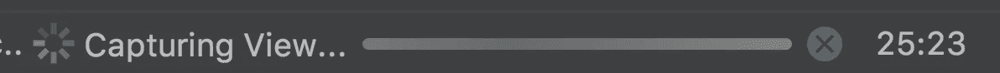
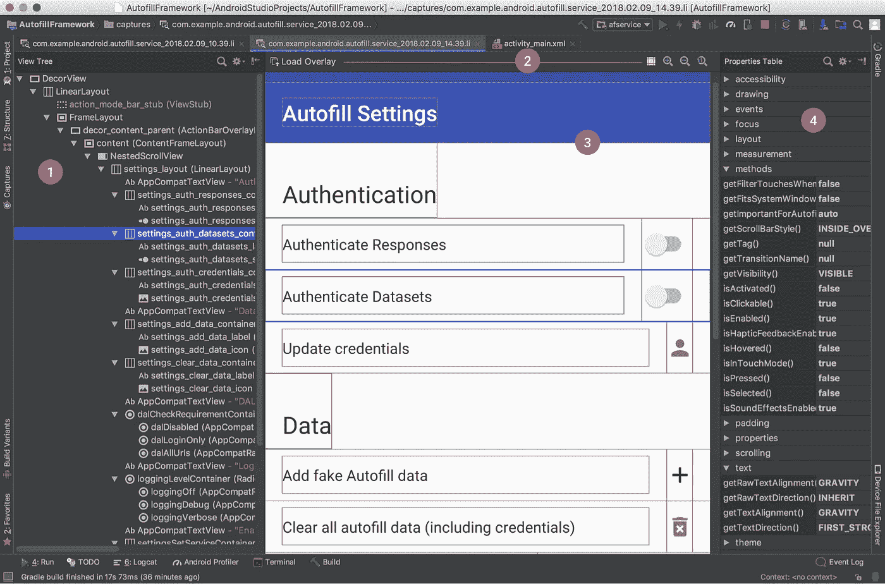
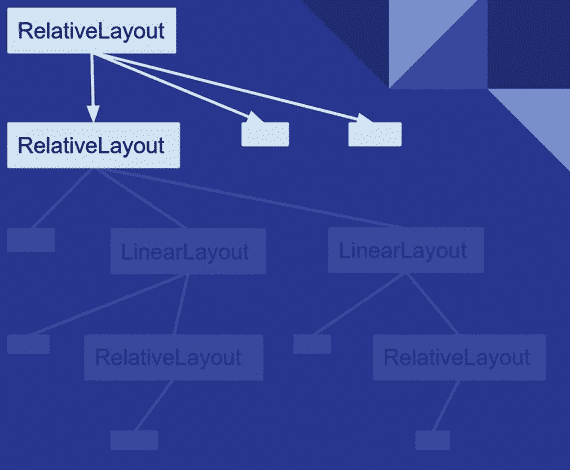
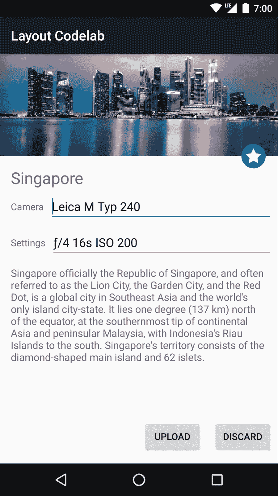
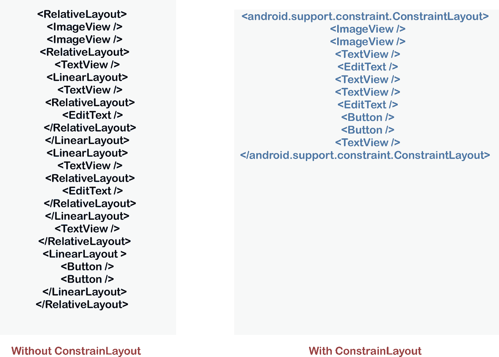

# 提高您的 Android 应用程序的 UI 性能

> 原文：<https://betterprogramming.pub/android-ui-performance-11b57ac4af8c>

## 最佳实践和优化的应用程序，看起来很棒，感觉很快

图片由 Satya Pavan Kantamani 提供

移动应用开发的一个重要步骤是测量 UI(用户界面)性能。缓慢的渲染会造成非常糟糕的用户体验。作为开发人员，我们非常重视编写逻辑代码，而不是 UI 代码——我见过一些开发人员，他们从来不想开发 UI。在我看来，这很糟糕，因为不管这个应用程序有多有用，用户一定喜欢它的 UI 设计。让我们探索一些选项，让我们的 UI 尽可能地发挥最佳性能。

Android 有一些设备上的开发人员选项，可以帮助您可视化您的应用程序在渲染其 UI 时可能会遇到的问题，例如执行不必要的渲染工作或执行长线程和 GPU 操作。因为已经有很多资源了，所以我只列出我们现有的最佳选择。

*   配置文件 GPU 渲染
*   系统跟踪
*   布局检查器
*   `ConstraintLayout`的好处

我们不能详细介绍它们，但我们将对上述每种武器如何帮助我们的应用程序更好地运行做一个基本概述。

# GPU 渲染分析器

> “Profile GPU 渲染工具以滚动直方图的形式直观地显示了渲染 UI 窗口帧所需的时间(相对于每帧 16 毫秒的基准时间)— [Android Studio 用户指南](https://developer.android.com/studio/profile/inspect-gpu-rendering)

转到开发人员选项，并启用监测部分下的配置文件 GPU 渲染。它会弹出一个选项窗口。选择“在屏幕上显示为条形”现在奇迹发生了。您的手机屏幕上开始显示类似下图的图表。

图片由 Satya Pavan Kantamani 提供

看到上面的图表不要害怕。这比你想象的要容易。

正如用户指南所解释的，对于每个可见的应用程序，该工具都会显示一个图表。每个垂直条的高度代表渲染帧所花费的时间(以毫秒为单位)。

水平绿线代表 16 毫秒的阈值。为了达到每秒 60 帧，每帧的垂直条需要保持在这条线以下。任何时候一个条形超过这条线，动画中可能会有暂停。

下表提供了使用运行 Android 6.0 和更高版本的设备时，profiler 输出中竖条的每一段的描述。

图片来源:[https://developer . Android . com/studio/profile/inspect-GPU-rendering](https://developer.android.com/studio/profile/inspect-gpu-rendering)

从上面的分析中，我们将知道渲染时是否有任何问题，这样您就可以深入代码，检查根本原因并修复问题。GPU 评测的其他细节和其他可以帮助您优化我们应用性能的内容有[调试 GPU Overdraw](https://developer.android.com/studio/profile/inspect-gpu-rendering) 、[使用评测 GPU 渲染进行分析](https://developer.android.com/topic/performance/rendering/profile-gpu)。

# 系统跟踪

[Systrace](https://developer.android.com/studio/profile/systrace) 是一个工具，它允许我们收集关于我们的设备上正在运行的内容的精确定时信息，然后将其可视化。有三种方法可以记录 Systrace:通过我们手机上的应用程序，通过系统命令行，通过 Perfetto 命令行工具。有不同扩展名的不同跟踪文件，如。跟踪，。不管跟踪文件是什么，只要使用 [Perfetto UI](https://perfetto.dev/#/) 查看即可。

Systrace 生成一个包含一系列部分的输出文件。该报告列出了每个进程的线程。如果给定的线程呈现 UI 帧，报告还会指示沿时间轴呈现的帧。当您在报表中从左向右移动时，时间会向前推移。这些报告如下所示:

在[https://ui.perfetto.dev/#!/viewer](https://ui.perfetto.dev/#!/viewer)上使用传统视图

更多细节可在 [Systrace 文档](https://developer.android.com/studio/profile/systrace.html)中获得。要分析报告，请查看[报告文档](https://developer.android.com/studio/profile/systrace/navigate-report)。

# 布局检查器

由于工具[层级查看器](https://developer.android.com/studio/profile/hierarchy-viewer?utm_campaign=app_series_complexviewhierarchies_012616&utm_medium=blog&utm_source=medium)已被弃用，我们来看看工具[布局检查器](https://developer.android.com/studio/debug/layout-inspector.html)。使用布局检查器所需的最低 Android Studio 版本是 3.1。

正如文档所述，布局检查器允许我们将您的应用布局与设计模型进行比较，显示应用的放大视图，还允许我们在运行时检查其布局的细节。当您的布局是在运行时在类级别而不是完全在 XML 中构建的，并且布局表现异常时，这将非常有用。

要使用布局检查器，我们需要一个已连接的设备或安装了调试应用程序的仿真器。在 Android Studio 中，点击 Tools> Layout Inspector，弹出一个对话框，显示正在运行的进程。通过单击选择您想要检查的流程。如果应用程序有多个窗口，它会显示另一个弹出窗口来选择您想要检查的窗口。然后单击确定。

几毫秒后，您将看到一个屏幕截图窗口:

每个截图都保存在`project-name/captures/`中的一个单独的`.li`文件中，并在一个新的标签中打开。

布局检查器显示以下内容:

1.  视图树:布局中视图的层次结构
2.  布局检查器工具栏:布局检查器的工具
3.  屏幕截图:显示在设备上的应用布局的屏幕截图，其中显示了每个视图的布局边界
4.  特性表:选定视图的布局特性

要了解更多信息，请查看[布局检查器文档](https://developer.android.com/studio/debug/layout-inspector.html)。

# 约束布局的好处

正如它的文档所提到的，`ConstraintLayout`允许你用一个扁平的视图层次结构创建大型复杂的布局，这意味着没有嵌套的视图组。这与`RelativeLayout`相似，其中所有视图都根据兄弟视图和父布局之间的关系进行布局。

`ConstraintLayout`比任何其他布局都有更多的性能优势。它有助于维护一个扁平的视图层次结构。

你可以在我的文章“[了解视图如何在 Android](https://medium.com/better-programming/understand-how-view-renders-in-android-763f0adfb95c) 中呈现”中了解更多信息

图片来源:[安卓开发者博客](https://android-developers.googleblog.com/2017/08/understanding-performance-benefits-of.html)

渲染视图主要有三个阶段:测量阶段、布局阶段和绘制阶段。在每一个阶段中，都会有一个从上到下的遍历。嵌套视图越多，渲染视图所需的时间和计算就越多。因此，通过在我们的应用程序布局中保持平面视图层次，我们可以创建一个快速响应的用户界面。

图片来源:[安卓开发者博客](https://android-developers.googleblog.com/2017/08/understanding-performance-benefits-of.html)

下面是使用和不使用`ConstraintLayout`渲染上面屏幕的示例片段。

[ConstraintLayout](https://developer.android.com/training/constraint-layout/index.html) 有许多属性，如指引线、障碍和链，有助于创建平面视图层次。

# 提示和技巧

这里有一些我们可以遵循的建议。

1.  在测量 UI 性能时，使用发布版本上的任何工具，而不是调试给出适当结果的版本。
2.  尽量避免阴影渲染，成本`onDraw()`更贵。
3.  维护平面视图层次结构，因为在复杂和深度视图层次结构的情况下，布局遍历需要更多时间。
4.  避免不必要的背景，这会导致一些渲染开销，例如，父背景和子背景相同。
5.  尽量避免 Alpha 渲染。

目前就这些。除了 UI 性能之外，我很快会写一些有助于提高应用程序性能的其他组件。敬请关注。

请让我知道你的建议和意见。

感谢您的阅读。

# **参考链接:**

[浏览系统报告](https://developer.android.com/studio/profile/systrace/navigate-report)

[测试 UI 性能](https://developer.android.com/training/testing/performance)

[慢速渲染](https://developer.android.com/topic/performance/vitals/render)

[改善布局性能](https://developer.android.com/training/improving-layouts)