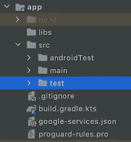
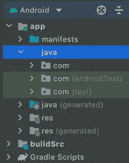
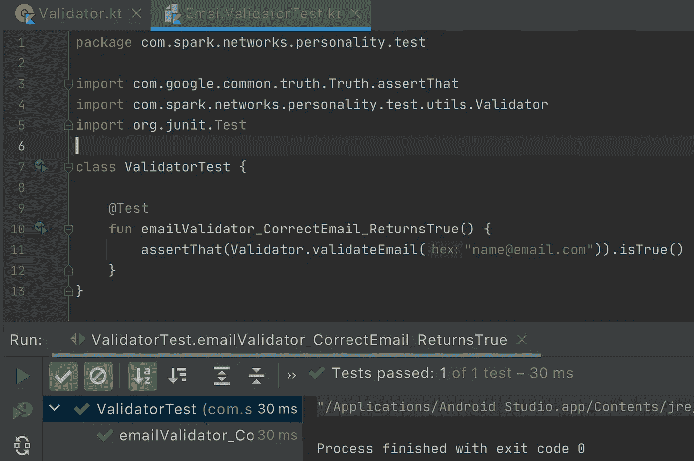
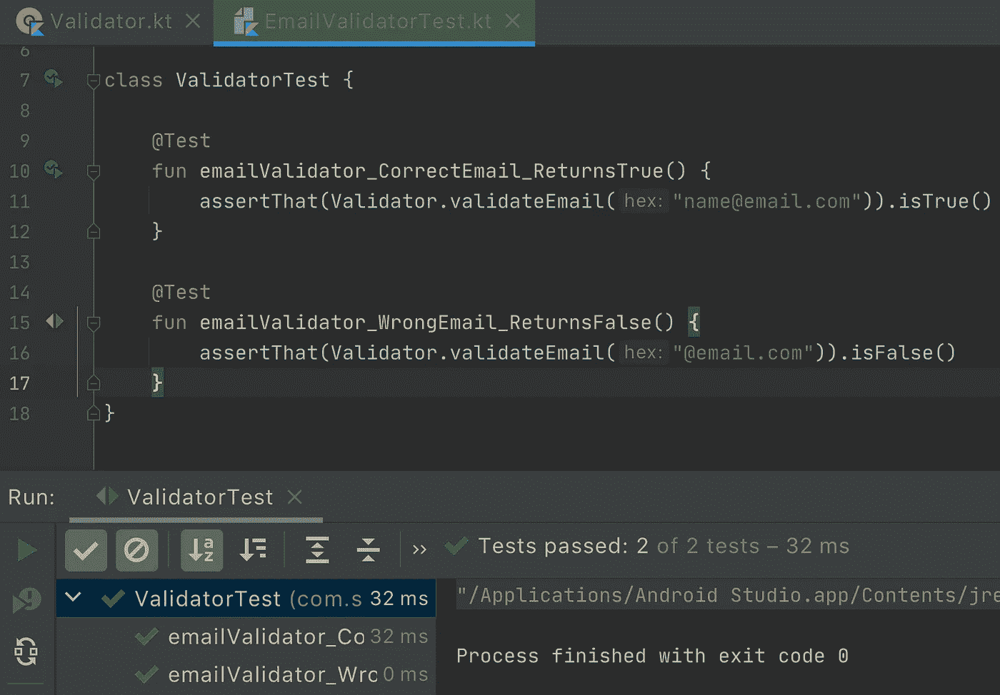

# Android 单元测试基础

> 原文：<https://betterprogramming.pub/android-unit-testing-basics-3e7075a432a1>

## 了解如何开始用 Android 编写单元测试


作者图片

在移动应用程序开发中，我们有许多正在发展的趋势，如 MVVM、Jetpack、KMM(Kotlin Multiplatform)等。如今，测试是最重要也是最受欢迎的事情之一。测试已经成为开发中的一个关键因素。app 测试有多种策略。在大部分的面试中，编写单元测试用例的知识已经成为必备。所以在这篇文章中，让我们看看什么是单元测试，以及编写本地单元测试用例的一些基础知识。

由于不可能在一篇文章中涵盖所有内容，我将写一系列关于测试的文章。如果你想跳到代码，请查看 Github repo:[Android _ unit _ tests](https://github.com/pavan5208/android_unit_tests)

# 我们需要写单元测试用例吗？

大多数情况下，答案是肯定的。由于我们有更快的开发周期来满足产品需求，我们在大多数情况下不在这个范围内，或者因为我们还没有开始而不采用它。然而，许多公司都在遵循编写单元测试的方法，以获得更好的代码质量，从而构建出优秀的产品。

甚至编写单元测试有助于解决 bug，另一方面，编写测试用例也有助于解决与我们可能没有意识到的现有代码更改相关的问题。

# 什么是单元测试？

单元测试意味着通过小部分测试编写的代码。我们通常编写有类的程序，而且类中的逻辑被分成方法。单元是指一小段代码，可以是方法、类或组件。单元测试的目的是验证单个单元的逻辑。

# 如何编写简单的单元测试

我们使用`JUnit` 框架来编写简单的单元测试。让我们看看如何为验证给定电子邮件的方法编写一个简单的单元测试。首先，我们需要知道在哪里编写这些测试。

我们通常在 Android Studio 中使用一个项目结构

*   用于写入应用程序逻辑的`main`文件夹。
*   `test` 文件夹用于编写单元测试。
*   `androidTest` 文件夹用于编写集成或自动化测试，我们将在接下来的文章中讨论。



如果我们使用 Android 结构，可能会略有不同，但如上所述，我们使用不同的目录用于各自的目的。



例如，我们在一个应用程序中有登录流，我们将用户的电子邮件地址作为用户名。我们需要在使用 API 登录之前验证这封邮件。这是为了验证是否提供了正确的电子邮件 id。为此，我们创建了一个名为`Validator`的类，我们在其中进行验证。

上面的`Validator`类有`validateEmail`方法，它接受输入并验证它，并根据验证结果提供布尔值。我们可以在活动、片段或视图模型中使用它来进行验证。让我们看看如何为它编写一个基本的单元测试用例。

**@Test** 注释告诉 JUnit 它所附加的公共 void 方法
可以作为测试用例运行。为了运行该方法，
JUnit 首先构造一个新的类实例，然后调用
带注释的方法。测试抛出的任何异常都将被 JUnit 报告为失败。如果没有抛出异常，则认为测试
已经成功。

在上面的代码片段中，我们使用 Google 的`Truth` 库进行断言语句。由于我们已经完成了编写，现在我们需要执行测试并查看结果。因为这是一个简单的测试，所以不需要仿真器或 Android 设备，他们可以自己运行 JVM。

我们可以通过右键单击文件并选择 Run ValidatorTest 选项来运行测试，或者通过点击方法旁边的 play 按钮来执行特定的方法，或者点击类名旁边的 play 按钮来运行类中的所有测试



如您所见，这是一个成功的案例，它显示测试通过了 1。要获得这些，我们需要在模块级构建 Gradle 文件中有以下依赖项

```
*testImplementation '***junit:junit**:4.12'
testImplementation 'com.google.**truth:truth**:1.1.3'
```

在编写测试时，测试所有可能的情况总是同等重要的。在上面的案例中，我们需要测试成功和失败的案例。让我们通过添加错误的电子邮件案例来查看输出，该案例将返回 false。



就这样，通过了两项测试…

# 让我们看看编写 Android 单元测试的实时用法

让我们举一个日常工作中的常见例子，在 Viewmodel 中进行 API 调用，并根据获得的状态将数据发送到 UI。例如，让我们继续上面的例子，我们有一个登录流程。输入凭证后，用户单击提交按钮，在这里我们调用**视图模型**中的方法，提供给定的输入，从这里我们调用**存储库**，在存储库实施中我们使用 **API 服务**来调用我们的 API。

如果我们使用模拟对象而不是真实的东西，那么为上述内容编写单元测试将会很简单。**嘲讽**是模拟或创造不真实行为的过程。在单元测试中，模拟有助于隔离外部依赖，并创建预期事物的模拟行为。简而言之，提供虚拟或模拟的行为来测试逻辑。

在登录流示例中，我们将首先测试 ViewModel，然后测试 Repo，最后测试 APIService。当我们使用模仿的概念时，我们将事情解耦并独立测试它们。让我们看看如何做到这一点。

查看 Github repo[Android _ unit _ tests](https://github.com/pavan5208/android_unit_tests)的代码库。

# 步骤 1:为 **LoginViewModel** 编写测试

让我们创建对应于LoginViewModel 的类`LoginViewModelTest`。`LoginViewModel`类可能将用例或存储库作为构造参数，所以我们需要根据我们的使用来模拟各自的类。让我们假设它使用了一个存储库接口 LoginRepo。LoginViewModel 的简单版本如下所示

现在让我们为上面的视图模型编写单元测试。

1.  加载状态验证测试用例
2.  API 成功状态测试用例
3.  API 错误状态测试用例

为了嘲弄 LoginRepo 我们有`Mockito` 库。在模块构建 Gradle 文件中添加以下依赖项

```
testImplementation **'org.mockito:mockito-core:2.28.2'** androidTestImplementation **'org.mockito:mockito-android:2.24.5'**
```

同样，我们需要用`@RunWith(JUnit4::class)` **来注释我们的类 LoginViewModelTest 。通过这个JUnit 将调用它所引用的类来运行该类中的测试，而不是运行 JUnit 内置的 runner。我们可以根据自己的需求定义任何定制的流道。**

让我们看看如何创建 LoginRepo 的模拟对象

```
val loginRepo = Mockito.mock(LoginRepo::class.*java*)
```

使用`when()`和`thenReturn()`也可以根据条件使用 Mockito。下面是一个简单的例子

```
Mockito.**when**(loginRepo.validateLoginDetails("test@test.com","123")).**thenReturn**(LoginResponse())
```

当调用`loginRepo`方法`validateLoginDetails`提供输入时，上面的表达式返回`LoginResponse`。

在编写测试时，我们通常需要在测试运行前创建或执行一些东西，并在测试执行完成后清理它们。在某种程度上，它类似于视图模型的`init`和`onCleared`方法。我们使用注释`@Before`和`@After`和**来实现这一点。**

我们的`LoginViewModelTest` 合起来看起来会像下面这样

当我们使用 Kotlin 协同程序时，我们可能需要添加与它们相关的测试依赖。

```
implementation 'org.jetbrains.kotlinx:kotlinx-coroutines-test:1.5.0'
```

关于完整的代码库，请查看 Github repo[Android _ unit _ tests](https://github.com/pavan5208/android_unit_tests)。一旦你运行`LoginViewModelTest` 我们可以看到所有的测试都通过了。

# 步骤 2:为 LoginRepo 编写测试

`LoginRepo`只不过是一个拥有抽象方法`validateLoginDetails`的接口。

```
package com.sample

interface LoginRepo {
     fun validateLoginDetails(username: String, pass: String): LoginResponse?
}
```

让我们创建一个类`LoginRepoTest`,并做与上面类似的测试。因为我们在回购中只有一种方法，所以我们有两种可能的结果，即成功和失败状态。`LoginRepoTest`代码如下所示:

运行`LoginRepoTest` 会给出测试通过的结果。

# 步骤 3:为 LoginAPIService 编写测试

我们来看看`LoginAPIService`。

为了测试 APIService，我们需要将模拟 web 服务器依赖项添加到模块级 Gradle 文件中:

```
testImplementation 'com.squareup.okhttp3:**mockwebserver**:4.9.0'
```

我们需要创建`MockWebServer`实例，并将其用于改型以获得预期的结果。在这里，我们将 web 服务器的响应数据设置为在方法调用时返回。让我们看看如何做到这一点:

这里我们已经处理了成功状态，现在尝试写入失败状态，并通过运行它进行检查。

如果您在执行代码片段时有任何问题，请查看 Github repo 上的完整代码库 [android_unit_tests](https://github.com/pavan5208/android_unit_tests) 。

# 摘要

总是为快乐和悲伤的流程编写测试。以上是单元测试的简单片段，我们可以做得更多。通过编写单元测试，我们可以提高构建质量。单元测试是测试的起点。还有很多我们可以做的，让我们在接下来的帖子里看看。

感谢阅读…

# 参考

*   [构建有效的单元测试](https://developer.android.com/training/testing/unit-testing)
*   [测试基础知识](https://developer.android.com/codelabs/advanced-android-kotlin-training-testing-basics#0)