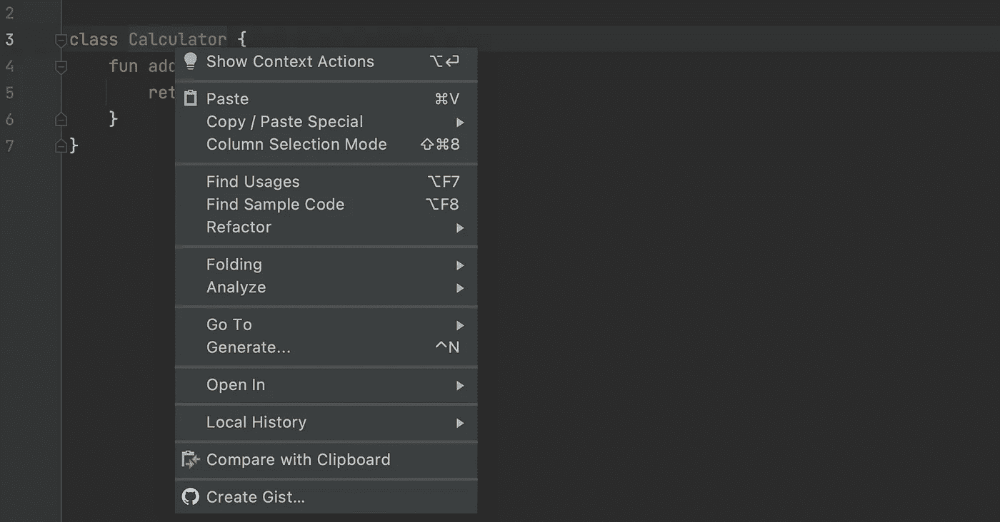
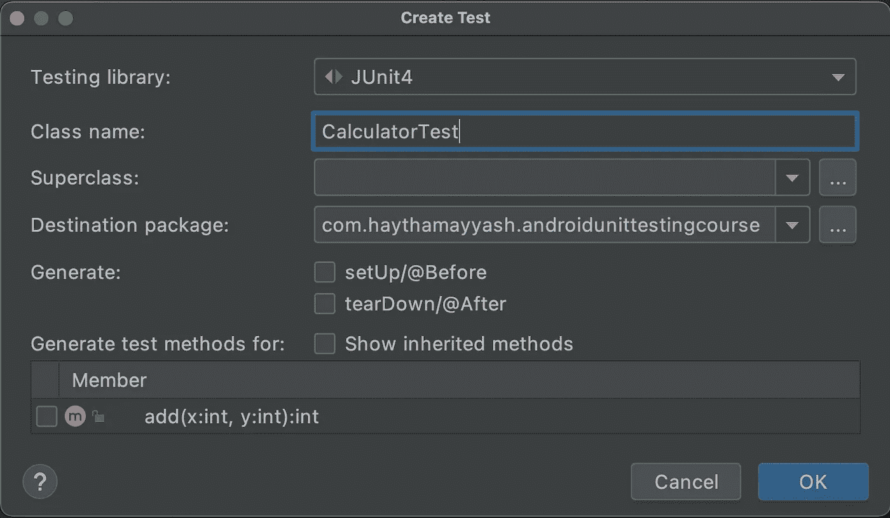
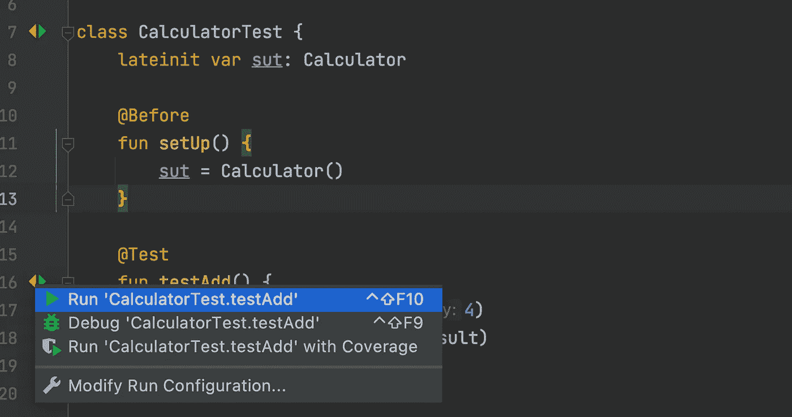
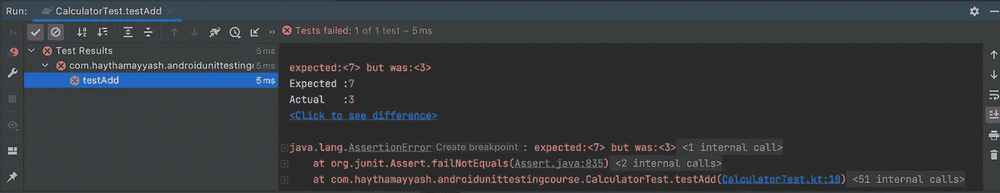
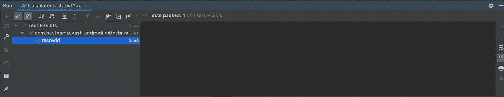

# Android 单元测试的基础

> 原文：<https://betterprogramming.pub/android-unit-testing-basics-78a04a66124a>

## 构建无 bug 的 Android 应用

[阿德里安](https://unsplash.com/@adrien?utm_source=medium&utm_medium=referral)在 [Unsplash](https://unsplash.com?utm_source=medium&utm_medium=referral) 拍摄的照片

想象一下，我们想要建造一座房子，我们将需要许多不同职业的工人，他们每个人都做着自己的工作。例如，电工实施电气基础设施住宅，橱柜制造商设计和建造橱柜，等等。

他们每个人都做了自己的工作(让我们称之为单元)，也确保它工作良好(测试)。将来，如果某些设备需要维护，我们将呼叫特定的专家来维护该设备，并确保其正常工作。

在软件开发中，我们有相同的想法。我们有单元，每个单元做一些工作，我们需要确保这些单元工作良好(如预期)。所以单元测试在这里发挥了作用。

# **什么是单元测试**

单元:单元是软件系统的一个可测试部分(oop 语言中的一个类)。

测试:验证该单元是否按预期工作。

因此，作为一个术语，单元测试就是验证每个单元都按预期工作。

例如，一个 Android 项目包括:

*   **单位:**也就是我们平时写的生产代码，或者正常代码。
*   **Test:** 测试那些单元的测试类。

# **单元测试优势**

> "正是单元测试使我们的代码保持了灵活性、可维护性和可重用性."
> 
> ***罗伯特·c·马丁，干净的代码:敏捷软件工艺手册***

灵活易维护！这是怎么回事？简单地说，我们可以更改产品代码，而不用担心更改会影响代码的其他部分。你会自信地改变。

因此，当改变现有功能时，它将减少成本和错误。

可重用，当我们编写单元测试时，特别是如果我们使用 [TDD(测试驱动开发)](https://en.wikipedia.org/wiki/Test-driven_development)，我们被迫保持我们的代码松散耦合，因此可重用。

此外，如果单元测试是干净的，它将是系统的非常好的文档。

你不认为在你的代码中开始使用单元测试是值得的吗？让我们举个例子。

# 第一个单元测试示例

我们有一个想要测试的计算器类:

我有意隐藏了实现，所以我们在编写它的测试时不会偏向它。

这是一个非常简单的例子，在一个复杂的例子中，如果你在写单元测试之前看到生产代码的实现，你会发现你自己在单元测试中写 bug 是一个需求。

所以，在你写单元测试之前，不要去看实现。相反，您可以从方法的名称、参数和返回类型来预测方法的作用。

现在，让我们为 Calculator 创建一个测试类。我们可以通过右击您的`class -> Generate -> Test`

然后选择 [JUnit4](https://en.wikipedia.org/wiki/JUnit) 。我们将使用它，因为它是最流行的版本。

现在点击 ok，选择测试包(不是`androidTest`包)。

随后，Android Studio 将生成一个`CalculatorTest`作为空类。我们将使用 JUnit 库来测试我们的类。

JUnit 是 Java 编程语言的一个单元测试框架。

在这里！我还添加了一些被覆盖的方法，我们稍后会解释。

*   `@Test`:表示以下方法为测试方法。
*   `@Before`:每次测试前进行。
*   `assertEquals`:检查预期结果与实际结果是否一致。如果是，则测试将通过，否则测试将失败。
*   `sut`:代表被测系统，表示我们要测试的类。

所以，我们在`setUp()`方法中初始化了我们想要的`test (sut)`类。
然后我们调用`testAdd()`方法中的`sut.add()`，并通过`assertEquals()`方法取其结果(`actual`)与期望值进行比较。

让我们运行这个测试来看看结果。要运行测试，您可以如下图所示

这将仅对当前方法运行测试。此外，您可以点击类旁边的图标来运行类中的所有测试方法。

结果是:

正如您所看到的，预期结果与实际结果不同，这意味着我们的实现中有一个 bug。现在让我们回到`Calculator`类，看看它的实现:

这里我们可以简单地通过返回 x + y 来解决这个问题。

所以修复后的`Calculator`类将如下所示:

让我们在修复错误后重新运行测试

最后，我们的测试通过了。

为了使我们的代码灵活、可维护和可重用，我们可以使用单元测试。这可能需要更多的时间和努力。但是这会节省我们以后的时间，也会给我们带来它所有的好处。