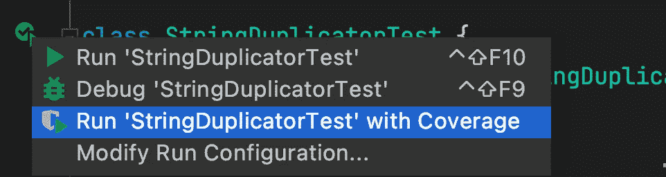
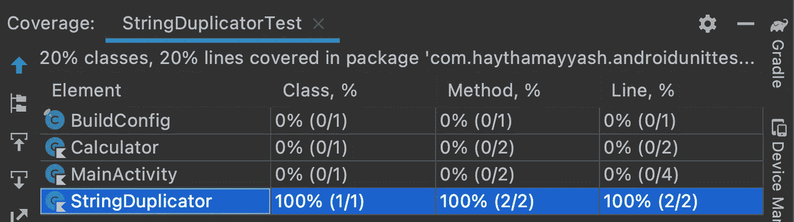
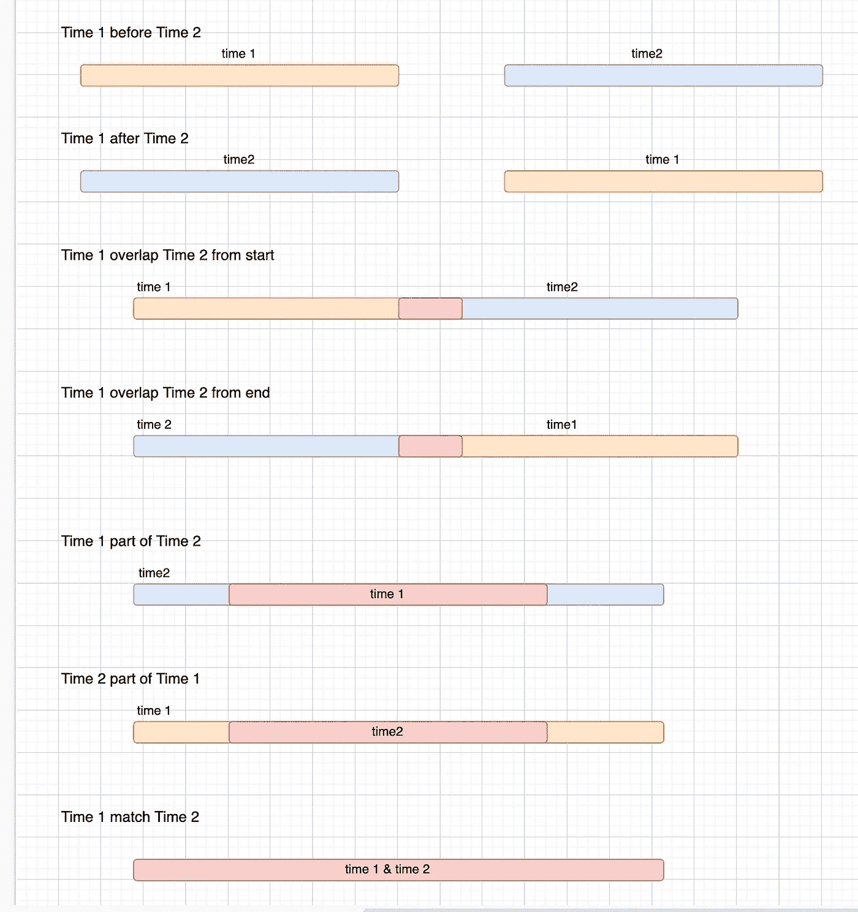
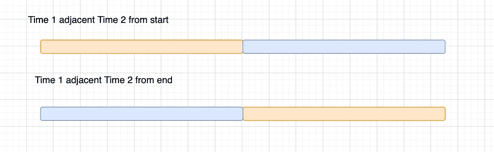

# Android 单元测试——选择命名约定和测试用例

> 原文：<https://betterprogramming.pub/android-unit-testing-choosing-naming-convention-and-test-cases-d1a3122ac28a>

## 构建无 bug 的 Android 应用


圭多·科帕在 Unsplash[拍摄的照片](https://unsplash.com?utm_source=medium&utm_medium=referral)

可维护性是我们编码时的目标之一。单元测试的一个好处是让代码更易维护，请查看优点[这里](https://medium.com/@haythamayyash95/android-unit-testing-basics-78a04a66124a)。

然而，当我们在单元测试中有错误的代码，并且需要改变一个现有的特性时，这将需要在产品代码和单元测试中(用错误的代码)进行改变。

单元测试就像地狱或陷阱一样，因为我们将花费大量时间阅读并试图理解到底写了什么，而不是通过使代码可维护来帮助我们！

换句话说，如果我们希望单元测试使代码更易于维护，我们需要使单元测试尽可能的干净。否则，一个小的变化将是一个大问题。

> 测试代码和生产代码一样重要。不是二等公民。它需要思考、设计和细心。它必须像产品代码一样保持干净。
> 
> — Robert C. Martin,《干净的代码:敏捷软件工艺手册》

# 选择测试方法名称

使代码干净的最流行的准则之一是为方法和变量选择一个好名字。您可以按照这些提示为您的项目选择一个好的测试方法名称:

## 可读性

可读性是通过选择一个简单的，有表现力的，有意义的名字来实现的。

## 一个命名约定

在您的项目中最好使用一个命名约定，这使得阅读测试报告更容易理解和一致。

但是，在某些情况下，如果您在另一个层中，您可以使用另一个约定。

例如，一些开发人员不喜欢这种约定:

```
MethodName_StateUnderTest_ExpectedBehavior
```

这是因为它包含了一个方法名，以及他们的论点，即单元测试应该测试行为而不是代码。这意味着测试代码不应该因为改变产品代码而受到影响。这种约定将测试方法与生产代码紧密耦合，这意味着如果您在生产代码中更改了方法名，那么您应该为测试该方法的任何“测试方法”更改它。

正如我前面提到的，它是紧密耦合的，因为您测试的是行为而不是代码，但是如果您测试的是实用程序类，在这种情况下，您可以使用这种约定，因为它包含方法名，所以更容易跟踪。

因此，对于业务逻辑，可以有一个不包含方法名的命名约定，例如，这个约定`When_StateUnderTest_Expect_ExpectedBehavior`。并使用另一个包含需要测试代码而不是行为的实用方法的方法名。

# 命名约定示例

有许多命名约定，遵循其中一些约定:

*   `MethodName_StateUnderTest_ExpectedBehavior` —例如:`getPost_success_postShouldCached`
*   `MethodName_ExpectedBehavior_StateUnderTest` —例如:`getPost_postShouldCached_success`
*   `Should_ExpectedBehavior_When_StateUnderTest` —例如:`should_throwException_when_NetworkError`
*   `When_StateUnderTest_Expect_ExpectedBehavior` —例如:`when_serverError_expect_postNotCached`

选择命名约定没有对错，只要它是描述性的。这取决于开发者和他更喜欢什么。

# 可读性更强

一些现代语言，比如 Kotlin，允许编写带空格的测试方法。

因此，更具可读性！例如，这个约定`When_StateUnderTest_Expect_ExpectedBehavior`如下所示

# 选择测试用例

我们不能测试所有可能的情况，因为那将是无限的！相反，我们基于我们的情况将被测试函数的输入/参数分成类别和边界，然后从每个类别和边界中选择一个值并测试它们。

测试用例没有具体的数量，要看每个案例。然而，如果[代码覆盖率](https://en.wikipedia.org/wiki/Code_coverage)不是 100%,那么我们必须编写更多的测试，但是 100%并不意味着我们覆盖了所有可能的情况。接下来的例子会更清楚。

## 示例 1:字符串复制器

假设我们有一个 StringDuplicator 类，它有一个如下所示的`duplicateString`方法

当我们想要复制某个字符串时，我们可以将参数/输入(在本例中是字符串)分为三类:空、一个字符和多个字符。首先，让我们添加一个测试用例并运行覆盖

要在覆盖范围内运行，您可以选择如下“在覆盖范围内运行`StringDuplicatorTest`”



结果将是 100%,因为测试功能已经覆盖了所有行



然而，尽管`StringDuplicator`覆盖率是 100%,我们仍然没有覆盖所有的测试用例(我之前提到的三个类别)。

为了覆盖所有的测试用例，我们可以再添加两个测试用例，测试代码如下:

## 示例 2:冲突会议检测器

假设我们有`ConflictMeetingsDetector`，它有如下的`haveMeetingsConflict`方法:

因此，我们可以将参数(在本例中为`meetingInterval1`和`meetingInterval2`)分成不同的类别，如下图所示



测试代码如下所示:

我们已经涵盖了所有类别，而且“覆盖范围内运行”会给我们 100%。
太好了，我们完成了吗？还没有。对于这个单元测试，我们可以把论点分成类别和界限。我们还没有覆盖边界。

我们很容易忘记边界/边缘情况。很多 bug 都来源于边界。所以我们在划分类别和界限的时候需要小心。

为了覆盖边界，我们可以添加两个新的测试用例，如下图所示:



此外，将添加两个新的测试函数，如下所示:

你可以在 GitHub 上从[这里](https://github.com/haythamayyash/android-unit-testing-course.git)找到完整的代码。

# 一锤定音

单元测试和产品代码一样重要。您应该尽可能保持测试代码的整洁，以便能够维护它，这样单元测试会对您有所帮助，否则，单元测试会使您的代码变得复杂和难以维护。

选择正确的测试用例可以通过将参数/输入分成类别和边界来完成。

同样，小于 100%的覆盖率意味着我们必须添加更多的测试用例，但是 100%的覆盖率并不意味着我们覆盖了所有可能的情况。