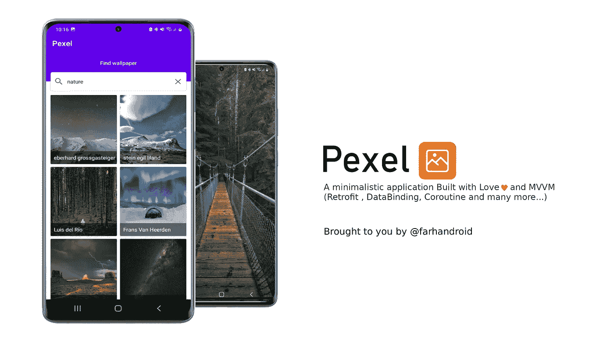
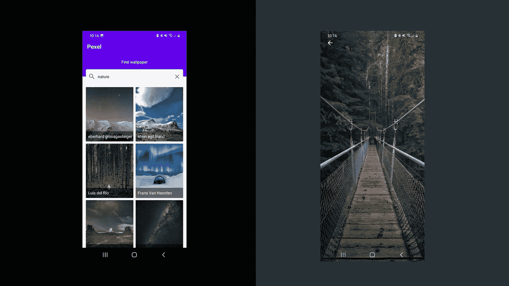
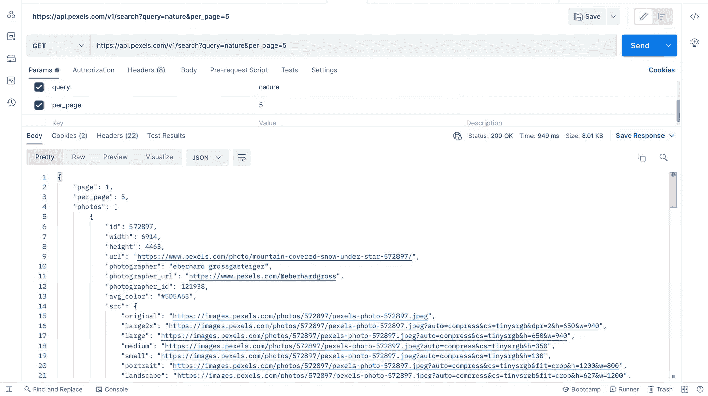
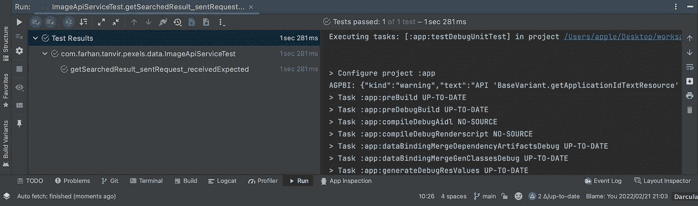
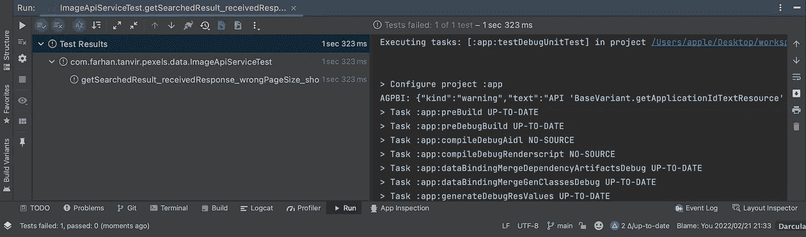

# 使用 MockWebServer 和真值断言库的 Android 单元测试

> 原文：<https://betterprogramming.pub/android-unit-testing-with-mockwebserver-and-truth-assertion-library-efe77bd6b14e>

## 构建无 bug 的 Android 应用



测试是软件生命周期的重要组成部分。我们开发人员容易犯错误。测试确保我们的代码按预期运行。它还有助于尽早发现错误，维护代码标准，并节省时间。

首先，我们将了解一些关于`MockWebServer`和真理断言库的知识。

## MockWebServer

根据官方文件:

> 这个库使得测试你的应用程序在进行 HTTP 和 HTTPS 调用时做正确的事情变得容易。它允许您指定要返回的响应，然后验证请求是否按预期发出。

如果你想了解更多，请点击查看[。](https://github.com/square/okhttp/tree/master/mockwebserver)

## 真实性

根据官方文件:

> Truth 是一个用于在测试中执行断言的库。真理由[番石榴](http://github.com/google/guava)团队拥有和维护。它被用于谷歌自己的代码库中的大多数测试。

如果你想了解更多请点击 [**这里**](https://truth.dev/) 。

# 给我看看我们在测试什么。



这是一个伟大的应用程序。不是吗？

我们将在本文中使用这个 [**GitHub**](https://github.com/Farhandroid/Pexel) 资源库。请随意检查。

# TL；速度三角形定位法(dead reckoning)

1.  在 build.gradle 中添加[**mock web server**](https://github.com/square/okhttp/tree/master/mockwebserver)、 [**Truth**](https://truth.dev/) 和 [**OKHTTP**](https://square.github.io/okhttp/) 的依赖
2.  如果 JUNIT 依赖项中存在加号(+)，请删除它并添加一个适当依赖项
3.  在`app/src/main/resources`文件夹中创建`ImageResponse.json`文件
4.  在`app/test`下创建`ImageApiServiceTest`类
5.  设置`MockWebServer`并编写测试

# 让我们测试一下

先添加依赖项在 build.gradle 中添加[**mock web server**](https://github.com/square/okhttp/tree/master/mockwebserver)、 [**Truth**](https://truth.dev/) 、 [**OKHTTP**](https://square.github.io/okhttp/) 的依赖项，请添加最新版本。

我们为这个项目使用了[**PEXELS**](https://www.pexels.com/)**API。我们将测试下面的`ImageApiService`**

**这是用`Retrofit`做的 API。该 API 将用于根据查询返回搜索结果。**

# **创造`MockResponse`**

**为了测试，我们需要创建一个带有 API 响应的 JSON 文件。但幸运的是，我们可以从 PEXELS 搜索 API 获得响应。复制它并在`app/src/main/resources`文件夹中创建一个`ImageResponse.json`文件。**

****

# **安装 MockWebServer**

**在测试包下创建`ImageApiServiceTest`类。现在，我们将在`ImageApiServiceTest`中设置 MockWebServer。**

**顾名思义，`Before`将在测试开始时调用，而`After`将在测试结束时调用。所以我们将在`Before`中设置 MockWebServer 并在`After`中关闭。我们可以看到，改型和`ImageApiService`被用来创建一个假的 API 服务。我们还需要将预期的响应排队为`MockResponse`。在`enqueueMockResponse`函数中，我们读取`ImageResponse.json`文件并将其作为`MockResponse`入队。**

# **让我们编写第一个测试**

**我们使用`runBlocking`作为协程。正如评论所描述的，我们创建了一个假的响应，创建了一个对 MockServer 的请求，获得了响应，并检查了它。让我们进行测试。**

****

**万岁！！！。测试通过了。**

**现在让我们写一个失败的测试用例。**

**创建过程和以前一样。**

****

**万岁！！！。测试失败了。也许我们应该难过。**

**谢谢你留到最后。任何建议都非常受欢迎。再次见到你。**

```
**Want to Connect?**If you want to, you can connect with me on [Twitter](https://twitter.com/FarhanT99598254)
```