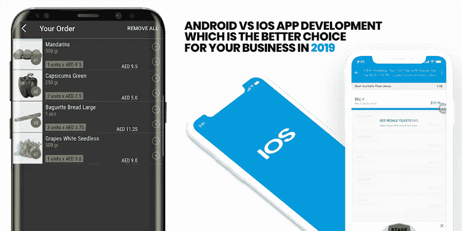
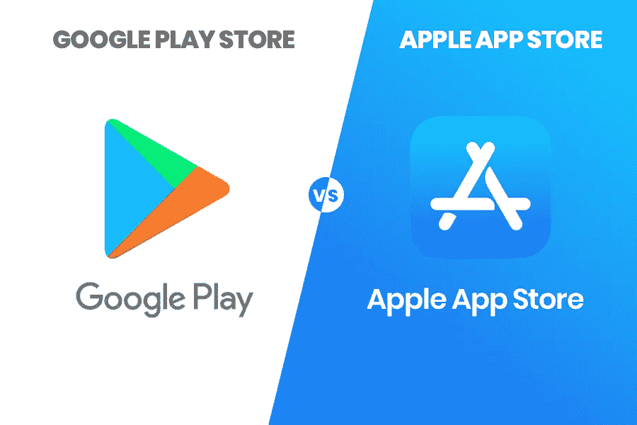
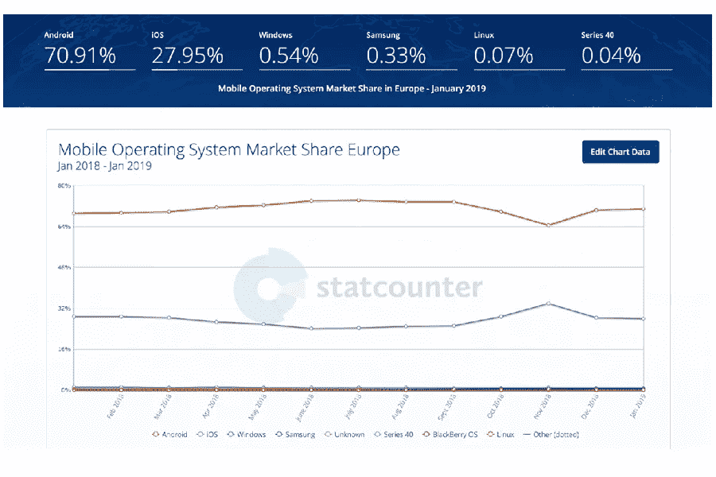
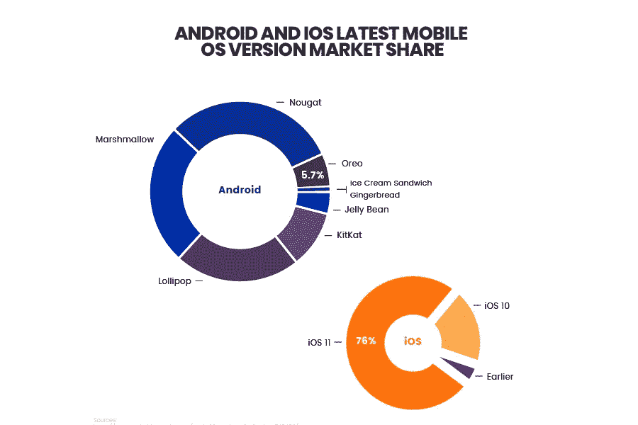
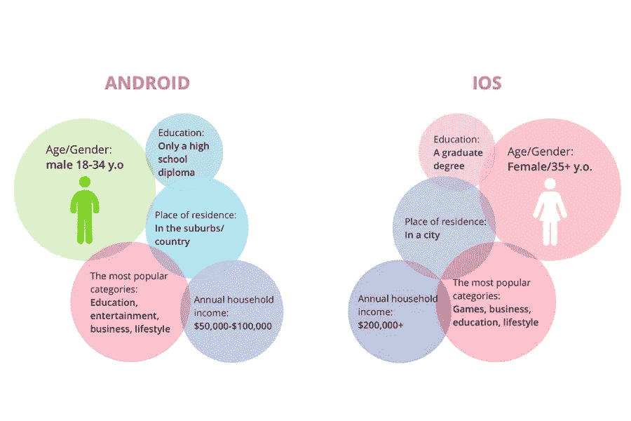
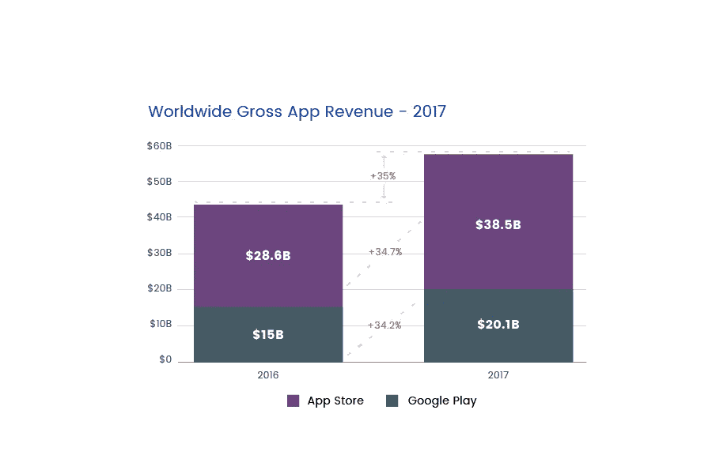

# Android vs. iOS App 开发:2019 年你的企业选择哪个更好？

> 原文：<https://betterprogramming.pub/android-vs-ios-app-development-which-is-the-better-choice-for-your-business-in-2019-933b20e4d9b8>

所以你最终决定为你的企业开发一个应用程序？但是，如何决定哪个平台最适合解决核心业务问题呢？不要烦恼！下面详细讨论一下各个平台的优缺点。

嗯，当您开始计划您的技术需求时，您需要分析和评估各种因素，以降低将您的血汗钱和努力置于危险境地的风险。

每个人都有不同的业务需求，因此没有适合所有人的单一应用程序开发平台。为了做出最佳决策，深入研究每个平台的细节并彻底了解其特性和局限性是值得的。

随着 iOS 和 Android 拥有 97%的全球市场份额，开发应用程序已经成为企业推广服务和增强领先优势的理想方法。

许多小公司使用内部应用开发团队来降低应用开发成本，但与应用开发公司签约可以帮助你在有限的预算和时间内开发应用。

## Google Play 商店还是苹果应用商店？

不好决定，那就不能两个平台都开发一个应用吗？不建议同时在两个平台上开发一个应用。原因如下:

这可能会耗尽预算。要在两个平台上开发一款应用，你需要 [**雇佣 iOS 应用开发者**](https://www.xicom.ae/services/iphone-app-developers/) 和一个 [**Android 应用开发**](https://www.xicom.ae/services/android-app-development/) 团队一起合作。那可以加起来是一大笔钱。

很冒险。你永远不知道你的应用是会大受用户欢迎还是彻底失败。所以最好先在其中一个 app 市场测试一下。

选择一个平台很重要。在选择平台之前，我建议考虑一些数据和事实来分析市场。

*   据 Statista 称，到 2019 年，手机用户数量有望突破 50 亿大关
*   从 2018 年到 2019 年，Android 占据了 74.45%的巨大市场，而 iOS 则占据了 22.85%
*   0.3%是 Windows 用户，0.28%是三星，0.41%在使用未知平台

在对当前市场的统计数据进行评估后，我们发现 Android 和 iOS 正在主导全球移动操作系统市场。

虽然苹果是当今统治世界的最知名的公司，但 Android 是在 2008 年推出的，并已成为使用最广泛的移动操作系统。

但是，决定使用哪个平台仍然是公司内部的一个热门话题。那么，哪种移动操作系统能帮助你通过一个移动应用锁定几个受众呢？让我们学习吧！

通过这篇文章，我将比较两个平台的各种因素，找出哪个更好，当谈到为企业开发应用程序时。

## **内容亮点**

*   市场占有率
*   受众和人口统计
*   应用的货币化
*   开发复杂性
*   应用程序开发时间表
*   开发成本
*   最终决策

# **市场份额和用户数量**

每年，市场都会发生变化和波动。

当你走在任何一个大城市的中心时，你可能会有这样的印象，iPhone 正在统治市场，大多数人都很容易找到他们。

然而，事实是这可能是一个稍微扭曲的表示。你对市场的快速观察和分析可能是危险的。所以花点时间，仔细读一读。

你可能会经常看到有人拿着 iPhone，但是会有轻微的失真。拿着 iPhone 6 的人看起来几乎和拿着 iPhone 8 的人一样，尤其是如果这些设备在一个盒子里的话。考虑到每年售出的大量 Android 智能手机，坊间传闻的可信度有多高？

## **为了更好地分析市场，我们来分析一些数字:**

2012 年，安卓系统占据了全球 21.5%的市场份额。这低于 iOS 的 61%。

2017 年，在市场发生巨大变化后，Android 拥有全球 64%的移动市场，是 iOS 32%的两倍。

在决定使用 Android 还是 iOS 时，你必须考虑这些人口统计属性，以便做出明智的决定。

# **观众和人口统计**

根据一项调查，据分析，Android 操作系统主要在发展中国家使用，但 iOS 通常在发达国家使用，那里的人们有收入，有能力在移动应用上花钱。

因此，作为一名商务人士，如果你想瞄准全球——无论是高收入还是低收入人群——你必须为你的业务选择 [**安卓应用开发**](https://www.xicom.ae/services/android-app-development/) 。

根据 Sensor Tower 的报告，2018 年，Google Play 商店在全球范围内吸引了约 757 亿次首次应用安装，而苹果应用商店仅吸引了 296 亿次。

其次，虽然机器人可能有更高的下载量，但 iOS 用户往往有更高的参与率，在 iOS 应用上花费更多。

Android 在低收入人群中很受欢迎，而 iOS 用户的主要受众来自北美和西欧。

18-30 岁的成年人大多是收入较高、受教育程度较高的 iOS 用户。

# **平均收入**

当然，你不仅要让你的应用程序受欢迎，还要有利可图。

看起来，由于 Android 的份额更大，它的收入也更高。但这是错误的。2016 年收入增长 82%，Android 似乎仍在输给 iOS。

苹果应用商店的收入仍然比安卓商店多 64%。

因此，如果你的唯一目标是赚钱的应用程序，这里有几个因素，你需要考虑:

与 iOS 用户相比，Android 用户不太可能在该应用上付费。所以我们不会对苹果应用商店从移动应用获得的收入超过谷歌 Play 商店感到惊讶。

不，你不需要相信我们的陈述。相信数字！2017 年是苹果应用商店的重要一年，因为它从移动应用程序中获得了 385 亿美元的收入，而 Google Play 为 201 亿美元。

# **应用开发复杂性**

应用程序开发的复杂性在决定您应该在 Android 和 iOS 开发之间选择什么平台方面起着巨大的作用。

然而，当谈到应用程序开发的复杂性时，由于编程语言和设备碎片化的巨大差异，Android 输给了 iOS。

开发一个 iOS 应用程序比开发 Android 应用程序要快得多。在 iOS 11 推出后，[有 50%的用户在最初的三个月内将他们的操作系统](https://mixpanel.com/trends/#report/ios_11)更新到最新版本，并且这个比例还在不断增加。

但如果我们谈论 Android，对于 Android 开发公司来说，这是一个烂摊子。有太多的智能手机和平板电脑运行在不同屏幕尺寸和长宽比的 Android 操作系统上。这最终意味着你需要开发一个适合他们所有人的应用——或者至少是 Android 的更大部分。

# **应用开发时间表**

## ***你想多早将你的应用推向市场？***

看完上一点，你可能会更容易猜到什么平台消耗的开发时间更多。没错，就是安卓！是的，正是因为它漫长的发布周期和碎片化。所以当比较 Android 开发者和 iOS 开发者时，后者要做的工作更少。

虽然 Android 应用程序是使用 JAVA 或 Kotlin 编程开发的，但 iOS 应用程序将使用 Objective-C 或 Swift 开发。

希望节省时间和资源的企业通常 [**雇用 iOS 应用程序开发人员**](https://www.xicom.ae/services/iphone-app-developers/) ，他们了解并迎合你想要推广业务的应用程序功能集。

# **开发成本**

移动应用开发的成本取决于项目的范围和复杂程度。项目越大越复杂，相应的预算就越大。iOS 和 Android 的应用程序开发和并没有什么内在的区别，让一个比另一个更贵。

应用程序开发的成本因您需要购买多少设备和操作系统版本而异。如果你需要开发更多的版本，应用程序将需要更多的时间和资源。

# **最终决定**

最后，你的最终决定将取决于什么对你的企业起作用。

如果你的目标受众是高收入人群，并且你将从应用内购买中获利，那么你可能会首先选择 iOS。如果你想接近更广泛的市场份额，并计划通过广告货币化，那么 Android 将是你的选择。