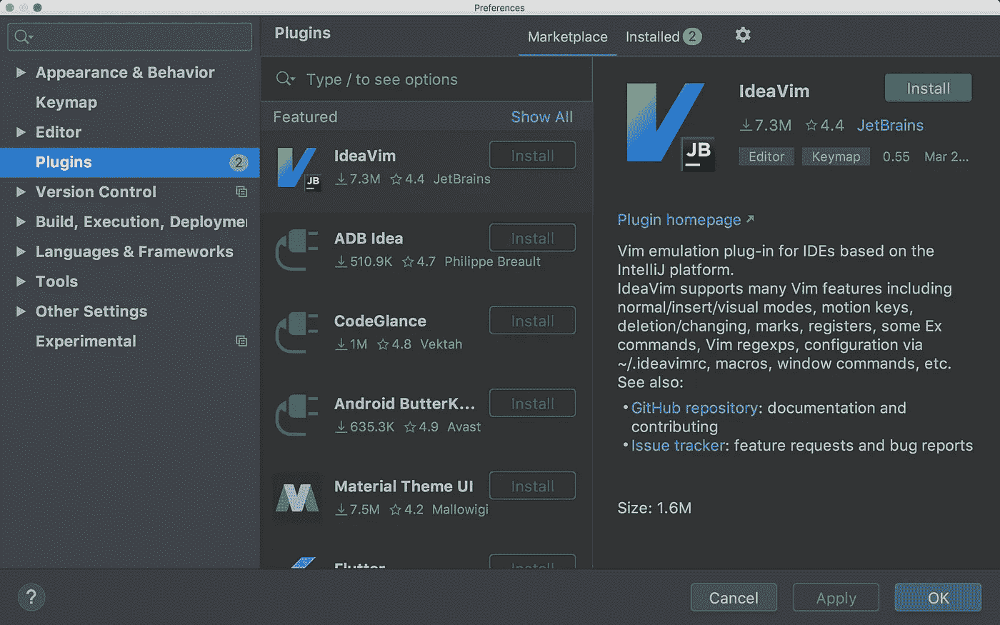
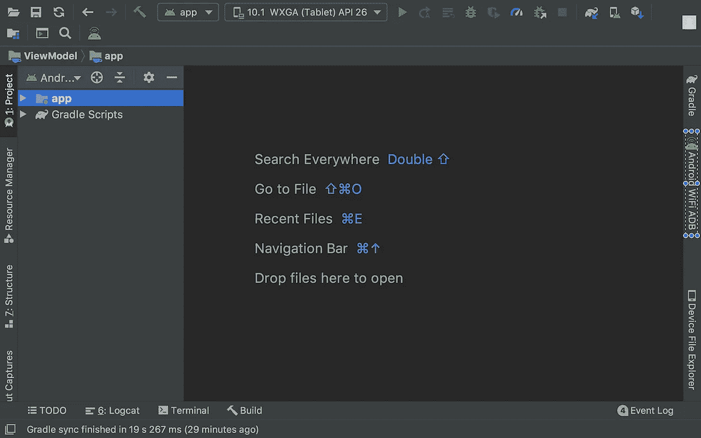
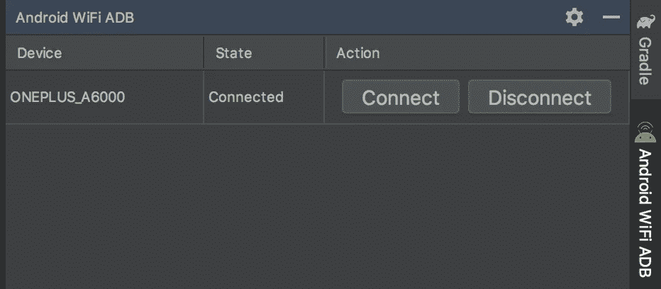
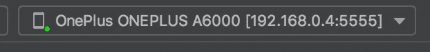
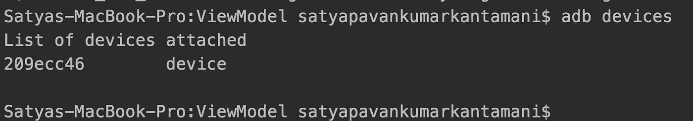
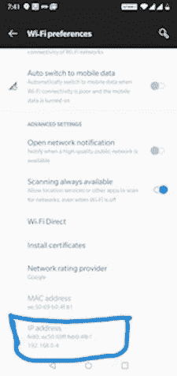
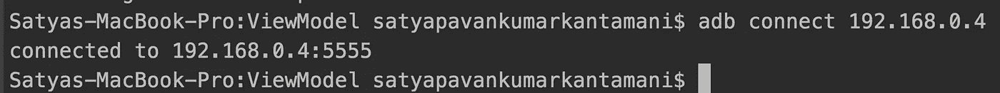
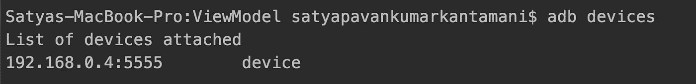

# 使用插件或 ADB 进行 Android 无线调试

> 原文：<https://betterprogramming.pub/android-wireless-debugging-using-plugin-or-adb-f2234db6b8f9>

## 无线连接以运行和调试您的应用程序


法比安·格罗斯在 [Unsplash](https://unsplash.com?utm_source=medium&utm_medium=referral) 上拍摄的照片

作为 Android 开发人员，我们每天编写代码并运行我们的应用程序来检查输出。我认为 Android 开发最吸引人的方面是我们可以在手机上即时看到结果。但有时我们在调试或运行应用程序时会对 USB 断开连接感到厌恶。

原因可能有很多，如电缆断裂或不起作用，或者有人意外拉动电缆。这个问题的最佳解决方案是无线调试。

在本文中，让我们讨论两种无线连接设备以调试应用程序的方法。第一种方式是 Android WIFI ADB 插件方式，另一种方式是通过 IP 地址连接设备。

# 插件方法

插件只不过是即插即用的组件。Android WIFI ADB 是 [Android Studio](https://developer.android.com/studio) 中的一个插件，可以帮助你通过 Wi-Fi 网络将系统连接到设备。它允许您通过 Wi-Fi 快速连接您的 Android 设备，只需按一个按钮，无需 USB 连接即可安装、运行和调试您的应用程序。(如果你不知道插件是如何工作的，可以看看我之前关于 [Android Studio 插件](https://medium.com/better-programming/android-studio-plugin-for-auto-generation-of-model-or-pojo-classes-78bfda432527)的文章。)

连接设备后，您不再需要 USB 电缆来进行调试。

让我们检查一下如何连接设备的步骤。

## 第一步。安装安卓 WIFI ADB 插件

要找到插件部分，请转到首选项并在 Android Studio 中选择右侧的插件。然后，您会发现以下屏幕:



您可以使用搜索栏来搜索您感兴趣的插件，或者您可以向下滚动到末尾来查看不同的可用插件。当你点击右边的任何一个插件时，你可以查看与该插件相关的信息。之后，如果你感兴趣，只需点击安装按钮。然后点击应用。在那之后，重启 studio，这样改动就能反映出来，你就可以使用插件了。

在我们的例子中，让我们在插件搜索栏上搜索 [Android WIFI ADB](https://plugins.jetbrains.com/plugin/7983-android-wifi-adb) 。然后我们可以找到不同发行商提供的不同插件的列表。让我们选择发行商[佩德罗维森特·戈麦斯桑切斯](https://github.com/pedrovgs)的插件，因为我用过它，感觉很方便。

文件→设置→插件→浏览存储库→搜索*安卓 WiFi ADB "*

*安装后，重启你的工作室。工作室重新打开后，您可以在右侧或顶部栏中找到该选项卡，如下所示:*

**

## ***第二步。点击右侧面板上的 Android WIFI ADB 选项卡***

*当您单击它时，它会打开一个窗口，显示已连接设备的列表(如果有)。如果没有连接任何设备，则显示“零 case”消息。此外，请记住，系统和手机都应通过同一个 Wi-Fi 网络连接，以实现设备连接。*

**

## *第三步。建立联系*

*最初，由于我们没有连接任何设备，它将状态显示为“断开”点击连接按钮连接到您的设备。一旦它显示状态“已连接”，您就可以移除 USB 来运行和调试您的应用程序。*

**

*连接时，您可以看到如下图像，表明它是通过 Wi-Fi 网络上的 IP 地址进行连接的。*

**

# *IP 地址方法*

*在这种方法中，我们将使用 Android SDK 中平台工具中的 ADB (Android Debug Bridge)工具。*

*让我们看看如何使用 ADB 工具。如果你在 Mac 上，进入终端，点击命令`adb`，然后按回车键。如果在`.bash_profile`中设置了路径变量，它将显示一系列可用的选项。如果没有，需要在`bash_profile file`中配置 PATH 变量。为此，打开终端并键入:*

```
*$ **open -t .bash_profile***
```

*这将打开文本格式的`bash_profile`文件，以便您可以在那里设置路径变量。*

```
*export PATH = $PATH:/Users/satyapavankumarkantamani/Library/Android/sdk/platform-tools/*
```

*检查是否设置了平台-工具路径。如果没有，从您的 SDK 位置复制 Platform-Tools 路径，并在上面的行中替换它。这样，你可以从一个终端执行`adb`命令，而不是总是改变你的目录到平台工具路径。*

*如果您在 Windows 上工作，检查环境变量路径是否设置为 Platform-Tools **。**配置好路径后，只需在终端或命令提示符下输入`adb`命令，就会出现选项列表。*

*请记住，对于这两种方法，我们都需要在系统和移动设备中通过同一个 Wi-Fi 网络进行连接。让我们开始吧。*

## *第一步。通过 USB 将设备连接到系统进行初始设置*

*要检查它是否正确连接，打开内置终端并运行命令`adb devices`。这将为您提供当前连接的设备列表。*

**

## *第二步。设置目标设备监听端口 5555 上的 TCP/IP 连接*

```
***adb tcpip 5555***
```

**

## *第三步。找到 Android 设备的 IP 地址*

*例如，在 Nexus 设备上，您可以在设置>关于平板电脑(或关于手机) >状态> IP 地址中找到 IP 地址。*

*在 Wear OS 设备上，您可以在设置> Wi-Fi 设置>高级> IP 地址中找到 IP 地址。*

*在我的设备上，它位于路径设置> Wi-fi 设置> Wi-Fi 偏好设置> IP 地址(滚动到底部)。*

**

## *第四步。通过 IP 地址连接到设备*

```
*adb connect IP_Address*
```

**

## *第五步。拔下 USB 电缆，通过键入初始命令来测试您的连接*

```
***adb devices***
```

**

*就这样，我们结束了。我们现在可以无线运行和调试了。*

*如果`adb`连接丢失:*

1.  *确保您的主机仍然连接到您的 Android 设备所在的 Wi-Fi 网络。*
2.  *再次执行`adb connect`步骤重新连接。*
3.  *如果这不起作用，重置您的`adb`主机:*

```
***adb kill-server***
```

*然后从头开始。*

# *注意*

*如果通过同一个 Wi-Fi 网络连接，这两种方法都有效。通过 Wi-Fi 安装 APK 可能会多花一点时间，与好处相比，这是微不足道的。*

# *参考*

*[安卓 WiFi 亚行](https://plugins.jetbrains.com/plugin/7983-android-wifi-adb)*

*[安卓调试桥](https://developer.android.com/studio/command-line/adb)*

*就这些了，我希望你喜欢这篇文章。请让我知道你的建议和意见。*

*感谢阅读…*