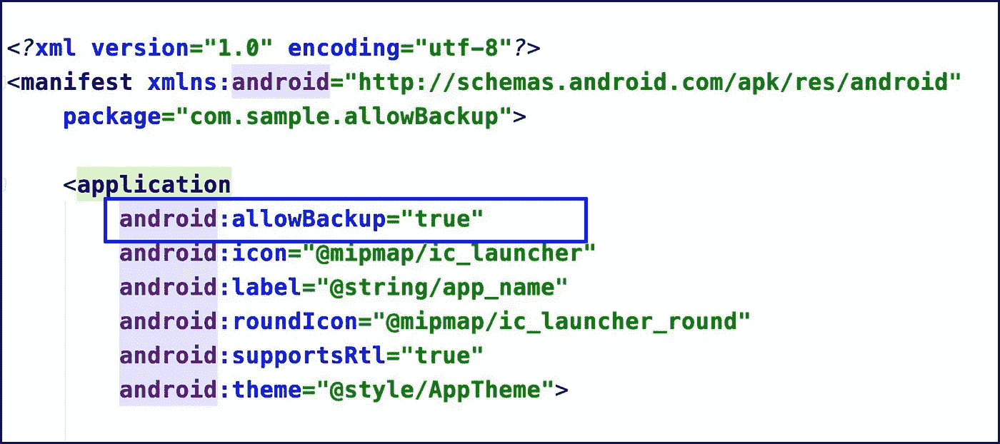

# Android 的属性 android:allowBackup 去神秘化

> 原文：<https://betterprogramming.pub/androids-attribute-android-allowbackup-demystified-114b88087e3b>

## 帮助防止您的用户丢失数据

android:allowBackup 清单属性

有各种各样的“备份”可以帮助你摆脱各种情况。想想你后备箱里的备用轮胎或者攀岩锚里多余的带子。如果你曾经攀岩过，你会知道在你的锚上增加冗余是很重要的。这样，如果一个部分失效，你还有另一个部分作为备份。

同样，Android 提供给你一个令人印象深刻的设置，名为 [allowBackup](https://developer.android.com/guide/topics/manifest/application-element#allowbackup) ，帮助我们自动备份应用程序数据。

# Android allowBackup 是做什么的？

正如[文档](https://developer.android.com/guide/topics/data/autobackup)所说，“*应用程序自动备份*会自动备份运行在 Android 6.0 (API 级别 23)或更高版本上的应用程序中的用户数据。”

我们可以在我们的 Android 应用程序中利用自动备份，这样我们的用户就可以更快地恢复他们的数据，如果他们在卸载后更换手机或重新安装我们的应用程序。

如果用户以任何方式删除应用程序，包括通过设备的工厂重置，当用户重新下载应用程序并安装`.apk`时，应用程序的数据仍将可用。自动备份也可以跨设备工作，这意味着当你的用户获得一部新手机时，他们不会丢失你的应用程序中的关键信息。

# 备份数据存储在哪里？

Android 通过将应用程序数据上传到用户的 Google Drive(默认情况下)来保存应用程序数据，在 Google Drive 中，数据受到用户的 Google 帐户凭证的保护。

数据存储在用户 Google Drive 账户的私人文件夹中。保存的数据不计入用户的个人 Google Drive 配额。仅存储最新的备份。当进行备份时，以前的备份(如果存在)将被删除。用户或设备上的其他应用程序无法读取备份数据。

用户可以在 Google Drive Android 应用程序中看到已备份的应用程序列表。在 Android 设备上，用户可以在 Drive 应用程序的导航抽屉中的设置>备份和重置>应用程序数据下找到该列表。

# 可以备份多少数据？

用户可以存储多达 25MB 的数据，这些数据会在您设备上安装的应用程序的整个生命周期内持续存在。

然而，实际上，如果您只需要保存设置和首选项，这就足够了。

# **什么是备份？**

默认情况下，自动备份包括系统分配给应用程序的大多数目录中的文件:

*   共享首选项文件
*   保存到应用内部存储器的文件，由`[getFilesDir()](https://developer.android.com/reference/android/content/Context#getFilesDir())`或`[getDir(String, int)](https://developer.android.com/reference/android/content/Context#getDir(java.lang.String,%20int))`访问
*   由`[getDatabasePath(String)](https://developer.android.com/reference/android/content/Context#getDatabasePath(java.lang.String))`返回的目录中的文件，其中也包括用`[SQLiteOpenHelper](https://developer.android.com/reference/android/database/sqlite/SQLiteOpenHelper)`类创建的文件
*   由`[getExternalFilesDir(String)](https://developer.android.com/reference/android/content/Context#getExternalFilesDir(java.lang.String))`返回的目录中的外部存储文件

您可以配置您的应用程序以包括和排除特定文件。

# 我们如何定制备份中包括和排除的内容？

为此我们有`[android:fullBackupContent](https://developer.android.com/guide/topics/manifest/application-element#fullBackupContent)`，它指向一个 XML 文件，该文件包含用于自动备份的[完整备份规则](https://developer.android.com/guide/topics/data/autobackup)。这些规则决定备份哪些文件。

您可以通过几个步骤做到这一点:

1.  在`res/xml`目录下创建一个 XML 文件`auto_backup_rules.xml`。
2.  使用以下语法指定要在备份中包括或排除的内容:

*   如果在`include`和`exclude`标签中都指定了类型，则在`exclude`标签中指定的项目优先。
*   您可以为想要指定的每个新资源添加一个新的`<include>`或`<exclude>`标签。
*   `path`标签指定了您想要包含或排除的资源的路径。例如:`<exclude domain="database" path="my_db.db"/>`

3.在您的 Android 清单中包含您的备份文件:

`<application ... android:fullBackupContent="@xml/auto_backup_rules">`

以下是 XML 文件的示例:

以上示例备份了除`device.xml.`之外的所有共享偏好设置

# 何时可以触发备份？

当满足以下所有条件时，备份会自动进行:

*   用户已在设备上启用备份。在 Android 9 中，这个设置在设置>系统>备份中。
*   自上次备份以来，至少已经过去了 24 小时。
*   设备处于空闲状态。
*   该设备连接到 Wi-Fi 网络(如果设备用户没有选择加入移动数据备份)。

# 我需要担心备份吗？

Android 备份依靠 Android 调试桥(ADB)命令来执行备份和恢复。然而，ADB 一直是黑客的软目标，仍然不被受尊敬的开发者信任。至少可以说，有人可以向您的备份数据中注入恶意代码的想法是令人不安的。对于终端用户来说，这通常不是问题，因为它需要在设备上启用调试，但由于许多 Android 用户喜欢探索和扎根他们的设备，这可能会成为一个严重的问题。

备份后，用户可以读取所有应用程序数据。`adb restore`允许从用户指定的来源创建应用程序数据。恢复后，应用程序不应假定数据、文件权限和目录权限是由应用程序自己创建的。

因此，处理和存储诸如卡细节、密码等敏感信息的应用程序。，应该将此设置明确设置为`false` —默认情况下，它设置为`true` —以防止此类风险，或者您也可以自定义需要备份的内容。

`<application ... android:allowBackup="false">`

以上就是我对这篇文章的看法。如果你有什么要分享的，请留下评论，这样我们可以一起学习。

原发表[此处](https://thedroidlady.com/2020-08-13-android-allowBackup-Demystified)。