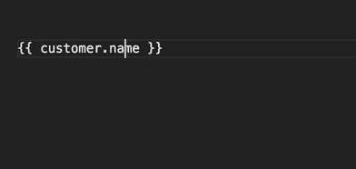
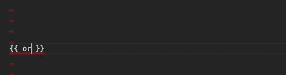
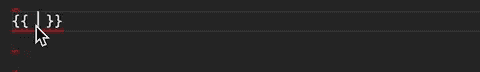
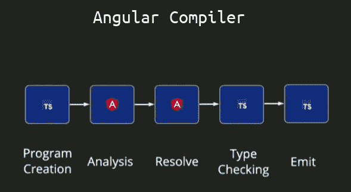
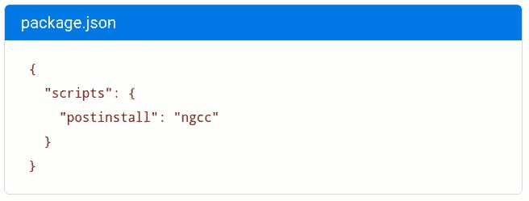

# Angular 10 的新功能

> 原文：<https://betterprogramming.pub/angular-10-new-features-dbc779061dc8>

## [网页开发](https://rakiabensassi.medium.com/list/software-engineering-7a179a23ebfd)

## Google 开发的 web 框架带给我们的新特性和突破性变化


亚历克斯·科特利亚斯基在 [Unsplash](https://unsplash.com?utm_source=medium&utm_medium=referral) 上拍摄的照片

Angular 10 是跨整个平台的主要版本，包括框架、Angular 材料和 CLI，将于 6 月 24 日推出。这意味着什么？

就像很多 Angular 社区的成员一样，我尝试着去关注新闻，看看 Angular 10 给我们带来了什么。我读了很多文章，但我觉得我在编程世界里是个新手。我多年的 Angular 经验并没有帮助我很好地理解那些文章在谈论什么。

因此，我决定写一篇新文章，介绍 Angular 10 中的新特性，让它更容易理解。

在我向您介绍最重要的变化以及它们对您、您的项目和 Angular landscape 的意义之前，我将解释一些有趣的事情，并揭开伴随的术语的神秘面纱。让我们开始吧。

# 术语

## 微 syntax

Angular [microsyntax](https://gist.github.com/mhevery/d3530294cff2e4a1b3fe15ff75d08855) 允许您以紧凑、友好的字符串形式配置指令。microsyntax 解析器将该字符串翻译成`<ng-template>`上的属性。所以你不用写`<ng-template ngFor [ngForOf]="items"><div>{{item}}</div></ng-template`，而是写`<div *ngFor="let item of items">{{item}}</div>`。

## 绑定表达式

Angular 中有四种不同类型的数据绑定:

*   **事件绑定:**例如:`<button **(**click**)**="updateName()">Update button</button>`
*   **双向数据绑定:**一种数据从组件到视图双向流动的机制。组件和视图总是同步的，在任何一端所做的更改都会立即双向更新。例如:`<input **[(**ngModel**)]**="name">`。
*   **插值:**表示组件中变量的文本放在模板的双花括号中。例子:`<p>**{{** name **}}**</p>`。
*   **属性绑定:**属性绑定是一种单向机制，允许您设置视图元素的属性。例如:
    `<button **[**disabled**]**="buttonDisabled"></button>`。

## 抽象语法树

AST 是*抽象语法树的缩写。*它是从编程语言中的语句和表达式生成的标记的表示。使用 AST，解释器或编译器可以生成机器代码或评估指令。角度模板 AST 是 HTML AST 的转换和注释版本，它具有以下功能:

*   将角度模板语法快捷方式，如`*ngFor`和`[name]`，转换成它们的规范版本(和`bind-name`)
*   收集引用(`#`属性)和变量(`let-`属性)。
*   使用收集的变量和引用解析和转换绑定表达式 AST 中的绑定表达式

## 简洁的

terser 是一个用于 ES6+的 JavaScript 解析器、解析器和压缩器工具包。Angular CLI 团队在 Angular CLI 7.0 中为构建的缩小阶段转移到 terser，因为不再维护 uglify-es，而且 uglify-js 不支持 ES6+。

## ' UrlMatcher '

`UrlMatcher`是根据 URL 匹配路线的功能。当`path`和`pathMatch`的组合不够有表现力时，你可以为`Route.matcher`实现一个定制的 URL 匹配器。

```
type [UrlMatcher](https://angular.io/api/router/UrlMatcher) = (segments: [UrlSegment](https://angular.io/api/router/UrlSegment)[], group: [UrlSegmentGroup](https://angular.io/api/router/UrlSegmentGroup), route: [Route](https://angular.io/api/router/Route)) => [UrlMatchResult](https://angular.io/api/router/UrlMatchResult);
```

以下匹配器匹配 HTML 文件:

```
content_copyexport function htmlFiles(url: [UrlSegment](https://angular.io/api/router/UrlSegment)[]) {
  return url.length === 1 && url[0].path.endsWith('.html') ? ({consumed: url}) : null;
}export const routes = [{ matcher: htmlFiles, component: AnyComponent }];
```

## 巴泽尔

Bazel 是 Angular CLI 的构建器，在版本 10 中已被弃用。这种不赞成的理由如下:

*   Bazel 网络生态系统仍在快速发展
*   Angular Ivy 编译器的引入使得以更快、更有效的方式使用 Bazel 成为可能
*   如果不进行权衡，基于 webpack 的 Angular CLI 的功能对等性很难实现，这对于许多 Angular 用户来说是不可接受的

## 角度语言服务

Angular Language Service 是一个分析引擎，它集成到您的代码编辑器中，并为它提供了一种在 Angular 模板中完成、跟踪引用、错误、提示和导航的方法。

它可以在单独的 HTML 文件中使用外部模板，也可以使用内嵌模板。您的编辑器会自动检测到您正在打开一个角度文件。然后它使用 Angular 语言服务来读取你的`tsconfig.json`文件，找到你的应用程序中所有的模板，然后为你打开的任何模板提供语言服务。



[角语服务](https://angular.io/guide/language-service)

它可以作为 Visual Studio 代码、WebStorm 和 Sublime Text 的扩展。您可以使用以下命令[安装它](https://angular.io/guide/language-service):

```
npm install --save-dev @angular/language-service
```

`@angular/language-service`是 TypeScript 语言服务的包装器(就像`ngtsc`包装了`tsc`)，并通过对角度概念的具体理解扩展了对 TypeScript 的分析。它可以在 Typescript 中的组件类和模板中的表达式之间架起一座桥梁。

# 编译器哲学

Angular 提供了两种编译应用程序的方法:

*   实时(JIT)，运行时在浏览器中编译你的应用。这是默认设置，直到角度 8。
*   提前(AOT)，在构建时编译你的应用和库。这是自 Angular 9 以来的默认设置。

Ivy 完全重写了编译器(和运行时),目的是:

*   达到更好的构建时间(通过更多的增量编译)
*   达到更好的构建规模(生成的代码与树抖动更兼容)
*   释放新的潜在特性(元编程或高阶组件、组件而不是模块的延迟加载、不基于 Zone.js 的新变化检测系统等)..)

视图引擎是 Ivy 的前身。

我们可以将 Ivy 上所做的工作分为三类，如[实现状态](https://github.com/angular/angular/blob/master/packages/core/src/render3/STATUS.md)中所述:

1.  `@angular/compiler-cli`:打印 transformer 管道，包括两个命令行工具:`ngtsc`和`ngcc`
2.  Ivy 编译器，将装饰者转换成 Ivy
3.  `@angular/core`:可以被`@angular/compiler`转换的装饰者

为了理解编译器是如何设置的，理解幕后的 Typescript 体系结构是有帮助的。

## 打字稿传输程序体系结构

下图显示了正常的`tsc`流程以及将`.ts`文件转换成`.js`文件的步骤。(`tsc`来自 Typescript CLI。它编译由`tsconfig.json`定义的最接近的项目。)


[打字稿架构](https://github.com/ikatyang/angular-html-parser/blob/master/packages/compiler/design/architecture.md)

以下是对此流程的简要解释:

*   **解析:**一个传统的递归下降解析器，做了一点调整以支持增量解析，它发出一个 AST。这是一个帮助识别当前文件中导入了哪些文件的树。
*   **类型检查器:**该步骤构建一个符号表，然后对文件中的每个表达式进行类型分析，报告发现的错误
*   **Transform:** 一组 AST 到 AST 的转换，执行各种任务，比如删除类型声明，将模块和类声明降级为 ES5，将`async`方法转换为状态机等。
*   **打印:**TS 到 JS 的转换

## 角度编译步骤

Angular 编译器构建在常规 TypeScript 体系结构之上，使用它的三个主要阶段:程序创建、类型检查和发射——外加一个分析步骤和一个解析步骤:



[角度编译器架构](https://www.youtube.com/watch?v=anphffaCZrQ&feature=youtu.be)

*   **程序创建:**从`tsconfig.json`开始
*   **分析:**逐类检查 TS 代码，寻找有棱角的东西并收集关于结构的信息
*   解决:立刻查看整个程序，理解它并做出优化决策
*   类型检查:就像普通的 TypeScript 编译器一样，它验证组件模板中的表达式并报告错误。这个过程没有被`ngtsc`扩展或修改。
*   **Emit:** 为每个修饰类生成角度代码，并对其进行修补。它将类型脚本代码转换为 JavaScript。整个过程中最昂贵的操作。

## 两个新的编译器入口点

Angular 引入了两个编译器入口点:`ngtsc`和`ngcc`。

`**ngtsc**`

编译兼容 Ivy 的代码。这是一个从类型脚本到 JavaScript 的转换程序，它寻找像`@Component`这样的角度装饰器，并用它们特定的角度运行时指令/对应物替换它们，像`ɵɵdefineComponent`。这是围绕`tsc`的最小包装。当`tsconfig.json`文件中的`angularCompilerOption` `enableIvy`标志设置为`true`时，`ngc`作为`ngtsc`运行。

**编译流程**

当`ngtsc`开始运行时，它首先解析`tsconfig.json`文件，然后创建一个`ts.Program`。在运行上述转换之前，需要做几件事情:

*   必须为包含装饰器的输入源文件收集元数据
*   `@Component`decorator 中列出的资源文件必须异步解析。例如，CLI 可能希望运行 webpack 来产生对`@Component`的`styleUrls`属性的`.css`输入。
*   必须运行诊断，这将创建`TypeChecker`并触及程序中的每个节点(一个相当昂贵的操作)

`**ngcc**`

`ngcc`代表角度兼容性编译器。它将 Ivy 之前的模块(旧样式)转换为 Ivy 兼容的代码。它处理来自 npm 的代码并生成等价的 Ivy 版本，就好像代码是用`ngtsc`编译的一样。`ngcc`也可以作为 webpack 这样的代码加载器的一部分运行，让来自`node_modules`的包动态传输。

**如何使用** `**ngcc**`

通过添加一个`postinstall` npm 脚本，可以在每次安装`node_modules`后运行`ngcc`:



在' [postinstall](https://angular.io/guide/ivy) 中使用' ngcc '的一种方法

如果您正在使用 Angular 8——这是 Ivy 的第一步——并且您想在启用 Ivy 的情况下启动一个新项目，您可以使用带有`ng new`命令的`--enable-ivy` 标志:

```
ng new shiny-ivy-app --enable-ivy
```

新项目是为 Ivy 自动配置的。在项目的`tsconfig.app.json`文件中`enableIvy`选项设置为`true`:

```
"angularCompilerOptions": {
  "enableIvy": true
}
```

最后，您可以通过在新创建的项目文件夹中执行`ngc`命令来运行编译器:

```
node_modules/.bin/ngc
```

然后，您可以在`dist/out-tsc`文件夹中检查生成的代码。

# Angular 10 的主要特点

对谷歌开发的框架的升级更侧重于生态系统的改进，而不是新功能。角度 10 设置为小于以前的版本。到目前为止，最新初步版本中的主要特性包括:

## 特征

*   此外，可选的更严格的设置在使用`ng new`通过`ng new -- strict`创建新的工作空间时提供了更严格的项目设置。启用此标志将使用新设置初始化新项目，以提高可维护性，帮助捕捉错误，并允许 CLI 对应用程序进行高级优化。
*   `**language-service**` **:** 增加了一个编译器接口，封装了实际的`ngtsc`编译器。特定于`language-service`的编译器使用项目接口管理多个[类型检查](https://github.com/angular/angular/commit/1142c37)文件，根据需要创建`ScriptInfo`文件。
*   `**language-service**` **:** 去除 HTML 实体的自动补全。自动完成功能将从 HTML 实体中移除，如`&amp;`、`&lt;`等。，因为它超出了 Angular LS 的核心功能，而且它的价值和性能成本都值得怀疑。
*   **编译器:**为属性读取和方法调用增加了名称跨度
*   **编译器:**依赖信息和`ng-content`选择器被添加到元数据中。这个[提议的编译器特性](https://github.com/angular/angular/pull/35695)将提供对工具有用的额外元数据，例如 Angular 语言服务，提供为库中定义的指令/组件提供建议的能力。
*   **编译器:** [将 microsyntax 表达式的`ExpressionBinding`中的正确值范围的](https://github.com/angular/angular/pull/36133)传播到`ParsedProperty`，这又将范围传播到模板 ASTs(VE 和 Ivy)
*   `**ngcc**` **:** 允许配置异步锁定超时。这增加了对用于设置`AsyncLocker`的`retryAttempts`和`retryDelay`选项的`ngcc.config.js`文件的支持。集成测试添加了一个新的超时检查，并使用`ngcc.config.js`来减少超时时间，以防止测试花费太长时间。
*   `**ngcc**` **:** 基于程序的[入口点查找器](https://github.com/angular/angular/commit/f3ccd29)已经实现。该查找器被设计为只处理由`tsconfig.json`文件定义的程序可到达的入口点。如果安装了大量的依赖项，但实际上只有一小部分入口点被导入到应用程序中，那么使用这个选项可以加快处理速度。
*   **Bazel:** 从闭包到开发模式文件的显式映射被公开。这个特性针对的是开发工具，它必须将产品构建输入转换成它们的开发模式等价物。
*   **本地化:**支持多个翻译文件的合并。以前，每个语言环境只能加载一个翻译文件。现在，用户可以为每个地区指定多个文件，每个文件的翻译将通过一个消息 ID 合并在一起。合并是基于先赢的方法。因此，如果您有三个要合并的文件— `"a.xlf”`、`"b.xmb"`和`"c.json"`——那么将使用来自`"a.xlf”`的任何消息，而不是来自`"b.xmb"`或`"c.json"`的消息……等等。在实践中，这意味着您应该将文件按最重要的顺序放在第一位，然后进行后备翻译。
*   **路由器:**对于路由器来说，`CanLoad`守卫现在可以返回`Urltree`。一名`CanLoad`护卫返回`Urltree`取消当前导航并重定向。这与目前增加的`CanActivate`守卫的行为相匹配。这不影响预压。一个`CanLoad`保护块阻止任何预压；任何带有`CanLoad`保护的路线都不会被预加载，保护也不会作为预加载的一部分被执行。
*   **角状材料:**角状材料现在包括一个[新的日期范围选择器](https://next.material.angular.io/components/datepicker/overview#date-range-selection)。要使用新的日期范围选择器，您可以使用`mat-date-range-input`和`mat-date-range-picker`组件。


角度材料新日期范围选取器

**性能改进**

*   `**compiler-cli**` **:** 增量执行模板类型检查，将 Ivy 模板类型检查拆分成多个文件
*   `**ngcc**` **:** 现在允许立即报告过时的锁文件。此外，在运行之间缓存一个解析过的`.tsconfig`文件。
*   `**ngcc**` **:** 减小入口点清单文件的大小。包的基本路径和入口点是已知的，所以不需要将它们存储在文件中。避免了存储不必要的空数组。以前，即使一个入口点不需要处理，`**ngcc**`也会解析入口点的文件来计算依赖关系，这对于大型节点模块来说会花费很多时间。
*   `**ngcc**` **:** 为了提高性能，`basePaths`的计算被偷懒了，所以在`TargetedEntryPointFinder`中只在需要时才工作。以前，`basePaths`是在 finder 被实例化时计算的，这在目标入口点已经被处理的情况下是一种浪费。

## 重大变化

*   **Typescript 3.9** 现已推出，对 TypeScript 3.8 的支持已被移除。TypeScript 3.6 和 TypeScript 3.7 也不再受支持。
*   TSlib，包含帮助器函数的 TypeScript 的运行时库，已更新到 [v2.0\.](https://github.com/microsoft/tslib/releases/tag/2.0.0)
*   用于 TypeScript 的 TSLint 静态分析工具已更新到版本 6。
*   Angular 包格式不再包括 ESM5 或 FESM5 包，节省了运行 Angular 包和库的`yarn`或`npm install`时的下载和安装时间。
*   新项目的浏览器配置已更新，排除了较旧的、较少使用的浏览器。不赞成对 Internet Explorer 9、Internet Explorer 10 和 Internet Explorer Mobile 提供支持。
*   **服务人员:**以前，从缓存中检索资源时会考虑`[Vary](https://developer.mozilla.org/en-US/docs/Web/HTTP/Headers/Vary)`头，这完全阻止了对缓存资产的检索(由于`ServiceWorker`-实现细节)，并由于不同浏览器中的不一致/错误实现而导致不可预测的行为。现在，当从`ServiceWorker`缓存中检索资源时，`Vary`头被忽略，这可能导致资源被检索，即使它们的头是不同的。如果您的应用程序需要根据请求头区分其响应，请确保 Angular `ServiceWorker`配置了[以避免缓存受影响的资源。](https://angular.io/guide/service-worker-config)
*   **路由器:**任何返回`EMPTY`的解析器都会取消导航。如果您想让导航继续，您需要更新解析器来发出一些值，(例如，`defaultIfEmpty(...)`、`of(..)`等)。
*   **常见:**更新了关于跨越午夜的日时段格式的逻辑。当使用`b`或`B`格式代码格式化时间时，呈现的字符串不能正确处理跨越数天的日周期。相反，这种逻辑正在退回到`AM`的违约案例。这个逻辑已经过了更新，所以它匹配一天中超过午夜的时间，所以它现在会呈现正确的输出，例如在英语中的`at night`。使用`formatDate()`或`DatePipe`或`b`和`B`格式代码的应用程序将受到这一变化的影响。
*   关于未知元素的警告现在被记录为错误。这不会破坏你的应用程序，但是它可能会使那些不希望通过`console.error`记录任何东西的工具出错。
*   **核心:** Angular npm 包不再包含JSDoc 注释来支持闭包编译器的高级优化。Angular 包中对闭包编译器的支持是实验性的，已经中断了很长时间。从 TS3.9 开始，闭包不能与 JavaScript emit 一起使用。如需更多信息和更新，请点击此[链接](https://github.com/microsoft/TypeScript/issues/38374)。
    如果您过去将闭包编译器与 Angular 一起使用，您可能会更好地直接使用从源代码构建的 Angular 包，而不是使用 npm 上的版本，后者主要针对 webpack/Rollup + terser 构建管道进行了优化。作为一个临时的解决方法，您可以考虑使用带有闭包标志`--compilation_level=SIMPLE`的当前构建管道。这个标志将确保您的构建管道产生可构建和可运行的工件，代价是由于禁用了高级优化而增加了有效负载的大小。
*   **核心:**通用已成为`ModuleWithProviders`的必备。`ModuleWithProviders`模式需要一个泛型类型参数来与 Ivy 编译和呈现管道一起工作，但是在提交之前，View Engine 允许省略泛型类型。如果开发人员在您的应用程序代码中使用没有泛型类型的`ModuleWithProviders`，版本 10 的迁移将为您更新代码。

但是，如果开发人员正在使用视图引擎，并且依赖于省略了泛型类型的库，您现在会得到类似于以下内容的构建时错误:

```
error TS2314: Generic type 'ModuleWithProviders<T>' requires 1 type argument(s).
```

在这种情况下，`ngcc`帮不了你(因为是 Ivy 专用的)，迁移只覆盖应用代码。您应该联系库作者来修复他们的库，以便在他们使用该类时提供类型参数。作为一种变通方法，可以在`.tsconfig`文件中将`skipLibChecks`设置为`false`，或者您可以更新您的应用程序以使用 Ivy。

## 错误修复

*   **路由器:** `UrlMatcher`现在被允许返回`null`
*   **核心:** `undecorated-classes-with-decorated-fields`迁移不修饰派生类
*   **服务人员:** [防止](https://github.com/angular/angular/pull/35870)软件注册策略影响 app 稳定性
*   已经修复了许多错误，包括编译器避免了多孔数组中的未定义表达式，以及[内核避免了导入不存在的符号时的迁移错误](https://github.com/angular/angular/pull/36367)。对于 [terser 内联错误](https://github.com/angular/angular/pull/36200)，内核中也有一个变通方法。另一个 bug 修复[正确识别了受测试平台](https://github.com/angular/angular/pull/36649)中覆盖影响的模块。

# 编译器兼容性问题

需要一个兼容性功能来逐步迁移到 Ivy 而不中断更改。它确保 Ivy 和非 Ivy 库在迁移期间可以共存。

并非所有角度代码都是同时编译的。应用程序依赖于共享库，这些库以编译形式发布在 npm 上，而不是作为类型脚本源代码。即使一个应用程序是使用`ngtsc`构建的，它的依赖项也可能没有。

如果一个特定的库不是用`ngtsc`编译的，那么在它的`.js`中就没有具体化的装饰属性。将它链接到一个不是以同样方式编译的依赖项会在运行时失败。

## 转换前 Ivy 代码

由于 Ivy 代码只能链接到其他 Ivy 代码，因此要构建应用程序，npm 中所有 Ivy 之前的依赖项都必须转换为 Ivy 依赖项。这种转换必须作为在应用程序上运行`ngtsc`的前奏，并且未来的编译和链接操作需要针对依赖关系的这种转换版本进行。

# 升级到角度 10

要更新您当前的 Angular 安装，您可以运行以下命令(参见 Angular 更新指南[此处为](https://update.angular.io)):

```
ng update @angular/cli @angular/core
```

你可以在 [GitHub](https://github.com/angular/angular/releases?ref=morioh.com) 上找到 Angular 10 版本，在[的变更日志](https://github.com/angular/angular/blob/master/CHANGELOG.md#1000-next6-2020-05-07)中找到更多细节。

感谢阅读。我希望这有所帮助。如果你有任何问题，请随时回复。

这篇文章最后一次更新是在 2020 年 6 月 29 日。

🧠💡我为一群聪明、好奇的人写关于工程、技术和领导力的文章。 [**加入我的免费电子邮件简讯，独家获取**](https://rakiabensassi.substack.com/) 或在此注册 Medium [。](https://rakiabensassi.medium.com/membership)

*你可以在 Udemy 上查看我的* ***视频课程****:*[*如何识别、诊断、修复 Web Apps 中的内存泄漏*](https://www.udemy.com/course/identify-and-fix-javascript-memory-leaks/) *。*

[](/frontend-architecture-376e6323ef9b) [## 我从设计企业应用程序中学到的 10 个教训

### 前端架构从来都不是“一劳永逸”的命题，没有任何设计或计划是完美或完整的

better 编程. pub](/frontend-architecture-376e6323ef9b) [](/angular-13-features-ef528a9ae16f) [## Angular 13 的新功能

### 100% Ivy，更好的组件 API，不支持 IE11，等等

better 编程. pub](/angular-13-features-ef528a9ae16f)