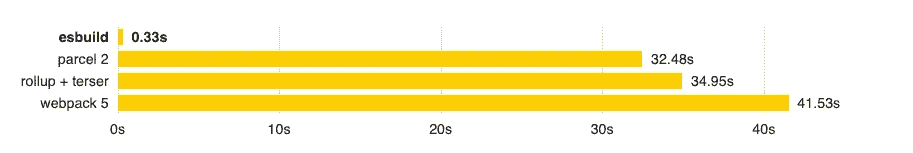
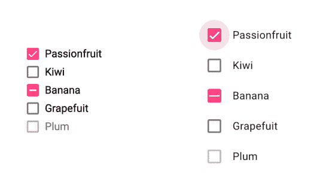

# Angular 13 的新功能

> 原文：<https://betterprogramming.pub/angular-13-features-ef528a9ae16f>

## 100% Ivy，更好的组件 API，不支持 IE11，等等


[丹尼尔·阿克谢诺夫](https://unsplash.com/@nebe3etogo?utm_source=medium&utm_medium=referral)在 [Unsplash](https://unsplash.com?utm_source=medium&utm_medium=referral) 上的原始照片(作者编辑)

谷歌广受欢迎的基于 TypeScript 的网络框架的新版本自 2020 年 11 月 3 日起可用。

这篇文章将让你更接近 Angular 13 中最重要的新功能和突破性变化，并帮助你决定是否值得为你的项目进行更新。

```
**Table of Contents**[Goodbye View Engine — 100% Ivy](#8679)
[Ergonomic APIs](#ba6a)
[No More Support for IE11](#a789)
[Update of Component API](#736d)
[Improved Debugging and Test Times](#5949)
[New Type for Forms](#dff9)
[Router](#b6ed)
[Accessibility (A11y)](#7b1d)
[Other Changes](#1637)
[Final Thought](#b2eb)
```

# 再见视图引擎— 100%常春藤

Angular 从其版本 8 开始引入了下一代编译和渲染管道 Ivy。Angular 9 默认使用 Ivy，同时保持对前身编译器和运行时视图引擎的支持。

新版本的框架现在是百分之百的常青藤。

为了简化和更新 Angular Package Format (APF ),现在删除了视图引擎特定的元数据和旧的输出格式，这将降低维护成本和 Angular 13 中代码库的复杂性。所有内部工具都预先转换为 Ivy，以便顺利进行更改。

Ivy 更加独立地编译各个组件，这缩短了开发时间。使用最新版本的 APF 构建的库不再需要使用`ngcc` ( [角度兼容性编译器](https://v13.angular.io/guide/glossary#ngcc))。这将为库开发人员提供更快的执行速度。

# 人体工程学 API

在 Angular 13 中，借助符合人体工程学的代码拆分 API 和组件级的粒度代码分解，加载时间得以缩短。

随着速度极快的 JavaScript 捆绑器 [ESBuild](https://esbuild.github.io/) 的引入，性能也得到了提高。ESBuild 现在与`[terser](https://terser.org/)`一起工作来优化全局脚本并支持 CSS sourcemaps，这实现了优化的全局 CSS。



*这个时候做一个制作捆绑 10 份的*[*three . js*](https://github.com/mrdoob/three.js)*库从头开始使用默认设置，包括缩小图和源图。* ( [图像来源](https://esbuild.github.io/))

ESBuild 还支持其他框架语言，如 [Elm](https://elm-lang.org/) 、 [Svelte](https://svelte.dev/) 和 [Vue](https://vuejs.org/) 。

# 不再支持 IE11

为了从本地 web APIs 和现代浏览器功能(如 web 动画和 CSS 变量)中受益，Angular 团队删除了对 Internet Explorer 11 的支持。

由于没有 IE 专用的 polyfills，并且不需要差异加载，因此这为应用程序提供了更小的包大小和更快的加载速度，并改善了用户体验。

这种突破性的变化肯定会影响到仍然使用 IE 11 并且尚未改用微软 Edge 或其他现代浏览器的权威机构或机构。

# 组件 API 的更新

由于对`ViewContainerRef.createComponent` API 的改进，现在您可以用更少的样板代码创建[动态组件](/angular-custom-autocomplete-7ffb479477e7)。

下面是创建动态组件的老方法:

角度 12 创建动态组件的方式

而且有了 Angular 13，就不需要用`ComponentFactoryResolver`:

创建动态组件的角度 13 方法

# 缩短了调试和测试时间

`TestBed`是角度应用程序和库的主要单元测试 API。

为了减少`TestBed`中的测试时间，新版本发布了改进的测试 API。框架现在可以设置和拆除测试环境，并在每次测试运行后自动学习 DOM。这使得测试速度更快，占用内存更少，隔离性更好。

# 表单的新类型

Angular 13 引入了一种新的表单类型，这就是`FormControlStatus`。它是表单控件所有可能的状态字符串的联合:

*   比如`AbstractControl.status`的类型现在是`FormControlStatus`而不是`string`。
*   并且`StatusChanges`的类型是`Observable<FormControlStatus>`而不是`Observable<any>`。

# 路由器

*   路由器有一个改进，当新的导航取消正在进行的导航时，它不会替换浏览器 URL。
*   有一个建议是修复导航的不正确解析。当默认 URL 序列化程序像查询参数中的问号一样丢弃所有内容时，就会发生这种情况:`/users?start=1?&pages=15`
*   您可以将缺失的出口事件添加到`RouterOutletContract`中，这在将来模块联合动态呈现组件时非常有用。

# 可访问性(A11y)

角形材料的可访问性(A11y)有所改进:所有材料设计组件(MDC)都经过检查，可获得更好的可访问性。

例如，复选框和单选按钮现在有更大的触摸尺寸，其他组件有更好的高对比度模式。



触摸目标大小的比较。右边的尺寸是新的尺寸。([图片来源](https://blog.angular.io/angular-v13-is-now-available-cce66f7bc296))

# 其他变化

*   框架核心现在支持 [TypeScript 版本 4.4](https://levelup.gitconnected.com/features-in-the-new-typescript-release-e5ef6ebba750) 。
*   [现在支持反应式编程库 RxJs(JavaScript 的反应式扩展)的版本 7](https://rxjs.dev/6-to-7-change-summary) 。
*   内联字体加速了[第一个内容丰富的绘画(FCP)](/web-vitals-guide-b56e28798e7f) ，这可以提高网页性能。这就是为什么该团队现在引入了对内嵌 Adobe 字体的支持，就像他们在 Angular 11 中内嵌 Google 字体一样。
*   我们可以动态地禁用或启用内置验证器，如`min`、`max`和`minLength`。
*   我们可以在`ng_package`设置自定义条件。
*   错误消息有所改进，例如关于[平台浏览器](https://github.com/angular/angular/pull/41356)的“*缺少动画触发器*的错误。
*   清除安全工作器中的[服务工作器](https://github.com/angular/angular/pull/43324)缓存。这确保了在将来的请求中不会提供破损或陈旧的内容。
*   本地化 API 的改进。可以查看`[$localize](https://angular.io/api/localize/init/$localize)`的文档。

# 最后的想法

Angular 框架的新版本带来了令人兴奋的特性。如果您的需求不依赖于 Internet Explorer 11，那么您有机会通过在项目中运行`ng update`来更容易地更新到 Angular 13。

你可以在 [GitHub](https://github.com/angular/angular/releases) 上找到新版本的代码，也可以在这里找到宣布完整发布细节的博客:

[](https://blog.angular.io/angular-v13-is-now-available-cce66f7bc296) [## Angular v13 现已上市

### 我们带着全新发布的 Angular v13 回来与大家分享！这个最新版本带来了各种…

blog.angular.io](https://blog.angular.io/angular-v13-is-now-available-cce66f7bc296) 

将来，`NgModules`可能会是可选的，因为 GitHub 上有一个针对它的 [RFC(征求意见)提案](https://github.com/angular/angular/discussions/43784)。这种改变将允许开发人员创建独立的组件，并实现用于声明编译区域的替代 API。

## 想联系作者？

我为一群聪明、好奇的人写关于工程、技术和领导力的文章。[加入我的免费电子邮件简讯](https://rakiabensassi.substack.com/)获得独家访问权限。