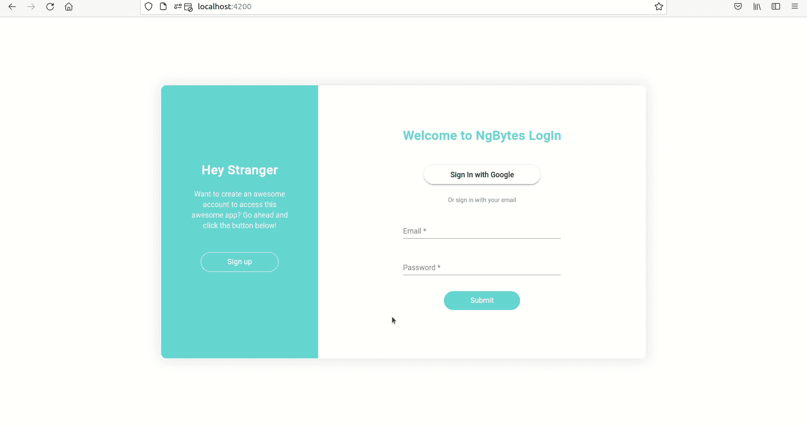
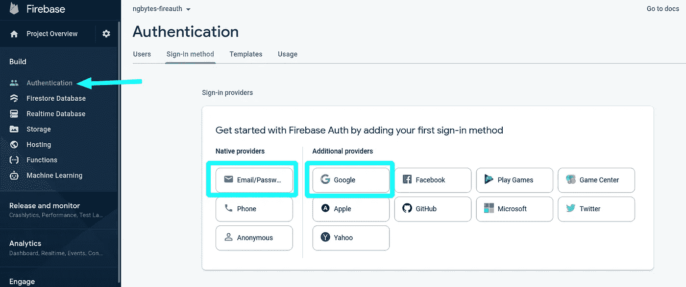
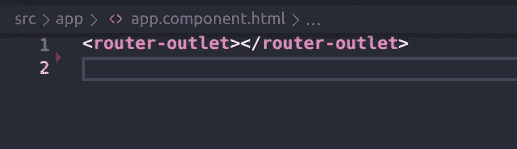
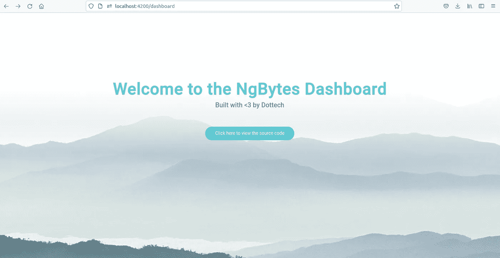
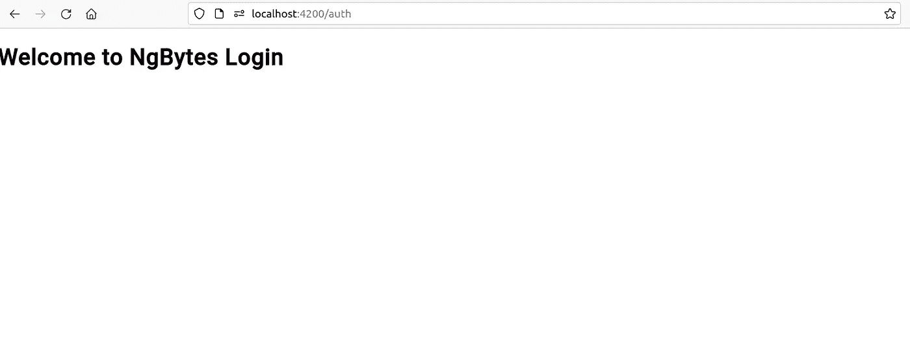
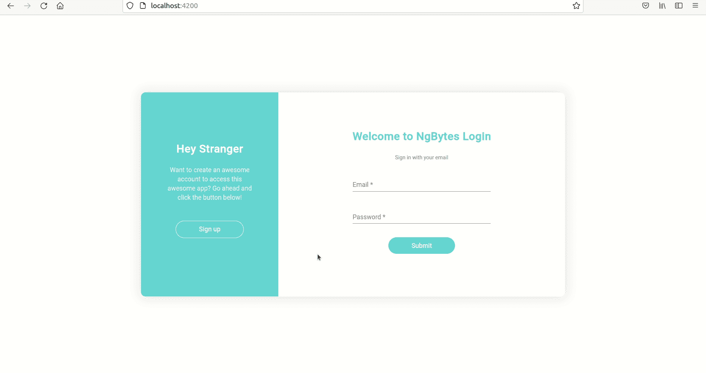

# AngularFire 7 的 Angular 13 Firebase 认证教程

> 原文：<https://betterprogramming.pub/angular-13-firebase-authentication-tutorial-with-angularfire-7-23dc8cee42c4>

## 使用 Angular 和 Firebase 实现社交和传统登录策略


圭多·詹森在 [Unsplash](https://unsplash.com?utm_source=medium&utm_medium=referral) 上的照片

# 介绍

身份验证是保护我们的应用免受未注册用户攻击的关键。在本教程中，您将学习如何在 Firebase 中实现传统的电子邮件/密码登录和谷歌社交登录，使用新的可摇树 [AngularFire](https://github.com/angular/angularfire) v.7.0 模块化 SDK，这允许我们充分利用新的可摇树 Firebase JS SDK (v9) 。

您还将学习如何使用 AngularFire Auth Guard 保护路由，以及如何根据用户是否经过身份验证将他们重定向到特定页面。

> 请注意，在撰写本教程时，Angular fire v.7.0 API [仍在开发中，功能还不完整](https://github.com/angular/angularfire/blob/master/docs/version-7-upgrade.md)；这些文档还没有更新到最新版本。AngularFire 提供了一个兼容层，允许您使用最新版本的库，同时完全支持 AngularFire v6.0 API。也就是说，如果你和我一样好奇，并且喜欢尝试你所有库的最新版本，那就继续享受这篇教程吧。

这是我们今天将构建的应用程序的预览:



身份验证应用程序预览

你可以在这里找到完整的代码。

## 索引

*   建立一个 firebase 项目。
*   使用 AngularFire 设置角度投影。
*   构建应用程序。
*   创建仪表板。
*   创建身份验证模块。
*   正在添加 Google 登录。
*   保护路线。

# 设置 Firebase 项目

要创建一个新的 Firebase 项目，我们需要登录到 [Firebase 控制台。](https://console.firebase.google.com/)完成后，我们可以点击 Add Project 创建一个新项目:


Firebase —创建新项目

我们需要为我们的项目选择一个名称:


Firebase —选择名称

决定我们是否希望谷歌分析在我们的项目中(你的选择，我会选择否):


firebase——支持谷歌分析

我们完了！我们现在有一个可爱的新的 Firebase 项目。

## 将 Firebase 添加到 Web 应用程序

现在我们需要将 Firebase 添加到我们的 Angular 应用程序中。为此，我们需要在控制面板中点击 Web app 按钮:


Firebase —添加 web 应用程序

然后我们需要选择一个名称:


最后，我们现在有了稍后将用于向我们的 Angular 应用程序添加 Firebase 的配置:


## 添加身份验证

是时候添加身份验证并选择我们想要实现的登录方法了。在本教程中，我们将添加一个 Google 社交登录和一个传统的电子邮件/密码登录。转到身份验证页面，选择提供商:



Firebase —选择登录方法

一旦我们启用了这两种登录方法，我们的身份验证控制面板应该如下所示:


启用 Firebase 的登录方法

仅此而已！我们现在已经完全设置好了 Firebase 应用程序，并准备就绪。是时候开始使用我们的 Angular 应用程序了。

# 设置角度项目

我们要做的第一件事是用 Angular CLI 创建一个新项目。

*提示:如果您还没有安装 Angular CLI，您可以通过运行以下命令来安装:*

```
npm i -g @angular/cli
```

要创建新的角度项目，我们可以运行以下命令:

```
ng new ngbytes-fireauth
```

*注意:当被问及是否要在新应用中添加路线时，不要忘记回答是！*

一旦 CLI 发挥了它的魔力，我们就可以用我们最喜欢的 IDE 打开新创建的项目(我建议使用 [VSCode](https://code.visualstudio.com/) ，这是我通常使用的一个)。

## 添加火基和角火

让我们将 Firebase 和 Angularfire 添加到我们的项目中。为此，我们将使用 AngularFire 原理图，它将负责为我们设置一切。让我们运行以下命令:

```
ng add @angular/fire
```

我们会被问一系列问题，比如我们想要设置哪些 Firebase 特性。对于本教程，我们只需要添加身份验证，因此我们选择:


然后我们会被问到我们想要使用的 Firebase 帐户，以及我们想要设置哪个项目。选择我们之前创建的项目，然后选择我们之前创建的应用程序。

一旦我们完成了所有这些，您将会看到原理图已经为我们处理了所有的 Firebase 配置。厉害！

## 添加角形材料

我们还会添加有棱角的材料。我们将再次使用原理图:

```
ng add @angular/material
```

## 禁用 strictPropertyInitialization

我们需要将`tsconfig.json`文件中的`strictPropertyInitialization`属性设置为 false。我们这样做是因为从版本 12 开始，所有新的 Angular 应用程序都默认启用严格模式，这意味着如果我们声明任何类属性而没有在构造函数中设置它们(Angular 中的常见做法)，TypeScript 将会抱怨。我们的`tsconfig.json`文件应该是这样的:

tsconfig.json 文件

## 删除角样板

最后，但同样重要的是，我们将删除 Angular 在`app.component.html`中自动生成的样板代码。非常小心，确保在删除样板代码时不要删除`<router-outlet></router-outlet>`标签，否则路由器将无法工作。

删除所有内容后，您的`app.component.html`应该只包含路由器出口标签:



app.component.html 的路由器出口标签

# 创建仪表板

是时候开始构建我们的 Angular app 了。让我们从创建一个`dashboard`模块开始。这是一个模块，它将包含我们想要保护的页面，防止未经授权的用户访问。让我们首先在`src/app`目录中创建一个`features`目录，它将包含我们所有的特性模块:

```
mkdir features
```

在这个新目录中，我们将使用 Angular CLI 创建我们的`dashboard`模块:

```
ng g m dashboard -m app --route dashboard
```

*提示:我们正在使用* `*--route*` *选项，这将在新模块中创建一个组件，并将该组件的路由添加到在* `*-m*` *选项提供的模块中声明的* `[*Routes*](https://angular.io/api/router/Routes)` *数组中。*

您将看到 CLI 已经在`features`目录中创建了一个`dashboard`模块，以及它对应的`dashboard-routing.module.ts`和组件。还修改了`app-routing.module.ts`，增加了一条`dashboard`路线，懒加载了`DashboardModule`。

让我们通过修改`dashboard.component.html`文件向`dashboard`组件添加一些信息:

仪表板组件模板

您可以随意向该文件添加任何内容。

*提示:不要忘记将* `*MatToolbarModule*` *导入到* `*DashboardModule*` *中，如果你也决定使用它的话。*

让我们添加一点 CSS，使仪表板看起来很漂亮:

仪表板组件 CSS

瞧，我们的`dashboard`模块准备好了！要查看它，我们可以导航到`[http://localhost:4200/dashboard](http://localhost:4200/dashboard)`:



仪表板预览

是时候开始我们的认证了。

# 创建身份验证模块

在`features`目录中，我们将使用 Angular CLI 创建一个`auth`模块:

```
ng g m auth --routing
```

*提示:我们正在使用* `*--routing*` *标志，它生成一个* `*auth-routing.module.ts*` *以及* `*auth.module.ts*`。

一旦我们创建了我们的模块，我们需要将它对应的路径添加到`app-routing.module.ts`文件中。

将路线添加到 app-routing 模块

请注意，我们添加了一个通配符路由，它重定向到默认路由。我们这样做是为了如果我们试图导航到任何不存在的路由，而不是抛出一个错误，我们将被重定向。

## 创建授权服务

我们与 Firebase 和 AngularFire 的所有互动都将在`AuthService`中进行。为了创建我们的服务，我们将再次使用 Angular CLI。在我们的`app`目录中:

```
mkdir core
cd core
mkdir services
cd services
ng g s auth
```

在我们的`authService`中，我们需要做的第一件事是在构造函数中注入 AngularFire `Auth`实例。然后，我们将创建一个`login`方法，它将接收登录数据(电子邮件和密码)，并使用`signInWithEmailAndPassword` AngularFire 方法登录:

使用非类型化登录方法的 AuthService

但是，我们的`login`功能是不是有点不对劲？我们有一个非常不体面的`any`！因为我们正在使用 TypeScript，并且我们希望所有的东西都被很好地输入，所以让我们创建一个`LoginData`接口来输入我们的登录数据。在我们的`core`目录中:

```
mkdir interfaces
cd interfaces
touch login-data.interface.ts
```

以下是我们的界面外观:

LoginData 接口[https://gist . github . com/nya Garcia/2 EC 63 C5 Fe 25 C1 d 281 fcdb 011722 e 9712](https://gist.github.com/NyaGarcia/2ec63c5fe25c1d281fcdb011722e9712)

现在我们可以使用我们的新接口来正确地键入我们的`login`函数的参数:

具有类型化登录功能的 AuthService

看起来好多了，不是吗？

我们还将创建一个 register 方法，它将使用 AngularFire `createUserWithEmailAndPassword`方法，以便新用户可以在我们的应用程序中注册。我们还将创建一个`logout`方法，正如您可能猜到的，它将允许我们的用户注销我们的应用程序:

向 AuthService 添加注册和注销功能

这就是我们目前在`AuthService`中所要做的一切(我们稍后将添加谷歌社交登录选项)。

现在是创建注册和登录表单的时候了，这样我们的用户就可以通过身份验证了。

## 创建登录页面

在`auth`目录中，我们将创建一个`login-page`组件，它将显示一条欢迎消息、用户可以登录的登录表单，以及稍后的 google 登录按钮:

```
mkdir pages
cd pages
ng g c login-page
```

一旦我们创建了我们的页面，让我们转到`login-page.component.html`文件并添加一个简单的标题:

```
<h1>Welcome to NgBytes Login</h1>
```

由于页面是路由组件，我们需要向指向`LoginPageComponent`的`auth-routing.module.ts`文件添加一个路由，如下所示:

在 AuthRoutingModule 中路由 LoginPageComponent

让我们运行`npm start`脚本，并检查所有东西都被正确路由。如果你打开浏览器进入`localhost:4200`，你应该会看到这个:



登录页面组件预览

厉害！是时候创建一个登录表单了，这样我们的用户就可以登录我们的应用程序了:

## 创建登录表单

现在我们将在我们的`auth`目录中创建一个`login-form`组件:

```
mkdir components
cd components
ng g c login-form
```

*提示:因为我们不会在本教程中编写任何测试，所以可以随意删除* `*login-form.component.spec.ts*` *文件。*

为了创建我们的表单，我们将使用反应式表单模块。我们还将使用棱角分明的材质模块来设计我们的造型。因为这不是本教程的目标，所以我不会详细讨论如何使用反应式表单。

首先，我们将把`ReactiveFormsModule`、`MatInputModule`、`MatFormFieldModule`和`MatButtonModule`模块导入到我们的`AuthModule`中:

将模块导入 AuthModule

然后，我们将在我们的`login-form.component.ts`文件中创建表单:

loginform 组件逻辑

如您所见，我们在表单中添加了基本验证:电子邮件和密码字段都是必填的，电子邮件字段只允许有效的电子邮件地址。

*提示:发现我们使用* `*EventEmitter*` *在提交时发出表单数据很奇怪吗？这是因为我们使用了智能/非智能组件模式，该模式将业务逻辑从纯粹的表示组件中分离出来。*

最后，在我们的`login-form.component.html`文件中:

LoginFormComponent 模板

*注意:看到我们如何在表单无效时禁用提交按钮了吗？这是一个糟糕的实践(可怜的 UX)，我这样做的唯一原因是为了简洁，因为本教程应该专注于 AngularFire，而不是角形的最佳实践。但是，请注意，不要在家里这样做！*

让我们在`login-form.component.css`文件中添加一点 CSS 来使表单更漂亮(如果你愿意，可以跳过这一步):

loginform 组件 CSS

太好了！我们现在有了一个可爱的登录表单。剩下的就是将它添加到`login-page.component.html`模板中:

将登录表单添加到登录页面

我们还需要将之前创建的`authService`注入到我们的`login-page.component.ts`文件中，并创建一个`login`方法，该方法将使用`authService`让用户登录，并在完成后重定向到仪表板。不要忘记捕捉任何可能的错误！

在登录页面组件中创建登录方法

让我们通过浏览浏览器并填写表单来测试一下我们到目前为止所做的工作。如您所见，如果我们试图将电子邮件字段留空，或者输入无效的电子邮件，将会显示一个错误，这意味着我们的验证工作非常出色。但是，如果我们尝试按提交按钮…

我们的控制台出现用户未找到错误。嗯，我们当然是。我们还没有注册任何用户吧？让我们创建一个注册表，这样我们就可以这样做了！

## 创建注册页面

就像我们对登录页面所做的一样，我们将创建一个注册页面，它将包含注册表单。在`auth/pages`目录内:

```
ng g c register-page
```

让我们为注册页面添加一个标题和一些样式:

RegisterPageComponent 模板

RegisterPageComponent CSS[https://gist . github . com/nya Garcia/f6f 3f 5892 f 711 fa 31 fa 4 acac 1c 886968](https://gist.github.com/NyaGarcia/f6f3f5892f711fa31fa4acac1c886968)

最后，但同样重要的是，我们需要向`auth-routing.module.ts`文件添加一个`register`路径:

添加 RegisterPageComponent 路由

既然我们的注册页面已经完成，那么我们需要做的就是创建一个注册表单…或者我们需要做什么？

我们的登录表单有两个字段，一个电子邮件和一个密码字段。我们的注册表需要有两个字段，一个电子邮件和一个密码字段。明白我的意思了吗？我们的两种形式将完全相同！你可能会想，不，它们不一样。一个表单用于登录，另一个用于注册新用户；两种完全不同的逻辑。

然而…

还记得我们如何使用智能/非智能组件模式将登录表单从登录页面中分离出来吗？我们的登录表单根本不负责执行任何逻辑，而是我们的登录页面。这意味着我们可以在注册页面中自由重用登录表单:

将登录表单添加到注册页面

很整洁，不是吗？现在是实现注册新用户的逻辑的时候了。当然，我们会在我们的`register-page.component.ts`文件中这样做:

将寄存器逻辑添加到 RegisterPageComponent

如您所见，我们调用了`authService.register`方法，该方法将在我们的 Firebase 应用程序中注册新用户，然后我们导航到登录页面，以便我们新注册的用户可以登录到我们的应用程序。

让我们给登录页面添加一些最后的润色:一个将新用户重定向到注册页面的按钮，并稍微改变一下布局，使其看起来不错:

改进登录页面

一些 CSS 魔法:

向登录页面添加样式

既然我们已经使登录页面看起来很漂亮，让我们花点时间对注册页面做同样的事情:

改进注册页面

更多 CSS:

向注册页面添加样式

是时候测试我们到目前为止所做的事情了。前往您的浏览器:


注册新用户并登录

厉害！我们正在登录我们的应用！然而，我们仍然缺少一些东西，不是吗？我们需要一个注销选项！让我们将它添加到我们的仪表板中。

## 添加注销选项

让我们前往我们的`dashboard.component.html`，创建一个注销选项:

向仪表板添加注销选项

现在我们有了注销选项，我们需要给我们的`dashboard.component.ts`添加一些逻辑。首先，我们将在构造函数中注入`AuthService`，然后我们将创建一个`logout`方法:

向仪表板组件添加注销方法

如您所见，一旦我们调用了`logout`方法，我们将把用户重定向到默认路线。就是这样！我们已经成功实现了一种让用户从我们的应用中注销的方法。让我们再次测试我们的应用程序:



注销

# 添加 Google 登录

现在，我们的传统登录已经完全实现，是时候添加我们的谷歌社交登录了。为此，我们将首先在`auth.service`中创建必要的方法:

向 AuthService 添加 loginWithGoogle 方法

然后，我们需要在登录页面上添加一个 Google 登录按钮:

添加 Google 登录按钮

最后，我们需要给我们的`login-page.component.ts`添加一个`loginWithGoogle`函数:

向 LoginPageComponent 添加 loginWithGoogle 方法

我们完了！让我们到我们的浏览器那里试一试:


登录 google

# 保护路线

如果你试图导航到仪表板页面`localhost:4200/dashboard`，你会发现你可以这样做，即使你未经认证。为了解决这个问题，我们将使用 AngularFire 提供的 auth guard，自动将未授权用户重定向到登录页面。在我们的`app-routing.module.ts`:

保护路线

正如你所看到的，我们用 AngularFire `AuthGuard`保护了`dashboard`路线，并且我们用 AngularFire `redirectUnauthorizedTo`管道建造了一个`redirectUnauthorizedToLogin`管道，然后提供给`AuthGuard`。这将确保任何试图访问仪表板页面的未经身份验证的用户都将被自动重定向到登录页面。请随意打开您的浏览器，尝试一下。

同样，我们不希望未经授权的用户访问仪表板，如果用户已经过身份验证，他们就不能导航到登录页面。让我们创建另一个自定义管道，它将已经登录的用户重定向到仪表板:

将重定向登录添加到主路由保护

现在，如果我们登录并尝试访问登录页面，我们将被自动重定向到控制面板。

## 可以激活的助手

AngularFire 为我们提供了一个`canActivate`助手，我们可以将它与 spread 操作符一起使用，使我们的路线更具可读性:

使用 canActivate 助手使路线更具可读性

# 结论

那都是乡亲们！恭喜您，您已经使用 Angular 13 和最新的 AngularFire 7 模块化 SDK 成功创建了一个身份验证应用程序。

请记住，新的 API 并不完整，所以如果您决定继续使用它，那么风险自负。此外，请记住，AngularFire 7 提供了一个兼容层，以便您可以继续使用以前的 AngularFire 6 API。

我希望这个教程对你有用。非常感谢您的阅读。