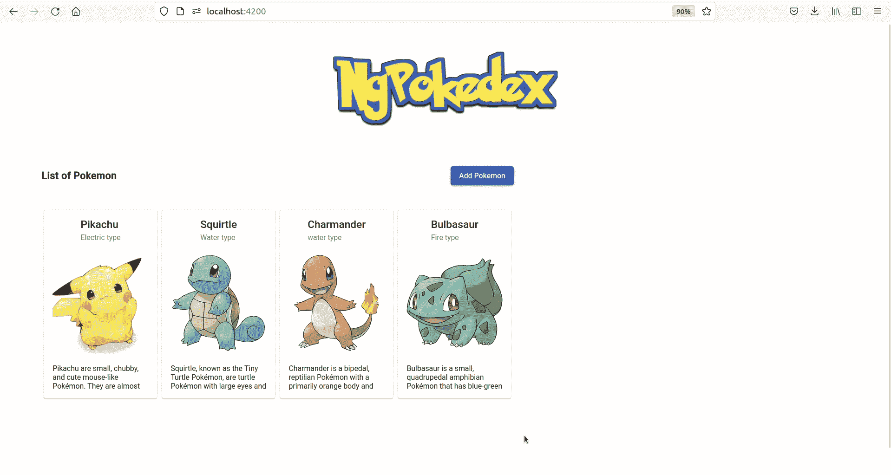
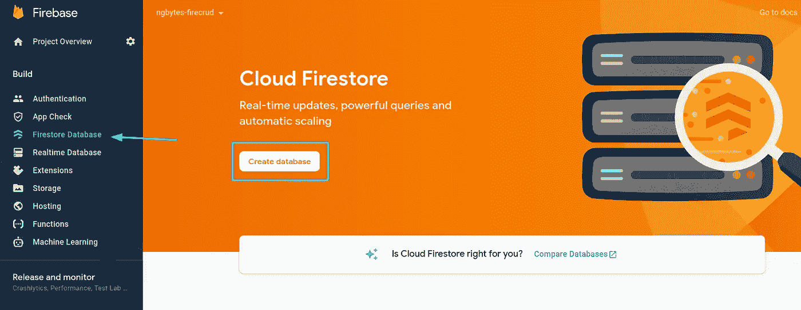
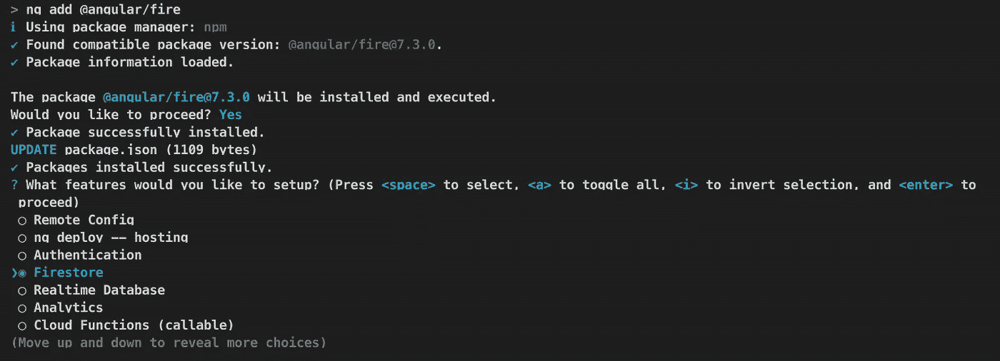
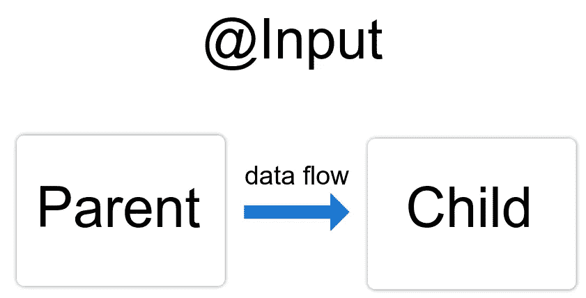
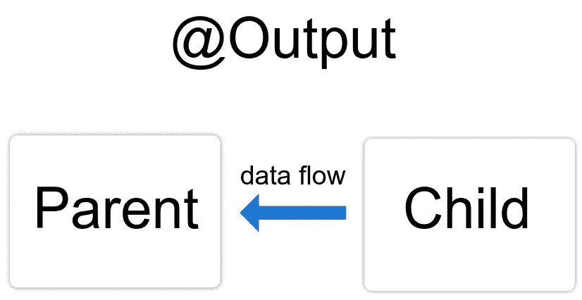
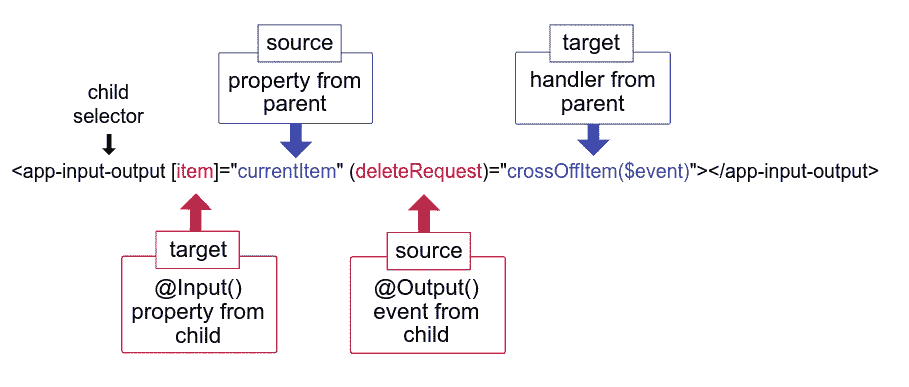

# AngularFire 7 的 Angular 14 Firebase CRUD 教程

> 原文：<https://betterprogramming.pub/angular-13-firebase-crud-tutorial-with-angularfire-7-2d6980dcc091>

## 了解如何使用 Angular 和 Firebase 实现 CRUD Pokedex


Thimo Pedersen 在 [Unsplash](https://unsplash.com?utm_source=medium&utm_medium=referral) 上拍摄的照片

# 介绍

在本教程中，您将学习如何使用 Angular 14、Firebase 的实时 NoSQL 云数据库(Firestore)和新的可摇树 [AngularFire](https://github.com/angular/angularfire) v.7.0 模块化 SDK 创建 Pokedex CRUD 应用程序，这使我们能够充分利用新的可摇树 Firebase JS SDK (v9) 。

> 请注意，在撰写本教程时，Angular fire v.7.0 API [仍在开发中，功能还不完整](https://github.com/angular/angularfire/blob/master/docs/version-7-upgrade.md)；这些文档还没有更新到最新版本。AngularFire 提供了一个兼容层，允许您使用最新版本的库，同时完全支持 AngularFire v6.0 API。也就是说，如果你和我一样好奇，并且喜欢尝试你所有库的最新版本，那就继续享受这篇教程吧。

这是我们今天将构建的应用程序的预览:



应用预览

你可以在这里找到[的完整代码。](https://github.com/puntotech/ngbytes-pokedex)

## 索引

*   建立一个 Firebase 项目。
*   使用 AngularFire 设置角度投影。
*   构建应用程序。
*   创建 Firestore 服务
*   创建口袋妖怪模块

# 设置 Firebase 项目

我们需要做的第一件事是创建一个新的 Firebase 项目，向我们的项目添加一个 web 应用程序，并设置 Firestore。如果您已经完成了，请继续下一部分。

如果你不知道如何做到这一点，我建议你遵循我的[如何创建和配置一个 Firebase 和 Angular 项目教程](/how-to-create-and-configure-a-firebase-and-angular-project-9305c40ee308)，一旦你的 Firebase 项目启动并运行，回来继续阅读。

## 建立 Firestore

*注意:如果您尚未将 Firestore 添加到您的 Firebase 项目中，我们现在将添加它。如果您已经这样做了，请随意跳过这一部分。*

是时候将 Firestore 添加到我们的项目中了！cloud Firestore 是 Firebase 和 Google Cloud 开发的一个用于移动、web 和服务器开发的数据库。像 Firebase 实时数据库一样，它通过实时监听器使您的数据在客户端应用程序之间保持同步。

前往你的 [Firebase 控制台](https://console.firebase.google.com)上的 Firestore 数据库页面，点击创建数据库按钮:



您必须选择是从生产模式还是测试模式开始。对你的选择要非常小心，因为以测试模式开始将允许每个人访问你的数据。仅当您知道自己在做什么时，才选择此选项:


Firebase —选择安全规则

您需要选择的最后一件事是 Firestore 数据的位置。正如警告消息所示，请明智地选择，因为您以后将无法更改此位置。

一旦你选择了地点，点击*启用*按钮，你的 Firestore 就创建好了:


Firebase —选择 Firestore 数据位置

您的 Firestore 数据库页面现在应该包含您新创建的云 Firestore 数据库:


Firebase —新创建的云 Firestore

厉害！我们的 Firebase 应用程序已经完全设置好了。是时候开始使用我们的 Angular 应用程序了。

# 设置角度项目

我们要做的第一件事是用 Angular CLI 创建一个新项目。

*提示:如果您还没有安装 Angular CLI，您可以通过运行以下命令来安装:*

```
npm i -g @angular/cli
```

要创建新的角度项目，我们可以运行以下命令:

```
ng new ngbytes-firepokedex
```

*注意:当被问及是否要在新应用中添加路线时，不要忘记回答是！*

一旦 CLI 发挥了它的魔力，我们就可以用我们最喜欢的 IDE 打开新创建的项目(我建议使用 [VSCode](https://code.visualstudio.com/) ，这是我通常使用的一个)。

## 添加火基和角火

让我们将 Firebase 和 Angularfire 添加到我们的项目中。为此，我们将使用 AngularFire 原理图，它将负责为我们设置一切。让我们运行以下命令:

```
ng add @angular/fire
```

我们会被问一系列问题，比如我们想要设置哪些 Firebase 特性。对于本教程，我们只需要使用 Firestore，所以让我们选择:



然后我们会被问到我们想要使用的 Firebase 帐户，以及我们想要设置哪个项目。选择我们之前创建的项目，然后选择我们之前创建的应用程序。

一旦我们完成了所有这些，您将会看到原理图已经为我们处理了所有的 Firebase 配置。厉害！

## 添加角形材料

我们还会添加有棱角的材料。我们将再次使用原理图:

```
ng add @angular/material
```

## 禁用 strictPropertyInitialization

我们需要将`tsconfig.json`文件中的`strictPropertyInitialization`属性设置为 false。

我们这样做是因为从版本 12 开始，所有新的 Angular 应用程序都默认启用严格模式，这意味着如果我们声明任何类属性而没有在构造函数中设置它们(Angular 中的常见做法)，TypeScript 将会抱怨。我们的`tsconfig.json`文件应该是这样的:

tsconfig.json 文件

## 删除角样板

最后，但同样重要的是，我们将删除 Angular 在`app.component.html`中自动生成的样板代码。非常小心，确保在删除样板代码时不要删除`<router-outlet></router-outlet>`标签，否则路由器将无法工作。

删除所有内容后，您的`app.component.html`应该只包含路由器出口标签:


app.component.html 的路由器出口标签

# 创建 firestore 服务

我们要做的第一件事是创建将与 Firestore 交互的服务，并为我们提供将在 Pokedex 中显示的数据。我们将使用传统的 Angular 模块结构，并用 Angular CLI 创建一个`core`模块来包含我们的服务。在您的终端中:

```
cd src/app
ng g m core
```

一旦我们创建了我们的`core`模块，我们可以用下面的命令在其中创建我们的服务:

```
cd core
ng g s pokedex-firestore
```

在我们的服务内部，我们需要做的第一件事是在构造函数中注入 AngularFire `Firestore`实例，正如其名称所示，我们可以用它来与 Firestore 交互。

我们还将创建一个私有的`pokemonCollection`变量，它将包含对 Firestore Pokemon 集合实例的引用。我们稍后将在查询中使用这个集合。到目前为止，我们的服务应该是这样的:

firestore 服务[https://gist . github . com/nya Garcia/5e7e 372 a9 FFA 8812 E3 c 7471 ef 4a 4375](https://gist.github.com/NyaGarcia/5e7e372aa9ffa8812e3c7471ef4a4375)

现在我们有了基本的 Firestore 配置，我们可以开始 CRUD 功能了。我们总共有 5 种不同的功能:

*   `getAll()`:将返回集合中的所有口袋妖怪。
*   `get(id)`:会返回与 id 匹配的口袋妖怪。
*   `create(pokemon)`:将增加一个新的口袋妖怪到收藏里。
*   `update(pokemon)`:将更新集合中的一个口袋妖怪。
*   `delete(id)`:会删除与 id 匹配的口袋妖怪。

让我们继续在我们的服务中实现这些功能:

实现 CRUD 函数[https://gist . github . com/nya Garcia/025 c 296 fde0b 93826 eff 6b 6060 CFB 13](https://gist.github.com/NyaGarcia/025c296fde0b93826eff6db6060cfb13)

太棒了，我们已经完成了服务！现在是时候创建`pokemon`模块了，它将允许我们的用户与服务进行交互。

# 口袋妖怪模块

这个功能模块将包含所有的口袋妖怪组件。主要的路由组件将是 Pokemon 组件，它将包含与 Firestore 服务交互的所有必要逻辑，并为其他组件提供它们需要的数据。我们总共有三个表示性(纯视觉)组件:

*   Pokemon 表单，我们将重用它来创建和更新 Pokemon。我们将在一个`MatDialog`中打开表单组件。
*   口袋妖怪列表将显示 Firestore 中存储的口袋妖怪列表。
*   口袋妖怪细节将显示选定的口袋妖怪的数据，并将有更新和删除按钮。

为了创建模块，我们将首先在`app`中创建一个`features`目录，然后使用 CLI 自动生成模块:

```
cd src/app
mkdir features
cd features
ng g m pokemon -m app --route pokemon
```

*提示:我们正在使用* `*--route*` *选项，该选项在新模块中创建一个组件，并将该组件的路由添加到在* `*-m*` *选项提供的模块中声明的* `[*Routes*](https://angular.io/api/router/Routes)` *数组中。*

您将看到 CLI 已经在`features`目录中创建了一个`pokemon`模块，以及它对应的`pokemon-routing.module.ts`和组件。它还修改了`app-routing.module.ts`，增加了一条`pokemon`路线，懒加载了`PokemonModule`。

由于我们希望口袋妖怪模块在我们打开应用程序时立即显示(而不是在我们导航到`/pokemon`时显示)，我们需要修改`app-routing.module.ts`文件，并更改路线路径，如下所示:

改变口袋妖怪路线[https://gist . github . com/nya Garcia/ab 68 EB 742d 81 b 28 FD 835631622 a 72147](https://gist.github.com/NyaGarcia/ab68eb742d81b28fd835631622a72147)

全部完成！

## 口袋妖怪界面

在我们继续创建 Pokemon 表单之前，我们将花一点时间来重构我们的`pokedex-firestore.service`。等等，什么？我们刚刚创建了服务，就已经要重构了？

抱歉，伙计们，这是给你们的计算机科学！还记得我们在服务内部创建的口袋妖怪界面吗？我们应该在`pokemon.module`中创建一个`interfaces`目录，并给它一个新家:

```
cd features/pokemon
mkdir interfaces
cd interfaces
touch pokemon.interface.ts
```

让我们将服务中的接口剪切并粘贴到新文件中:

口袋妖怪服务[https://gist . github . com/nya Garcia/0625 BCB 5 c 9 bb 215 aee 7 dfbc 5 CB 02483 e](https://gist.github.com/NyaGarcia/0625bcb5c9bb215aee7dfbc5cb02483e)

厉害！不要忘记在服务中导入接口，就像这样:

在服务中导入口袋妖怪接口[https://gist . github . com/nya Garcia/fa 8223633 FB 69 f 81 de 4 FDA 33 da 24 b 10 a](https://gist.github.com/NyaGarcia/fa8223633fb69f81de4fda33da24b10a)

恭喜你，你已经成功重构了 Firestore 服务！我们现在可以继续前进了。

## 口袋妖怪的形式

为了能够创建和更新口袋妖怪，我们需要创建一个`form`组件。首先，我们将在`pokemon`模块中创建一个`components`文件夹，然后使用 CLI 创建我们的表单:

```
cd features/pokemon 
mkdir components
cd components
ng g c form
```

为了创建我们的表单，我们将使用反应式表单模块。我们还将使用棱角分明的材质模块来设计我们的造型。因为这不是本教程的目标，所以我不会详细讨论如何使用反应式表单。

首先，我们将把`ReactiveFormsModule`、`MatInputModule`、`MatFormFieldModule`、`MatButtonModule`和`MatDialog`模块导入到我们的`PokemonModule`中:

导入模块[https://gist . github . com/nya Garcia/a8b 4769 c 6 fc CBC 1 be 1 ea 2 EB 743905081](https://gist.github.com/NyaGarcia/a8b4769c6fccbc1be1ea2eb743905081)

然后，我们将在我们的`form.component.ts`文件中创建表单:

创建口袋妖怪表单[https://gist . github . com/nya Garcia/da 0 ed 888 f 32 cf 2e 58 b 2950247 FB 51 ba 4](https://gist.github.com/NyaGarcia/da0ed888f32cf2e58b2950247fb51ba4)

如您所见，我们为表单添加了基本验证，使所有表单字段都成为必填字段。如果您打算在生产中使用这段代码，您可能需要添加进一步的验证，并且，除了其他事情之外，限制所有输入字段的长度。

我们还注入了一个`MatDialogRef`，可以用来关闭包含表单的对话框。关闭时，我们可以提供一个可选的结果值，然后我们可以在最初打开对话框的组件中访问该值。

`@Inject(MAT_DIALOG_DATA)`注入令牌允许我们访问传递给对话框组件的数据。我们为什么需要这个？因为我们将重用我们的表单，既用于创建新的口袋妖怪，也用于更新现有的口袋妖怪。如果我们想创建一个新的口袋妖怪，我们不会向对话框传递任何数据。然而，如果我们想要更新一个现有的口袋妖怪，我们将传递一个口袋妖怪到对话框，并且表单字段将用口袋妖怪的值初始化。

最后，让我们仔细看看`submit`函数，更具体地说，看看`dialogRef.close()`中的返回值:

```
{...this.pokemon, ...this.form.value}
```

不知道这行代码是怎么回事？放心吧！我们会一起经历的。我们基本上是将`pokemon`和`form.value`对象合并成一个对象，通过使用扩展操作符(不熟悉？阅读本指南，成为专家！)。我们这样做是因为我们想在创建和更新 Pokemon 时重用这个表单。如果我们使用这个表单来创建一个口袋妖怪，`pokemon`对象将是未定义的，它不会影响结果。然而，如果我们使用表单来更新一个口袋妖怪，`pokemon`对象将包含`id`属性，这在`form.value`对象中是不存在的，它将被添加到结果中。

让我们在`form.component.html`文件中实现模板:

口袋妖怪表单模板[https://gist . github . com/nya Garcia/CDB 5 D1 C20 c 320 e 131 ba 600d 4c CB 22856](https://gist.github.com/NyaGarcia/cdb5d1c20c320e131ba600d4ccb22856)

最后但同样重要的是，一点 CSS:

表单样式[https://gist . github . com/nya Garcia/3d 685 b 7073340 f 231 a 57d 3039 c 4271 A8](https://gist.github.com/NyaGarcia/3d685b7073340f231a57d3039c4271a8)

## 口袋妖怪名单

该组件将显示集合中所有口袋妖怪的列表。让我们用 Angular CLI 创建我们的`list`组件(在`components`目录中，别忘了！):

```
ng g c list
```

为了设计我们的列表，我们将使用`MatCard`组件。因此，我们需要将`MatCardModule`导入到我们的`pokemon.module.ts`文件中:

导入 MatCardModule[https://gist . github . com/nya Garcia/B0 b5 b 6 db 81d 3 fc 3 e 834 e 10 b 87 c 7d 69 e 9](https://gist.github.com/NyaGarcia/b0b5b6db81d3fc3e834e10b87c7d69e9)

现在我们可以开始列表组件了。

## 列表逻辑

还记得我们 firestore 服务中的`getAll`方法吗？它返回一个`Observable<Pokemon[]>`，一个口袋妖怪数组的可观测值，其中包含了我们 Firestore 收藏中存储的所有口袋妖怪。我们的列表组件将接收这个可观察对象，并使用它来显示所有的口袋妖怪。在我们的`list.component.ts`:

正在接收口袋妖怪$ Observable[https://gist . github . com/nya Garcia/643312 e 34 a9 de 8 CBA 4 b 7510 b 02558 a 28](https://gist.github.com/NyaGarcia/643312e34a9de8cba4b7510b02558a28)

如果你不熟悉`Input()`和`Output()`装饰器，我会简单解释一下。如果你已经知道它们是如何工作的，可以跳过下面的解释:

*   `Input()`装饰器意味着`pokemon$`属性将从父组件接收它的值。在教程的后面，当我们创建 Pokemon 组件(它是父组件)时，我们将解释如何将值从父组件发送到子组件，所以现在不要担心这一部分。



输入流程图

*   `Output()`装饰器允许我们向父组件发送数据。它将属性标记为某种入口，通过它我们可以将数据发送给父对象。`Ouput()`属性**总是**需要类型`EventEmitter`。在这种情况下，每当我们从列表中选择一个口袋妖怪时，我们就用它来通知父组件。稍后，当我们创建 Pokemon 组件时，我们将解释如何在父组件中接收数据。



输出流程图

你可以在[官方角度文档中阅读更多关于输入和输出的信息。](https://angular.io/guide/inputs-outputs)

## 列表模板

然后，在我们的`list.component.html`组件中，我们将使用`ngFor`和`async`管道遍历`pokemon$`可观察对象。

*注意:* `*async*` *管道自动订阅和取消订阅可观测量，允许我们使用* `*ngFor*` *轻松地遍历它们。*

我们将使用`mat-card`组件来显示我们的口袋妖怪数据，并使它看起来很漂亮:

列表组件模板[https://gist . github . com/nya Garcia/1178 db 3 ff 0 af 5 EC 507 c 34 D5 e 515 B1 a5d](https://gist.github.com/NyaGarcia/1178db3ff0af5ec507c34d5e515b1a5d)

一些 CSS:

列表样式[https://gist . github . com/nya Garcia/50a 344 a4 eab 10450 ECB 6 FDC 9 bccb 7718](https://gist.github.com/NyaGarcia/50a344a4eab10450ecb6fdc9bccb7718)

厉害！我们的`list`组件准备好了。

## 口袋妖怪的细节

我们还需要一个细节组件，它将显示我们选择的口袋妖怪的信息。该组件还将有删除和更新按钮。让我们在我们的`components`目录中创建它:

```
ng g c detail
```

该组件将通过`@Input`从`pokemon`组件接收选定的口袋妖怪。然后，在模板中，我们将显示那个口袋妖怪的数据。在我们的`detail.component.html`:

详细模板[https://gist . github . com/nya Garcia/db 904237991 ef 4348 c 92d 072 f 41 fc 47d](https://gist.github.com/NyaGarcia/db904237991ef4348c92d072f41fc47d)

如您所见，我们添加了更新和删除按钮。点击更新按钮将调用`update`函数，点击删除按钮将调用`delete`函数。这些函数将使`updatePokemon`和`deletePokemon`事件发射器发出一个值，让父组件知道我们点击了哪个按钮。然后，家长可以相应地采取行动。下面是我们的组件实现:

细节组件逻辑[https://gist . github . com/nya Garcia/f 7 e 46 f 4150 f 40 fc 5 f1 ed 3309d 020097d](https://gist.github.com/NyaGarcia/f7e46f4150f40fc5f1ed3309d020097d)

注意我们是如何在两个事件发射器中发送`void`值的？这是因为我们不需要向父组件发送任何实际数据，我们只想知道用户何时单击子组件中的更新或删除按钮，并做出相应的反应。

让我们添加一些样式:

细节造型[https://gist . github . com/nya Garcia/a 51ee 9 b 35 BF 50 aa 4 f 255d 24 e 12d 3 a 2](https://gist.github.com/NyaGarcia/a51ee9b2b35bf50aa4f255d24e12d3a2)

仅此而已！我们的零件准备好了。这是我们的最后一个表示组件，所以我们现在准备开始我们的智能，充满逻辑的组件:口袋妖怪组件。

## **口袋妖怪组件**

该组件将包含与 Firestore 服务通信的所有必要逻辑，并为其他表示组件(表单、列表和细节)提供它们需要显示的数据。它作为一种控制器，指导我们的应用程序的数据流。让我们看一下我们的`pokemon.component.ts`文件，然后开始吧。

我们需要做的第一件事是在构造函数中注入`PokemonFirestoreService`，以及表单的`MatDialog`。我们还将创建两个类变量:

*   一个`allPokemon$`变量，我们将通过调用`pokemonService.getAll()`函数在`ngOnInit`中初始化它。
*   一个`selectedPokemon`变量，将包含选中的口袋妖怪。

创建类变量和添加依赖关系[https://gist . github . com/nya Garcia/96dc 6554 ba 14697982d 9 ecbfcda 5 a 601](https://gist.github.com/NyaGarcia/96dc6554ba14697982d9ecbfcda5a601)

厉害！我们继续。我们的口袋妖怪组件将包含以下方法:

*   `addPokemon`:该方法将打开表单对话框，对话框关闭后，将过滤掉 falsy 值的流，然后调用`pokemonService.create`函数，用表单数据创建一个新的 Pokemon。
*   `updatePokemon`:该方法与`addPokemon`类似。它还打开表单对话框，将`selectedPokemon`作为数据传递，这样我们可以更新它的值。一旦对话框关闭，它也会过滤流，然后调用`pokemonService.update`函数来更新口袋妖怪。最后，它用新的口袋妖怪数据更新`selectedPokemon`。
*   `selectPokemon`:该方法接收一个`Pokemon`，并相应地更新`selectedPokemon`类变量。
*   `deletePokemon:`这个方法用`selectedPokemon.id`调用`pokemonService.delete`函数。它还将`selectedPokemon`设置为`undefined`。

下面是这些方法的实现:

实现逻辑[https://gist . github . com/nya Garcia/b 69 CD 88602 F3 c 348 DDC 340 D8 e 9060 BCA](https://gist.github.com/NyaGarcia/b69cd88602f3c348ddc340d8e9060bca)

我们需要做的最后一件事是配置模板:

口袋妖怪组件模板[https://gist . github . com/nya Garcia/30249 fdad 5 BD 84 E0 a4 c 381 e 89 a 727 ed 0](https://gist.github.com/NyaGarcia/30249fdad5bd84e0a4c381e89a727ed0)

如果您不熟悉绑定语法，我将简单解释一下。让我们来看看`app-list`:

*   `[pokemon$]="pokemon$"`:这叫做属性绑定。还记得我们在`app-list`组件中使用`Input()`装饰器来创建`pokemon$`变量，该变量将从父组件接收其值吗？通过这个属性绑定，我们将子节点的`pokemon$`变量绑定到父节点的`allPokemon$`变量。您可以将此视为将`allPokemon$`变量“发送”给孩子。
*   `(pokemonEmitter)="selectPokemon($event)"`:这叫做事件绑定。它将我们使用`app-list`组件(子组件)中的`Output()`装饰器创建的`pokemonEmitter`事件与我们在该组件(父组件)中实现的`selectPokemon`函数连接起来。当子组件中的`PokemonEmitter`发出一个值时，父组件在`$event`中接收它并将其传递给`selectPokemon`函数。

下图解释了`input`和`output`语法的工作原理:



角度文档中的输入/输出示例图

你可以在[官方角度文档中了解更多信息。](https://angular.io/guide/inputs-outputs)

最后，让我们添加一点 CSS 来使它看起来更容易:

向口袋妖怪组件添加样式[https://gist . github . com/nya Garcia/4a 190 ea C2 f 6 dcb 6 ABC 45d 855070 e 2938](https://gist.github.com/NyaGarcia/4a190eac2f6dcb6abc45d855070e2938)

我们完了！让我们继续测试，看看一切是否正常。如果您还没有在终端上运行`npm start`,请在浏览器上运行:


测试应用程序

# 重构:处理订阅

使用 Observables 的一个危险是内存泄漏。这是为什么呢？因为，一旦我们订阅了一个可观察对象，它就会无限期地发出值，直到满足以下两个条件之一:

1.  我们手动取消订阅可观察的。
2.  它完成了。

正如你可能想象的那样，这会给我们带来问题，这就是为什么总是确保订阅得到正确处理是很重要的。

当使用 Angular 时，`async`管道为我们处理订阅，但是，由于我们只能在组件模板中使用它，每当我们必须订阅组件类中的可观察对象时(就像我们在`pokemon.component.ts`中所做的那样)，我们将不得不自己处理订阅。怎么会？

嗯，我们可以使用一个 Subject 和`takeUntil()`操作符，在组件被销毁时强制我们的可观察对象完成。我们来实施吧。

首先，我们将在`pokemon.component.ts`文件中创建一个`destroyed$`主题:

```
destroyed$ = new Subject<void>();
```

然后，我们将使用组件被破坏时触发的`ngOnDestroy`钩子，让我们的主题发出:

使销毁的 subject 发出[https://gist . github . com/nya Garcia/77 DC 5c 92858 CB 830 B1 D2 BC 634813 BC a9](https://gist.github.com/NyaGarcia/77dc5c92858cb830b1d2bc634813bca9)

最后，同样重要的是，当`destroyed$`主题发出一个值时，我们将使用前面提到的`takeUntil`操作符来完成我们的 Observables:

使用 take until[https://gist . github . com/nya Garcia/1e 843737 e 543 CBA 44d 42135 f 628 df 493](https://gist.github.com/NyaGarcia/1e843737e543cba44d42135f628df493)

经过所有的更改后，我们的`pokemon.component.ts`文件将如下所示:

办理订阅[https://gist . github . com/nya Garcia/25 aae 4 e 57 CB 15721 de 334 F2 c 33822 f 23](https://gist.github.com/NyaGarcia/25aae4e57cb15721de334f2c33822f23)

# 结论

那都是乡亲们！希望您已经学会了如何使用 Angular 14 和最新的 AngularFire 7 模块化 SDK 创建 CRUD 应用程序。

请记住，新的 API 并不完整，所以如果您决定继续使用它，那么风险自负。此外，请记住，AngularFire 7 提供了一个兼容层，以便您可以继续使用以前的 AngularFire 6 API。

我希望你喜欢这个教程，并发现它很有用。感谢您的阅读！