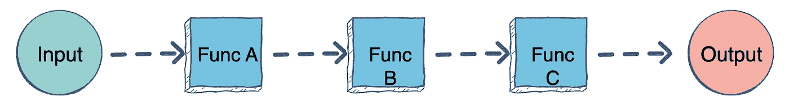
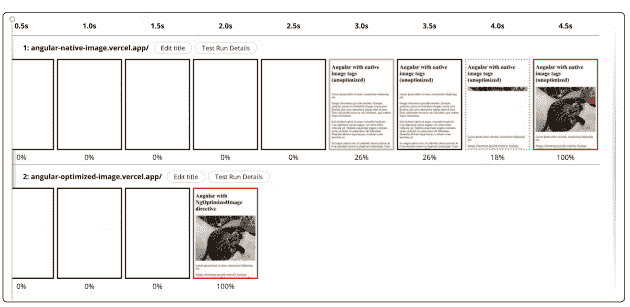
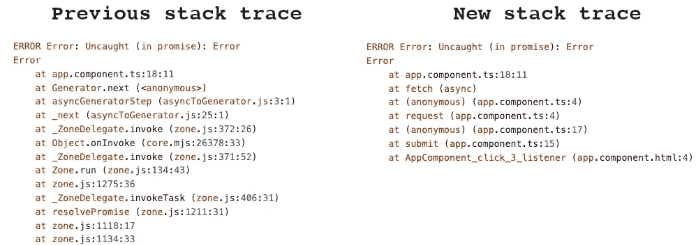
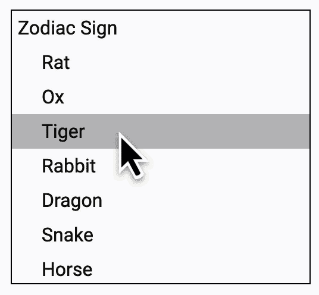
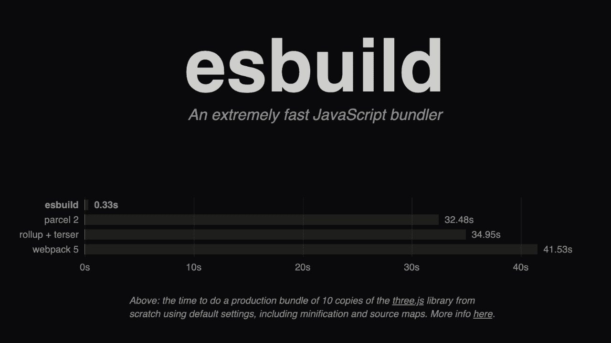

# Angular 15:有什么变化和新变化

> 原文：<https://betterprogramming.pub/angular-15-193cb008e8f3>

## [网络开发](https://rakiabensassi.medium.com/list/software-engineering-7a179a23ebfd)

## 指令组合 API、稳定的独立 API、更少的样板代码、更好的性能等等


[丹尼尔·阿克谢诺夫](https://unsplash.com/@nebe3etogo?utm_source=medium&utm_medium=referral)在 [Unsplash](https://unsplash.com/?utm_source=medium&utm_medium=referral) 上的原始照片(作者编辑)

2022 年 11 月 16 日，谷歌发布了其 Angular 框架的第十五个主要版本。

就像社区的许多成员一样，我对它给生态系统带来的巨大改善感到非常兴奋。

在这篇文章中，我将深入挖掘新功能和几十项改进，并分解它们对 Angular landscape 的意义，以及它们如何改善[开发者体验](/how-to-improve-developer-experience-2d5908d7bbb0)和 [web 性能](https://medium.com/better-programming/javascript-memory-leaks-390957523a9e)。

但是在我们开始之前，我将解释一些伴随的术语。

```
Table of Contents

Lingo
   ∘ Function composition
   ∘ HMR
   ∘ @keyframes
   ∘ Lazy loading
   ∘ Stack trace
   ∘ Tree shaking

New Features

   1\. Directive Composition API
   2\. Stable Standalone APIs
   3\. Tree-shakable Router API
   4\. HTTP with provideHttpClient
   5\. Functional Router Guard
   6\. Dynamic Router Outlet Names
   7\. Easy Lazy Loading
   8\. Stable Image Directive
   9\. Better stack traces
   10\. Mistyped banana in the Box
   11\. Component-Scoped keyframes
   12\. Compatibility for MDC Components
   13\. CDK Listbox

Additional Improvements

   ∘ Ivy Landmark / Better Performance
   ∘ Angular DevTools
   ∘ Angular CLI
   ∘ More utility in forms package
   ∘ Deprecated Protractor
   ∘ Improvements in the esbuild support

Final Thought
```

# 术语

## 功能组成

当我们将一个函数的结果传递给下一个函数，然后将这个函数的结果传递给另一个函数，直到我们从最终执行的函数中获得最终结果，我们在 JavaScript 函数合成中调用这个过程。

```
// Instead of passing the result of one function to another this way:

func1(func2(func3(15)))

// You can define a compose function (if you're not using a library like lodash or ramda)

const compose = (…fns) => x => fns.reduceRight((y, f) => f(y), x)

compose(func1, func2, func3)(15)
```



JavaScript 中的函数组合([源](https://www.educative.io/answers/function-composition-in-javascript)

## HMR

当应用程序在浏览器上运行时，我们可以添加、删除或交换模块，而无需完全重新加载。我们称这个过程为热模块更换(HMR)。

*   它节省了宝贵的开发时间，因为当源代码发生变化时，它只更新应用程序中发生变化的内容。
*   与完全重新加载不同，HMR 保持应用程序状态，可以显著加快开发速度。

## @关键帧

CSS 中的`@keyframes` [at-rule](https://developer.mozilla.org/en-US/docs/Web/CSS/At-rule) 指定了动画从一组风格逐渐变化到另一组风格的中间步骤。

我们使用关键字“从”和“到”或 0%和 100%来确定这种变化。这里有一个例子:

[来源](https://developer.mozilla.org/en-US/docs/Web/CSS/@keyframes)


CSS @keyframes 规则([来源](https://www.w3schools.com/cssref/css3_pr_animation-keyframes.php))

## 惰性装载

为了提高性能和系统资源的利用率，我们延迟了模块和对象的初始化或加载，直到应用程序需要它们。我们称这种设计模式为延迟加载。

## 堆栈跟踪

堆栈和堆是程序运行时动态分配内存的两个地方。

堆栈跟踪是程序执行过程中某个时间点的执行堆栈的报告。

开发人员通常在交互式或事后调试会话中使用堆栈跟踪。

## 树摇晃

JavaScript 中的摇树就是剔除死代码的过程。结果将是最小的束尺寸。

通过检查`import`和`export`语句，像 [webpack](https://webpack.js.org/guides/tree-shaking/) 和 [Rollup](https://rollupjs.org/guide/en/) 这样的模块捆绑器会自动删除应用程序不使用的代码。

# 新功能

# 1.指令合成 API

Directive Composition 是 GitHub 上的[特性请求，在 Angular 15 中实现之前已经需求了六年。](https://github.com/angular/angular/issues/8785)

谷歌开发者关系主管兼 Angular 团队的工程师 Minko Gechev 将其描述为一种编写 UI 逻辑的新方法，因为它允许代码重用，而不是传统的继承。

类似于 JavaScript 中的[函数组合，指令组合支持通过利用`hostDirectives`属性将组件和其他指令中的单个指令组合成一个更复杂的指令:](#59aa)

在上面的例子中，我们使用了`HasColor`指令和来自`CdkMenu`的指定输入和输出。

请记住，只有独立的指令才能用于合成。

# 2.稳定的独立 API

独立组件和 API 是 Angular 14 中引入的一个显著特性。没有`NgModule`，它们使应用构建变得更加容易。有了这个新版本，API 变得稳定，不再处于开发者预览状态。

# 3.树摇动路由器 API

在 Angular 14.2 中添加了`provideRouter()`功能的[路由器独立 API](https://kevinkreuzer.medium.com/angular-router-standalone-apis-461547e92bbc) 现在也有了稳定的状态。

```
const appRoutes: Routes = [];
bootstrapApplication(AppComponent,
  {
    providers: [
      provideRouter(appRoutes,
        withDebugTracing(),
        withRouterConfig({paramsInheritanceStrategy: 'always'}))
    ]
  }
);
```

路由器独立 API 允许树抖动，从而消除了多余的代码。当捆绑器在构建过程中删除不需要的代码时，我们得到了大约 11%的精简路由器实现。

# 4.HTTP with provideHttpClient

就像在路由器 API 中使用`provideRouter()`函数一样，在 Angular 15 的新世界中，我们可以使用`provideHttpClient()`在一个模块可选的 app 中提供`HttpClient`。

同样的逻辑也适用于 HTTP 拦截器。我们可以使用`withInterceptors()`将它们定义为函数:

```
bootstrapApplication(AppComponent, {
  providers: [provideHttpClient(withInterceptors([authInterceptor()]))]
});
```

或者通过使用`withInterceptorsFromDi()`注册一个基于类的拦截器:

```
bootstrapApplication(AppComponent, {
  providers: [provideHttpClient(withInterceptorsFromDi([AuthInterceptor]))]
});
```

# 5.功能路由器防护

除了树抖动路由器 API，Angular 15 还带来了其他创新，以减少样板代码。新的功能性路由器保护提供了一种更简洁的方法来直接在声明中实现保护，正如我们在下面的示例中看到的:

对于传统方法，我们实现一个`AuthGuard`并在其中注入一个`AuthService`来检查用户是否通过了`canActivate()`方法的认证:

```
// The traditional approach: Implement AuthGuard and inject AuthService in it
@Injectable({ providedIn: 'root' })
export class AuthGuard implements CanActivate {
  constructor(private authService: AuthService) {}

  canActivate() {
    return this.authService.isAuthenticated();
  }
}

const route = {
  path: 'dashboard',
  canActivate: [AuthGuard]
};
```

有了功能性的路由器防护，我们可以去掉所有的样板代码，在我们的路由声明中注入`AuthService`并调用它的`isAuthenticated()`方法:

```
const route = {
  path: 'dashboard',
  canActivate: [() => inject(AuthService).isAuthenticated()]
};
```

# 6.动态路由器出口名称

我们现在可以在 Angular 15 中动态设置路由器出口名称。

比如我们可以从 For 循环中把它绑定到一个变量上，这在以前是不可能的。这是一个游戏改变者，它允许我们编写健壮的弹性组件。所以你要在一个循环中这样写:

Angular 15:动态路由器出口名称

您可以将插座作为输入参数传递。

# 7.轻松延迟加载

以前，当您在路由模块中延迟加载组件或其子组件时，您必须遵循延迟加载语法来选择要加载的内容，这有点复杂。

我个人从来没有背过。每次我需要使用它时，我都会从另一个模块或项目中复制/粘贴它，并对其进行调整:

Angular 14:惰性加载语法

以角度导出模块

Angular 15 中的新语法叫做 [router unwraps 默认导入](https://github.com/angular/angular/pull/47586) s，这要简单得多。如果你像我一样，喜欢编写较少的样板代码，你会喜欢它的。

您所需要做的就是使用`export default`来指定默认情况下应该加载什么组件。然后就可以去掉`.then(..)`操作了:

Angular 15:惰性加载语法

使用“导出默认值”以角度方式导出模块

# 8.稳定图像指令

在 Angular 14.2 中添加到框架中的图像指令`[NgOptimizedImage](https://angular.io/guide/image-directive)`，现在在当前版本中是稳定的。它优化了网页性能和[核心网页重要指标](https://medium.com/p/b56e28798e7f)得分，例如 [Land's End](https://www.landsend.com/) 在使用该指令后，其[最大内容油漆(LCP)](http://web.dev/lcp) 提高了 75%。



演示应用前后([来源](https://medium.com/angular-blog/angular-v15-is-now-available-df7be7f2f4c8))

Angular 15 还提供以下功能:

*   图像警告的改进
*   由于自动生成了`srcset`指令，缩短了下载时间
*   实验性填充模式:当没有指定尺寸时，它让图像填充其父容器

# 9.更好的堆栈跟踪

有了与 Chrome DevTools 团队合作开发的新的异步堆栈标记 API，我们现在在堆栈跟踪中不再有`zone.js`废话，有了更好的调试体验。



角度为 15°的堆栈跟踪的改进

# 10.盒子里打错了的香蕉

“盒子里的香蕉”是一个描述角度模板中两种绑定方式的语法的术语。你可能在使用`ngModel`时见过多次:

带 ngModel 的角形材料下拉列表

有时开发人员通过将括号放在方框`([])`之外来写括号(香蕉)和方括号(方框)的顺序不正确，这导致了很多错误。

新 Angular 版本中的修复将报告此类问题，并通过[语言服务](https://angular.io/guide/language-service)提供修复。根据您的 IDE，您可能需要也可能不需要在您的项目上安装`@angular/language-service`并将其添加到您的`package.json`中。例如，WebStorm 从 2019.1 版开始不再需要它:

```
npm install --save-dev @angular/language-service
```

# 11.组件范围的关键帧

很长一段时间，Angular 中的 CSS 关键帧都有问题。

尽管框架提供了一个`Emulated` `viewEncapsulation`来防止样式表的命名冲突，CSS `@keyframes`动画并没有锁定到组件的属性选择器。它们仍然在全球范围内可用，因此，[它们会泄漏或与其他同名的关键帧](https://github.com/angular/angular/issues/33885)重叠。下面是本·纳德尔为这种情况做的演示:

在 Angular 15 中，如果在应用程序的多个位置有相同的关键帧名称，它们将不会在组件定义和渲染中发生冲突，因为它们现在是组件范围的。

Angular 团队通过用主机组件选择器假装关键帧名称来解决这个已经运行了多年的问题。

如果您依赖于关键帧的全局方面，此更改可能会破坏您的代码。在这种情况下，需要将它们移到全局样式表中。

# 12.MDC 组件的兼容性

为了更好地符合材料设计规范并采用材料 3 组件样式，Angular 团队基于[Web 材料设计组件(MDC)](https://github.com/material-components/material-components-web) 重构了 Angular 材料组件。

您可能会注意到这些组件的样式和 DOM 结构有所更新，有些是从头开始重写的。因此，当[迁移到 Angular 15](https://github.com/angular/components/blob/main/guides/v15-mdc-migration.md#how-to-migrate) 时，您可能需要调整您的项目。

# 13.CDK 列表框

在 Angular 15 中，组件开发工具包(CDK)包附带了一个基于 WAI ARIA 列表框模式的`@angular/cdk/listbox`模块:



CDK 列表框用户体验([来源](https://medium.com/angular-blog/angular-v15-is-now-available-df7be7f2f4c8))

这个新的 CDK 模块有助于创建定制的列表框交互，这要归功于它提供的指令。它提供了[可访问性(A11y)](https://medium.com/better-programming/angular-keyboard-listeners-good-practices-b208edc6bf89) 特性，比如 bidi 布局支持、键盘交互和焦点管理。

# 其他改进

对于角度 15，我们还有以下变化:

*   常青藤地标/更好的性能:Angular 的最新版本提供了一个舒适的构建，重建 HMR 更容易实现。
*   更好的堆栈跟踪:
*   Angular DevTools 现在提供了依赖注入调试的预览。
*   Angular CLI:当你用`ng new myAppName`创建一个新的 Angular 工作空间时，你会得到一个简化的输出和更少的生成文件。
*   表单包有更多的实用功能。
*   弃用量角器:基于社区反馈，Angular 团队宣布 e2e 测试框架[量角器](https://www.protractortest.org/#/)弃用，它将在 2023 年夏天停止使用。可供选择的端到端测试解决方案包括 [Cypress](https://www.cypress.io/) 、 [Nightwatch](https://nightwatchjs.org/) 和 [WebdriverIO](https://webdriver.io/) 。
*   新版本改进了 Angular 14 中引入的实验性 esbuild 支持。要尝试 esbuild，您需要在`angular.json`中更新您的构建器，如下所示:

```
"builder": "@angular-devkit/build-angular:browser-esbuild"
```



esbuild 登录页面([来源](https://blog.angular.io/angular-v15-is-now-available-df7be7f2f4c8))

# 最终想法

与 React 等轻量级库相比，Angular 存在性能问题。但在移除了遗留的编译器和渲染引擎并用 Ivy 替换后，Angular 团队和社区贡献者实现了新的改进，这将使 Angular 超快。

正如你所看到的，在框架版本 15 中有很多变化。如果你还没有涉足其中，我希望你能从这篇文章中获得一些见解，并更愿意在你的项目中使用它。

更多详情可以查看 GitHub 上的[Angular 博客](https://medium.com/angular-blog/angular-v15-is-now-available-df7be7f2f4c8)或者 Angular 15 [Changelog](https://github.com/angular/angular/blob/main/CHANGELOG.md) 。

下面这篇文章可以帮助您完成迁移过程:[升级到 Angular 15:我们的经验和教训](https://medium.com/gitconnected/angular-upgrade-26d331837012)。

```
**Want more?**

I write about engineering, technology, and leadership 
for a community of smart, curious people.

Join [my free email newsletter](https://rakiabensassi.substack.com/) for exclusive access.
```