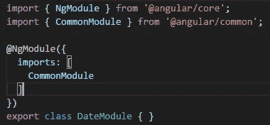
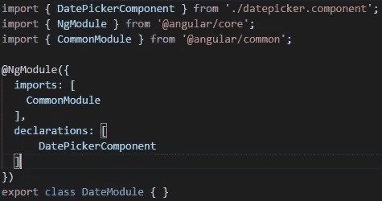
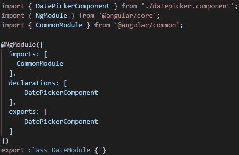
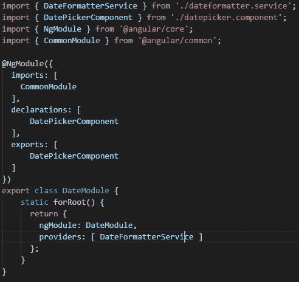
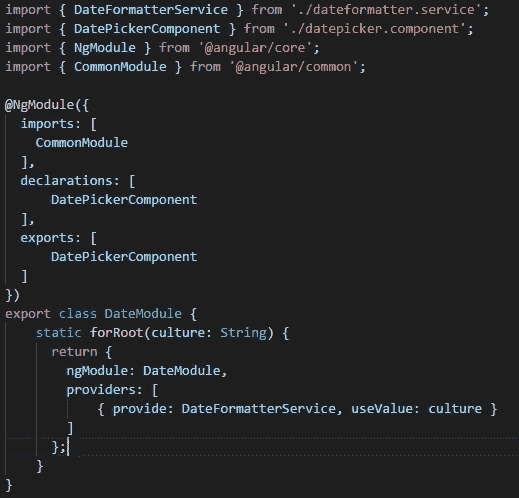
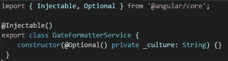

# 角度:共享模块

> 原文：<https://betterprogramming.pub/angular-4-shared-modules-18ac50f24852>

## 我们如何创建共享模块？


您需要创建一个将在应用程序的不同模块上使用的组件，这种情况很常见。如果你试图将组件添加到多个模块中，Angular 会抛出一个错误:

```
Type xxxComponent is part of the declarations of 2 modules: xxxModule and yyyModule
```

正是在这种情况下，共享模块才有意义。它们将允许您在多个模块中使用组件，共享服务实例，并且还应该是创建应用程序的公共管道和指令的地方。

# 我们如何创建共享模块？

当然，首先您需要创建一个模块。它不需要在任何地方包含单词 *shared* ，它可以是这样的:



这个模块将包含与应用程序日期相关的所有内容(日期选择器、格式化器等等)。

现在，让我们将一个组件添加到本模块中:



到目前为止，一切就像你在创建一个常规模块一样，但这还不够，你需要让使用这个模块的其他模块可以访问`DatePickerComponent`。

为此，您需要将日期选择器组件添加到模块导出数组中:



现在，您允许导入`DateModule`的其他模块访问`DatePickerComponent`。

使用同样的方法，您可以导出管道和指令，但是不能使用它来导出服务。

对于服务，您需要将函数`forRoot()`添加到共享模块中。你最终会得到这样的结果:



按照惯例，`forRoot`静态方法同时提供和配置服务。

在这种共享模块(公开服务)的情况下，您需要添加它们并调用根模块中的`forRoot`(通常是`AppModule`)来确保拥有公开服务的全局实例。

您还可以将参数传递给`forRoot`方法来配置服务初始化。如果你需要参数，你的代码将会像这样结束:



在您的服务中，您在构造函数上接收这些值:



# 结论

在 Angular 中创建共享模块非常简单，你迟早需要在你的应用中创建一个。

即使一开始听起来有点可怕，你也会对和他们一起工作以及他们的优点感到舒服。