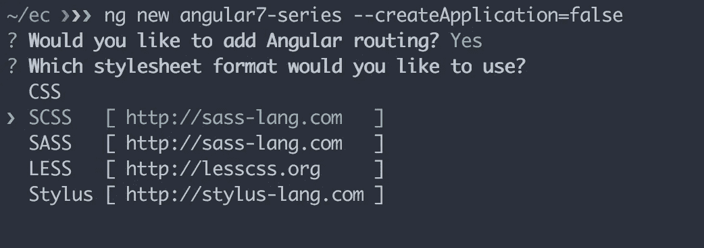
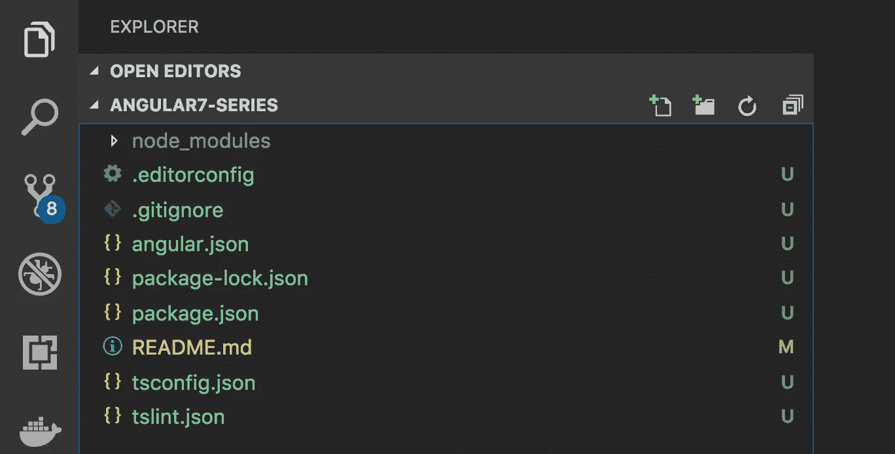
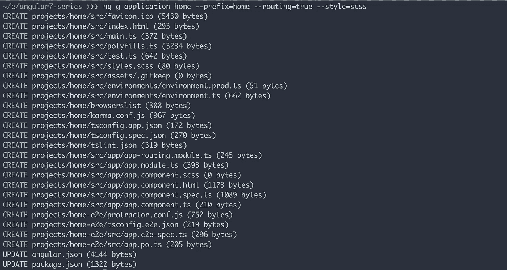
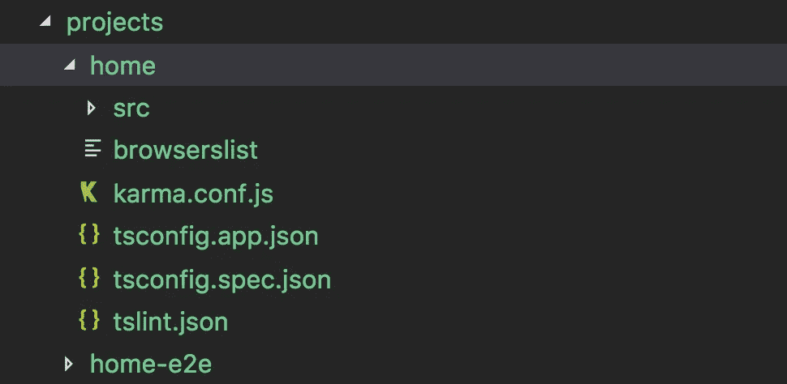
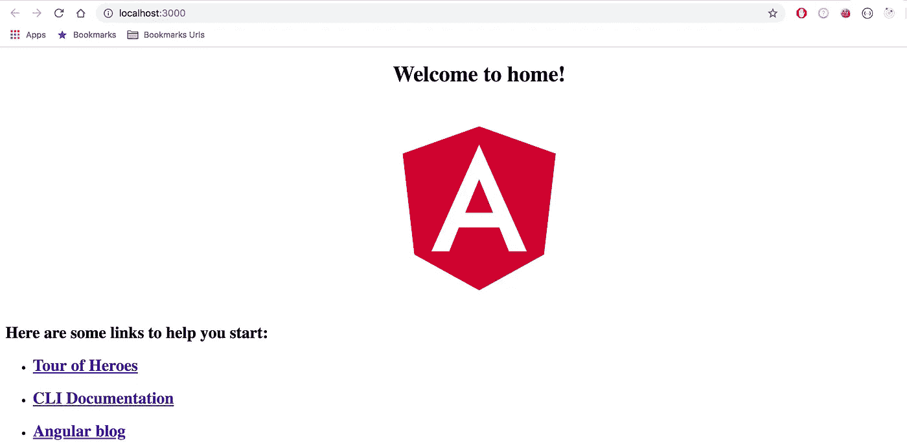
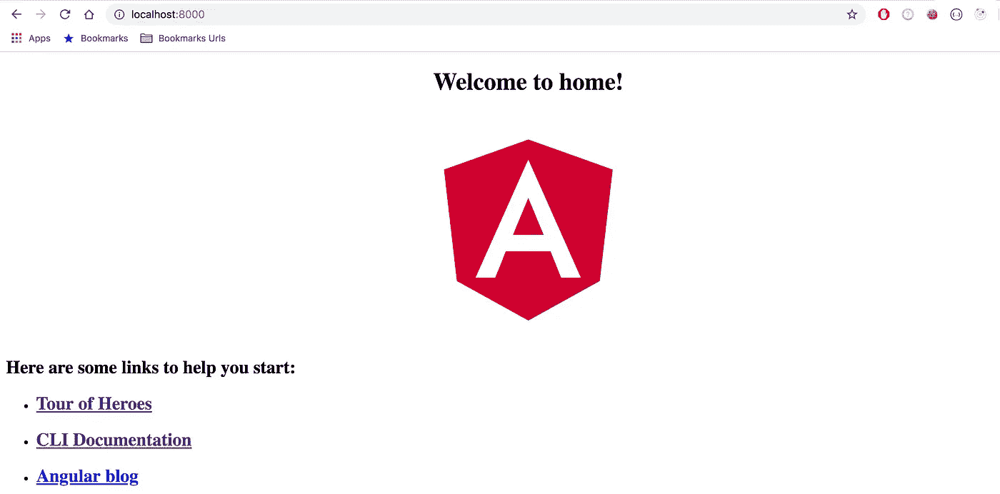
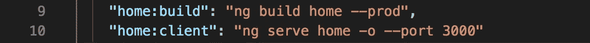

# Angular 7 系列第 1 部分:创建企业级应用程序

> 原文：<https://betterprogramming.pub/angular-7-series-part-1-create-enterprise-level-application-36c84786fa27>

## 关于使用 Angular CLI 创建具有 mono-repo 架构的企业级应用程序的系列文章的第一篇

在本系列中，我将使用 Angular CLI 创建具有 mono-repo 架构的企业级应用程序。在这些应用程序中，我将添加 angular 组件、服务、管道、路由、angular 材料、ngrx、PWA、自定义库、SEO 支持、主题化支持、使用 angular universal 的服务器端渲染、高级 oAuth 和许多其他带有分步说明的东西。敬请期待！

本系列的主要目标是展示我们如何最好地利用可用的工具、原理图和 CLI 来轻松快速地构建企业级 Angular 应用程序。

# 先决条件

为了完成这一部分，你需要安装 Node.js 版本`10.x.x`和`angular-cli`版本`7.x.x`

# 步骤 1:安装 Angular CLI

你需要在你的机器上全局安装`angular-cli`。

`npm install -g @angular/cli`

# 步骤 2:创建一个 GIT 存储库

对于这个系列，我已经创建了`[angular7-series](https://github.com/mkhan004/angular7-series)`存储库。对于每个部分，我将添加一个新的分支，以便您可以轻松地跟踪所有的更改。在您的情况下，您可以为项目选择任何名称。一旦创建了存储库，就在本地克隆它。

# 步骤 3:建立一个 Angular 7 项目

在克隆的项目目录之外，您需要运行，

`ng new **your_project_name** --createApplication=false`

`*ng new* ***angular7-series*** *--createApplication=false*`

它将提示几个问题，一旦你回答了这些问题，然后它将创建一个空的工作区。在我的项目中，我正在设置路由器并选择样式表为`SCSS`。

angular7 项目工作空间设置

*注意:如果您没有指定* `*--createApplication=false*` *，那么它会在您的工作区内添加一个默认应用程序。但是我更喜欢单独创建所有的应用程序。*

Angular7 工作空间文件夹结构

# 步骤 4:创建第一个应用程序

现在，我将在我的工作区内创建第一个应用程序`home`，从我的项目根目录，我需要执行以下命令:

`ng g application **home** --prefix=**home** --routing=true --style=scss`

*注意:该命令将创建* `*home*` *应用程序以及路由设置和样式表为* `*SCSS*` *。*

民用

我们的`home`应用程序已经创建在`projects`目录中。Iit 也为我们设立了`home-e2e` 。

主应用程序文件夹结构

# 步骤 5:带有实时重新加载的开发构建

在使用`home`应用程序之前，请确保运行:

`npm install`

现在，您可以通过执行以下命令，在开发模式下服务这个`home`应用程序:

`ng serve home -o --port 3000`

开发模式下的主页应用程序

# 步骤 6:生产构建

您可以使用以下命令创建生产版本:

`ng build **home** --prod`

## **与**T10 一起服务于生产构建

您可以使用`http-server`在本地复制`production`应用来提供生产构建。

`npm install http-server -g`

`http-server -p 8000 -c-1 **dist/home**`

现在如果打开[*http://localhost:8000*](http://localhost:8000)，就会看到`home` app 正在运行。

生产模式下的主页应用程序

## 生产模式下的实时重建

在某些情况下，您可能需要在生产模式下多次重建您的应用程序，以测试一些功能，如 PWA 和 universal。您可以通过在 *-观看*模式下构建您的应用来最大限度地减少您的时间和精力。为此，您需要打开两个不同的终端，

在第一个终端中，用`*--watch*`运行 build 命令:

`*ng build home --prod --watch*`

然后在第二个终端中，使用`http-server`服务应用程序:

`*http-server -p 8000 -c-1 dist/home*`

现在，如果您对应用程序进行任何更改，终端 1 将自动重建。你只需要刷新你的浏览器[*http://localhost:8000*](http://localhost:8000)*就能看到变化。我将展示如何在添加 PWA 后，在[*http://localhost:8000*](http://localhost:8000)*和上自动重新加载任何构建变更。**

# **步骤 7:向 package.json 脚本添加命令**

**为了保持我们的脚本简单，我只添加了两个命令:一个用于创建 prod build，另一个用于在开发模式下为应用程序提供服务。**

****

**npm 脚本**

# **步骤 8:创建第二个、第三个……..应用程序**

**现在我将创建第二个名为`profile`的应用程序。为此，我将重复第四至第七步。您可以按照相同的步骤创建任意数量的应用程序。**

## **资源**

*   **[这一块的源代码](https://github.com/mkhan004/angular7-series/tree/part-1/enterprise-level-application)。**
*   **要了解有关 CLI 命令、别名和参数的更多信息，请访问 [angular cli](https://angular.io/cli) 。**

# **其他文章**

*   **[Angular 7 系列第 2 部分:创建自定义库](https://medium.com/better-programming/angular-7-series-part-2-create-custom-library-8d7a0494b2cc)**
*   **[Angular 8 系列第三部分:升级至 Angular 8](https://medium.com/better-programming/angular-8-series-part-3-upgrade-to-angular-8-c08745131cb6)**
*   **[角度 8 系列第 4 部分:添加角度材料](https://medium.com/better-programming/angular-8-series-part-4-add-angular-material-6501e91041d8)**