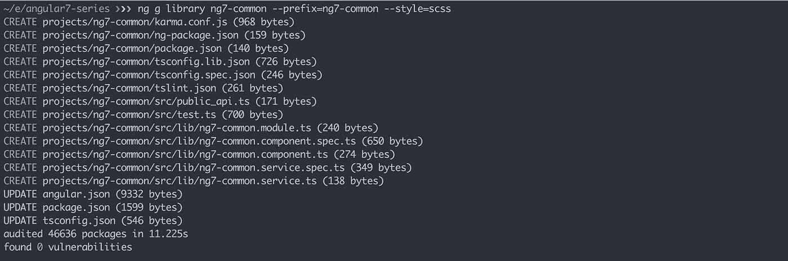
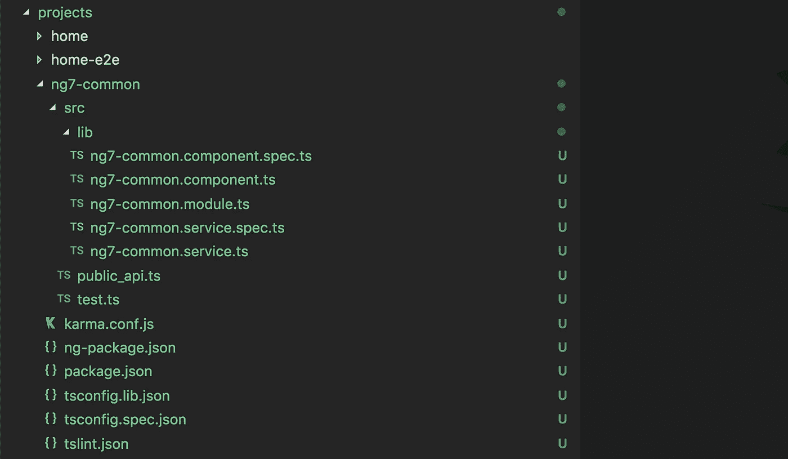
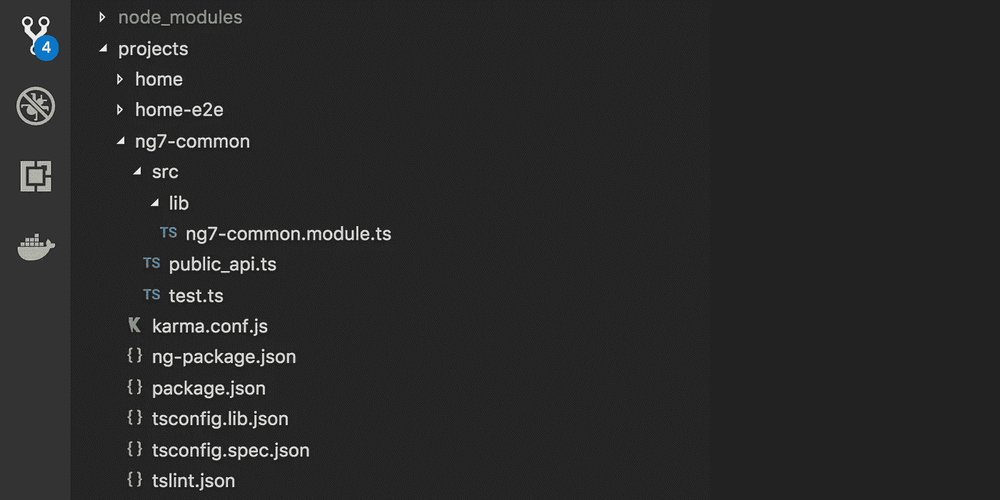
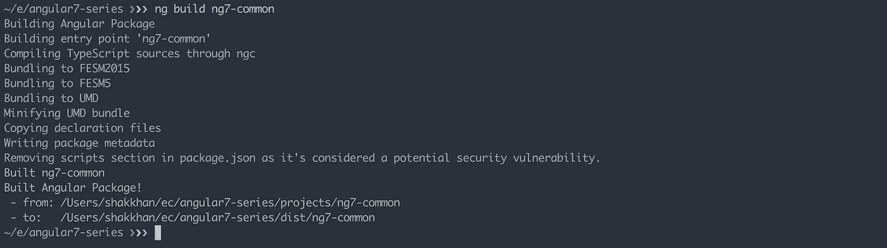
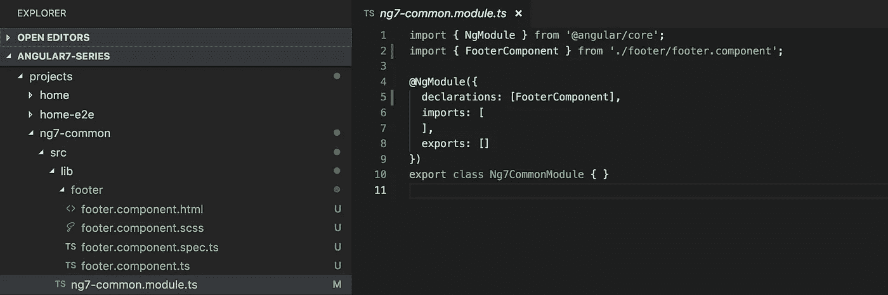
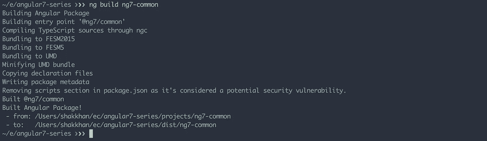
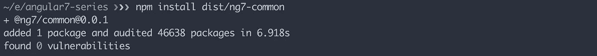
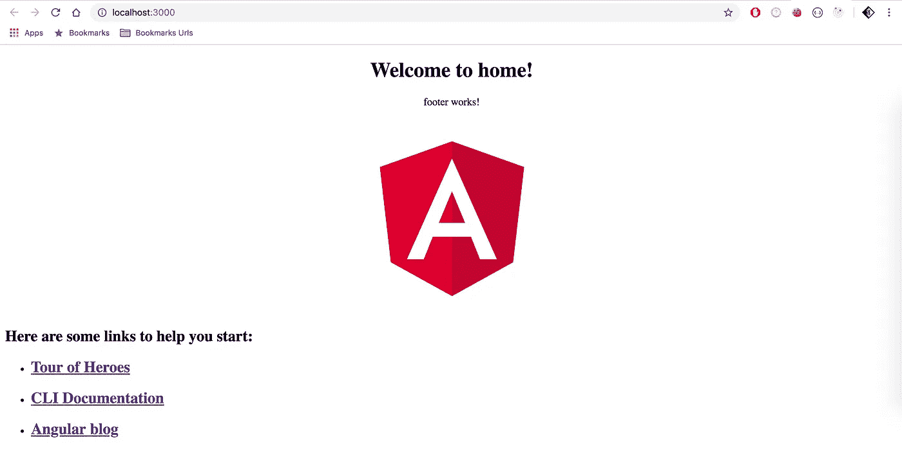

# Angular 7 系列第 2 部分:创建自定义库

> 原文：<https://betterprogramming.pub/angular-7-series-part-2-create-custom-library-8d7a0494b2cc>

## 关于使用 Angular CLI 创建具有 mono-repo 架构的企业级应用程序的系列文章的第二篇


角度库

在这篇文章中，我将从我在第一部分离开的地方开始。到目前为止，我已经使用`angular-cli`用 mono-repo 架构建立了一个工作区。然后，在工作区内，我创建了两个应用程序:`home`和`profile`。如果您尚未完成第一部分，请先访问 [Angular 7 系列第一部分:创建企业级应用](https://medium.com/better-programming/angular-7-series-part-1-create-enterprise-level-application-36c84786fa27) 。源代码链接也是可用的。

# 步骤 1:库命名约定

当构建一个应用程序时，即使只是为了学习、练习或娱乐，你也应该为变量、函数、类、数据模型/接口、库和任何其他你命名的东西保持良好的、有意义的命名约定。由于范围有限，我将在本文中仅简要解释`library`命名约定，但在将来，我将撰写另一篇文章，介绍标准应用程序架构、数据流和命名约定。

对于`library`的命名惯例，我更喜欢在所有的名字上加一个前缀。前缀应该很小；它可以是您的项目名称、您的团队名称或您的平台名称。如果你的库名有多个单词，那么在中间使用破折号(`**dasherize**`)。所以这个库的全名结构将是`<prefix>-<library-name>`。在库`package.json`中，包名结构将是`@<prefix>/<library-name>`。对于这个项目，我将使用`ng7`作为前缀。例如，如果我添加一个名为`common`的库，那么完整的库名将是`ng7-common`，而`package.json`中的包名将是`@ng7/common`。

如果在库中创建任何组件，使用完整的库名作为选择器前缀，例如在`FooterComponent`中，选择器将是`ng7-common-footer`。一旦您从该库中导入任何模块或组件，您的导入引用将是`@ng7/common`。

***注*** *:我们应该避免在任何名称中使用数字，只是为了系列名称我在前缀中使用了数字。在你的情况下，请避免数字。*

# 步骤 2:确定所需的应用程序

在这个系列中，我将创建一个具有顶部导航、页脚、用户登录、用户配置文件、web 表单的项目。我会尽可能使用有棱角的材料组件。

为了协调所有这些，我计划添加两个应用程序:`home`和`profile`。我已经在本系列的第一部分中创建了这些应用程序。在`home`应用程序中，我将添加几个`components`，它们将是公开可访问的，这意味着任何人都可以在没有`authentication`的情况下访问。`profile`应用程序还会有一些`components`来显示`authenticated`用户配置文件。

我喜欢将`home`和`profile`分开的原因是`home`应用程序将具有公共的特性，内容将主要是静态的，并且它与用户配置文件没有任何直接的依赖关系，而`profile`应用程序将具有更多带有动态数据的动态特性，将会发生大量的用户交互，并且我们还需要维护用户状态。很明显，与`home`相比，`profile`应用需要更频繁的发布。

# 步骤 3:确定所需的库

在我创建任何库之前，我们需要思考并尝试确定这个项目需要多少个库。让我们来找出答案:

1.  对于顶部导航、页脚、任何共享数据模型或接口等常见组件，我将创建一个名为`common`的库。
2.  我更喜欢将所有服务分开，所以我将添加一个`service`库。
3.  对于`jwt`基于令牌的认证，我将添加一个名为`oauth`的库。这个库将有`ngrx`特性`store`实现。
4.  对于反应式表单处理，我将添加一个`form`库。
5.  我会添加一个`router`库来使用`ngrx`特性`store`访问序列化的`RouterStateSnapshot`，它将用于标识当前路由器`state`和`params`。
6.  为了支持主题化，我将添加一个`theme`库。
7.  我还将添加一个`material`库来保持 angular material 模块单独导入。

随着我们继续本系列的其他部分，我可能需要添加更多的库。

# 步骤 4:创建一个新的分支

基于我们最初的计划，我正在为这篇文章创建一个[新分支。但是我仍然会为新读者保留第一部](http://part-2/create-libraries)中的[分支。你总能在](http://part-1/enterprise-level-application)[主](https://github.com/mkhan004/angular7-series)分支上找到最新的代码。

# 步骤 5:创建库

现在我将创建一个`common`库，全名为`ng7-common`，使用以下命令:

`ng g library ng7-common --prefix=ng7-common`



创建 ng7-公共库

这将在`projects`目录中创建`ng7-common`库，其中包含`src/lib`中的`ng7-common.module.ts`、`ng7-common.component.ts`、`ng7-common.service.ts`文件，以及`public_api.ts`作为`src`目录中的入口文件。



ng7-公共图书馆

# 第六步:清理图书馆

如果你看一下我们的图书馆目录，很少有像`ng7-common.component.ts`、`ng7-common.component.spec.ts`、`ng7-common.service.ts`、`ng7-common.service.spec.ts`这样的文件，我们不需要。您可以安全地删除这些文件，并确保从`public_api.ts`和`ng7-common.module.ts`中清除导入/导出语句。这是`public_api.ts`文件在清理前的样子:

`ng7-common.module.ts`文件清理前:

文件清理后，我们的库将如下所示:



ng7-公共图书馆

清理后的`ng7-common.module.ts`文件:

以及清理后的`public_api.ts`文件:

# 第 7 步:配置样式文本

现在如果你看一下`angular.json`文件，你会看到没有为这个库指定`styleext`示意图，这意味着如果我们在这个库中默认创建任何组件`angular-cli`将创建一个`.css`文件作为样式表。不幸的是，`library`原理图不支持`--style=scss`特性，正如它不支持`application`原理图一样。但是当然，您可以在每次创建新组件时指定`--style=scss`，我不喜欢这样做。我希望`angular-cli`团队会考虑在`library`示意图中添加该属性。

作为解决方法，我将在`angular.json`中添加该设置。它可以像这样手动配置:

# 第 8 步:构建一个库

现在我们准备用这个命令来构建我们的`ng7-common`库:

`ng build ng7-common`



成功构建:ng7-常见

# 第 9 步:向库中添加组件

在我们开始使用`ng7-common`库之前，我需要添加一个组件。我正在使用来自项目根的这个命令添加一个`footer`组件:

`ng g component footer --project=ng7-common`

如下图所示，它已经在`ng7-common`库中创建了`footer`组件，包括一个`.scss`文件作为样式表。它还在`ng7-common.module.ts`中包含了导入语句和组件声明。



页脚组件

# 第 10 步:从库中导出组件

如果我们想从库中导出任何组件，那么作为第一步，我们必须在`@NgModule`的`exports: []`部分注册该组件名称。例如:如果我想从`ng7-common`库中导出`FooterComponent`，我必须在`ng7-common.module.ts`中进行如下更新:

然后作为第二步，我们需要从`public_api.ts`中的组件文件导出所有内容，如下所示:

> 注意:对于从库中导出任何组件、服务、接口或任何数据模型，我们应该通过`public_api.ts`来导出它们。如果我们这样做了，我们的进口申报就会非常干净，

```
import { FooterComponent, Ng7CommonModule } from '@ng7/common';
```

否则就会变成这样(这是你不想做的)，

```
import { Ng7CommonModule } from '@ng7/common/src/lib/ng7-common.module';
import { FooterComponent } from '@ng7/common/src/lib/footer/footer.component';
```

# 步骤 11:更新包名

如果你在`ng7-common`图书馆里面找`package.json`，我们的包名是`"name": "ng7-common"`。你可以保持现在的样子，它不会有任何问题。但是我喜欢遵循我在第一步中解释的命名约定，所以我将包名更新如下:

现在让我们重新构建库，以验证一切正常工作。是的，有效！！



完美！，现在让我们验证`./dist/ng7-common`目录中的`package.json`。正如所料，库包名是`@ng7/common`。

# 步骤 12:安装库

现在是时候安装新创建的库`ng7-common`并准备将`footer`组件导入到我们的应用程序中了。我们可以通过以下方式安装`ng7-common`库

> `npm install dist/ng7-common`



成功安装

在项目级别`package.json`中，它添加了一个新的`dev`依赖项

```
"@ng7/common": "file:dist/ng7-common",
```

现在我们准备将`footer`组件导入到`home`和`profile`应用程序中。

# 步骤 13:修复安装问题

但是在我们变得非常兴奋之前，我想强调一下我们马上要面对的一个问题。如果我们需要移除`node_modules`和`dist`并重新安装，那我们就完了。现在我们不能运行`npm install`，因为`file:dist/ng7-common`不存在。不幸的是，我们不能建造图书馆，因为 T21 不见了。

我们现在能做什么？以及第一个选项:

1.  从`package.json`开发依赖项中删除库引用。
2.  运行`npm install`
3.  构建库`ng build **ng7-common**`
4.  然后再装回库`npm install **dist/ng7-common**`

这是可行的，但是一遍又一遍地执行所有这些步骤是非常烦人的。

作为第二种选择，我们可以将我们的库安装为可选的依赖项，而不是`dev`依赖项。例如，要安装`ng7-common`库，我们需要运行以下命令:

> `*npm install* ***dist/ng7-common*** *--save-optional*`

```
{
  "name": "angular7-series",
  "version": "0.0.0",
  ...
  ...
 **"optionalDependencies": {**                      <--------
 **"**[**@ng7/common**](http://twitter.com/ng7/common)**": "file:dist/ng7-common"**
 **}**
}
```

现在，对于任何全新安装，我们只需运行以下命令:

1.  运行`npm install --no-optional`
2.  然后建图书馆`ng build **ng7-common**`
3.  最后，运行`npm install`，这将安装在 1 中跳过的可选依赖项。

比起第一个选择，我更喜欢第二个选择。因此，对于所有的库安装，我将遵循第二个选项。这意味着我在第 12 步中安装库的方式不是我以后要遵循的方式。

# 步骤 14:将组件导入应用程序

现在我将把`footer`组件导入到`home`应用程序中。为此，我需要将`Ng7CommonModule`导入到`home`应用程序的`app.module.ts`中。

然后在`app.component.html`内添加`footer`组件选择器，如下所示:

最后，是编译和运行`home`应用程序的时候了:

`npm run home:client`

它会编译我们的`home` app，并在`http://localhost:3000/`打开。



主页应用程序呈现页脚组件

# 步骤 15:库的 npm 脚本

我将下面的脚本添加到`ng7-common`库的项目级别`package.json`:

# 步骤 16: npm 发布库

如果你需要在`npm`出版你的图书馆，那么你可以关注[托德·帕尔](https://medium.com/u/11477bb8a02e?source=post_page-----8d7a0494b2cc--------------------------------)的这篇伟大的文章 [**《棱角图书馆系列——出版**](https://medium.com/p/ce24bb673275) 。谢谢托德。

# 一些棘手问题:

*   **循环依赖:**如果你有多个库，那么从库-a 如果你导入一些东西到库-b，那么你永远不能从库-b 导入任何东西到库-a。如果你这样做，那么将得到循环依赖错误。因此，您需要提前计划哪个库将被哪个库使用，并确保它们有一个方向的流动。
*   **外部模块:**一旦你将一个库模块导入另一个库模块并创建一个构建，你可能会看到这样的警告

```
No name was provided for external module '[@fusion/c](http://twitter.com/fusion/pipe)ommon' in output.globals – guessing 'common'
```

要解决这个问题，您需要更新`ng-package.json`

```
{
  "$schema": "../../node_modules/ng-packagr/ng-package.schema.json",
  "dest": "../../dist/fusion-service",
  "lib": {
    ...
    "umdModuleIds": {                      <----------
 **"@fusion/common": "@fusion/common"**   <----------
    }                                      <----------
  }
}
```

## 资源

*   [这一块的源代码](https://github.com/mkhan004/angular7-series/tree/part-2/create-libraries)。
*   要了解有关 CLI 命令、别名和参数的更多信息，请访问 [angular cli](https://angular.io/cli) 。

# 其他文章

*   [Angular 7 系列第 1 部分:创建企业级应用](https://medium.com/better-programming/angular-7-series-part-1-create-enterprise-level-application-36c84786fa27)
*   [Angular 8 系列第 3 部分:升级至 Angular 8](https://medium.com/better-programming/angular-8-series-part-3-upgrade-to-angular-8-c08745131cb6)
*   [角度 8 系列第 4 部分:添加角度材料](https://medium.com/better-programming/angular-8-series-part-4-add-angular-material-6501e91041d8)