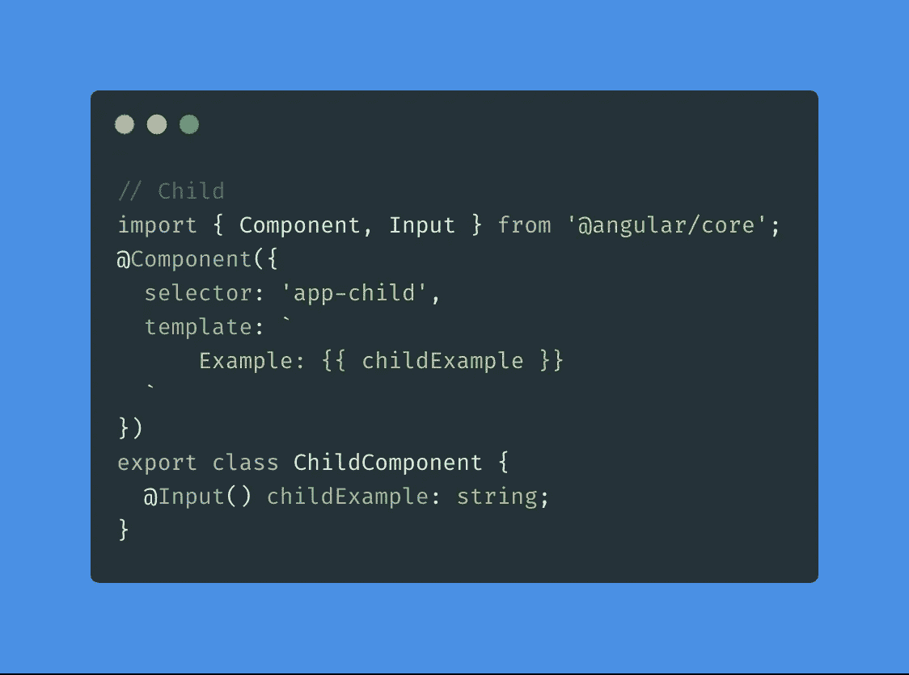
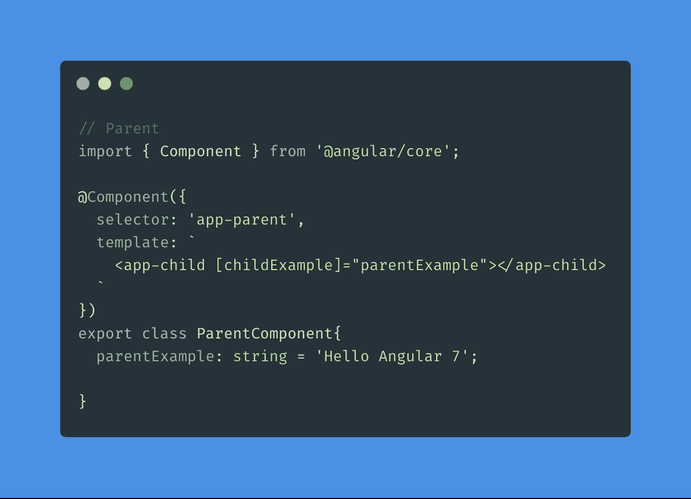
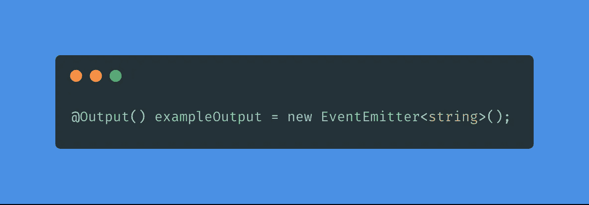
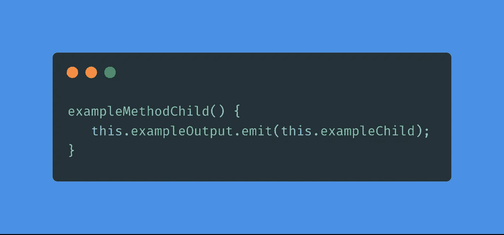
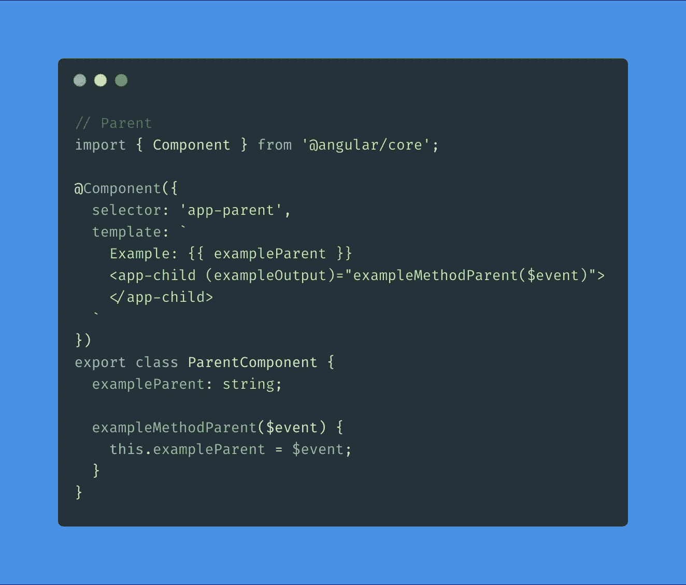
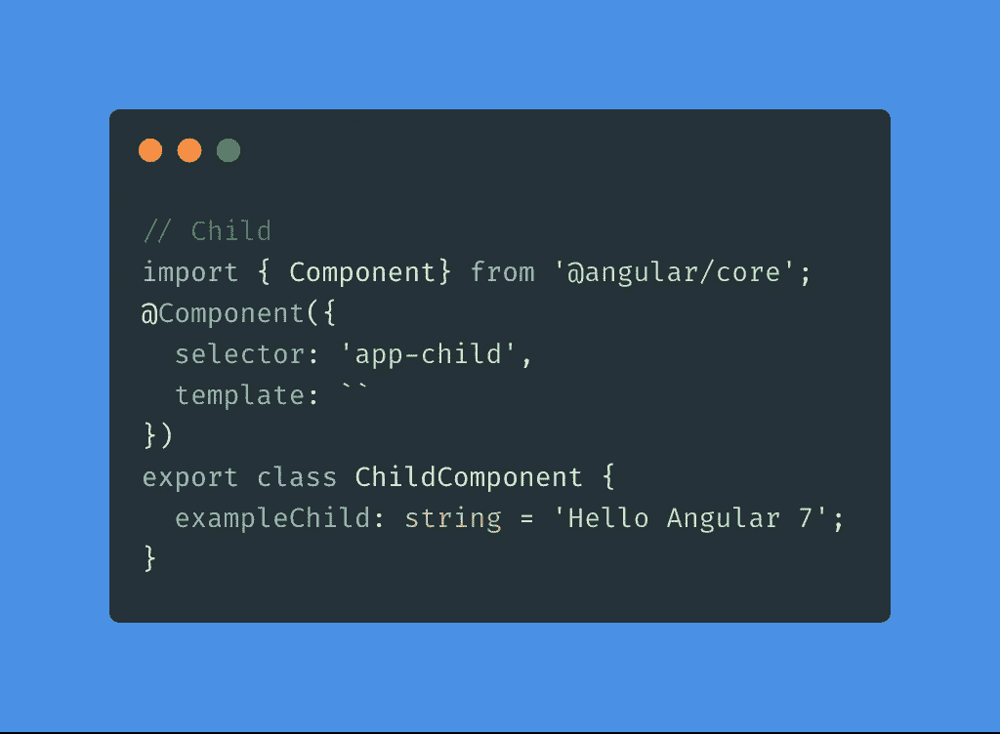
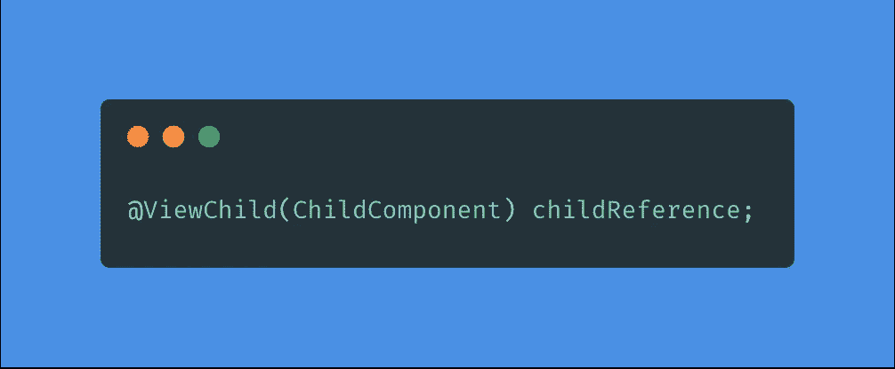
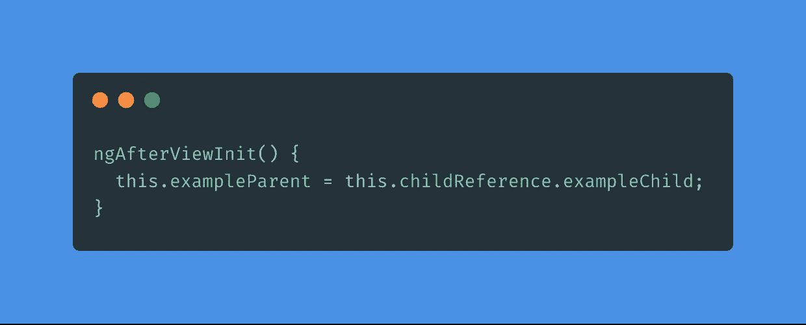
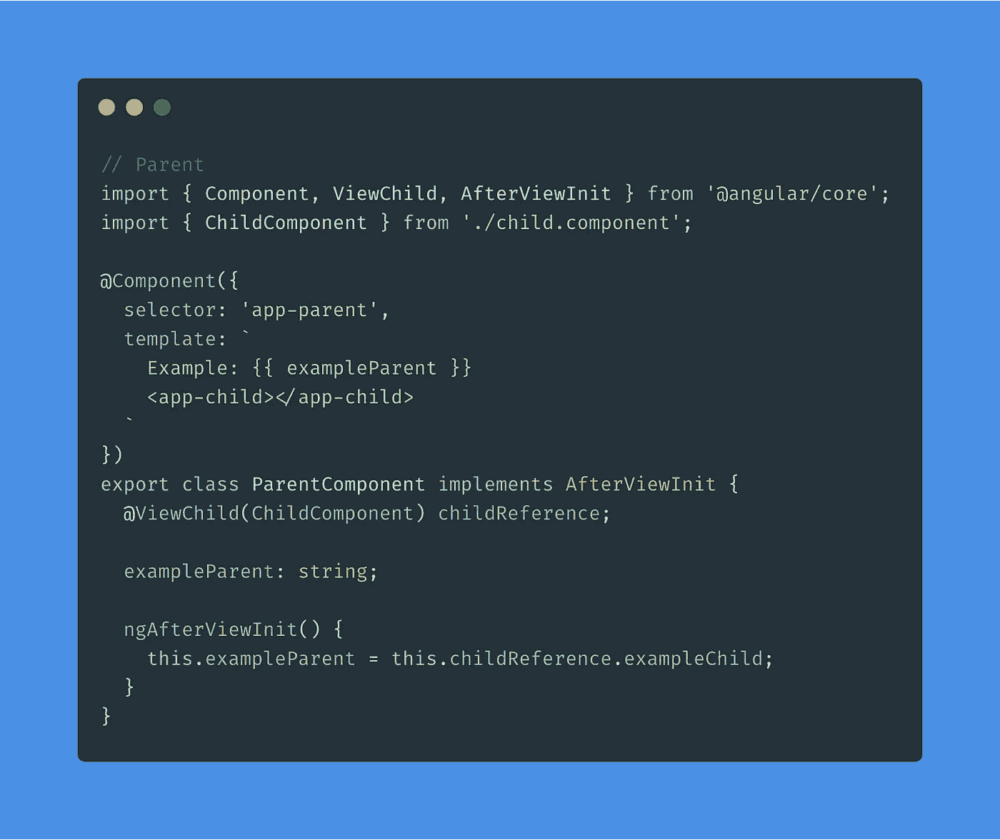

# 在 Angular 中与其他元件共享元件数据

> 原文：<https://betterprogramming.pub/angular-7-share-component-data-with-other-components-1b91d6f0b93f>

## 有角的

## 使用 Angular 的输入、输出、EventEmitter 和 ViewChild 共享组件数据

通过 [rawpixel](https://unsplash.com/@rawpixel?utm_source=medium&utm_medium=referral) 上的 [Unsplash](https://unsplash.com?utm_source=medium&utm_medium=referral)

*注:本文适用于每一个 Angular 版本，包括最新版本。*

要共享组件数据，您可以使用以下命令:

*   `@Input` —属性绑定
*   `@Output`和`EventEmitter` —事件绑定
*   `@ViewChild`和`AfterViewInit`

让我们依次看一下它们。

# @Input —属性绑定

如果要将数据从父组件传递到子组件，需要使用两个东西:`@Input`和属性绑定。

在这个例子中，我们在`child`组件中设置了一个名为`childExample`的变量，它是一个字符串。我们在变量前面设置 Angular 的`@Input`装饰器。

代码显示由[碳](https://carbon.now.sh/?bg=rgba(74%2C144%2C226%2C1)&t=material&wt=none&l=application%2Ftypescript&ds=false&dsyoff=20px&dsblur=68px&wc=true&wa=true&pv=56px&ph=56px&ln=false&fm=Fira%20Code&fs=14px&lh=152%25&si=false&es=2x&wm=false)

这为我们提供了向子节点的选择器(`<app-child>`)添加属性的选项，如下例所示:

在父类中，我们声明了一个名为`parentExample`的变量。我们给它一个值`[childExample]`。结果是文本“Hello Angular 7”显示在子组件中。

 [## 每个开发人员的必备工具

### 通过生成文档节省大量时间

itnext.io](https://itnext.io/must-have-tool-for-every-developer-71508e73e9aa) 

# @Output & EventEmitter —事件绑定

对于`@Output`和`EventEmitter`，情况正好相反。您可以将数据从子组件传递回父组件。同样，我们在子元素中声明了一个变量，但是这次使用了`@Output`装饰器和一个新的`EventEmitter`:

我们希望通过执行以下操作将事件`emit`添加到父组件:

在子组件中单击每个按钮时，我们将文本“Hello Angular 7”传递给父组件。

在我们的父组件中，我们现在可以为子选择器(`<app-child>`)设置一个事件。正如你所看到的，我们使用了来自孩子的`exampleOutput`，它的值是一个名为`exampleMethodParent`的方法，带有参数`$event`。

现在，在子方法中的每个按钮点击上，我们通过父方法中的一个事件获得一个文本。在这个方法中，我们给`example`一个`$event`的值。通过插值(`{{ exampleParent }}`)，我们现在可以看到我们孩子的示例文本。

# @ViewChild & AfterViewInit

传递数据的第三种方式是使用`@ViewChild`和`AfterViewInit`。使用最后一个选项，我们可以引用子组件并访问父组件中的变量。

装饰器设置在父组件中。我们在类中声明了以下内容:

我们还需要实现`AfterViewInit`生命周期挂钩，因为在视图初始化之前，子视图是不可用的。在`ngAfterViewInit()`方法中，我们从`ChildComponent`访问`exampleChild`并将值赋予`exampleParent`变量。

我们完整的`ParentComponent`将会是这样的:

同样，通过插值(`{{ exampleParent }}`)，我们现在可以看到我们孩子的示例文本。

## 感谢您的阅读！我的 [Github](https://github.com/jeroenouw/) 或者 [Twitter](https://twitter.com/jeroenouw) 。如果你觉得这篇文章有用，请点击👏关注 button，并考虑阅读我的其他文章:

 [## 解释了使用 Next.js 呈现数据

### 简单解释了 getStaticPaths、getStaticProps 和 getServiceSideProps

itnext.io](https://itnext.io/rendering-data-with-next-js-explained-28364f5fc11d)  [## 每个开发人员的必备工具

### 通过生成文档节省大量时间

itnext.io](https://itnext.io/must-have-tool-for-every-developer-71508e73e9aa)