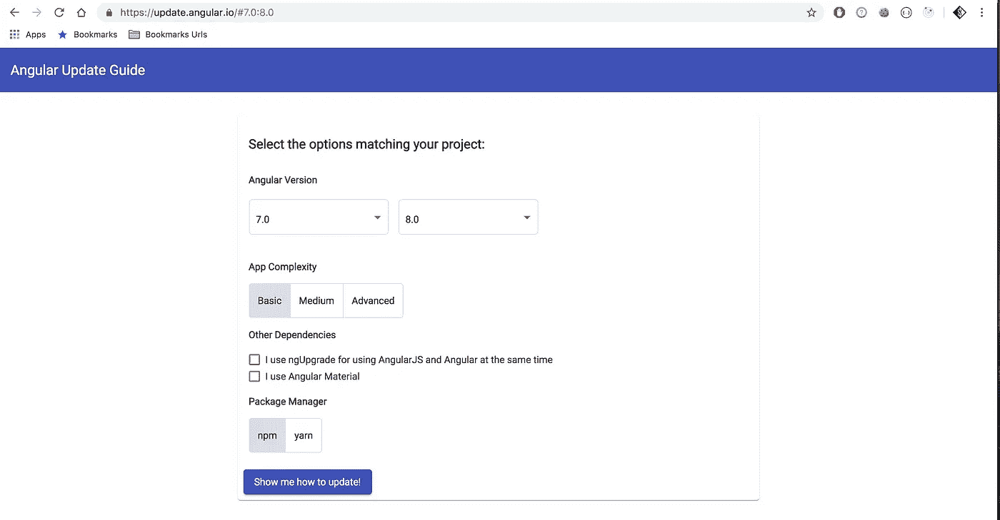
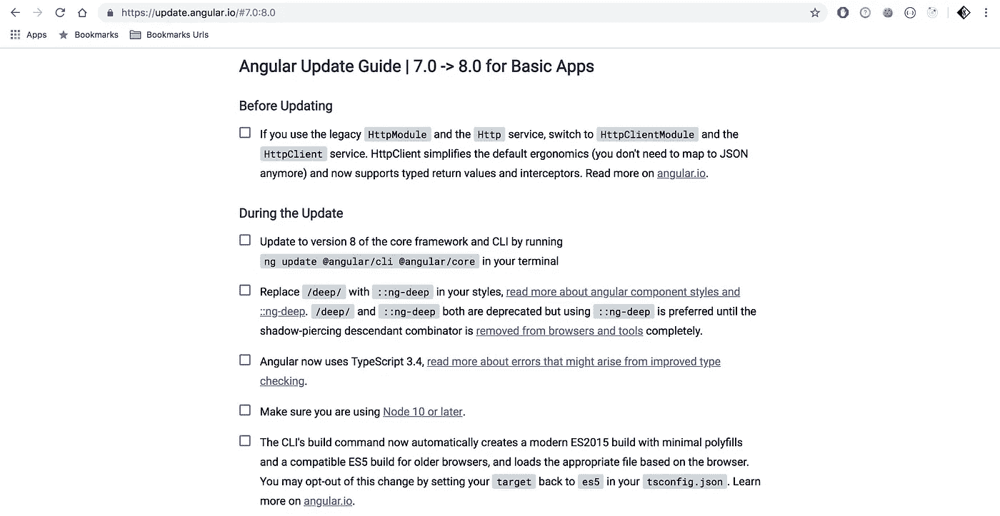
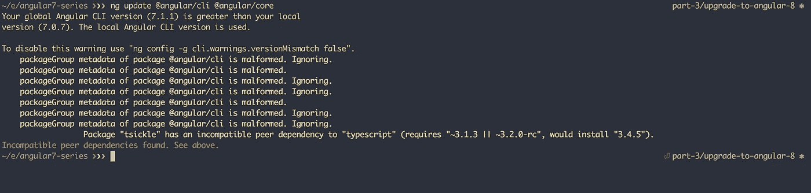
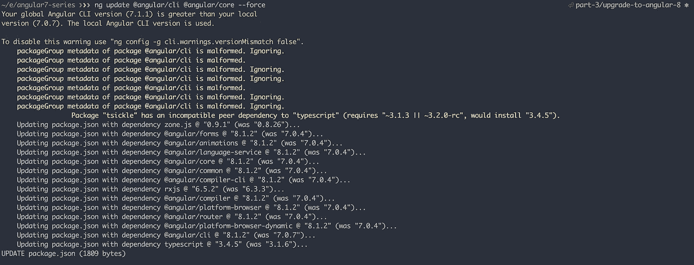
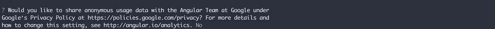
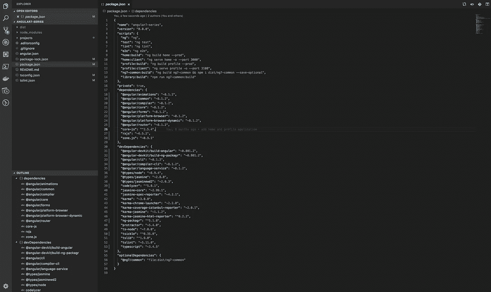
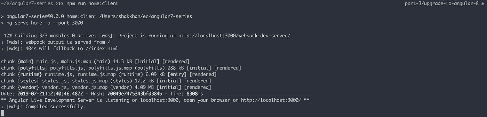
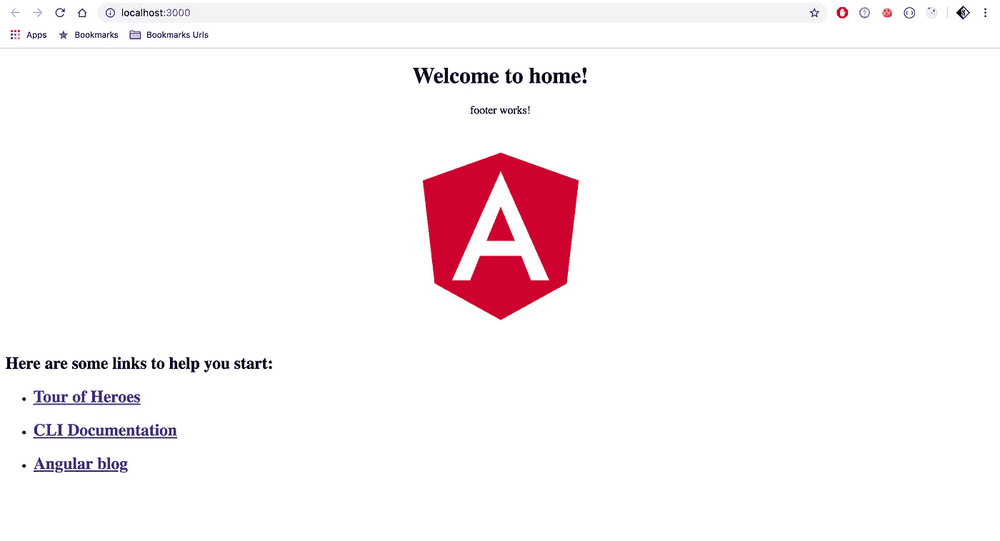

# Angular 8 系列第 3 部分:升级到 Angular 8

> 原文：<https://betterprogramming.pub/angular-8-series-part-3-upgrade-to-angular-8-c08745131cb6>

角度 8 升级

这将是我几个月前开始的[角 7 系列](https://medium.com/better-programming/angular-7-series-part-1-create-enterprise-level-application-36c84786fa27) 的第三篇文章。由于 Angular[8 已经推出，在这一部分，我将从升级我们的项目到最新的稳定版本开始。](https://angular.io/)

# 为什么要升级到 Angular 8

对我们来说，理解为什么要不断升级到最新版本是非常重要的。不仅仅是 Angular，还有我们在项目中使用的其他依赖包。

任何开源社区，尤其是 Angular 的团队，都会快速而积极地解决问题并提供新的特性和功能。这就是技术快速发展的方式。

我可以保证，如果您的任何主要依赖项落后于两个或更多的主要版本，您将面临失去活跃社区支持的风险。有一天你会发现自己处于这样一种状态，你不得不放弃你的代码库，重写整个东西。

我个人不喜欢放弃一个项目并开始一个新项目的概念，只是为了避免我们随着时间的推移而产生的一些问题。

# 升级步骤

## 1.创建新分支

我将使用与 [Angular 7 系列](https://github.com/mkhan004/angular7-series?source=post_page---------------------------)中相同的 Git repo 来添加一个新分支`part-3/upgrade-angular-8`，使用这个命令:`git checkout -b part-3/upgrade-angular-8`。

## 2.确定如何升级

升级到新版本比以前更简单。这要归功于 Angular 团队让升级步骤变得简单易行。

要确定您需要运行哪些命令来更新您的项目，请访问[角度更新指南](https://update.angular.io/)。

选择您的当前版本(对我们来说是`7.*.*`)和预期版本(`8.*.*`，然后点击“演示如何更新！”按钮。

它会给你列出你需要做的事情。

角度更新指南

基本应用的角度更新指南| 7.0 -> 8.0

## 3.运行更新命令

从上面的列表中，我只需要运行一个命令:`ng update @angular/cli @angular/core`，将我们的项目更新到 Angular 8。

运行该命令后，我得到了一些警告，因为我的全局和本地 CLI 版本不匹配。在您的情况下，您可能不会得到任何错误。

警告和不兼容性列表

为了解决这个警告，我需要运行一个带有`— force`标志的更新命令。

正如您在这里看到的:

用`- - force '标志更新命令

Angular CLI 增加了新的提示，以获得您共享匿名使用数据的权限。我这种情况，回答`no`。

厉害了，我们的项目已经成功升级到 Angular 8 了。

## 4.编译并运行

当我们完成升级后，让我们编译我们的`home`应用程序来验证是否一切正常:`npm run home:client`。

运行主页应用程序

是啊！我们现在有角 8.1.2。

Angular 8(家庭应用)

# 资源

这篇文章的源代码:

 [## mkhan004/angular7 系列

### 通过在 GitHub 上创建帐户，为 mkhan004/angular7 系列开发做出贡献。

github.com](https://github.com/mkhan004/angular7-series/tree/part-3/upgrade-to-angular-8) 

欲了解更多关于角度更新命令的信息，请访问 [angular.io](https://angular.io/cli/update) 。

# 其他文章

*   [Angular 7 系列第 1 部分:创建企业级应用](https://medium.com/better-programming/angular-7-series-part-1-create-enterprise-level-application-36c84786fa27?source=post_page---------------------------)
*   [Angular 7 系列第 2 部分:创建自定义库](https://medium.com/better-programming/angular-7-series-part-2-create-custom-library-8d7a0494b2cc)
*   [角度 8 系列第 4 部分:添加角度材料](https://medium.com/better-programming/angular-8-series-part-4-add-angular-material-6501e91041d8)