# 角度 8 系列第 4 部分:添加角度材料

> 原文：<https://betterprogramming.pub/angular-8-series-part-4-add-angular-material-6501e91041d8>

## 创建企业级应用程序系列的第四部分


作为 Angular 8 系列的一部分，在这个作品中，我将在我们的项目中添加[角状材料](https://material.angular.io/)。

为此，我将创建一个名为`material`的库，正如我们在 [Angular 7 系列第 2 部分:创建自定义库](https://medium.com/better-programming/angular-7-series-part-2-create-custom-library-8d7a0494b2cc)中计划的那样，以保持 Angular 材质模块的导入是独立的。

# 添加角形材料的步骤

## 1.创建新分支

我用这个命令在 [Angular 7 系列](https://github.com/mkhan004/angular7-series?source=post_page---------------------------) repo 中添加一个新的分支`part-4/add-angular-material`:`git checkout -b part-4/add-angular-material`。

## 2.创建素材库

由于我们已经将我们的项目升级到 Angular 8，从现在开始，如果我们创建一个新的库，我将使用前缀`@ng8`而不是`@ng7`。

为了创建`@ng8/material`库，我将遵循 [Angular 7 系列第 2 部分:创建自定义库](https://medium.com/better-programming/angular-7-series-part-2-create-custom-library-8d7a0494b2cc)中解释的步骤。如果你还没有读过那篇文章，请读一读。

我用下面的命令创建这个库:`ng g library ng8-material —-prefix=ng8-material`。

如您所见，我们的库已经创建:

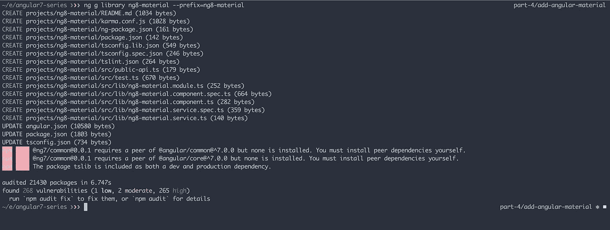

添加 ng8-素材库

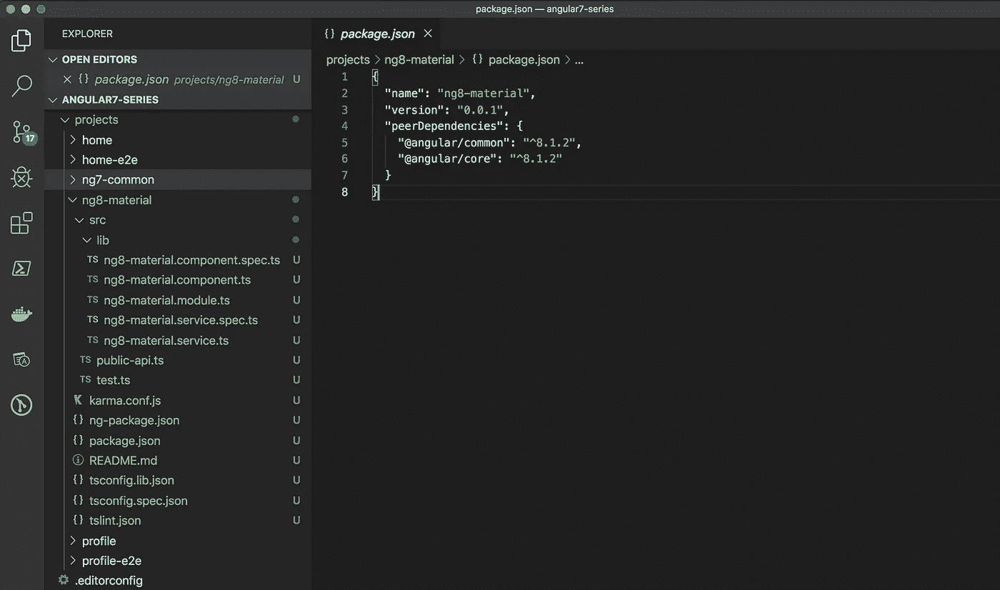

为 ng8-素材库生成的文件

## 3.图书馆清理

基于步骤 6:库清理，在 [Angular 7 系列第 2 部分:创建自定义库](https://medium.com/better-programming/angular-7-series-part-2-create-custom-library-8d7a0494b2cc)中，我现在将删除不必要的文件(组件、服务)及其导入/导出引用。

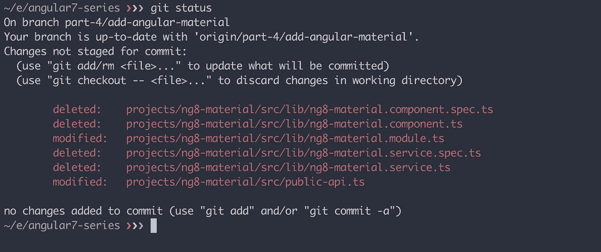

已清理的文件

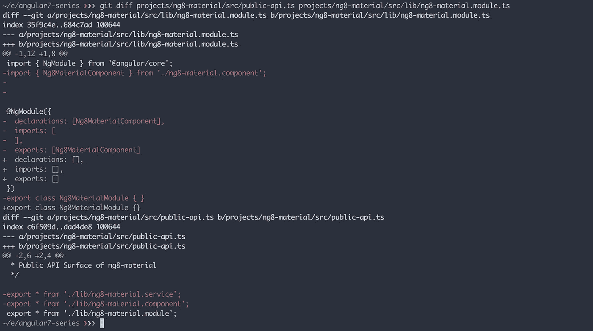

导入/导出引用清理

如果你发现很难弄清楚哪些文件被删除和更新了，你可以查看 Git [提交](https://github.com/mkhan004/angular7-series/commits/part-4/add-angular-material)。

## 4.更新包名

目前在`ng8-material`库内的`package.json`中，是:`"name": ng8-material`。但是，我们将把它重命名为`"name": @ng8/material`。

如果你不知道我为什么重命名库，请阅读我之前的文章 [Angular 7 系列第二部分:创建自定义库](https://medium.com/better-programming/angular-7-series-part-2-create-custom-library-8d7a0494b2cc)。

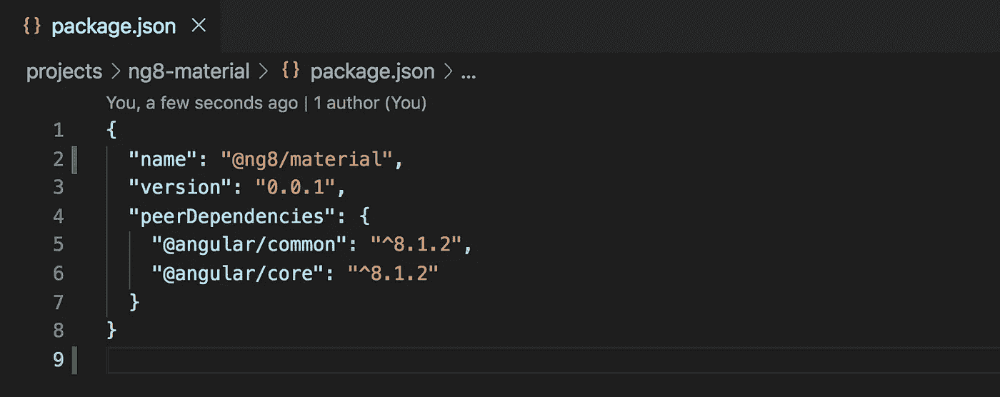

重命名`ng8-material to @ng8/material`

## 5.构建 ng8 材料库

在添加`npm`脚本之前，我们将使用命令`ng build ng8-material`构建我们的新库。

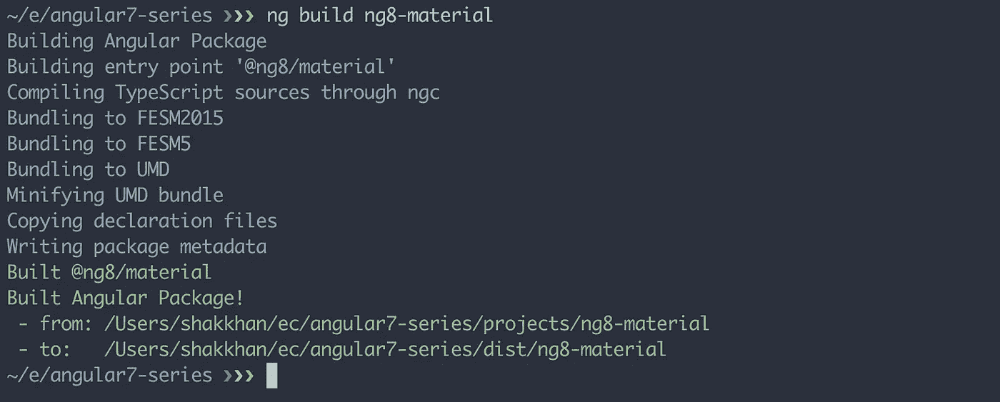

成功构建

## 6.添加有角度的材料

现在，我们准备添加角材料到我们的项目。

我将使用 Angular CLI 命令添加材料。`ng add @angular/material`。运行该命令后，您将看到一个关于预构建主题选择的 CLI 提示。

在我的情况下，我选择`Indigo/Pink`，然后点击`enter`。

你现在会得到另一个关于设置`[HammerJS](https://hammerjs.github.io/)`的提示，我们需要这个，回复`yes`。下一个提示是关于设置浏览器动画。回复`yes`就完事了。

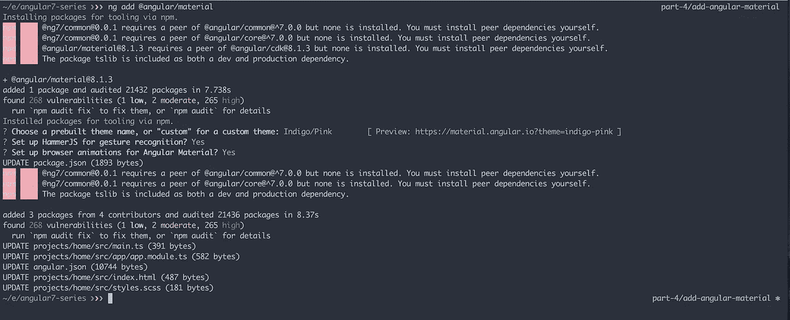

添加@角度/材料

正如你所看到的，我们的项目中现在有棱角的材料。我们已经成功添加了`@angular/cdk`、`@angular/material`和`hammerjs`。

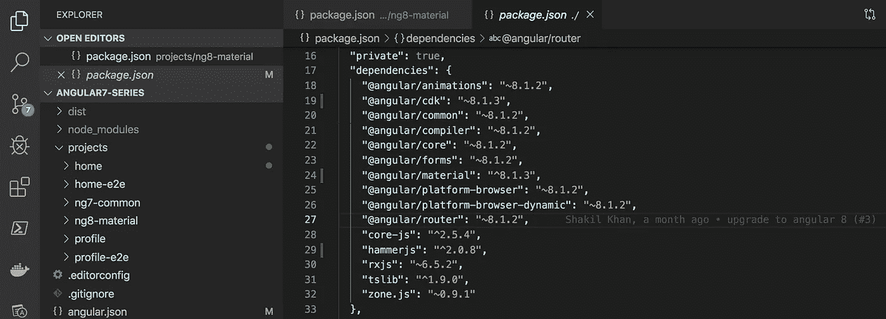

角状材料

它还为`home`应用程序在`angular.json`中添加了`Indigo/Pink`主题。但是，它没有在我们的`profile`应用程序中添加这个主题。

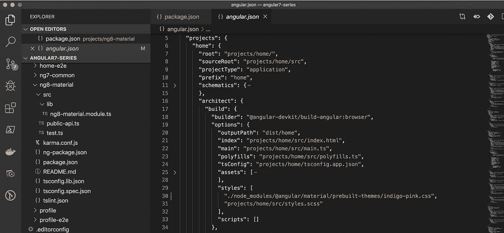

添加预构建主题

注意 **:** 如果你想知道`ng add @angular/material`为什么不更新`profile`应用，那是因为任何`ng add`命令只会更新`default`项目。在我们的例子中，它是`home`。

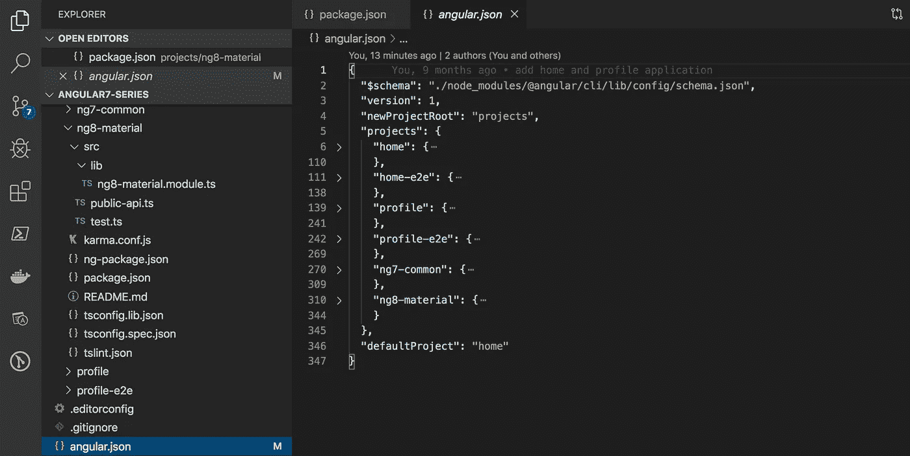

默认项目主页

现在我们将回顾一下`home`应用程序中`ng add @angular/material`命令所做的其他更改。在`app.module.ts`中，已经导入了`BrowserAnimationsModule`。

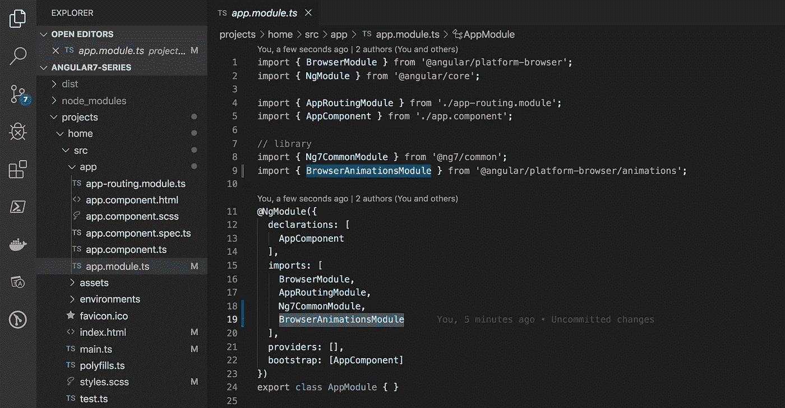

应用程序模块

在`main.ts`中导入了`hammerjs`，并在`styles.scss`文件中添加了自定义`css`样式。

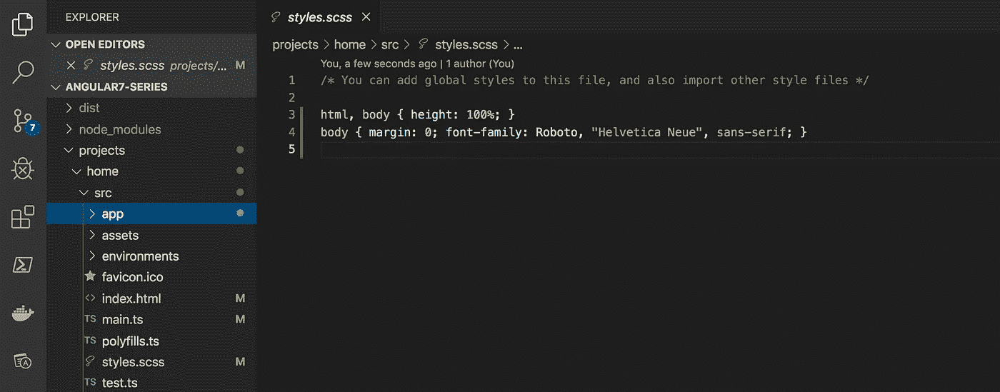

生成的样式

最后，在`index.html`中，它为材质`icons`和`Roboto`字体添加了`stylesheet`链接，这是角材质的默认设置。

一旦我们在接下来的文章中增加了对`theming`的支持，我们将学习如何改变这个默认的字体系列。

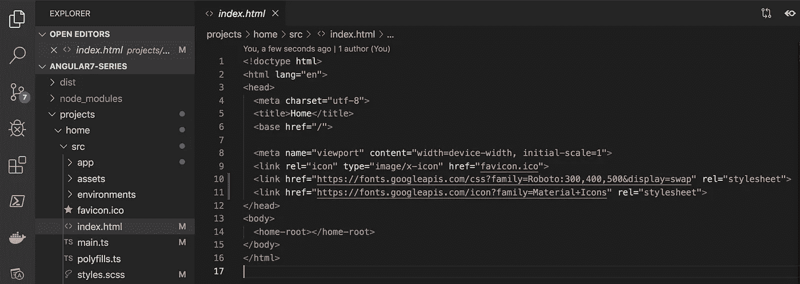

`Stylesheet links`

## 7.为特定项目添加角形材料

问题是:“我们如何对其他非默认项目，如`profile`应用程序，进行与步骤 6 中对`home`应用程序相同的更改？我们需要手动操作吗？”

否，因为 Angular CLI 添加了一个`--project=your-project-name`标志。

现在，我将运行`ng add @angular/material --project=**profile**`命令，在`profile`应用程序中应用相同的更改。

您可能已经注意到，这一次它没有添加/更新`package.json`，因为在上一个命令中，它已经添加了所需的包。

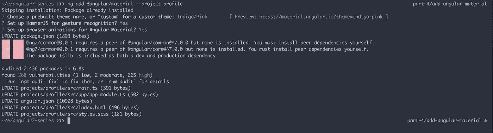

提示交互

## 8.添加 npm 构建脚本

现在，我将为`ng8-material`添加构建脚本，与`ng7-common`相同。我还会更新`library:build`脚本。

以下是我所做的更改:

```
"ng8-material:build": "ng build ng8-material && npm i dist/ng8-material --save-optional",
"library:build": "npm run ng7-common:build && npm run ng8-material:build"
```

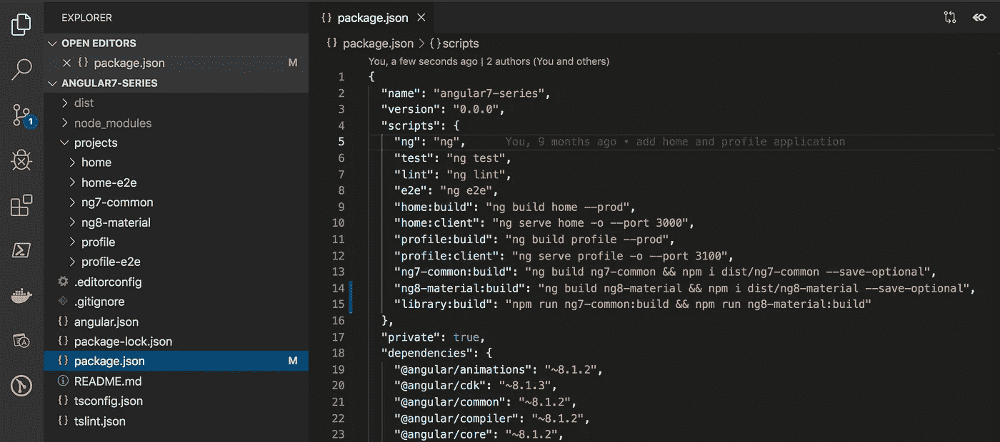

ng8-材料的新脚本

现在，我将运行`npm run library:build`命令到`build`和`install`我们的新库。

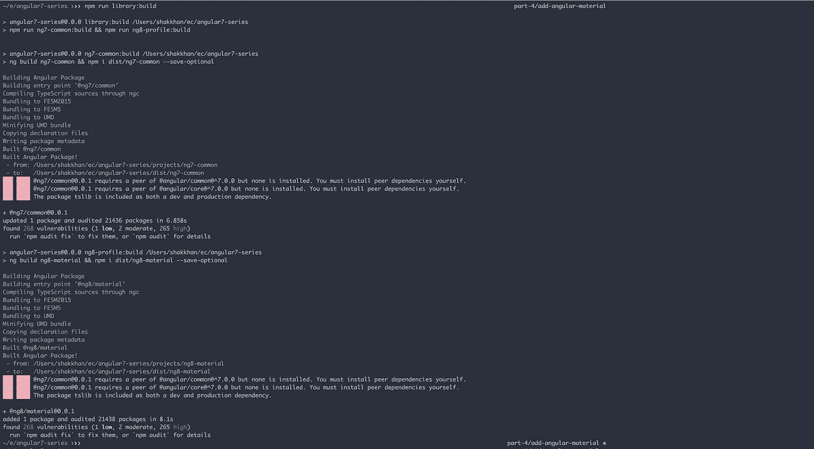

npm 运行库:构建

## 9.在 ng8-材料库中添加角度材料模块

为了尽量减少库的变化，我将导入`ng8-material`库中所有可用的材料模块。但是，在你的情况下，你应该只添加需要的模块，否则，它会给你编译的`dist`增加额外的负担，这是你应该避免的。

从这个 StackBlitz [示例](https://stackblitz.com/angular/lngdalpggar?file=app%2Fmenu-position-example.ts)中，我复制了`ng8-material.module.ts`中的材料模块。

确保你也列出了`@NgModule`的`export`模块中的所有模块。否则，客户端应用程序将无法使用材料组件。

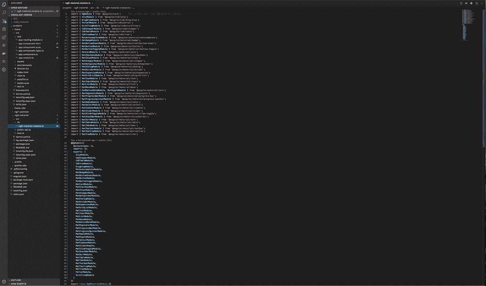

## 10.添加角度材料顶部导航

为了测试我们的角度材质实现，我使用`MatToolbarModule`添加了一个简单的顶部导航。

由于相同的顶部导航组件将在`home`和`profile`应用程序中使用，我使用命令`ng g component TopNav --project=ng7-common`将这个`TopNav`组件添加到`ng7-common`库中。


添加顶部导航

现在，我需要将`Ng8MaterialModule`导入到`Ng7CommonModule`中，这样我就可以访问`@ng7-common`库中的所有角度材料组件。

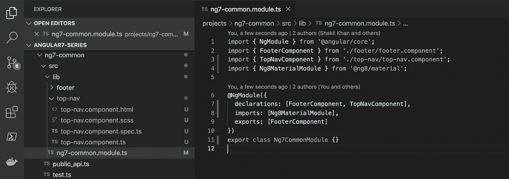

导入 Ng8MaterialModule

现在，让我们使用`MatToolbar`组件创建`TopNavComponent`模板。

我还在`top-nav.component.scss`中添加了一行`css`代码来合成导航按钮的位置。

```
.menu-spacer {
  flex: 1 1 auto;
}
```

最后，我从`Ng7CommonModule`导出这个`TopNavComponent`。

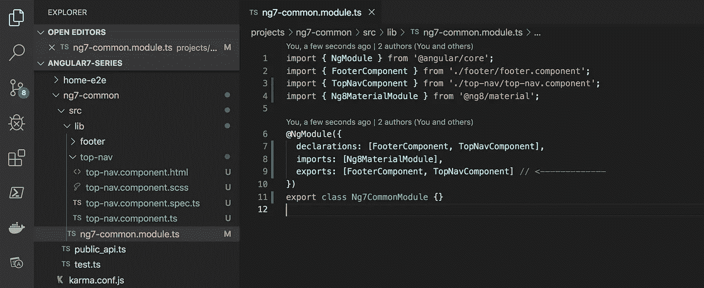

我们还需要通过`public_api.ts`导出`TopNavComponent`。有关详细信息，请学习 [Angular 7 系列第 2 部分:创建自定义库](https://medium.com/better-programming/angular-7-series-part-2-create-custom-library-8d7a0494b2cc)中的步骤 10:从库中导出组件。

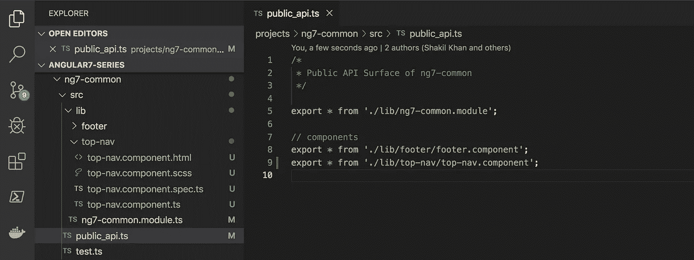

导出顶部导航组件

## 11.构建库

现在，我使用`npm run library:build`命令构建我们两个库。构建成功，但有一个警告日志:

```
No name was provided for external module '[@ng8/material](http://twitter.com/ng8/material)' in output.globals – guessing 'material'
```

要解决这个问题，您可以遵循 [Angular 7 系列第 2 部分:创建自定义库](https://medium.com/better-programming/angular-7-series-part-2-create-custom-library-8d7a0494b2cc)中的“一些难点”一节。

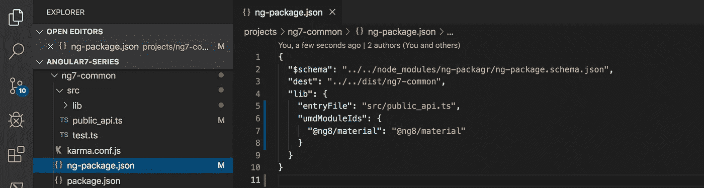

## 12.在主应用程序中包含 TopNavComponent

我正在`app.component.html`模板的顶部添加`<ng7-common-top-nav></ng7-common-top-nav>`。最后，使用`npm run home:client`命令运行`home`应用程序。

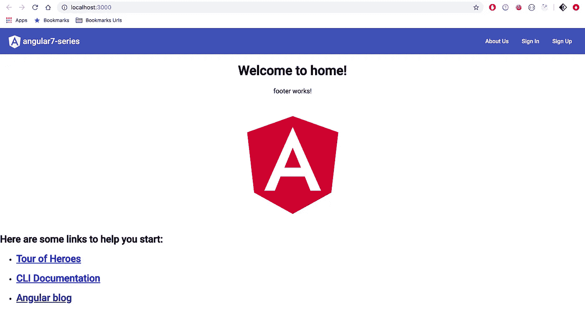

民用

# 资源

*   [这一块的源代码](https://github.com/mkhan004/angular7-series)。
*   要了解更多关于角状材料的信息，请访问他们的文档。

# 其他文章

*   [Angular 7 系列第 1 部分:创建企业级应用](https://medium.com/better-programming/angular-7-series-part-1-create-enterprise-level-application-36c84786fa27?source=post_page---------------------------)
*   [Angular 7 系列第 2 部分:创建自定义库](https://medium.com/better-programming/angular-7-series-part-2-create-custom-library-8d7a0494b2cc)
*   [Angular 8 系列第 3 部分:升级到 Angular 8](https://medium.com/better-programming/angular-8-series-part-3-upgrade-to-angular-8-c08745131cb6)
*   Angular 8 系列第 5 部分:添加角度路由(即将推出)