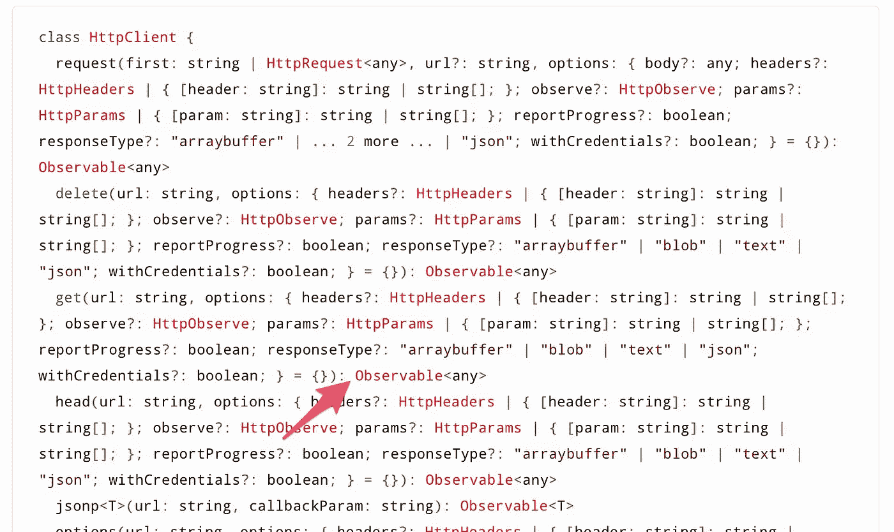

# 有棱角的 AJAX 接口并不像你想象的那样工作

> 原文：<https://betterprogramming.pub/angular-ajax-interfaces-dont-work-as-you-might-expect-fae73ad19f83>


本·怀特在 [Unsplash](https://unsplash.com?utm_source=medium&utm_medium=referral) 上拍摄的照片

当从 Angular web 应用程序提供 AJAX 通信时，最好的做法是编写一个 Typescript 接口。这样，您就可以设置希望从 JSON 接收的字段，并设置可观察对象来管理它。不管怎样，底层发生了什么并不清楚，可能会让你认为 Angular 实际上是将 JSON 键和值映射到接口上。

但事实并非如此。

# 我应该用一个接口代替<*any>吗？*

`HttpClientModule`使您能够使用通常在服务中注入的提供者`HttpClient`来执行 AJAX 请求。这种注入是使用角度依赖注入完成的，这是一种内置机制，可以将服务实例放入任何需要使用它的组件、服务或 Typescript 类中。

该服务使您能够调用`get`、`post`和其他方法来用任何方法触发 HTTP 请求。这些服务方法中的每一个都必须以不同的方式传递参数，因为我们希望将参数放在 HTTP 主体请求中(使用`POST`)或 HTTP 头中(例如，使用`GET`)。

当谈到可观察对象时，有趣的部分就来了，因为所有这些方法都有一个可观察对象作为返回类型。



所有 HttpClient 服务方法都返回 Observables

作为默认的内置实现，所有这些方法都用可观察对象处理`<any>` ,这意味着每个订阅这个可观察对象(然后触发它)的人都会收到一个`<any>`对象。

使用`<any>`对象从来都不是一个好主意，除非它在您的特定用例中有内在的意义。请记住，使用通用对象会导致完全非结构化的对象建模方法，并且很容易在代码中生成对字段和方法的错误引用。

因此，我们不使用`<any>`，而是使用 Typescript 接口来定义 JSON 结构，并将其映射到我们的应用程序中。

更好的是，我们可以实例化一个自定义类，而不是接口，这样我们就可以编写代码来实现方法和有用的东西，使我们的实例更加强大。

在一些应用程序中，这个动作被称为*序列化*(例如，将 JSON 序列化为模型)。我花了很多时间尝试在 Angular 中将 JSON 自动序列化为实例类，但是没有办法做到这一点，除非实现工厂设计模式或类似的东西。没有自动化允许它。即使您试图将处理 JSON 的可观察对象设置为一个类名，当您使用反射检查对象时，您将得到一个通用对象。这就是为什么大多数程序员使用工厂模式或助手方法来实例化一个类，而不是假装 Angular 会为你做这件事。

无论如何，如果你想了解更多关于建模接口的知识，请继续阅读。

# 隐藏和怪异的行为

一旦您将接口设置为由`HttpClient` Observable 处理，您会看到这样的情况:

```
import { Injectable } from '[@angular/core](http://twitter.com/angular/core)';
import { HttpClient } from '[@angular/common](http://twitter.com/angular/common)/http';
import { Observable } from 'rxjs';
import { AjaxResponse } from '../interfaces/ajax.interfaces';[@Injectable](http://twitter.com/Injectable)({
  providedIn: 'root'
})
export class AjaxService {endPoint = `/assets/mock.json`constructor(
    private http : HttpClient
  ) { }getCandies() : Observable<**MyInterface**>{
    return this.http.get<**MyInterface**>(`${this.endPoint}`)
  }}
```

你必须记住的第一件事是，由可观察对象处理的类型的表达式实际上并没有做多少事情。

记住，通过 HTTP 和`XmlHttpRequest`传递的任何东西都只是一个非结构化的对象，反映了 MIME 类型 application/JSON。这就是为什么 Observable 处理`<any>`而不是一个类型化的泛型。无论谁遇到该接口，都可以访问该接口提供的字段，而不是`<any>`字段。但是还有更多…

如前所述，接口的指示形式化了可观察的数据，但它不会删除或丢弃任何超出的信息。因此，即使您将接口设置为有三个 JSON 键，您也将获得并在 JVM 内存中保存 web 服务器发送给您的所有内容。

这基本上不受您的控制，因为这是 Javascript 和 AJAX 的固有行为:JavaScript 只是获取一切并将其传递给应用程序上下文。如果你曾经认为 Angular 会从内存中清除任何你没有说过要继续使用接口字段的东西，你会发现这不会发生。

测试它很容易:发出一个 AJAX 请求，使用一个带有一些字段的接口，并使用一个 web 服务作为端点，它将向您发送比预期更多的内容。现在试着`console.log`一下界面，你会看到里面会包含你收到的所有东西，就好像你根本没用过这个界面一样。

# 结论和安全考虑

注意这种角度行为，因为它可能会背叛你的假设。

有时候，在应用程序执行期间，来自 AJAX 的数据会在内存中浮动很长时间——这取决于您如何使用接口实例以及它的作用域何时结束。

当你使用一个远程 API 时，不要假装只得到你的接口定义的东西，因为你将得到所有的东西。

丢弃不需要的数据的唯一方法是使用我提到的第一种方法。如果您在 Angular 组件中获取即将到来的数据(甚至使用接口),并实例化您的定制模型，那么一旦接口范围结束，接口就会释放内存。

请记住，JSON 可能在底层启动的函数中包含恶意代码，而您甚至不应该在内存中包含这些代码。