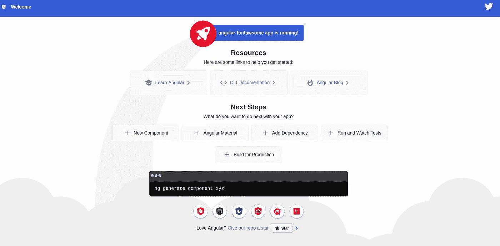
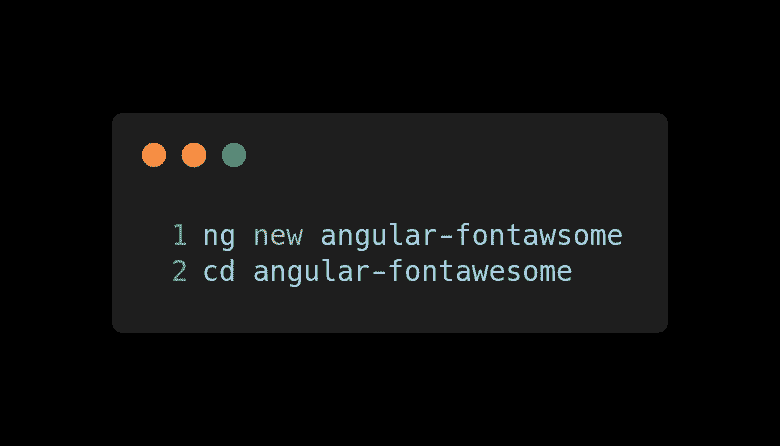
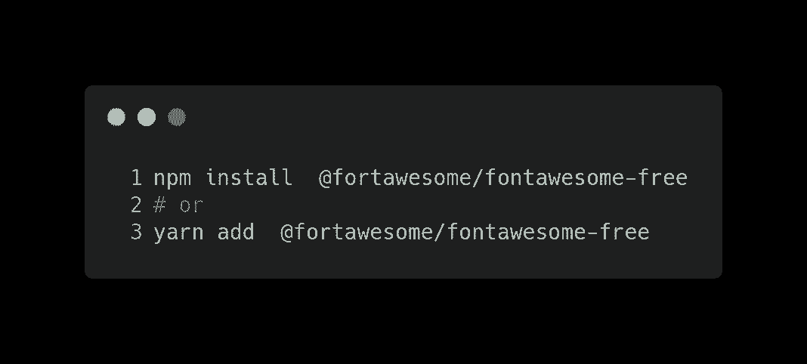
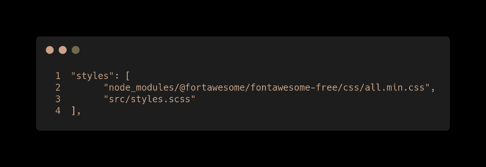
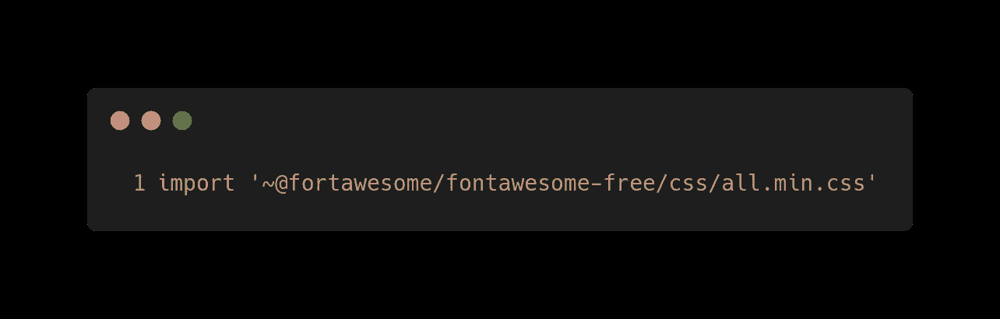

# 在 5 个简单的步骤中完成棱角分明的字体

> 原文：<https://betterprogramming.pub/angular-and-font-awesome-in-5-easy-steps-e7b97dbffb16>

## 循序渐进的角度教程


[Clem Onojeghuo](https://unsplash.com/@clemono2?utm_source=unsplash&utm_medium=referral&utm_content=creditCopyText) 在 [Unsplash](https://unsplash.com/search/photos/icon?utm_source=unsplash&utm_medium=referral&utm_content=creditCopyText) 上的照片

Font Awesome 是互联网上最受欢迎的图标工具包，经过重新设计，从零开始构建。

除此之外，还有图标字体连字、SVG 框架、面向 React 等流行前端库的官方 npm 包，以及对新 CDN 的访问。

在这篇文章中，我将向你展示如何配置字体牛逼，只用五个步骤就可以在 Angular 中使用。

在这些步骤中，我们将在不使用特定的[角度包](https://github.com/FortAwesome/angular-fontawesome)的情况下配置 Font Awesome。在未来的帖子中，它将使用官方包进行配置，这甚至更简单，我们将让 Font Awesome 与相同的 Angular 生态系统一起工作。



# 步骤 1:初始化您的项目

如果你正在考虑在你的 Angular 项目中使用字体 Awesome，你可能已经有了一个初始化的项目。然而，对于本教程，让我们从头开始一个项目。



# 第二步:安装字体真棒

装字体牛逼。



# 第三步:加入牛逼字体

有几种方法可以将字体 Awesome 包含在我们的项目中:

1.  打开`angular.json`并在样式数组中插入一个新条目:



2.打开`styles.scss`并在文件中插入一个新条目:



# 步骤 4:添加字体牛逼 CSS 类

打开模板的组件，在任何 HTML 元素中添加字体 Awesome CSS 类:


# 第五步:运行你的应用程序

运行您的应用程序:

```
ng serve
```

# 资源

*   [字体牛逼](https://github.com/FortAwesome/Font-Awesome)
*   本岗位的 [GitHub 分支](https://github.com/Caballerog/angular-fontawesome-1)。