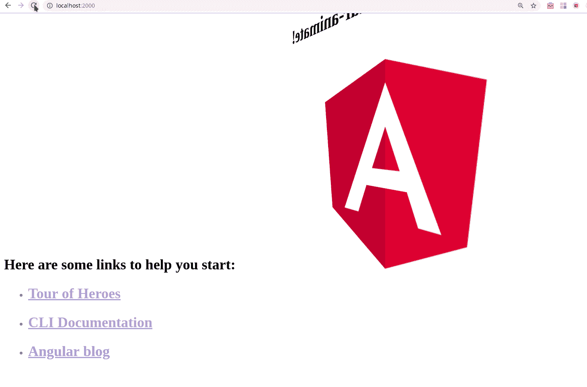
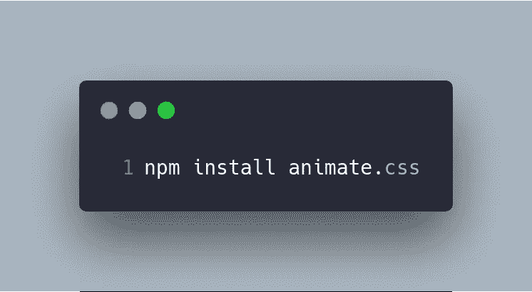
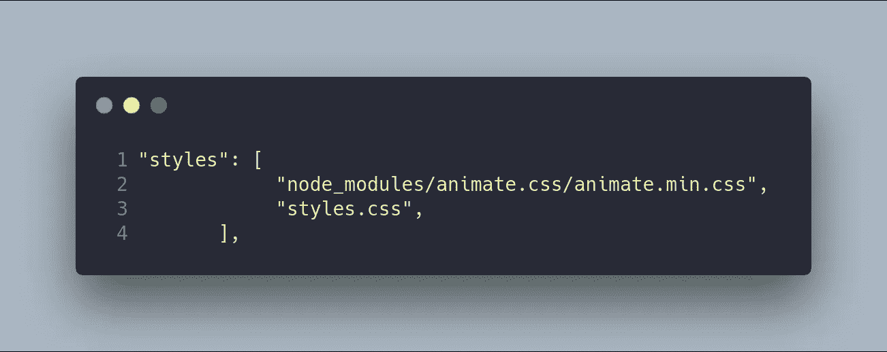
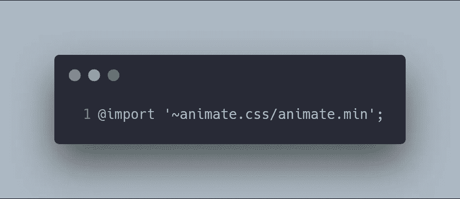
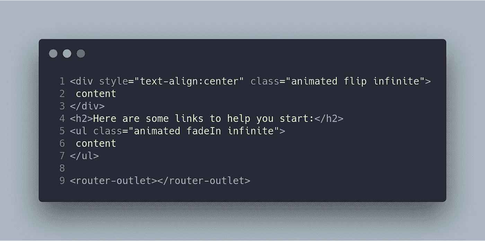

# Angular + Animate.css 五个简单步骤

> 原文：<https://betterprogramming.pub/angular-animate-css-in-five-easy-steps-624b337169ad>

## 循序渐进的角度教程



[Animate.css](http://daneden.github.io/animate.css) 是一个跨浏览器的 css 动画库，非常容易使用。

在这篇文章中，我将向你展示如何通过五个步骤来配置 Animate.css 以用于 Angular。

# 步骤 1:初始化您的项目

如果您正在考虑在 Angular 项目中使用 Animate.css，您可能已经有了一个初始化的项目。然而，对于本教程，让我们从头开始我们的项目。


# 第二步。安装 Animate.css

安装`animate.css`。



# 第三步。包含 Animate.css

有几种方法可以将 Animate.css 包含在我们的项目中:

1.  打开`angular.json`并在样式数组中插入一个新条目:



2.打开`styles.css`并在文件中插入一个新条目:



# 第四步。添加动画 CSS 类

打开模板的组件，将动画 CSS 类添加到任何 HTML 元素中:



# 第五步。运行您的应用程序！

运行您的应用程序:

```
ng serve
```

# 越来越多越来越多…

*   [Animate.css](https://daneden.github.io/animate.css/)

本岗位的 **GitHub** 分部为[https://github.com/Caballerog/angular-animate.css](https://github.com/Caballerog/angular-animate.css)