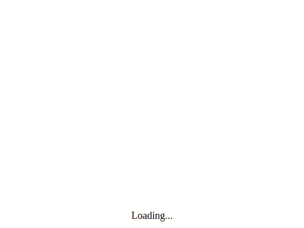

# 装载机的角度应用

> 原文：<https://betterprogramming.pub/angular-application-with-loaders-216390c6da92>

## 在显示内容之前，让用户知道您的应用程序正在加载


加载时如何生成图像。io

# 为什么您应该总是使用装载机

加载器，也称为加载指示器，在几个方面有所帮助。

首先，用户不必盯着空白的屏幕等待你的应用程序启动。盯着空白页看太久会让人怀疑这一页是否有效。这可能会导致用户刷新页面—您的整个应用程序又要从头开始下载。这可能会造成永无止境的挫败感。最终用户可能会离开你的网站，我们不希望这样！我们希望快乐的用户会留下来，是忠诚的！

其次，加载器防止在加载资源时页面上显示持续的变化。这些微小的变化会扰乱布局——页面会闪烁、改变颜色和字体，或者元素会改变位置。如果其中一个元素的加载时间比另一个长，用户的操作可能会被中断。同样，这会导致沮丧和负面情绪，导致用户不再希望使用该应用程序。

让我们继续看看如何实现加载器并让我们的用户满意！

# 初始加载屏幕

当应用程序正在下载并且`app-root`标签仍然为空时，可以显示第一个加载屏幕。我们可以通过在`index.html`文件中添加`style`元素，用一些 CSS 技巧来实现这一点:

```
<style type="text/css">
  app-root:empty::after {
    content: "Loading...";
    position: absolute;
    display: block;
    top: 50%;
    left: 50%;
    font-size: 20px;
    transform: translate(-50%, -50%);
  }
</style>
```

它检查我们的`app-root`元素是否为空，并显示`Loading...`文本。在应用程序被下载后,`app-root`被初始化，并根据您的应用程序逻辑填充其余的元素。但这意味着应用程序可能会开始下载一些外部资源(徽标、样式)并开始应用它们。

如果外部请求检索应用程序的某种配置，那么我们可以使用 Angular `APP_INITIALIZER`并在初始化应用程序时加载该信息。这可以解决一些我们必须订阅响应`Promise/Observable`的情况。

# 加载应用外部资源的屏幕

## 加载样式

应用程序可以下载必须在第一页(或任何其他页面)向用户显示的外部样式/字体/图像。在大多数情况下，这些资源是并行下载的，这意味着页面会随着时间的推移而发生明显的变化。下面是它可能的样子:



缓慢的例子来看变化

正如你所看到的，首先我们看到的是黑色文本，只有在这之后才应用样式和字体。在日常情况下，这种转换取决于互联网速度，可能不太明显，但它仍然会产生一些闪烁。

为了解决 loader 的这个问题，我们首先需要了解我们的应用程序是如何处理资源的。在我的例子中，我为外部样式创建了一个新的`link`元素，它基于可以由单独的请求检索的配置，将`link`处理部分的内容留给浏览器。这允许基于后端配置应用远程样式。然而，这产生了一个小问题:添加`link`元素并不意味着样式被加载——浏览器仍然会尝试下载并应用这些样式。我们可以通过为`load`事件添加一个事件监听器来解决这个问题，并标记我们的样式已加载。

```
const stylesheet = document.createElement('link');

stylesheet.addEventListener('load', () => {
  this.isStylesLoaded = true;
});

stylesheet.rel = 'stylesheet';
stylesheet.href = this.configurationService.getConfig().style + '.css';

document.getElementsByTagName('head')[0].appendChild(stylesheet);
```

## 加载字体

如果您使用 scss 或 sass，那么可能会出现从其他位置导入字体的情况，这可能会产生问题。我们不能简单地检测它们何时被下载——浏览器对此有实验性的功能——但是 Angular 还不支持它们。为了解决这个问题我们可以使用`[webfontloader](https://github.com/typekit/webfontloader)`。这是一个小库，允许加载外部字体，并让我们能够检测它们何时被加载。我们可以简单地将这个库导入到我们的应用程序中，然后像这样使用它:

```
import { Component, OnInit } from '@angular/core';

import * as WebFontLoader from 'webfontloader';

@Component({
  selector: 'app-root',
  templateUrl: './app.component.html',
  styleUrls: ['./app.component.scss']
})
export class AppComponent implements OnInit {
  isFontsLoaded = false;

  constructor() { }

  ngOnInit(): void {
    WebFontLoader.load({
      active: () => {
        this.isFontsLoaded = true;
      },
      google: {
        families: ['Monoton']
      }
    });

  }

}
```

## 创建加载屏幕

现在我们可以在应用程序 HTML 文件中使用这两个参数`isFontsLoaded`和`isStylesLoaded`，在这里我们想要显示一个加载屏幕。下面是最简单的方法:

```
<div style="text-align:center" *ngIf="isFontsLoaded && isStylesLoaded; else loading">
  <h1>Welcome to {{ title }}!</h1>
  <h2>Current style: {{ style }}</h2>
</div>

<ng-template #loading>
  <div class="loader">
  </div>
</ng-template>
```

就是这样！最终结果中间不会有任何黑色文本，用户将会看到`Loading…`以及之后的完全加载的内容。不再有挫败感，消极思想，内容跳跃和闪烁。使用你的应用程序只是纯粹的快乐！[可以在 github](https://github.com/b-pagis/angular-remote-styles) 找到完整的代码示例。

# 结论

加载器通过防止用户看到某些时候不应该看到的东西，对用户产生了积极的影响。如果使用正确，它们还可以指示加载的进度，这意味着用户将知道应用程序正在启动，他不需要刷新页面或询问网站是否真的在工作。通过消除消极的想法，我们创造了幸福。满意的用户往往比思想灰暗的用户更忠诚！

*示例是用 Angular 8 编写的，但通用方法应该也适用于以前和即将推出的版本*。

# 来源

[](https://github.com/b-pagis/angular-remote-styles) [## b-pagis/angular-remote-style

### 颜色和字体由外部配置控制的小例子。配置服务包含两个…

github.com](https://github.com/b-pagis/angular-remote-styles) [](https://github.com/typekit/webfontloader) [## typekit/webfontloader

### 当通过@font-face 使用链接字体时，Web 字体加载器为您提供额外的控制。- typekit/webfontloader

github.com](https://github.com/typekit/webfontloader) [](https://www.npmjs.com/package/ng-http-loader) [## ng-http-loader

### 请用叉子阅读变更日志，卢克。没有测试的 PR 可能不会被合并。要安装此库，请运行…

www.npmjs.com](https://www.npmjs.com/package/ng-http-loader) [](https://developers.google.com/web/fundamentals/performance/optimizing-content-efficiency/webfont-optimization?hl=en) [## 网络字体优化|网络基础|谷歌开发者

### 排版是好的设计、品牌、可读性和易访问性的基础。网络字体支持以上所有功能…

developers.google.com](https://developers.google.com/web/fundamentals/performance/optimizing-content-efficiency/webfont-optimization?hl=en)