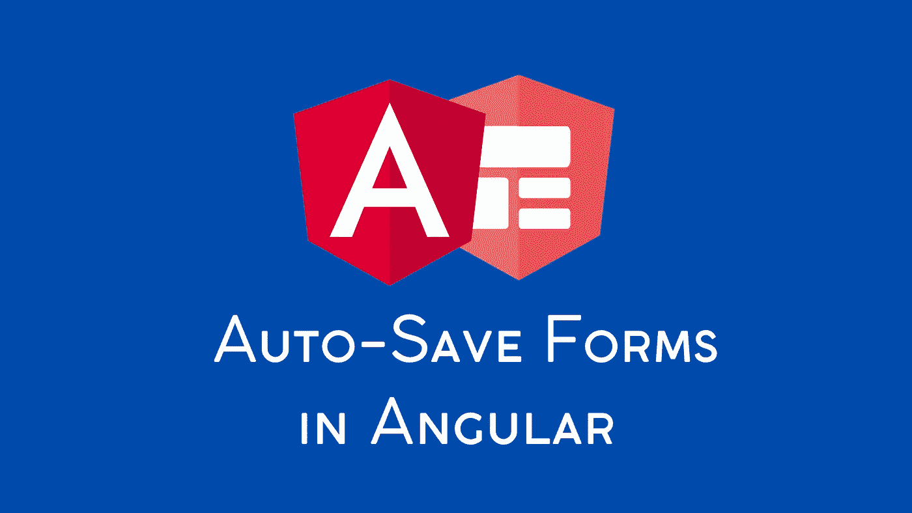

# 如何在 Angular 中创建自动保存表单

> 原文：<https://betterprogramming.pub/angular-auto-save-forms-1a396d17ed7d>

## 角度自动保存表单| RXJS 运算符

## 使用 RxJs 和 Angular 材料创建反应式和模板驱动的自动保存表单的简要指南

使用 Canva 创建的照片—资源来自 [Angular 新闻包](https://angular.io/presskit)

在本文中，我们将研究如何在 Angular 中创建自动保存的表单。我们将实现这个特性及其所有的功能，比如开关、显示小吃店通知等等。

在这个过程中，我们将探索几个 RxJs 操作符。我们将从实现反应式表单的特性开始。最后，我们将看到模板驱动的表单需要什么样的改变。

所以，让我们开始吧！

# 概观

在我们深入细节之前，让我们快速看一下演示应用程序。

该表单有两个输入字段:用户的名和姓。它有一个“保存”按钮，如果表单有效，该按钮将被启用。最后，如果启用了自动保存，每当用户更改任何值时，加载栏就会出现在表单的底部。代码如下:

你可能已经注意到了，我们使用有棱角的材料。要安装它，只需要运行:`ng add @angular/material`。

# 启用/禁用自动保存功能

实现自动保存功能的切换非常容易。

首先，我们在`AppComponent`中声明一个`boolean`变量`autoSaveEnabled`。

然后，我们使用`mat-slide-toggle`元素上的`[(ngModel)]="autoSaveEnabled"`双向绑定该变量。接下来，我们将变量作为输入传递给包含表单的`UserProfile`组件。

我们通过实现`[OnChanges](https://angular.io/api/core/OnChanges)`生命周期钩子来处理`autoSave`输入属性的值变化。我们将`changeDetection`设置为`[OnPush](https://angular.io/guide/change-detection-skipping-subtrees#using-onpush)`,这样当这个组件的输入属性值发生变化时，就会触发这个组件的变化检测。我们定义了`ngOnChanges`方法来根据属性值启用或禁用自动保存(稍后将详细介绍)。

# 自动保存表单

我们需要问的问题是“什么时候”？我们希望什么时候自动保存表单？

我们希望在满足以下所有条件时实现这一点:

1.  自动保存已启用
2.  用户更改了一个值
3.  表格是有效的

条件#1 已经在前面的部分中实现了。其余的在`enableAutoSaving`方法中实现。那么，让我们来看看。

为了在用户更改值时自动保存表单(条件#2)，我们需要订阅表单的`valueChanges` observable。

从官方文档来看，`[valueChanges](https://angular.io/api/forms/AbstractControl#valueChanges)`是“每当控件的值在 UI 中或以编程方式改变时，发出一个事件的多播可观察对象”

*   在第 1 行，我们定义了`changesSubscription`来保存订阅。我们在第六行做作业。这将让我们在以后想要禁用该功能时取消订阅。
*   在第 2 行和第 3 行，我们定义了一个`BehaviorSubject`及其相应的可观察值，用于显示或隐藏加载栏。
*   在第 7 行，如果表单无效，我们过滤并停止任何发出的值(条件#3)。保存无效值没有意义。
*   在第 8 行，假设用户输入了使表单有效的内容，我们发出`true`，因此显示加载栏。
*   在第 9 行，我们使用时间跨度为 1000 毫秒(=1 秒)的`[debounceTime](https://rxjs.dev/api/operators/debounceTime)`操作符。除非用户停止输入超过一秒钟，否则可观察对象不会发出信号。我们给用户时间在打字时做出反应、暂停或思考。
*   在第 10–11 行，我们使用了`switchMap`操作符，它是一个高阶映射操作符。它将用户数据从表单传递给`UsersService`的`saveUser`方法，并期待一个可观察的。该方法确实返回一个可观察对象，`switchMap`自动订阅和取消订阅该对象。
    这被称为“内部可观察对象”，因为它嵌套在另一个可观察对象`valueChanges`中，后者被称为“外部可观察对象”最后，如果在 HTTP 请求完成之前发出了另一个值，那么`switchMap`会取消该请求以支持新的请求。
*   在第 12 行，我们在内部可观察对象上使用了`finalize`操作符。当这个观察完成时(正常或由于错误)，我们发出`false`来隐藏加载栏。
*   在第 15 行，我们终于从`subscribe`到`valueChanges`。

在下面的`saveUser`方法中，我们使用`catchError`和返回`EMPTY`来避免将任何错误从内部(`switchMap`)可观察传播到外部(`valueChanges`)可观察。

如果我们允许这种情况发生，可观察性将会完成，我们将需要重新订阅来监听值的变化。

最后，当我们需要禁用该特性时，我们调用`disableAutoSaving`方法来取消订阅`changeValues`可观察对象。

# 观察表单状态的变化

不幸的是，我们还没有完成。

假设用户已经填写了表单并且现在是有效的。然后，他们反复按“退格”键，直到其中一个字段为空。表单变为无效，但最后的更改(带有最后一个剩余字符的更改)不会被取消。

是的，这是一个次要的细节，但这些细节使差异！

我们需要观察表单状态的变化并相应地采取行动。为此，我们需要订阅表单的`statusChanges` observable。

*   在第 1 行和第 4 行，我们定义并设置了`statusSubscription`变量，就像我们对`changesSubscription`所做的一样。
*   在第 5 行，我们使用`distinctUntilChanged`操作符，当表单从有效变为无效时，只允许发出不同的状态值，反之亦然。
*   在第 6 行，我们使用`pairwise`操作符将以前和当前发出的值配对。在第 7 行，我们使用`tap`操作符来使用这个对。
*   在第 8-10 行，如果表单的状态从`VALID`变为`INVALID`，我们调用`disableAutoSaving`。这取消了`changesSubscription`，因此没有请求被分派。问题已解决！
*   在第 12–15 行，如果表单是`VALID`且`changesSubscription`关闭，即如果自动保存先前被禁用，我们启用自动保存。
*   在第 14 行，我们在表单上显式调用`updateValueAndValidity`。如果我们不这样做，使表单再次有效的第一个更改将不会自动保存。这是因为这个特定的变化发生在调用`enableAutoSaving`之前，在这个方法中，我们订阅了`changeValues`可观测值。
*   在第 17 行，我们最终订阅了可观察的。

当我们禁用自动保存特性时，我们必须调用`disableStatusWatching`方法来取消订阅`statusChanges`观察值。

最后，我们实现了`OnDestroy`生命周期挂钩。我们在`ngOnDestroy`方法中取消订阅这两个订阅，以避免任何内存泄漏。

好了，现在我们完成了！😅

和往常一样，你可以在下面的 StackBlitz 找到一个工作演示，或者只在[这个 GitHub 库](https://github.com/kagklis/ng-autosave-forms.git)中找到源代码。

别忘了订阅我的时事通讯，关注更多类似的内容！

# 模板驱动的表单呢？

我们看到了这是如何与反应形式一起工作的。我们能自动保存模板驱动的表单吗？当然可以！我们只需要做一些改变。

首先，我们需要导入`FormsModule`(如果还没有导入)。通过导入`[FormsModule](https://angular.io/api/forms/FormsModule)`，所有`<form>`标签上的`NgForm`指令变为活动状态。我们不需要添加任何特殊的选择器。

但是我们如何倾听价值和地位的变化呢？嗯，我们需要拿到表格。

我们使用`ngForm`作为键将指令导出到一个本地模板变量中。我们还使用`ngModel`和`name`属性注册子控件。

接下来，我们通过使用组件类中的`@ViewChild`装饰器来获取表单的引用。就是这样！我们现在可以使用这个引用，做我们到目前为止看到的事情。

注意到第 19 行奇怪的语法了吗？不，这不是打印错误。

`NgForm`指令创建一个顶级`[FormGroup](https://angular.io/api/forms/FormGroup)`实例，并将其绑定到一个表单，以跟踪聚合表单值和验证状态。这个`FormGroup` 实例可以通过`form`属性来访问。

但是`NgForm`没有提供`updateValueAndValidity`方法或任何其他方式来强制更新表单。因此，我们使用这种变通办法。

您可以在 GitHub 和 StackBlitz 上的单独分支中找到前面链接中的源代码。

# 结论

在本文中，我们演示了如何在 Angular 中创建自动保存的表单。在此期间，我们使用并解释了几个 RxJs 操作符。最后，我们强调了反应式表单实现和模板驱动表单实现之间的区别。

我希望你喜欢这篇文章，并且你学到了一些新的东西。

*感谢阅读。敬请关注更多内容。*

***延伸阅读:***

 [## 角形定制管道——终极指南

### 如何在 Angular 中创建自定义管道，什么是纯管道和不纯管道，以及如何使用纯管道来改善

javascript.plainenglish.io](https://javascript.plainenglish.io/custom-pipes-in-angular-the-ultimate-guide-e54bb400e3ce)  [## 角度截击机:完全指南

### 什么是角拦截器？它是如何工作的？如何创建一个并提供给应用程序？如何绕过它们…

javascript.plainenglish.io](https://javascript.plainenglish.io/angular-interceptors-a-complete-guide-7294e2317ecf)