# Angular:用 NgRx 构建 CRUD 应用程序

> 原文：<https://betterprogramming.pub/angular-building-a-crud-application-with-ngrx-40e5f1c0b50c>

## 在 Angular 中构建一个简单的课程管理系统

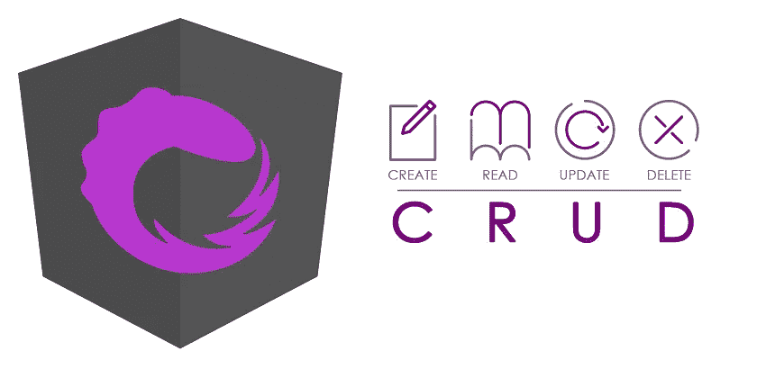

# 介绍

在我之前的文章中，我解释了 [NgRx](https://ngrx.io/) 的基本概念以及它们是如何结合在一起的。现在，是时候构建一个以 NgRx 作为状态管理系统的迷你 CRUD 应用程序了。

如果你是 NgRx 世界的新手，我建议你在尝试本教程之前看看我以前的帖子。在本文中，我不会详细讨论底层的 NgRx 概念。

# 项目详情

在这篇文章中，我们将构建一个简单的课程管理系统。如下所示，您将能够通过这个简单的 web 应用程序在课程实体上执行所有 CRUD 操作。


## 项目结构

如下图所示，我们的应用程序将由两个主要模块组成，即`App`和`Course`。课程模块将有两个定制组件，即`Course List`和`Create Course`。


## REST API

一般来说，Angular 应用程序与 REST API 交互，对数据执行 CRUD 操作。

因此，我在 Spring Boot[中实现了一个简单的 REST API，它公开了下面的端点。我们将使用这个 API 从 Angular 应用程序进行连接，并执行数据操作。](https://spring.io/projects/spring-boot)

```
// Retrieve all courses
GET     [http://localhost:8080/api/courses](http://localhost:8080/api/courses)// Create a course
POST    [http://localhost:8080/api/courses](http://localhost:8080/api/courses)// Delete a course
DELETE  [http://localhost:8080/api/courses/{courseId}](http://localhost:8080/api/courses/{courseId})// Update a course
PUT     [http://localhost:8080/api/courses/{courseId}](http://localhost:8080/api/courses/{courseId})
```

## 完整源代码

您可以在 GitHub 上找到这个示例应用程序[的完整源代码。请注意，我还将 Spring Boot 应用程序(REST API)的可执行 JAR 文件(course-1.0.0-SNAPSHOT.jar)添加到了同一个存储库中。](https://github.com/sarindufit/angular-ngrx-example/tree/master/angular-ngrx-example)

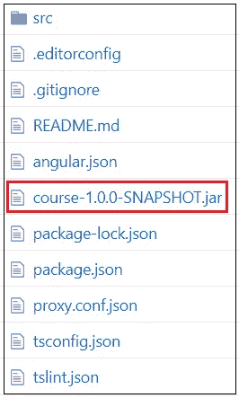

# NgRx 实体一览

您已经遇到了我将在本文中使用的大多数 NgRx 术语。例如，存储、效果、动作、选择器和缩减器。在本文中，我将介绍一个名为 [NgRx Entity](https://ngrx.io/guide/entity) ( `@ngrx/entity`)的新 NgRx 库。

NgRx 实体帮助我们管理应用程序中的各种数据实体。例如，在我们的应用程序中，`Course`是一个实体。它采用以下格式。

```
export interface Course {id: string;name: string;description: string;}
```

NgRx 实体库使得对存储在应用程序状态中的课程对象执行不同的操作(添加、更新、删除、选择)变得非常容易。让我们看看如何…

## 实体状态接口

实体库提供了一套工具，让我们的 NgRx 生活变得更加轻松。首当其冲的就是`EntityState`接口。`EntityState`的形状如下图所示。

```
interface EntityState<V> {
  ids: string[];
  entities: { [id: string]: V };
}
```

我们必须使用`EntityState`来声明我们的`courses`状态的接口。

```
import { EntityState } from '@ngrx/entity';export interface CourseState extends EntityState<Course> { }
```

当使用`EntityState`时，`courses`状态将采用以下格式。

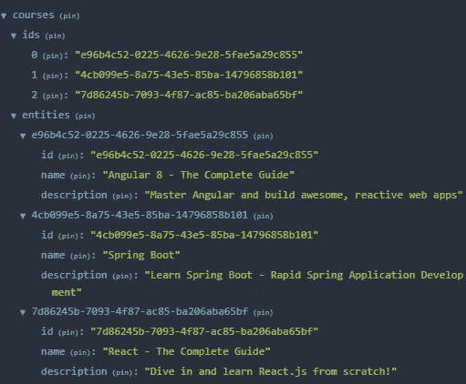

如您所见，它维护了一个课程 id 数组和一个课程对象字典。我们维护一个 id 列表和一个实体字典，而不仅仅是维护一个实体数组，主要有两个原因:

1.  我们希望快速查找特定的实体。如果您只想从商店中选择一门课程，使用实体字典比搜索数组要快得多
2.  我们还想维护列表的顺序。如果你想让列表保持有序，这一点尤其重要！

## 实体适配器

实体适配器是另一个与`EntityState`齐头并进的工具。它提供了一堆助手方法，使得对存储在`EntityState`中的数据执行各种操作变得非常容易。

这些辅助方法使 reducers 变得简单、有表现力和一致。您可以通过以下方式创建实体适配器。

```
import { createEntityAdapter } from '@ngrx/entity';
const courseAdapter = createEntityAdapter<Course>();
```

下面是适配器公开的与状态交互的一些非常有用的方法。

*   `addOne`:向集合中添加一个实体。
*   `addMany`:向集合中添加多个实体。
*   `addAll`:用提供的集合替换当前集合。
*   `removeOne`:从集合中删除一个实体。
*   `removeMany`:通过 I 或谓词从集合中删除多个实体。
*   `removeAll`:清除实体集合。
*   `updateOne`:更新集合中的一个实体。
*   `updateMany`:更新集合中的多个实体。
*   `upsertOne`:添加或更新集合中的一个实体。
*   `upsertMany`:添加或更新集合中的多个实体。
*   `map`:通过定义一个映射函数来更新集合中的多个实体，类似于`Array.map`。

# 设置项目

## 使用的软件版本

*   角度 CLI: 8.0.1
*   节点:11.6.0
*   角度:8.0.2
*   NgRx: 8.6.0
*   引导程序:4.4.1

## 项目初始化

步骤 1:执行下面的命令并创建一个新项目。

```
ng new angular-ngrx-example
```

步骤 2:我们将使用 [Bootstrap](https://getbootstrap.com/) 向我们的应用程序添加样式。您可以使用下面的命令安装引导程序。

```
npm install bootstrap --save
```

步骤 3:通过更新`angular.json`文件导入引导程序，如下所示。

步骤 4:安装 NgRx 依赖项。

```
npm install [@ngrx](http://twitter.com/ngrx)/{store,effects,entity,store-devtools,schematics} --save
```

# 向根模块添加 NgRx 支持

执行以下 schematics 命令，生成初始状态管理，并将其注册到`app.module.ts`中。

```
ng generate [@ngrx/schematics](http://twitter.com/ngrx/schematics):store State --root --statePath store/reducers --module app.module.ts
```

执行完上述命令后，您的项目文件夹结构应该如下所示。

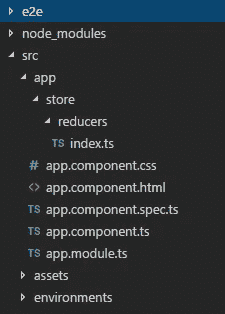

以下是`index.ts`文件的内容。请注意，我对自动生成的文件做了一些小的修改。比如，为了清晰起见，我把`State`界面改成了`AppState`。

NgRx schematics 命令也将更新`app.module.ts`文件。以下是该文件的更新内容。

# 创建和设置“课程”功能模块

## 生成“课程”模块

如前所述，我们的应用程序由两个主要模块组成，即`App`和`Course`。现在是用下面的命令创建`Course`模块的时候了。

```
ng generate module course
```

上述命令将在`app`文件夹下直接创建一个名为`course`的子文件夹。此外，一个名为`course.module.ts`的新文件将被创建并放置在`app/course`文件夹下。

以下是`course.module.ts`文件的初始版本。请注意，该文件将在下游进行修改，以添加 NgRx 支持、声明组件和声明服务提供者。

## 定义“课程”模型

下一步，您必须定义表示`Course`实体的模型接口。创建一个名为`course.model.ts`的文件，并将其放在`app/course/model`文件夹下。这个文件的内容应该如下所示。

## 定义服务类别

服务用于与 REST API 交互并执行数据操作。为了定义服务类，创建一个名为`course.service.ts`的文件，并将其放在`app/course/services`文件夹下。

这个文件的内容应该如下所示。

如您所见，它有通过 REST API 检索、创建、更新和删除`Course`实体的方法。一旦定义了服务类，您必须在如下所示的`course.module.ts`文件中注册它。

下图说明了此时我们的应用程序的文件夹结构。

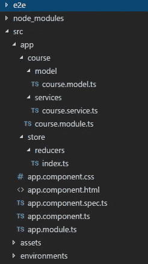

# 向“课程”模块添加 NgRx 工件

下一步，你必须定义动作、减少器、效果和选择器，并连接到`course`模块。这些工件将被创建在一个名为`store`的目录中，这个目录位于`app/course`目录下。

## 定义 NgRx 操作(course.actions.ts)

特别说明:

*   `loadCourses`、`createCourse`、`deleteCourse`和`updateCourse`是组件调度的自解释动作。然而，`coursesLoaded`是一个特殊的动作，将由效果调度，以便通知商店课程已成功加载。
*   `updateCourse`动作接受类型为`{update: Update<Course>}`的有效载荷。`Update`是 NgRx 实体提供的辅助类型，用于帮助建模部分实体更新。这个类型有一个属性`id`标识更新的实体，还有一个属性`changes`指定对实体做了哪些修改。

## 定义 NgRx 减速器(course.reducers.ts)

特别说明:

*   下面的代码片段通过扩展`EntityState`来定义`Course`状态。正如我们之前讨论的，`EntityState`维护一个 id 列表和一个实体字典。除了这两个属性，我们在这里定义了一个名为`coursesLoaded`的自定义属性。该属性主要用于指示课程是否已经加载到状态中。

```
export interface CourseState extends EntityState<Course> {  coursesLoaded: boolean;}
```

*   下面的代码片段创建了一个提供帮助函数的`Entity Adapter`。

```
export const adapter: EntityAdapter<Course> = createEntityAdapter<Course>();
```

*   初始状态定义如下。实体适配器提供了一个助手函数来获取初始状态。如你所见，我们最初将`coursesLoaded`属性设置为`false`。

```
export const initialState = adapter.getInitialState({  coursesLoaded: false});
```

*   下面的代码行导出了适配器提供给我们的几个预定义的选择器。这些选择器将被我们的自定义选择器使用。(我们将在定义选择器时研究这一点。)

```
export const { selectAll, selectIds } = adapter.getSelectors();
```

## 定义 NgRx 选择器(course . selector . ts)

特别说明:

*   这里，我们使用`selectAll`预定义的选择器以数组的形式检索所有的课程实体。
*   `areCoursesLoaded`选择器用于检查程序是否已经载入状态。这个选择器使用我们在`CourseState`中定义的`coursesLoaded`定制属性。

## 定义 NgRx 效果(course.effects.ts)

特别说明:

`createCourse$`、`deleteCourse$`和`updateCourse$`效果不言自明。它们只是调用相应的 REST 端点并执行操作。

这些效果不会将传入的动作映射到新的动作类型，这就是使用`{dispatch: false}` config 的原因。

但是，`loadCourses$`有一个特殊的行为。它接受类型`loadCourses`的动作，一旦通过 REST API 检索到课程，它就将响应映射到一个名为`coursesLoaded`的新动作类型。

检索到的课程列表被传递到`coursesLoaded`动作中。

## 在课程模块中注册 NgRx 工件

定义 NgRx 工件后，如下所示更新`course.module.ts`文件以添加`State`支持。

特别说明:

*   下面的代码行在课程模块的应用程序状态中创建了一个专用切片(`courses`),并将 reducers 附加到其上。

```
StoreModule.forFeature('courses', courseReducer),
```

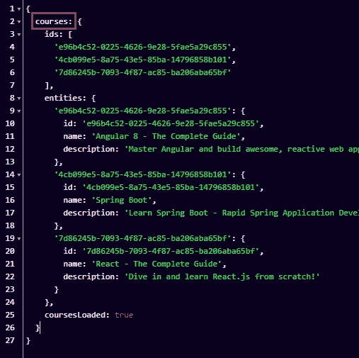

*   下面的代码行记录了课程模块状态下的效果。

```
EffectsModule.forFeature([CourseEffects])
```

现在，这个问题已经解决了，在这个阶段，你的项目文件夹结构应该如下图所示。

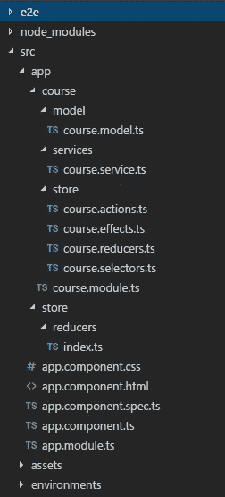

# 创建组件和定义路线

正如我们之前讨论的，我们的应用程序由两个主要模块组成，即`App`和`Course`。课程模块由两部分组成，即`courses-list`和`create-course`。

我们的下一步是创建这两个组件并定义相应的路由。注意，`courses-list`和`create-course`目录将被创建在`app/course/component`目录下。

## 定义“课程-列表”组件

模板:`courses-list.component.html`。

组件:`courses-list.component.ts`。

特别说明:

*   该组件负责简化列表、更新和删除操作。

## 定义“创建课程”组件

模板:`create-course.component.html`。

组件:`create-course.component.ts`。

## 在课程模块中声明组件

你必须在`course.module.ts`文件中声明上述组件。

## 配置路线

现在是时候定义路线并将相应的组件与这些路线相关联了。这必须在如下所示的`app.module.ts`中完成。

特别说明:

*   `CoursesListComponent`使用解析器获取数据。路径解析器确保组件在导航到特定路径之前可以使用数据。在这种情况下，解析器负责在完成到`/courses`的导航之前检索课程列表。

## 实施路径解析器(course.resolver.ts)

特别说明:

*   `areCoursesLoaded`自定义选择器用于检查数据是否已经加载到状态中。
*   只有当数据在状态中不可用时，才会调度`loadCourses`动作。
*   在`coursesLoaded`标志被设置为`true`之前，运营商链不会让值传递给订户。因此，在成功加载课程之前，应用程序不会导航到`/courses`路线。

## 定义路由器出口

作为最后一步，您必须在`app.component.html`中定义路由器出口。

在这个阶段，你的文件夹结构应该如下图所示。

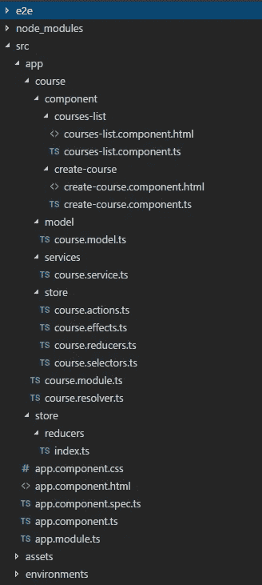

# 配置代理以访问 REST API

正如本文开头提到的，我们使用一个用 Spring Boot 编写的简单的 REST API 来连接 Angular 应用程序。

Spring Boot 应用程序在`localhost:8080`运行，而角度应用程序在`localhost:4200`运行。当 Angular 应用程序试图访问 REST API 时，这种不匹配将导致跨源资源共享(CORS)错误。为了解决这个问题，我们必须创建一个代理。

## 创建代理文件

在项目的根文件夹中创建一个名为`proxy.conf.json`的文件(与`package.json`文件在同一层)，并在其中添加以下内容。

## 注册代理文件

在 CLI 配置文件`angular.json`中，将`proxyConfig`选项添加到`serve`目标:

# 运行应用程序

应用程序应该分两步启动。您必须首先启动 Spring Boot 应用程序(REST API ),然后启动 Angular 应用程序。

## 运行 Spring Boot 应用程序(REST API)

Spring Boot 应用程序被打包成一个名为`course-1.0.0-SNAPSHOT.jar`的可执行 JAR 文件，放在[这里(GitHub)](https://github.com/sarindufit/angular-ngrx-example/blob/master/angular-ngrx-example/course-1.0.0-SNAPSHOT.jar) 。

注意，要执行这个 JAR 文件，您必须在系统上安装 Java 8。如果安装了 Java 8，您可以执行下面的命令并启动应用程序。

```
java -jar {path_to_the_jar_file}/course-1.0.0-SNAPSHOT.jar
```

如果应用程序成功启动，您应该会看到下面的日志。

## 运行角度应用程序

可通过执行以下命令启动角度应用。

```
ng serve
```

当应用程序成功启动时，从浏览器导航到`http://localhost:4200/courses`,您应该会看到下面的屏幕。

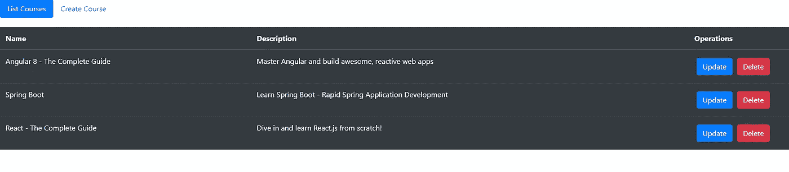

# 了解执行流程

## 检索课程

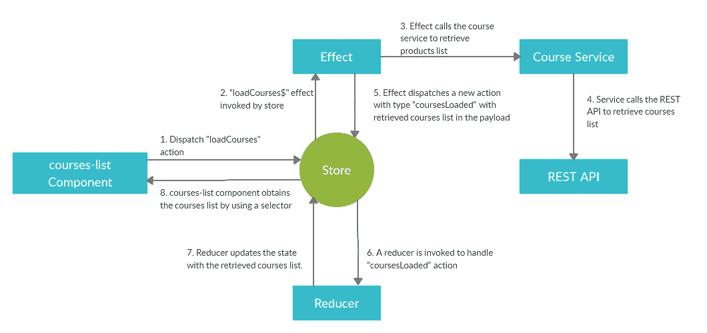

## 创建课程

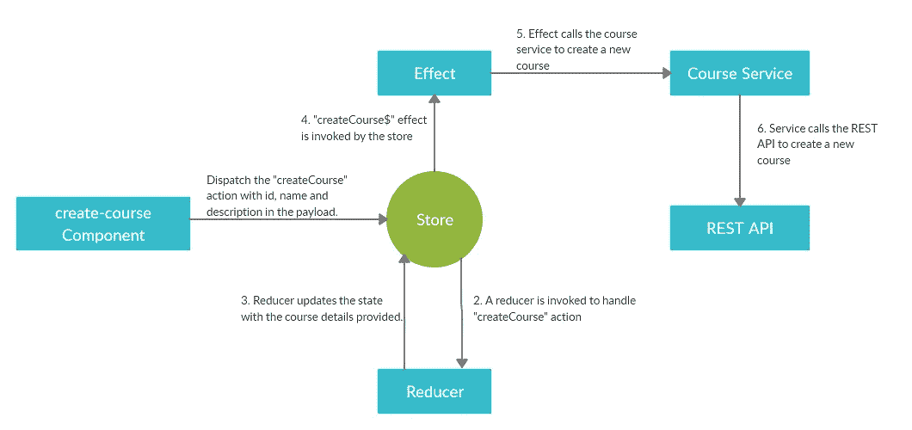

特别说明:需要注意的关键是 reducer 用新的数据更新状态(反过来 UI 也会更新)，甚至在效果调用 API 并实际在服务器中创建记录之前。

## 更新课程


特别说明:同样，reducer 用更新的课程数据更新状态(反过来，UI 也会更新)，甚至在效果调用 API 并实际更新服务器中的相关记录之前。

## 删除课程

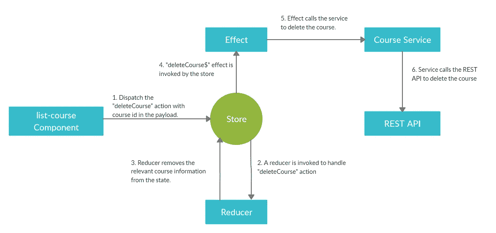

特别说明:类似于创建一个课程，更新一个课程，reducer 从状态中删除相关的课程信息(反过来 UI 也会更新)，甚至在效果调用 API，删除服务器中的相关记录之前。

## 乐观 UI

乐观 UI 是一种模式，您可以用它来模拟状态突变的结果，甚至在从服务器收到响应之前更新 UI。

在这个特定的应用程序中，我们遵循相同的模式。如上所述，当创建、更新和删除课程时，状态和 UI 甚至在从 REST API 接收到响应之前就被更新了。

# 结论

这个故事的主要目的是提供一个分步指南来构建一个基于 NgRx 的 Angular 应用程序。

正如上一节所解释的，我们已经使用乐观 UI 模式实现了这个迷你系统。

在我的下一篇文章中，我打算解释在基于 NgRx 的应用程序中使用乐观 UI 模式时如何进行错误处理。