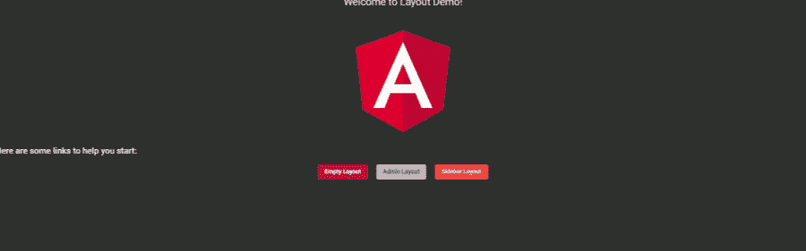

# Angular:与 LayoutModule 一致的 UI

> 原文：<https://betterprogramming.pub/angular-consistent-ui-with-layoutmodule-10516fd57a2f>

## 了解如何以较低的维护成本集中布局

图片由 [PIRO4D](https://pixabay.com/fr/users/PIRO4D-2707530/?utm_source=link-attribution&amp;utm_medium=referral&amp;utm_campaign=image&amp;utm_content=2011743) 从 [Pixabay](https://pixabay.com/fr/?utm_source=link-attribution&amp;utm_medium=referral&amp;utm_campaign=image&amp;utm_content=2011743) 获得

在一个应用程序中，我们经常会面临在某些页面之间设计不同的布局。一种布局用于登录，另一种用于管理员，第三种用于用户，依此类推。

也许，最终，你的应用程序中会出现`ngIf`，随着你的开发，它开始变得难以维护。

我们如何简化这一过程？通过创建 LayoutModule！

# 创建您的布局模块

首先，让我们创建 LayoutModule:

`ng g module layouts`

然后，生成您的布局，例如:

`ng g component layouts/empty-layout`

`ng g component layouts/admin-layout`

`ng g component layouts/sidebar-layout`

*注意:不要忘记在* `*AppModule*`中 `*AppRoutingModule*` *之前导入你的* `*LayoutModule*`

# *路由配置*

*在本例中，我将使用`app-routing.module.ts`来配置路线，以采用布局并将它们应用于路线组。*

*完成我们目标的关键是把布局作为我们孩子的基础。*

*我们的路线已经准备好了，但是我们仍然需要在我们的布局中添加`<router-outlet>`来应用儿童内容*

# *添加*

*该元素允许我们将内容放置在布局中所需的位置。例如，在不同的生成布局中:*

*现在，您已经拥有了创建不同布局和关注内容所需的一切！*

*最后，为了测试我们不同的布局，让我们生成一个新的组件 TestComponent，并包含我们的 AppComponent 的内容。这个组件代表了我们应用程序的子组件*

*并且不要忘记只将`<router-outlet>`添加到您的 AppComponent 中！*

**

*这是我们的最终结果*

# *它是如何工作的？*

*首先，当应用程序启动时，AppModule 将使用 NgModule 中的 bootstrap 属性启动 AppComponent。*

*AppComponent 只包含了`router-outlet`，所以它会把内容委托给 Angular 路由器。在我们的路由配置 AppRoutingModule 中，我们将子组件分组到我们创建的不同布局中。这使得布局中的每个子组件看起来都一样，我们可以将注意力转向子组件的内容。*