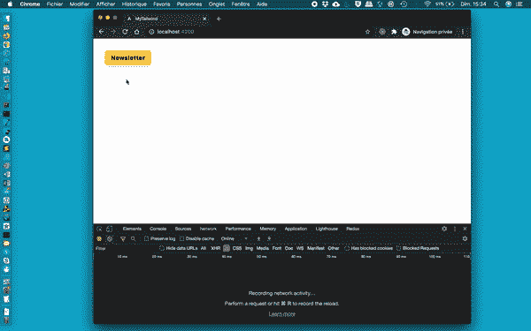

# 角度:创建一个懒惰加载的顺风模式

> 原文：<https://betterprogramming.pub/angular-create-a-lazy-loaded-tailwind-modal-73675c66acae>

## 用 Angular 和 Tailwind CSS 构建一个通用的、惰性加载的对话框


照片由[艾米尔·吉耶莫](https://unsplash.com/@emilegt?utm_source=unsplash&utm_medium=referral&utm_content=creditCopyText)在 [Unsplash](https://unsplash.com/?utm_source=unsplash&utm_medium=referral&utm_content=creditCopyText) 拍摄

我有机会参与[owly](https://owlly.ch/)，这是一个由 [Sandro Scalco](https://twitter.com/saandr0o) 创立的[开源](https://github.com/project-owlly)项目，旨在实现瑞士的数字民主。

上周，当我们讨论使用 [Scully](https://scully.io) 预渲染主要角度应用程序的需求时，我们也决定将其迁移到 [Tailwind CSS](https://tailwindcss.com/) 。

结果，我不得不创建一个定制的、通用的惰性加载模型。

# 元

本文已于 2020 年 11 月发表。该解决方案已经过 Angular v11 和 Tailwind v2 测试。

# 介绍

本教程描述了使用 Angular 和 Tailwind CSS 创建一个通用对话框。通过 *generic* ，我的意思是创建一个对话框的容器，它可以在应用程序中使用不同的内容重复使用几次，而不需要多次重写所有内容。

此外，过去和现在对我来说都很重要的是，modal 的内容是延迟加载的，以获得最佳性能。

# 添加顺风 CSS

我已经尝试了各种解决方案来将顺风 CSS 添加到 Angular 应用程序中，尽管有一个小的[问题](https://github.com/ngneat/tailwind/issues/16)可能很快就会得到解决，但是由团队 [ngneat](https://github.com/ngneat) 提供的[顺风示意图](https://github.com/ngneat/tailwind)是迄今为止我尝试过的最简单的方法。

```
ng add @ngneat/tailwind
```

运行上面的命令，按照提示，并享受。

# 服务

为了`open`和`close`任何模态，我们创建一个服务`modal.service.ts`。它负责这些操作，还负责将它们附加到 DOM `body`。

关于这个操作，老实说，我不知道如何用 Angular 来编码这些东西，我不得不在 google 上寻找解决方案。幸运的是，我找到了 Carlos Roso 的这篇很好的文章[,它描述了所需的步骤。](https://medium.com/hackernoon/angular-pro-tip-how-to-dynamically-create-components-in-body-ba200cc289e6)

最后，由于服务是在`root`中提供的，值得注意的是，我们在内存中保存了对当前附加的组件的引用，分别显示。这样，我们一次只允许一个模态。如果您需要同时显示多个元素，我建议您用数组而不是单个类变量来处理这些元素。

# 模态容器

为了初始化模态容器，我们创建了一个新的模块`modal.module.ts`。

然后我们添加相关的组件`modal.component.ts`，除了创建一个默认初始化为`true`的状态`display`并公开一个函数`close`之外，它没做什么。

由于我们延迟加载模态，这些模态将在创建时显示，因此默认状态分别是`open`，而不是关闭。

`close`函数包含一个小的`timeout`,这样，在被我们之前创建的服务从 DOM 中有效分离之前，模态首先以图形方式消失。

容器的 HTML 代码是从 Tailwind 提供的[免费叠加示例](https://tailwindui.com/components/application-ui/overlays/modals)中提取的。我们正在使用一个`section`，我们为其应用了一个`fixed`位置，并为其赋予了一个`10`的`z-index`。此外，我们也相应地设计了所需的空间、阴影和尺寸。

除了 UI 本身，值得注意的是，我们使用了角度内容投影功能`ng-content`，能够分别在模态中添加任何内容，使这个对话框成为一个通用容器。

我们还将`close`函数附加到该部分，并停止`$event`对其内容的传播；否则，每次单击或按下它的一个子对象时，模态就会自动关闭。

最后，我们用一些定制的 CSS 制作了样式类`open`的打开和关闭的动画。用一些顺风工具也许有可能实现这一点，但是我觉得用那种方式解决它更有信心。

```
section {
  visibility: hidden;
  opacity: 0;

  &.open {
    visibility: inherit;
    opacity: 1;
  }

  transition: opacity 250ms ease-in;
}
```

# 模态示例

设置好上面的服务和容器后，我们现在可以使用它们来创建任何模态了——例如，在下面的例子中，用户可以输入用户名。

请注意，该示例包含一个表单，但不是强制的。与此相反，真正**重要的**要注意:

我建议你**不要**为模块声明创建一个单独的文件，但是在这种特定的情况下，在同一个文件中声明它的模块作为组件。

您可能不会遇到和我一样的错误，但是由于我们使用了一堆在另一个单独的模块中声明和引用的核心组件，Angular 在构建时抱怨它无法解决这些问题，直到我最终发现在组件文件中添加模块可以解决构建问题。

除此之外，你的组件被投射到模态容器中，它基本上像其他独立组件一样工作。

如果你想添加一个按钮来从它的内容中关闭模态或者在一个函数完成后关闭它，你可以，如例子所示，使用一个`ViewChild`来访问容器并调用我们之前声明的`close`方法。

模板的关键是容器中内容的封装，在我们之前创建的`app-modal`组件中。至于组件的代码，没有什么特别需要注意的。

# 模式创建

最后，由于动态导入，我们可以按需加载我们的 modal 示例，因此只在需要的时候才获取相关代码。此外，我们使用我们的服务来`open`它并将其附加到 DOM 的`body`。

如果一切都如预期的那样工作，那么模态应该是延迟加载的，我们应该能够打开和关闭示例模态。



# 收场白

我真的很感激有机会被聘为自由职业者，在像 Owlly 这样的超级项目上进行合作。再次感谢桑德罗给我这个机会。我也希望这篇教程能对那些想用角度和顺风设置模态的人有所帮助，如果你有改进的想法，请告诉我！

到无限和更远的地方！

大卫