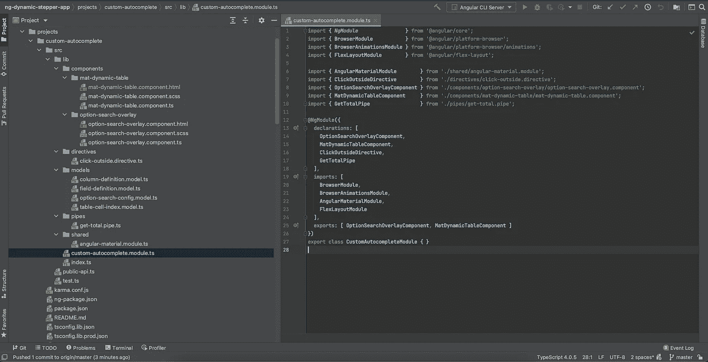
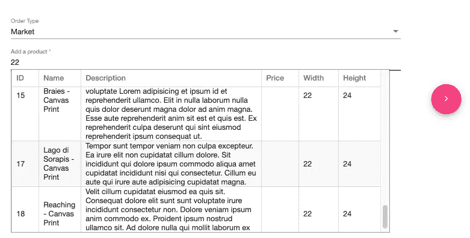

# 用动态表格构建一个自定义的自动完成搜索角应用程序

> 原文：<https://betterprogramming.pub/angular-custom-autocomplete-7ffb479477e7>

## [软件工程](https://rakiabensassi.medium.com/list/software-engineering-7a179a23ebfd)

## 玩 CSS 覆盖和有角度的材料组件


[斯科特·格雷厄姆](https://unsplash.com/@homajob?utm_source=medium&utm_medium=referral)在 [Unsplash](https://unsplash.com?utm_source=medium&utm_medium=referral) 上拍照

因为我们面临的挑战永远不会结束。

因为，作为程序员，我们永远不会停止学习和改进。

因为 web 开发是一种创造性的艺术，也是一种游戏——一种我们可以玩规则的游戏。

由于这些原因，今天我们将实现一个可定制的自动完成功能，在其覆盖图中呈现一个动态表格，并将它导出为一个角度库，如下面的视频所示:

[带有动态表格的自定义自动完成功能](https://www.youtube.com/watch?v=tRLu-EbGAI0)

*   列的数量、类型和名称作为输入传递给动态表
*   承载自定义自动完成功能的组件为表提供数据列表。这个列表可以是静态的，也可以是动态的(一个可观察的列表)。
*   用户可以通过鼠标点击或通过[使用键盘箭头](/angular-keyboard-listeners-good-practices-b208edc6bf89)导航并按下`Enter`键从显示的选项列表中选择一个选项。当按下向下箭头或向上箭头时，列表中具有焦点的选项会突出显示，以增强用户体验。
*   每当选择一个选项时，都会向宿主组件返回一个事件
*   每当用户更改搜索查询时，也会有一个事件返回给托管组件，例如，如果我们想从 HTTP 服务器获取一个新的数据列表，这非常有用。

本文是上一篇文章的第二部分:"[构建一个可重用的步进器作为角度库](/angular-library-dynamic-stepper-2ba05ab40228)"今天的库独立于旧的库，但是出于演示的目的，我们将使用定制的自动完成功能扩展 create-order 模板，作为一个新的字段，看看如何使用它。

所以让我们开始吧。

# 生成新库

我们的自定义自动完成模块将作为库创建在`projects`文件夹下。你可以点击查看 GitHub 上的源代码[。导航到项目的根文件夹，并在终端上运行以下命令:](https://github.com/rakia/ng-dynamic-stepper)

```
ng generate library custom-autocomplete
```

# 生成库的组件

当生成我们的组件时，我们必须指定`--project`标志来告诉 Angular CLI 在适当的库文件夹中生成它们。我们需要两个组件来实现今天的目标:

```
ng generate component components/option-search-overlay **--project**=custom-autocomplete **--export**ng generate component components/mat-dynamic-table **--project**=custom-autocomplete **--export**ng generate directive directives/click-outside **--project**=custom-autocompleteng generate pipe pipes/get-total **--project**=custom-autocomplete
```



自定义自动完成库项目结构

# 选项-搜索-覆盖组件

第一个组件`option-search-overlay`，呈现一个输入字段——用户可以在其中输入搜索查询——并自动打开一个覆盖图，显示给定过滤器的正确结果。模板看起来是这样的:

option-search-overlay.component.html

打字稿部分:

选项-搜索-覆盖图.组件. ts

有五种键盘监听器:

*   两个监听器用于`keydown.arrowdown`和`keydown.arrowup`在选项列表中导航
*   一个用于选择选项的`keydown.enter`键监听器
*   一个用于`keydown.esc`键的监听器，用于关闭打开的覆盖图
*   一个用于`input`表单域上的`keydown`的监听器，当用户启动 t

您可能已经注意到，第二个组件`mat-dynamic-table`是第一个组件`option-search-overlay`的子组件。

当用户开始在`input`字段中输入内容时，我们呈现 DOM 元素`ng-template`——包含动态表格。为了实现这一点，我们利用了 Angular CDK 的`overlay`包，它提供了一种在屏幕上打开浮动面板的方法:

```
import { OverlayModule } from '@angular/cdk/overlay';
```

下面是 javatpoint.com 的一段摘录，解释了什么是叠加以及如何使用它们:

> “覆盖”的意思是用涂层覆盖某物的表面。换句话说，它是用来把一件东西放在另一件东西的上面。覆盖层使网页更有吸引力，并且易于设计。
> 
> 创建叠加效果意味着将两个 **div** 放在同一个地方，但是两个 div 都将在需要时出现。要使第二个 div 出现，我们可以悬停或单击一个 div。"

让我们来看一个更直观的叠加图，看看如何用[角度材质](/angular-10-new-features-dbc779061dc8)来实现它:



用于实现自定义自动完成的角度 CDK 覆盖图

我已经向`input`表单字段添加了以下属性:

```
cdkOVerlayOrigin #trigger=”cdkOverlayOrigin”
```

对于`ng-template`标签，我添加了一个属性和两个输入:

```
cdkConnectedOverlay
[cdkConnectedOverlayOrigin]=”trigger” [cdkConnectedOverlayOpen]=”isOverlayOpen” 
```

*   值`trigger`将`ng-template` DOM 元素连接到`input`表单字段
*   值`isOverlayOpen`由`option-search-overlay.component.ts`中的`false`初始化，然后根据覆盖图的状态进行更新:

打开，关闭覆盖

为了避免这种情况，当用户没有选择选项就离开时，覆盖图保持打开。我使用了一个指令`clickOutside`，它检测在使用该指令的 DOM 元素之外的`document`上的任何点击。在这种情况下，将执行`closeOverlay()`方法:

检测特定 DOM 元素外的单击的角度指令

# 动态表组件

第二个组件`mat-dynamic-table`是一个动态材料表，这意味着它独立于它的列列表。在模板中，我们有一个通过`displayColumnDefs`列表的循环来确定每一列的名称、标签、值和类型:

mat-dynamic-table.component.html

以下是打字稿部分:

mat-动态表.组件. ts

为了计算表尾中类型为`number`的列的总和，我创建了一个管道`getTotal`。对于[性能](/build-me-an-angular-app-with-memory-leaks-please-36302184e658)来说，管道比使用方法好得多。仅当列定义中的参数`hasFooter`为`true`时，我才显示页脚:

get-total.pipe.ts

# 在创建订单视图中使用库

我们现在所需要看到的是我们到目前为止所实现的结果，即在订单创建的第一步中通过插入`option-search-overlay`作为一个新字段来更新表单:

create-order-step1.component.html

我们必须通过添加一个数组`displayColumnDefs`来调整 T [ypeScript](/typescript-new-release-19f1238c6a68) 组件，该数组为自动完成的覆盖定义了列列表。我们还需要定义`optionSearchConfig`:

[创建订单步骤 1.component.ts](https://gist.github.com/rakia/31f72531518690e9c53aba20fd1c9ef1#file-create-order-step1-component-ts)

有了这些，我们就有了部署和使用应用程序所需的一切，如上面的视频所示。

想自己尝试一下吗？

继续克隆 GitHub 库[上可用的最终和完全成熟的解决方案](https://github.com/rakia/ng-dynamic-stepper)。

那里的源代码支持在`mat-dynamic-table`中显示一个`checkbox`列。对于我们的自动完成搜索来说，多选功能非常有用。

此应用程序的下一部分可在此处获得:

[](/build-a-hand-pose-detector-web-app-powered-by-machine-learning-62131ec43db5) [## 构建由机器学习驱动的手部姿势检测器 Web 应用程序

### 结合机器学习和网络开发

better 编程. pub](/build-a-hand-pose-detector-web-app-powered-by-machine-learning-62131ec43db5) 

感谢阅读！我希望这对您的编码之旅有所帮助和启发。

🧠💡我为一群聪明、好奇的人写关于工程、技术和领导力的文章。 [**加入我的免费电子邮件简讯，独家获取**](https://rakiabensassi.substack.com/) 或在此注册 Medium [。](https://rakiabensassi.medium.com/membership)