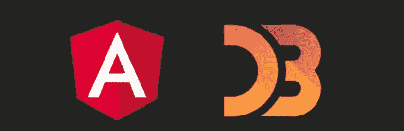
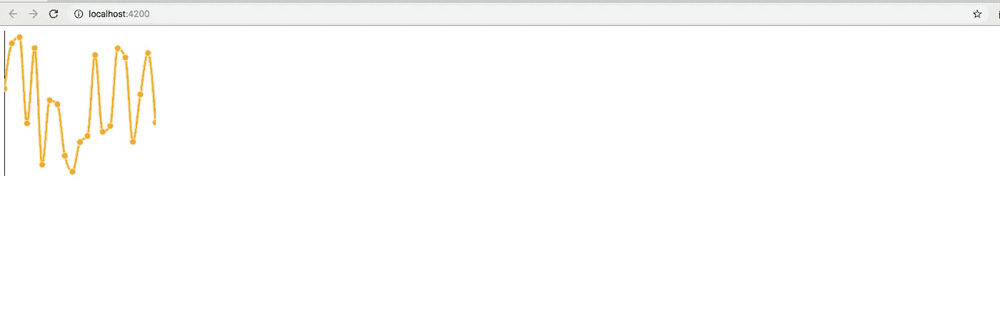
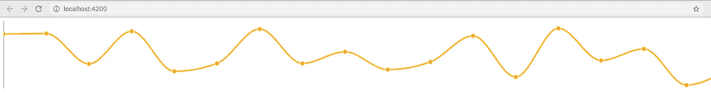
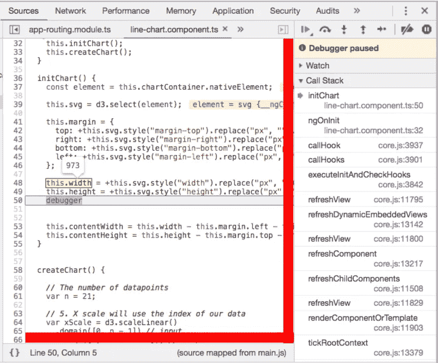

# 带有 D3.js 和 CSS 的 Angular 响应图表

> 原文：<https://betterprogramming.pub/angular-d3js-a-better-pattern-for-adjusting-charts-via-css-646992231901>

## 调整图表的更好模式



大家好。在这篇文章中，我将解释我以前每次在 Angular 和 [D3](https://d3js.org) 中使用视觉组件时都会发现的几个问题。

为了启发您，我将使用一个基于此示例的折线图:

 [## D3 v5 折线图

### 戈尔德李街区 27370 D1 ea 8464 b 04538 E6 D8 ced 39 e 89

bl.ocks.org](https://bl.ocks.org/gordlea/27370d1eea8464b04538e6d8ced39e89) 

这没什么太复杂的——它只是用随机数据创建一些基本的东西，比如线形图。

# 问题是

在 D3 中用 Angular 初始化一个图表有很多方法，所以这可能是个问题。当然，如果你在 Angular 中做了三个以上的 D3 视觉组件，你每次做的方式都不一样。

让我来解释一下调整图表的好方法。

但是第一步，我将给出用 Angular 和 D3 创建一个新项目的说明。

## 创建角度项目

使用 Angular CLI 快速设置一个:

```
$ npm install -g @angular/cli
```

然后开始一个新项目:

```
$ ng new ng-d3-css-example
$ cd ng-d3-css-example
```

## 集成 D3

它的打字稿:

```
$ npm install d3 --save
$ npm install [@types/d3](http://twitter.com/types/d3) --save-dev
```

## 生成组件

让我们创建一个组件。

```
$ ng generate component line-chart
```

## 模板

这里的要点是，对于 D3 的每个可视组件，我都使用这段代码。我喜欢它，因为它只有一个带`svg`、一个`class`的标签，以及一个稍后检索它的标识符。就是这样！

```
<**svg** **#chart** class="**chart**"></svg>
```

## 风格

这里的焦点是`.chart`类——它允许我们通过 CSS 调整图表。它将我们调整图表大小的方式与其他部分完全分开，并且只通过样式来完成。

`line-chart.component.scss`

```
...

**.chart** {
    width: 240px;
    height: 230px;

    ... 
```

## 控制器

快速看一下控制器——所有的魔法都在里面。然后，我将只对几件事进行评论。

我们的控制者，奇迹发生的地方。请看下面的解释。

显然，导入 D3:

`line-chart.component.ts`

```
import * as d3 from "d3";
```

另一项任务是通过`@ViewChild`检索组件本身，以添加我们所有可视组件中始终存在的属性。

`line-chart.component.ts`

```
@ViewChild("chart", { static: true }) protected chartContainer: ElementRef; svg: any;
  g: any; tooltip: any; margin: {top:number; right:number; bottom: number; left: number;}; contentWidth: number;
  contentHeight: number; width: number;
  height: number;
```

所有这些属性都必须初始化。事实上，我们可以在一个`ngOnInit` 的循环中做到有角，因为我们已经拥有了一切。

`line-chart.component.ts`

```
initChart() {
    const element = this.chartContainer.nativeElement;

    this.svg = d3.select(element);

    this.margin = {
      top: +this.svg.style("margin-top").replace("px", ""),
      right: +this.svg.style("margin-right").replace("px", ""),
      bottom: +this.svg.style("margin-bottom").replace("px", ""),
      left: +this.svg.style("margin-left").replace("px", "")
    };

    **this.width = +this.svg.style("width").replace("px", "");
    this.height = +this.svg.style("height").replace("px", "");**

    this.contentWidth = this.width - this.margin.left - this.margin.right;
    this.contentHeight = this.height - this.margin.top - this.margin.bottom;

    this.g = this.svg.append("g").attr("transform", "translate(" + this.margin.left + "," + this.margin.top + ")");
  }
```

*   放一些页边距等等。在 D3 中，对内容进行一点限定几乎总是强制性的
*   我们将`width`和`height`转换成一个数值，，这是这里的关键概念
*   事实上，即使你在风格中加入了`%`、`vw`、`vh`或其他度量，它仍然会被正确设置

## **结果**

在设置了像`width`和`height`这样的 CSS 属性之后，你就可以检查它们了。

```
$ npm start
```



记住，在我们把‘宽度:240px 高度:230 像素；'

现在，看它是通过 CSS 修改的，当我为这个修改时:

```
.chart {
      //width: 240px;
      //height: 230px; width: 100%;    
      height: 100%;...
```



是和 *'%'* 一起工作吗？是的，正如我之前说过的，它们被神奇地从 CSS 中捕获并转换成数字。

D3 将宽度设置为一个数字。然而，在它作为 100%的最大大小从 CSS 中检索出来之前(`.chart`类中的`width`属性)。



截图看看它是如何自动转换成数字的

最后，您也不需要在其他部分调整图表——无论是模板还是控制器。

*回购至此(*[*stack blitz*](https://stackblitz.com/edit/ng-d3-css-example-v2?file=src%2Fapp%2Fapp.component.html)*或*[*GitHub*](https://github.com/ackuser/ng-d3-css-example-v2/tree/part1/adjustingViaCss)*上支开拓)*

# 结论

每当我必须用 Angular 和 D3 构建图表时，它都会让我头疼。现在，我想根据我的经验和知识，我已经找到了一个好方法至少初始化它们。

我希望你喜欢，也希望你学会了调整图表的新方法。感谢阅读。