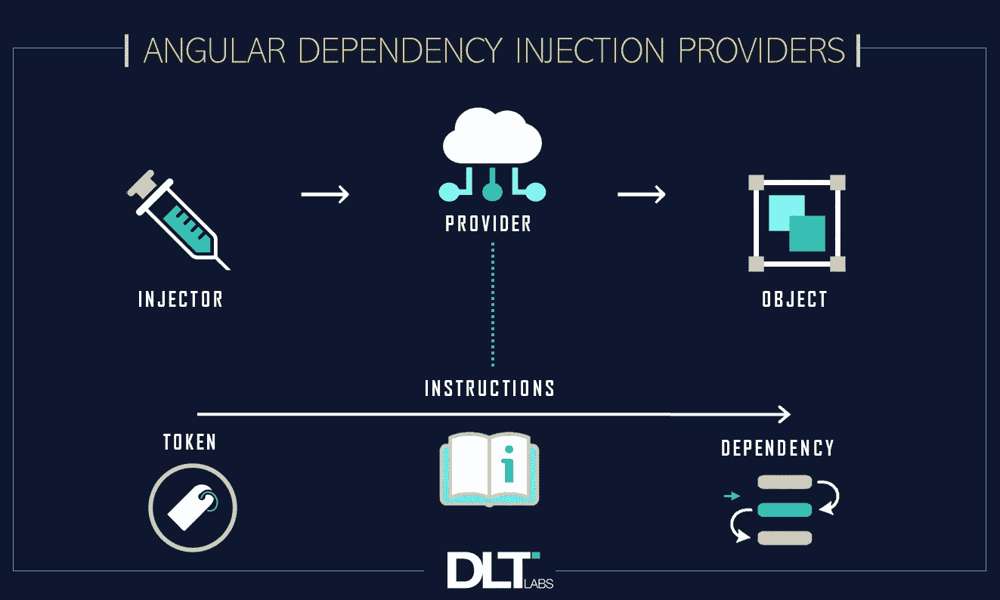

# 角度依赖注入提供程序对象

> 原文：<https://betterprogramming.pub/angular-dependency-injection-provider-objects-f7dc363acc6c>

## 如何使用角度依赖注入提供程序对象及其重要性



今天，我们将讨论角度依赖注入提供程序对象在角度应用程序中的重要性，以及如何在不同的情况下使用不同的角度依赖注入提供程序对象。

让我们通过一个真实的应用程序用例来理解这一点。

# **用例**

在我们的角度应用程序中，我们有一个角度服务类`app-service.ts`。它内部编写了一些方法来提供指定的功能。

该类在根组件级`app.module.ts`提供，使其可用于所有功能模块。

例如:

```
@NgModule({declarations: [ AppComponent ],providers: [ AppService ],})export class AppModule { }
```

让我们假设这个服务在 1000 个不同的应用程序组件中使用，因为应用程序变得越来越大，以服务于每个组件各自的数据。

例如:

```
export class AppComponent implements OnInit {constructor(private service: AppService){}}
```

过了一段时间后，我们决定编写一个不同版本的服务，名为`app-service-v1.ts`,对现有的方法功能进行了重大修改，但使用了相同的方法签名。

# **问题**

现在，我们希望这个新服务能够在所有有`app-service.ts` 的地方实现。

此外，我们不想放弃旧版本，因为如果项目在任何后期阶段需要，我们可能不得不切换回旧版本。

好吧，我们该怎么做？

有什么想法吗？

# **解决方案**

## **1。解决这个问题的一种方法**

如果我们考虑在根级别导入新服务`app-service-v1.ts` 并在每个组件级别进行更改，我们必须记住我们有 1000 个地方来合并这些更改，根据应用程序的大小，这个数字可以更高。

但是，如果我们在完成了到最新版本的迁移后，被要求切换回以前的版本，该怎么办呢？

例如:

先前版本:

```
export class AppComponent implements OnInit {constructor(**private service: AppService**){}}
```

最新版本:

```
export class AppComponent implements OnInit {constructor(**private service: AppServiceV1**){}}
```

## **2。另一种方法:角度依赖注入提供者**

在这种情况下，根级模块将如下所示:

```
@NgModule({declarations: [ AppComponent ],providers: [{ **provide: AppService, useClass: AppServicev1**}],})export class AppModule { }
```

这样，我们就完成了向新服务的迁移。

有点像:我会一直要求`AppService`，你却给我提供`AppServicev1`。

*Angular Provider Object Literal*为我们如何在组件中接收服务类的实例带来了很多变化。

Angular 的两个流行的依赖注入提供者是:

1.  别名提供者(如上所述)。
2.  价值提供者。

有时，提供一个虚拟对象或现成的对象比提供一个实际的服务实例更有用。

这种技术通常用于为我们的应用程序编写`unit-test`，我们不想使用实际的服务方法进行测试，这可能会对我们的后端服务进行实时`HTTP` 调用。

`Unit-test`模块示例:

```
describe(‘TestLoginService’, () => {**let service** = {login : ()=> of({})};beforeEach(() => {TestBed.configureTestingModule({**providers: [{ provide: LoginService, useValue: service** }]imports: [HttpClientTestingModule] }); }); });
```

我希望这篇文章有助于增强您对角度依赖注入提供者的理解。

*作者 Amit 实验室的 Amit Yadav*