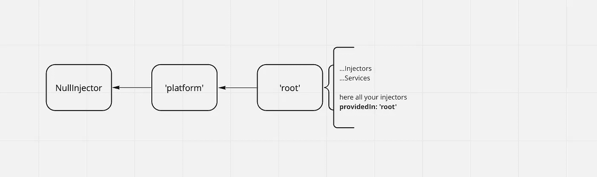
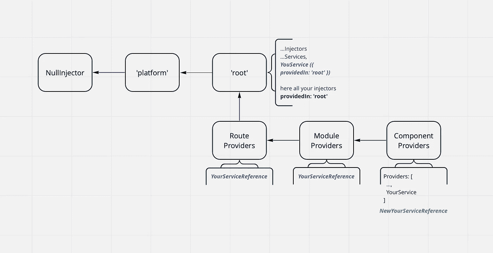

# 角度:DI、服务和喷射器

> 原文：<https://betterprogramming.pub/angular-di-services-and-injectors-1f777e883e18>

## 依赖注入如何与服务一起工作


让我们谈谈 Angular 中的依赖注入系统，稍微讨论一下注入器，并决定实现服务提供者的方法。

Angular 文档很好地描述了喷射器的系统，但是为了完整的理解，有必要对此给予更详细的关注。

此外，应该注意服务是如何加载的:在加载应用程序时立即加载还是在使用时加载？

再来看角楼*迪*的方案。有几个级别的注入器，每个新模块/组件/指令都有自己的注入器级别。在 Angular 的*版本* *14* 中，在路线中增加了新的注射等级。

该系统类似于一个树形结构，如果用图形表示，会得到以下视图:



对注射器的搜索从孩子到父母等等，直到`NullInjector`。

如果*依赖注入*中没有关于注入服务的条目，那么您会得到一个相当常见的错误:

```
NullInjectorError: No provider for YourService!
```

正如您所想，可以通过在应用程序或所需模块中声明服务来修复这个错误。

Angular 文档推荐使用单例服务，这通常是正确的方法，并在`root`中提供它们。像这样:

```
@Injectable({ providedIn: 'root' })
```

这是什么意思，`'root'`从何而来？当应用程序启动时，这个`'root'`级别的注入器被创建，它由我们在`bootstrapModule`方法中加载的上下文决定。该模块或组件(从*版本 14* 开始，这可以通过*独立*实现)将是树的`'root'`级。另外，在上面的方案中可以看到，还有父母`'platform'`和`NullInjector` *DI* 等级。

因此，通过声明`providedIn: 'root'`，我们向 *DI* 系统表明对服务的当前实例的引用位于`'root'`。理解这一点很重要，这就是如何组合*依赖注入*树的。

现在让我们看看声明服务的可能选项。

第一个变体是在服务本身的`@Injectable`装饰器中用属性声明的:

```
providedIn?: Type<any> | ‘root’ | ‘platform’ | ‘any’ | null;
```

Angular 文档详细说明了`providedIn`属性参数的效果:

*   `Type<any>`:将注射剂与`@NgModule`或其他`InjectorType`关联。我们可以声明一个模块，在这个模块中，服务将被实例化并注入 DI，例如:`@Injectable({ providedIn: YourModule })`。
*   `null`(此处相当于`undefined`):自动不提供任何范围的注射剂。我们必须在`Providers`属性中将服务添加到提供者列表中。

`InjectorType`:

*   `'root'`:大多数 app 中的应用级注入器。
*   `'platform'`:页面上所有应用共享的特殊单例平台注入器。
*   `'any'`:在每个延迟加载的模块中提供一个唯一的实例，而所有急切加载的模块共享一个实例。

第二个变体是第一个变体之后的服务声明，具有空属性`providedIn` : `@Injectable()`，其为`undefined`，与此类似:

```
@Injectable({ providedIn: null })
```

接下来，您需要在指令/组件/模块的`Providers`属性中声明一个服务，这个服务的一个实例将在这个 *DI* 级别创建。

需要注意的是，即使服务是在第一个变体中创建的，在`Providers`中声明这个服务也会导致这个服务的一个新实例的创建以及在 DI 树中对它的引用。因此，在不同层次的 *DI* 树中，可能会出现相同服务的不同实例。

此外，在角度*版本 14* 中，您可以在 `Routes`中使用带有属性`Providers`的额外 DI 电平。

有一个视图示例:



现在关于加载`@Injectable()`类代码，不管声明方法如何，它们都被下载到客户端，但是第一个模块类块直接使用可注入类(至少在构造函数中声明)。

谢谢，今天的`@Injectable()`就到这里。