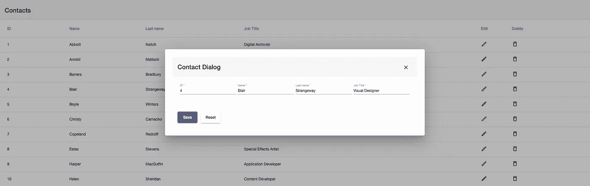
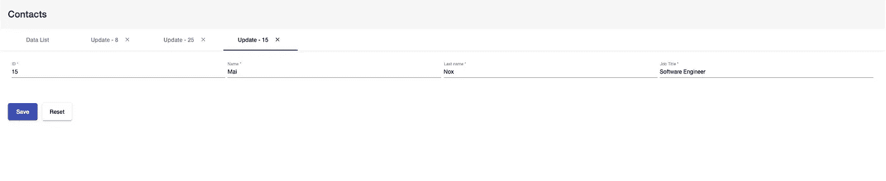
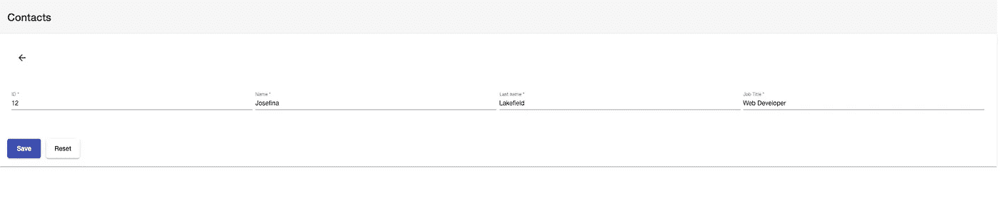

# 角度动态模板:如何建立一个有 3 种布局风格的应用

> 原文：<https://betterprogramming.pub/angular-dynamic-layout-with-ngtemplate-8b6faa995a8f>

## [软件工程](https://rakiabensassi.medium.com/list/software-engineering-7a179a23ebfd)

## Angular ngTemplateLayout 的高级用例


照片由[光晕](https://unsplash.com/@halacious?utm_source=medium&utm_medium=referral)在 [Unsplash](https://unsplash.com?utm_source=medium&utm_medium=referral) 上拍摄

Angular 提供了非常强大的功能，支持各种各样的高级用例。今天我们将学习如何设计和实现一个支持三种布局风格的 Angular 应用程序:

*   在对话框中打开更新视图
*   使用`arrowBack`在新页面中打开更新视图，返回到列出所有项目的上一页
*   在多个选项卡中打开多个更新视图

要在三种布局之间切换，我们需要做的就是改变变量`layoutStyle`的值。就这么简单。默认值为`'dialog'`。

```
layoutStyle = 'dialog' | 'tabs' | 'newPage'
```



布局样式 1:在对话框中更新联系人



布局样式 2:在新选项卡中更新联系人



布局样式 3:在新页面中使用返回按钮更新联系人

我们将使用容器-呈现器设计模式，并从组件继承、内容投影以及 Angular Core 和 Angular template 系统的一些很酷的特性(`ng-template`、`ng-container`、`ngTemplateOutlet`)中获益，以实现我们的目标。让我们从引入允许灵活布局系统的`ng-template`指令开始。

# ng 模板指令

Angular 已经在许多结构指令中使用了`ng-template`，比如`ngIf`、`ngFor`和`ngSwitch`。该标签的内容包含模板的一部分，该模板可以与其他模板组合在一起，以形成最终的组件模板。下面是一个简单的用例:

角度 ng 模板的使用案例

`else`子句指向名为`progress-bar`的模板。使用`#progress-bar`语法，通过模板引用为其指定名称。

# 项目设置

如果你的机器上还没有 Angular CLI，那么让我们按照这些说明[开始安装吧](https://cli.angular.io/)。下一步是使用以下命令创建项目:

```
ng new ng-dynamic-layout
cd ng-dynamic-layout
```

`ng new`命令提示您输入要包含在初始应用程序中的特性信息。按下 *y* 出现“您想添加角度布线吗？”并选择 SCSS 作为样式表格式，然后按 Enter 键。

*   安装[角材](https://material.angular.io/components/table/overview)、[角材柔性布局](https://github.com/angular/flex-layout)和角材:

```
npm install @angular/material
npm install @angular/cdk
npm install @angular/flex-layout
```

*   通过将此行添加到`src/style.scss`来导入角度主题:

```
@import "~@angular/material/prebuilt-themes/indigo-pink.css";
```

*   生成`BaseModule`:

```
ng generate module shared/base-module
```

*   在其中生成一个新组件，`dynamic-layout`:

```
ng generate component shared/base-module/dynamic-layout --export
```

*   生成`ContactsModule`:

```
ng generate module modules/contacts
```

*   在其中生成以下组件:

```
ng generate module modules/contacts/containers/contact-containerng generate module modules/contacts/presenters/contactng generate module modules/contacts/presenters/contact-listng generate module modules/contacts/presenters/contact-update/contact-formng generate module modules/contacts/presenters/contact-update/contact-update-dialog --type=dialog
```

*   更新`app-routing.module.ts`中的路由:

```
const routes: Routes = [
  { path: '', redirectTo: 'contacts', pathMatch: 'full' },
  { path: 'contacts', component: ContactContainerComponent}
];
```

# 深入细节

好了，现在是时候进入正题了。我们在`ContactsModule`中的主要展示者是`ContactComponent`，它是使用多时隙内容投影为两个动态模板指定值的地方—“T8”和“`update`”。

`dynamic-layout`标签将内容包装在组件中，根据`layoutStyle`的值，`DynamicLayoutComponent`将管理如何以及在哪里呈现更新模板:

contact.component.html

打字稿部分，`contact.component.ts`:

contact.component.ts

您可能已经注意到，`ContactComponent`正在扩展`BasePresenter`，它是一个父组件，负责处理相应更新视图的创建/打开/删除，并将用户重定向到列表或更新页面:

base-presenter.component.ts

与`BasePresenter`类似，我使用了`BaseContainer`和`BaseList`父组件，并将通用功能委托给它们，这有助于避免重复代码:

基本容器.组件. ts

基本列表.组件. ts

现在是时候揭示我是如何设计`DynamicLayoutComponent`的了。除了一些输入字段和事件发射器与宿主组件通信之外，TypeScript 部分没有任何逻辑:

动态布局.组件. ts

是我们的主要游戏领域。我在这里添加了逻辑，通过`ng-content select="[list]"`和`ng-content select="[update]"`将正确的内容附加到正确的模板上。我还指定了用`ng-container *ngTemplateOutlet="update"`和`ng-container *ngTemplateOutlet="list"`呈现每个模板的占位符:

最后但同样重要的是向您展示父代`StoreService`的外观。这是一个基于`BehaviorSubject`的服务，同时扮演着商店的角色。它也是所有模块的商店服务继承的类:

基本模块商店服务

整个应用程序可在 [Github 这里](https://github.com/rakia/angular-dynamic-layout)获得。自己查一下 app，点一下周围。

# 最后的想法

角度内容投影和动态模板是构建可重用组件和实现清晰架构的非常有用的特性。我们已经看到了`ng-content`和`ng-template`指令是如何工作的，以及它们如何改进 UX 设计和解决我们在企业应用程序中最常遇到的问题。

受益于 Typescript/Angular 继承，将许多功能转移到一个中心位置，这使我能够摆脱大量样板代码，便于将来的维护。我介绍的解决方案并不是构建最终应用程序的唯一解决方案。请随时提供反馈或分享您是如何解决类似挑战的。

感谢阅读。

🧠💡我为一群聪明、好奇的人写关于工程、技术和领导力的文章。 [**加入我的免费电子邮件简讯，独家获取**](https://rakiabensassi.substack.com/) 或在此注册 Medium [。](https://rakiabensassi.medium.com/membership)

*你可以在 Udemy 上查看我的* ***视频课程****:*[*如何识别、诊断、修复 Web Apps 中的内存泄漏*](https://www.udemy.com/course/identify-and-fix-javascript-memory-leaks/) *。*