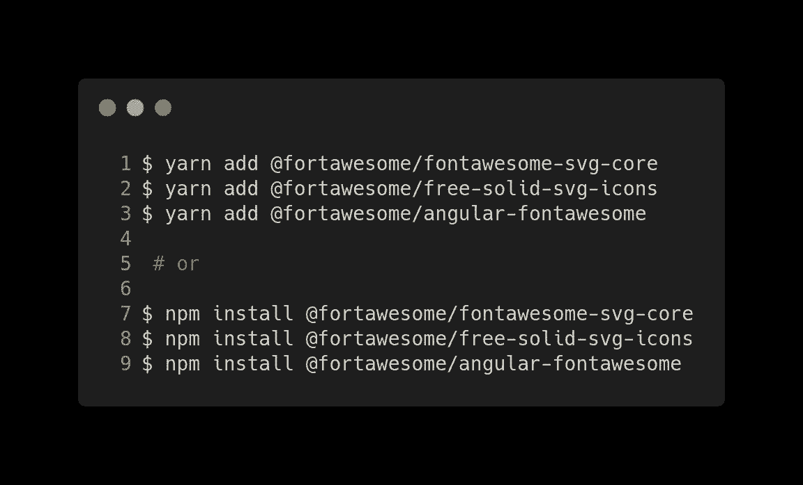
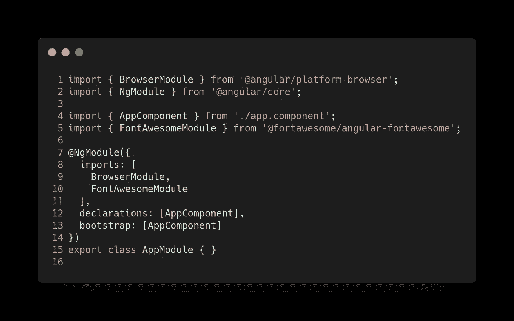

# 使用 angular-fontawesome，只需 5 个简单步骤即可完成 Angular + Font Awesome

> 原文：<https://betterprogramming.pub/angular-font-awesome-in-5-easy-steps-with-angular-fontawesome-2b80129bcd7>

## 循序渐进的角度教程


照片由[马库斯·德保罗](https://unsplash.com/@marcusdepaula?utm_source=unsplash&utm_medium=referral&utm_content=creditCopyText)在 [Unsplash](https://unsplash.com/search/photos/font?utm_source=unsplash&utm_medium=referral&utm_content=creditCopyText) 拍摄

[Font Awesome](https://fontawesome.com/) 是互联网上最受欢迎的图标工具包，经过重新设计，从零开始构建。

最重要的是，图标字体连字、SVG 框架、流行前端库(如 React)的官方 npm 包等功能，以及对新 CDN 的访问。

在这篇文章中，我将向你展示如何通过 5 个步骤来配置字体 Awesome 以用于 Angular。

在这些步骤中，我们将使用特定的 [Angular 包](https://github.com/FortAwesome/angular-fontawesome)配置 Font Awesome。在以前的帖子中，它是按照包含 CSS 的旧方式配置的。


# 第一步。初始化您的项目

如果你正在考虑在你的 Angular 项目中使用字体 Awesome，你可能已经有了一个初始化的项目。然而，对于本教程，让我们从头开始我们的项目。


# 第二步。安装字体真棒

装字体牛逼。



# 第三步。包括 FontAwesomeModule

将`FontAwesomeModule`添加到`src/app/app.module.ts`中的导入:



# 第四步。添加字体牛逼 CSS 类

将图标绑定到组件中的属性`src/app/app.component.ts`:


打开模板的组件，在任何 HTML 元素中添加字体 Awesome CSS 类:

```
<fa-icon [icon]="faCoffee"></fa-icon>
```

# 第五步。运行您的应用

运行您的应用程序:

```
ng serve
```

# 资源

*   [字体牛逼](https://github.com/FortAwesome/Font-Awesome)
*   本岗位的 [GitHub 分支](https://github.com/Caballerog/angular-fontawesome-2)。