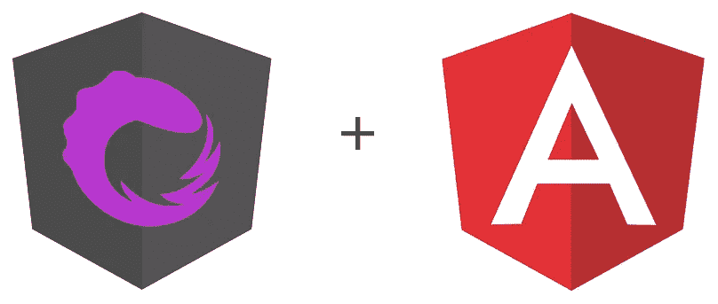
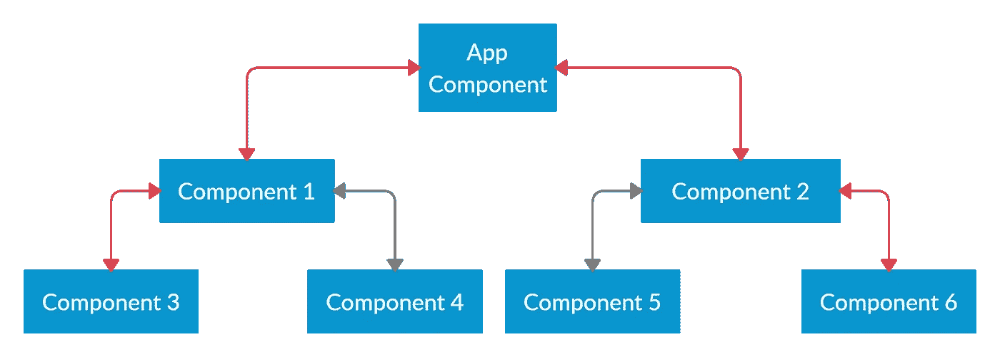
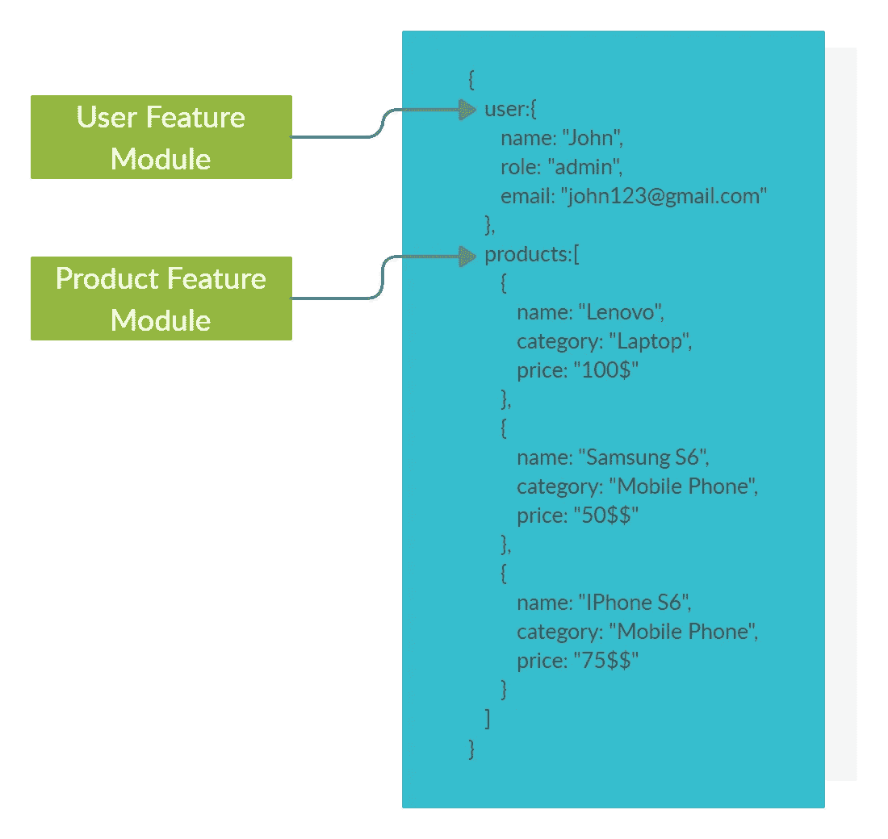
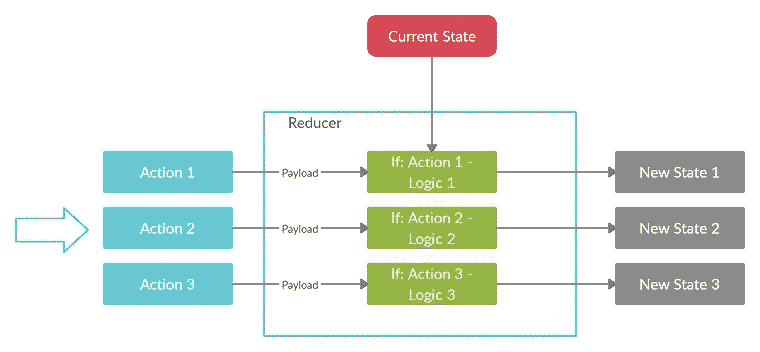
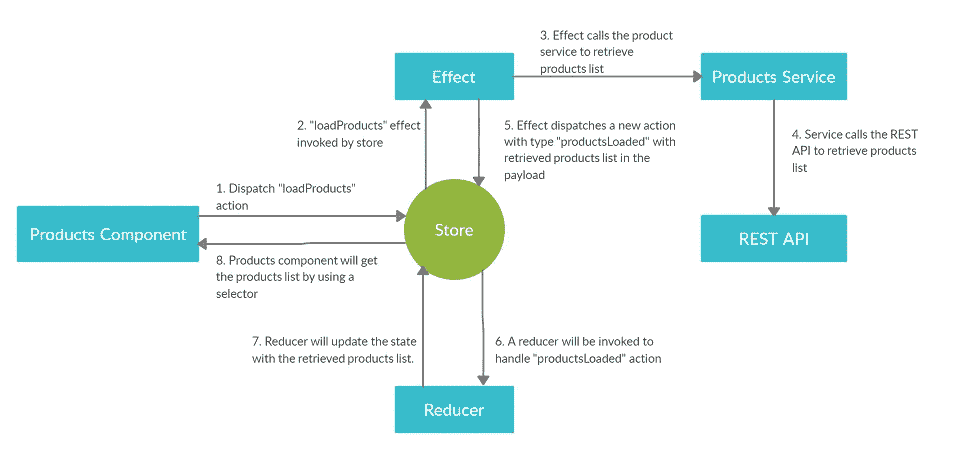

# angular:NgRx 入门

> 原文：<https://betterprogramming.pub/angular-getting-started-with-ngrx-75b9139c23eb>

## NgRx 的基础知识，包括代码示例



图片来源:Sarindu Udagepala

当我第一次开始使用 NgRx 时，我面临着一个陡峭的学习曲线。理解 NgRx 包含的基本元素需要大量的阅读和研究。这篇文章的主要目的是将我收集的知识传递给读者，让他们的 NgRx 生活更轻松。

我打算讨论以下主题:

*   NgRx 是什么？
*   NgRx 的基本元素:存储、动作、缩减器、选择器、效果
*   NgRx 组件之间的交互
*   NgRx 的利与弊

# **NgRx 是什么？**

首先， [NgRx](https://ngrx.io/) 代表角度无功延伸。NgRx 是一个基于 [Redux](https://redux.js.org/) 模式的状态管理系统。在我们深入讨论细节之前，让我们试着理解角度应用中的*状态*的概念。

## 状态

理论上，应用程序状态是应用程序的整个内存。简而言之，应用程序状态由 API 调用接收的数据、用户输入、呈现 UI 状态、应用程序首选项等组成。应用程序状态的一个简单、具体的例子是 CRM 应用程序中维护的客户列表。

让我们试着在角度应用程序的上下文中理解应用程序状态。众所周知，角度应用通常由许多组件组成。这些组件中的每一个都有自己的状态，并且不知道其他组件的状态。为了在父子组件之间共享信息，我们使用了`@Input`和`@Output`装饰器。然而，只有当您的应用程序由几个组件组成时，这种方法才是实用的，如下所示。


当组件数量增加时，仅仅通过`@Input`和`@Output`装饰者在组件之间传递信息就成了一场噩梦。我们就拿下图来对此进行阐述吧。



如果您必须将信息从组件 3 传递到组件 6，您将必须跳四次并涉及其他三个组件。如您所见，这是一种非常麻烦且容易出错的状态管理方式。这就是 Redux 模式发挥作用的地方。

## Redux

Redux 是一种模式，用于简化 JavaScript 应用程序中的状态管理过程(不仅仅是 Angular)。Redux 主要基于三个主要原则。

**真实的单一来源**——这意味着应用程序的状态存储在一个单一存储中的对象树中。存储负责存储数据，并在需要时向组件提供数据。(我这里指的是角度应用。但是 Redux 通常可以应用于任何 JavaScript 应用程序。)根据这种体系结构，数据在存储和组件之间流动，而不是在组件之间流动。下图说明了这个概念。


**只读状态**——换句话说，状态是不可变的。这并不一定意味着状态总是不变的，不能改变。它只是暗示不允许你直接改变状态。为了改变状态，您必须将应用程序不同部分的*动作*(我们将在后面详细讨论)发送到商店。

**状态用纯函数**修改——调度动作将触发一组称为 *reducers* 的纯函数。Reducers 负责根据收到的动作以不同的方式修改状态。这里需要注意的一个关键点是，一个 reducer 总是会返回一个包含修改的新状态对象。

## NgRx

NgRx 是一组受 Redux 模式启发的库。顾名思义，NgRx 是专门为 Angular 应用编写的状态管理解决方案。我们将在下一节深入研究 NgRx 库的基本构建块。请注意，我将对所有示例代码使用 NgRx version 8。

# NgRx 的基本元素:存储、动作、缩减器、选择器、效果

## 商店

商店是整个状态管理过程中的关键元素。它保存状态并促进组件和状态之间的交互。你可以通过角度依赖注入获得对外挂的引用，如下所示。

```
constructor(private store: Store<AppState>) {}
```


该存储引用随后可用于两个主要操作:

*   通过`store.dispatch(…)`方法向商店发送动作，这将依次触发减少器和效果
*   通过选择器检索应用程序状态

**状态对象树的结构**

假设您的应用程序包含两个名为 User 和 Product 的特性模块。这些模块中的每一个都处理整体状态的不同部分。产品信息将一直保持在状态中的`products`部分。用户信息将一直保持在`user`区的状态。这些切片也被称为*切片*。



## 行动

动作是您分派到存储区的指令，可选地带有一些元数据(有效负载)。根据操作类型，商店决定执行哪些操作。在代码中，一个动作由一个普通的旧 JavaScript 对象表示，该对象有两个主要属性，即`type`和`payload`。`payload`是一个可选属性，还原器将使用它来修改状态。下面的代码片段和图说明了这个概念。


```
{ "type": "Login Action", "payload": { userProfile: user }}
```

NgRx 版本 8 提供了一个名为`createAction`的实用函数来定义动作创建者(不是动作，而是动作创建者)。下面是这方面的示例代码。

然后，您可以使用`login`动作创建器(这是一个函数)来构建动作，并将其发送到商店，如下所示。`user`是你传入动作的`payload`对象。

```
this.store.dispatch(login({user}));
```

## 还原剂

Reducers 负责修改状态并返回带有修改的新状态对象。Reducers 接受两个参数，当前状态和动作。基于接收到的动作类型，reducers 将对当前状态执行某些修改，并产生新的状态。下图展示了这一概念。



与 actions 类似，NgRx 提供了一个名为`createReducer`的实用函数来创建 reducers。典型的`createReducer`函数调用如下。

正如您所看到的，它接受初始状态(应用程序启动时的状态)和一对多状态改变函数，这些函数定义了如何对不同的操作做出反应。这些状态改变函数中的每一个都接收当前状态和动作作为参数，并返回新的状态。

## 效果

当一个动作被分派到商店时，效果允许你执行副作用。我们试着通过一个例子来理解这一点。当用户成功登录一个应用程序时，一个带有`type`和`Login Action`的动作将被发送到商店，用户信息在`payload`中。缩减器功能将监听该动作，并用用户信息修改状态。此外，作为一个副作用，您还希望将用户信息保存在浏览器的本地存储中。一个效果可以用来执行这个额外的任务(副作用)。

在 NgRx 中创建效果有多种方法。下面是一种简单明了的创造效果的方法。请注意，你一般不会用这种方法来创造效果。我仅以此为例来解释幕后发生的事情。

*   `actions$` observable 会发出商店收到的动作。这些值将通过一个操作链。
*   `ofType`是使用的第一个运算符。这是 NgRx(不是 RxJS)提供的一个特殊操作符，用于根据动作的类型过滤掉动作。在这种情况下，只有`login`类型的动作将被允许通过运营商链的其余部分。
*   `tap`是链中用于在浏览器本地存储中存储用户信息的第二个操作符。`tap`操作符通常用于在操作符链中执行副作用。
*   最后，我们必须手动订阅`login$`观察值。

然而，这种方法有几个主要缺点。

*   您必须手动订阅可观察对象，这不是一个好的做法。这样，您将总是不得不手动取消订阅，这会导致缺乏可维护性。
*   如果运算符链中出现错误，可观察对象将出错，并停止发出后续值(动作)。结果，副作用不会被执行。因此，您必须有一种机制来手动创建一个新的可观察实例，并在出现错误时重新订阅。

为了克服这些问题，NgRx 提供了一个名为`createEffect`的实用函数来创建效果。典型的`createEffect`函数调用如下所示。

`createEffect`方法接受一个函数，该函数返回一个可观察对象和(可选的)一个配置对象作为参数。

NgRx 处理由支持函数返回的可观察对象的订阅，因此您不必手动订阅或取消订阅。此外，如果操作链中出现任何错误，NgRx 将创建一个新的可观察值并重新订阅，以确保副作用总是得到执行。

如果`dispatch`在配置对象中是`true`(默认值)，`createEffect`方法返回一个`Observable<Action>`。否则，它返回一个`Observable<Unknown>`。如果`dispatch`属性为`true`，NgRx 将订阅`type` `Observable<Action>`返回的可观察对象，并将收到的动作分派给商店。

如果您没有将接收到的动作映射到操作链中的不同类型的动作，那么您必须将`dispatch`设置为`false`。否则，执行将导致无限循环，因为相同的动作将在`actions$`流中一次又一次地被调度和接收。例如，您不必在下面的代码中将`dispatch`设置为`false`，因为您将原始动作映射到操作符链中的不同类型的动作。

在上面的场景中，

*   效果接收`type`的动作`loadAllCourses`。
*   作为副作用，API 被调用，课程被加载。
*   API 对动作`type` `allCoursesLoaded`的响应被映射，加载的课程作为动作`payload`被传递。
*   最后，已经创建的`allCoursesLoaded`动作被发送到商店。这是由 NgRx 在引擎盖下完成的。
*   缩减器将监听输入的`allCoursesLoaded`动作，并用加载的进程修改状态。

## 选择器

选择器是用于获取存储状态片段的纯函数。如下所示，即使不使用选择器，也可以查询状态。但是这种方法也有一些主要的缺点。

```
const isLoggedIn$ = this.store.pipe(map(state => !!state.user));
```

*   `store`是您可以订阅的观察值。每当商店收到一个动作，`store`就会将状态对象推送给它的订阅者。
*   如果需要，您可以使用映射函数来获取状态片段并执行任何计算。在上面的例子中，我们正在获取状态对象树中的`user`片段，并将其转换为一个布尔值，以确定用户是否已经登录。
*   您可以手动订阅`isLoggedIn$` observable，或者在带有异步管道的角度模板中使用它来读取发出的值。

然而，这种方法有一个主要缺点。一般来说，商店经常从应用程序的不同部分接收动作。按照上面的实现，每次商店收到一个动作，商店就会发出一个状态对象。这个状态对象将再次通过映射函数并更新 UI。

但是，如果映射函数的结果与上次相比没有变化，就没有必要再次更新 UI。例如，如果`map(state => !!state.user)`的结果自上次执行以来没有改变，我们就不必再次将结果推送到 UI/订阅者。为了实现这一点，NgRx(不是 RxJS)引入了一个叫做`select`的特殊操作符。使用`select`操作符，上面的代码将会发生如下变化。

```
const isLoggedIn$ = this.store.pipe(select(state => !!state.user));
```

如果映射函数的结果与上次相比没有变化，那么`select`操作符将阻止值被推送给 UI/订户。

这种方法可以进一步改进。即使`select`操作符没有将未改变的值推送给 UI/订户，它仍然必须每次都接受状态对象并进行计算以获得结果。

如前所述，当商店收到来自应用程序的动作时，observable 将发出一个`state`。一个动作并不总是更新状态。如果状态没有改变，映射函数计算的结果也不会改变。因此，如果发出的`state`对象与上次相比没有变化，我们不必再次计算。这就是选择器发挥作用的地方。

选择器是一个纯粹的函数，它维护对以前执行的记忆。只要输入没有改变，就不会重新计算输出。相反，输出将从内存返回。这个过程叫做*记忆* n

NgRx 提供了一个名为`createSelector`的实用函数来构建具有记忆能力的选择器。以下是`createSelector`实用功能的一个例子。

`createSelector`函数接受一对多映射函数，这些函数给出状态的不同部分，以及一个执行计算的投影函数。如果状态切片自上次执行以来没有改变，则不会调用投影仪功能。为了使用创建的选择器函数，您必须将它作为参数传递给`select`操作符。

```
this.isLoggedIn$ = this.store .pipe( select(isLoggedIn) );
```

# NgRx 组件之间的交互

下图说明了 NgRx 生态系统中不同组件之间的交互方式。



# NgRx 的利与弊

## 赞成的意见

*   单一事实来源的概念使得组件在角度应用程序中共享信息变得更加容易。
*   组件不能直接更改应用程序状态。只有还原剂能够改变状态。这使得调试更加容易。

## 骗局

*   当您第一次开始使用 NgRx 时，有一个陡峭的学习曲线。
*   应用程序将有点冗长，因为您必须引入几个新的工件，如 reducers、选择器、效果等等。

# 结论

这篇文章的主要目的是向您介绍 NgRx 概念。我计划在下一篇文章中实现一个完整的基于 NgRx 的角度应用程序。